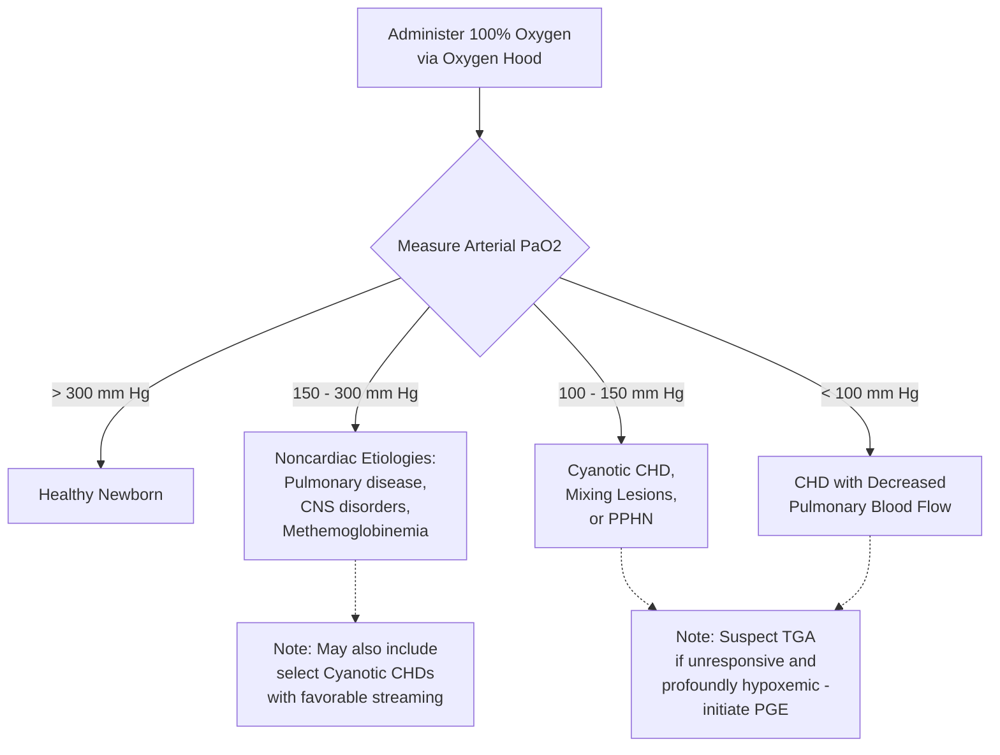

---
{"dg-publish":true,"uptext":"Back to Index (💗 Cardiology)","uplink":"/cardiology/cardiology/","permalink":"/cardiology/hyperoxia-test/","dgPassFrontmatter":true}
---

## Overview & Principle

- Distinguishes cyanotic Congenital Heart Disease (CHD) from primary pulmonary disease.
- Premise: Neonates with cyanotic CHD cannot significantly elevate arterial partial pressure of oxygen ($PaO_2$) despite 100% oxygen administration.
- Infants with pulmonary disease increase intraalveolar $PO_2$, overcoming ventilation-perfusion mismatch and reversing hypoxia.

## Methodology

- Administer 100% oxygen.
- Utilize oxygen hood.
- Avoid nasal cannula or face mask.
- Strict hood usage guarantees near 100% oxygen delivery, preventing false-positive results.

## Interpretation of Results

|$PaO_2$ Level (mm Hg)|Likely Etiology|Key Notes|
|:--|:--|:--|
|**> 300**|Healthy newborn|Normal response.|
|**150 - 300**|Noncardiac etiologies (Pulmonary disease, CNS disorders, Methemoglobinemia)|Not 100% confirmative; rare cyanotic CHD cases achieve >150 mm Hg via favorable intracardiac streaming.|
|**100 - 150**|Cyanotic CHD (mixing lesions with increased pulmonary blood flow) or PPHN|-.|
|**< 100**|Cyanotic CHD (decreased pulmonary blood flow)|Typical of severe right ventricular outflow tract obstruction.|

## Clinical Nuances & Differential Diagnosis

- **Central Nervous System (CNS) Disorders:** Hypoxia reverses completely with artificial ventilation.
- **Transposition of the Great Arteries (TGA):** Profound hypoxemia/cyanosis (saturations <70%) remains unresponsive to hyperoxia test.
- **Management Implication:** Lack of response to hyperoxia test in suspected TGA mandates immediate prostaglandin (PGE) initiation.

## Related Fetal Variant: Maternal Hyperoxygenation (MH) Test

### Purpose

- Evaluates fetal pulmonary vasoreactivity to oxygen.
- Predicts postnatal hemodynamic instability in high-risk CHD.

### Procedure & Response

- Administer 100% oxygen to mother via non-rebreather face mask.
- **Normal Fetal Response:** $\geq$ 10% decrease in Doppler pulsatility indices of branch pulmonary arteries.
- **TGA Application:** Alterations in septum primum position or foramen ovale flow during MH predict postnatal need for balloon atrial septostomy (BAS).

### Algorithmic Approach to the Hyperoxia Test

