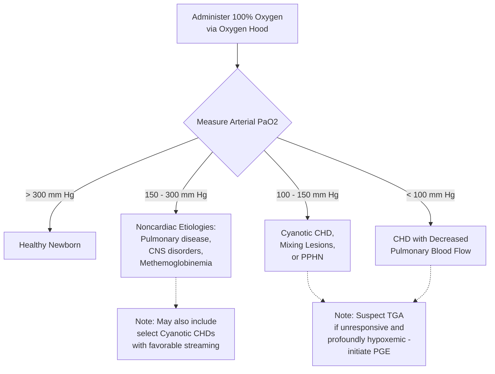

---
{"dg-publish":true,"uptext":"Back to Index (💗 Cardiology)","uplink":"/cardiology/cardiology/","permalink":"/cardiology/hyperoxia-test/","dgPassFrontmatter":true}
---

### Principle and Purpose

- The hyperoxia test is primarily utilized as a diagnostic method to distinguish cyanotic congenital heart disease (CHD) from pulmonary disease in a cyanotic or cardiorespiratory-distressed neonate.
- The fundamental premise of the test is based on the physiological response to 100% oxygen administration: infants with pulmonary disease can overcome ventilation-perfusion abnormalities due to high levels of intraalveolar partial pressure of oxygen (PaO2), which reverses the hypoxia.
- Conversely, neonates with cyanotic CHD generally fail to significantly raise their arterial PaO2 when administered 100% oxygen due to fixed right-to-left intracardiac shunting.

### Procedure and Precautions

- The test must be performed by administering almost 100% oxygen to the patient using an oxygen hood.
- The use of a nasal cannula or face mask is strictly discouraged, as these methods cannot guarantee the exact delivery of 100% oxygen, potentially leading to false-positive results.
- Arterial blood gas sampling is required to accurately measure the resulting PaO2.

### Interpretation of Results

| Post-100% Oxygen Arterial PaO2 | Most Likely Clinical Diagnosis / Etiology                                                                                                      |
| :----------------------------- | :--------------------------------------------------------------------------------------------------------------------------------------------- |
| **> 300 mm Hg**                | Healthy newborn                                                                                                                                |
| **150 – 300 mm Hg**            | Noncardiac etiologies (Pulmonary disease, Central Nervous System (CNS) disorders, Methemoglobinemia)                                           |
| **100 – 150 mm Hg**            | Cyanotic congenital heart lesions, Increased pulmonary blood flow (mixing lesions), or Persistent Pulmonary Hypertension of the Newborn (PPHN) |
| **< 100 mm Hg**                | Congenital heart disease (CHD) with decreased pulmonary blood flow                                                                             |

### Diagnostic Nuances and Clinical Correlates

- A PaO2 result between 150 and 300 mm Hg is not 100% confirmative for noncardiac etiologies; certain patients with cyanotic CHD may achieve a PaO2 > 150 mm Hg if they have favorable intracardiac streaming patterns.
- Hypoxia secondary to congenital heart lesions remains relatively constant over time, whereas hypoxia caused by respiratory disorders or PPHN fluctuates with time or with alterations in ventilator management.
- If cyanosis is caused by a central nervous system disorder, the infant's PaO2 will usually normalize completely upon the initiation of artificial ventilation.
- In cases of profound hypoxemia (oxygen saturations < 70%) that is completely unresponsive to the hyperoxia test, a ductal-dependent lesion such as transposition of the great arteries (TGA) should be strongly suspected.
- Any patient with hypoxia unresponsive to the hyperoxia test, especially with suspicion for TGA, requires the immediate initiation of a prostaglandin (PGE) infusion to promote ductal patency and intracardiac mixing.

### Algorithmic Approach to the Hyperoxia Test

