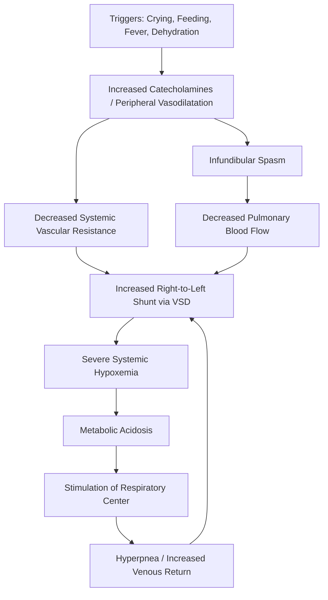

---
{"dg-publish":true,"uplink":"/cardiology/cardiology/","uptext":"Back to Index (💗 Cardiology)","permalink":"/cardiology/paroxysmal-hypercyanotic-spells/","dgPassFrontmatter":true}
---

## Definition and Epidemiology

- AKA Paroxysmal hypercyanotic attacks, hypoxic spells, blue spells, or anoxic spells.
- Acute emergency requiring prompt recognition and intervention.
- Peak incidence between 2 and 6 months of age.
- Frequent occurrence before 2 years of age.
- Higher susceptibility in infants with mild resting cyanosis lacking homeostatic compensatory mechanisms (e.g., polycythemia).

## Triggers and Precipitating Factors

- Spontaneous and unpredictable onset.
- Early morning occurrence immediately after awakening.
- Vigorous crying, agitation, or exertion.
- Feeding.
- Dehydration, fever, or pain.

## Pathophysiology

- Acute decrease in pulmonary blood flow.
- Increased right-to-left shunting across ventricular septal defect.
- Infundibular spasm from increased circulating catecholamines.
- Activation of right ventricular mechanoreceptors secondary to decreased systemic venous return.
- Activation of left ventricular mechanoreceptors secondary to decreased pulmonary blood flow.
- Peripheral vasodilatation causing severe fall in systemic vascular resistance.
- Systemic hypoxia inducing severe metabolic acidosis.
- Acidosis stimulating respiratory center causing hyperpnea.
- Increased venous return from hyperpnea worsening right-to-left shunt (vicious cycle).

## Clinical Features

- Inconsolable crying, restlessness, and severe irritability.
- Hyperpnea with deep and rapid breathing.
- Absence of significant subcostal recession despite hyperpnea.
- Progressive, deepening cyanosis.
- Gasping respirations.
- Disappearance or marked reduction of right ventricular outflow tract systolic ejection murmur.
- Episode duration ranging from a few minutes to several hours.
- Generalized weakness and sleep following brief episodes.

## Differential Diagnosis of Cyanotic Episodes

- Cyanotic breath-holding spells (forced expiration during crying, age 6 months to 5 years).
- Pallid breath-holding spells (associated severe bradycardia, first 1-2 years of life).
- Acrocyanosis (peripheral cyanosis with cold exposure, normal pink mucous membranes).
- Respiratory disorders (variable partial pressure of oxygen, responsive to mechanical ventilation).
- Central nervous system disorders (hypoxia reversed with artificial ventilation).
- Persistent pulmonary hypertension of the newborn (improved hypoxia with hyperventilation).

## Complications

- Syncope or loss of consciousness.
- Convulsions and seizures.
- Cerebral thrombosis, central nervous system infarction, hemiplegia.
- Intractable metabolic acidosis, shock, and respiratory failure.
- Death.

## Management

### Immediate Interventions
#### Reduce SVR and oxygen
- Knee-chest position on abdomen (increases systemic vascular resistance, increases systemic venous return).
- Loosening of constrictive clothing.
- Oxygen delivery via face mask or nasal cannula.
#### Calming the child
- Calming and holding the infant.
- Subcutaneous morphine (0.2 mg/kg).
- Intramuscular ketamine (3-5 mg/kg).
- Intranasal fentanyl or midazolam.
#### ACIDOSIS/dehydration correction
- Intravenous fluid bolus (10 mL/kg dextrose normal saline).
- Avoidance of premature, agitating blood draws.
- Transcutaneous oxygen saturation monitoring.
- Intravenous sodium bicarbonate (1-2 mEq/kg diluted 1:1 or in 10 mL/kg N/5 in 5% dextrose) for rapid metabolic acidosis correction.
### Pharmacological Interventions (Refractory Spells)
#### BETA blockers
- Intravenous beta-blockade for infundibular spasm reduction and heart rate control.
- Intravenous propranolol (0.15-0.25 mg/kg given slowly, repeatable once in 15 minutes).
- Intravenous metoprolol (0.1 mg/kg slowly over 5 minutes, maximum 3 doses, followed by 1-2 mcg/kg/min infusion).
- Intravenous esmolol infusion.
#### VASOPRESSORS
- Vasopressor administration for systemic vascular resistance augmentation and forced pulmonary blood flow.
- Intravenous phenylephrine (5 mcg/kg bolus, 1-4 mcg/kg/min infusion).
- Intravenous methoxamine (0.1-0.2 mg/kg) or intramuscular methoxamine (0.1-0.4 mg/kg).
- Intravenous diazepam (0.2 mg/kg) or midazolam (0.1-0.2 mg/kg) for seizure management.
#### OTHERS
- Neuromuscular blockade, elective intubation, and mechanical ventilation for persistent spells.
- Preparation for palliative (e.g., Blalock-Taussig-Thomas shunt) or corrective surgery.

### Post-Spell Care and Prevention

- Careful neurological examination and central nervous system imaging for focal deficits.
- Oral propranolol therapy (0.5-1.5 mg/kg every 6-8 hours) for resting saturation improvement and spell frequency reduction.
- Therapeutic or prophylactic iron supplementation (if hemoglobin <12 g/dL) for relative anemia correction and stroke risk reduction.
- Strict avoidance of dehydration.
- Detailed echocardiography for disease morphology delineation.
- Parental counseling regarding spell recurrence and precipitating factors (dehydration, fever, pain).
- Expedited elective surgical repair.