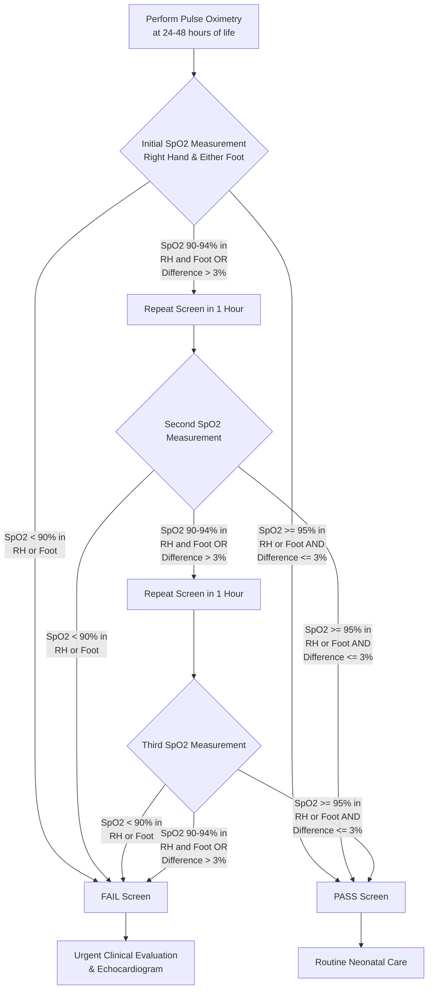

---
{"dg-publish":true,"uptext":"Back to Index (💗 Cardiology)","uplink":"/cardiology/cardiology/","permalink":"/cardiology/pulse-oximetry-in-the-diagnosis-of-critical-congenital-cardiac-disease/","dgPassFrontmatter":true}
---

## Overview of Pulse Oximetry Screening

- Routine pulse oximetry has become an essential "vital sign" in the cardiovascular assessment of neonates.
- It is the principal non-invasive screening method utilized in the newborn nursery to detect unsuspected critical cyanotic congenital heart disease (CCHD) in asymptomatic newborns.
- The overall prevalence of critical congenital heart disease in the United States is estimated to be about 20 per 10,000 live births.
- While central cyanosis may be visually apparent in severe cases, careful observation of the tongue, mucous membranes, and nail beds can be subjective and unreliable.
- Pulse oximetry allows for the objective detection of milder forms of hypoxia before overt clinical decompensation occurs.
- Saturations of 95% or lower while breathing room air are considered abnormal and warrant further investigation.

### Critical Congenital Heart Diseases Targeted

- Screening primarily targets duct-dependent lesions where closure of the ductus arteriosus will lead to severe cardiac decompensation, profound hypoxemia, acidosis, and cardiovascular collapse.
- The primary critical cyanotic lesions targeted by pulse oximetry screening include:

| Category                                                       | Specific Critical Congenital Heart Lesions                                                                                                              |
| -------------------------------------------------------------- | ------------------------------------------------------------------------------------------------------------------------------------------------------- |
| **Duct-Dependent Systemic Circulation**                        | Hypoplastic left heart syndrome (HLHS)   Critical aortic valve stenosis   Severe coarctation of the aorta   Interrupted aortic arch            |
| **Duct-Dependent Pulmonary Circulation / Right-Sided Lesions** | Pulmonary atresia with intact ventricular septum (PA/IVS)   Critical pulmonary stenosis   Severe Tetralogy of Fallot (TOF)   Tricuspid atresia |
| **Mixing Lesions / Transposition**                             | D-Transposition of the great arteries (D-TGA) (especially at risk for restrictive atrial septum)                                                        |
| **Severe Venous/Valvular Lesions**                             | Obstructed total anomalous pulmonary venous return (TAPVR)   Congenital mitral and tricuspid valve regurgitation   Neonatal Ebstein anomaly       |

## Screening Protocol and Algorithm

- Screening is recommended to be performed between 24 and 48 hours of life, or prior to discharge if the newborn is discharged earlier.
- Measurements must be obtained from both a pre-ductal and a post-ductal site to assess for differential cyanosis.
- The pre-ductal measurement is obtained from the right hand.
- The post-ductal measurement is obtained from either foot.

### Criteria for Pass, Fail, and Repeat

|Screening Result|Criteria|Action Required|
|:--|:--|:--|
|**Pass**|SpO2 $\ge$ 95% in right hand OR either foot **AND** absolute difference is $\le$ 3% between right hand and foot.|Routine neonatal care.|
|**Fail (Positive)**|SpO2 < 90% in either the right hand OR foot.|Urgent echocardiography and clinical evaluation.|
|**Repeat Zone**|SpO2 90–94% in right hand and foot **OR** > 3% absolute difference between right hand and foot.|Repeat screening once in 1 hour.|
|**Fail after Repeats**|SpO2 90–94% in right hand and foot **OR** > 3% absolute difference after the **third** screening attempt.|Urgent echocardiography and clinical evaluation.|

## Management of a Failed Screen

- An infant who fails the pulse oximetry screen requires immediate and comprehensive medical evaluation to determine the underlying etiology of the hypoxemia.
- Urgent two-dimensional echocardiography with Doppler is the definitive noninvasive test indicated to confirm or definitively rule out structural congenital heart disease.
- While awaiting echocardiography, a careful physical re-examination is mandatory.
- The clinician must perform detailed cardiac auscultation to assess for pathological murmurs or abnormal heart sounds (e.g., a single S2 commonly seen in transposition of the great arteries).
- A thorough assessment of peripheral pulses in both the upper and lower extremities is required to evaluate for inequalities suggestive of left-sided obstructive lesions.
- Four-extremity blood pressure measurements should be obtained to assess for a significant gradient between the upper and lower extremities, indicative of aortic arch obstruction or coarctation.
- If echocardiography is not immediately available and clinical suspicion for a ductal-dependent lesion is high, the clinician should initiate a prostaglandin E1 (PGE1) infusion to maintain ductal patency and prevent cardiovascular collapse.
- Because prostaglandin therapy carries a risk of apnea, personnel skilled in neonatal endotracheal intubation must be readily available.

## Differential Diagnosis for Positive Pulse Oximetry

- A failed pulse oximetry screen is highly sensitive for hypoxemia but is not entirely specific to congenital heart disease.
- Numerous non-cardiac conditions can result in abnormal pulse oximetry readings in the newborn period.

|Category|Specific Conditions|
|:--|:--|
|**Cardiac (CCHD)**|Hypoplastic left heart syndrome, Pulmonary atresia, Tetralogy of Fallot, TAPVR, d-TGA, Tricuspid atresia, Truncus arteriosus, severe Coarctation of the aorta.|
|**Pulmonary / Respiratory**|Respiratory distress syndrome (RDS), transient tachypnea of the newborn (TTN), meconium aspiration syndrome, pneumonia.|
|**Vascular**|Primary persistent pulmonary hypertension of the newborn (PPHN).|
|**Hematologic**|Methemoglobinemia, severe neonatal anemia.|
|**Neurologic**|Central nervous system disorders resulting in hypoventilation, intracranial hemorrhage, sepsis/meningitis.|

## Nuances and Clinical Correlates

### Differentiating Cardiac from Non-Cardiac Hypoxia

- Hypoxia in cyanotic CHD tends to be relatively constant, whereas hypoxia secondary to respiratory disorders or PPHN often fluctuates with time or changes in ventilatory management.
- Hyperventilation may temporarily improve hypoxemia in neonates with PPHN, but it rarely improves oxygenation in those with fixed cyanotic CHD.
- The Hyperoxia Test can be utilized as a diagnostic adjunct to differentiate between pulmonary and cardiac etiologies of cyanosis.
- The Hyperoxia Test involves administering 100% oxygen via an oxygen hood and measuring the arterial blood partial pressure of oxygen (Pao2).
- In healthy newborns or those with strictly pulmonary disease, the high intra-alveolar Po2 overcomes ventilation-perfusion mismatching, causing the Pao2 to rise above 150-300 mm Hg.
- In neonates with cyanotic CHD, the right-to-left intracardiac shunting prevents the Pao2 from rising appreciably; values typically remain below 100-150 mm Hg despite 100% oxygen administration.

### Limitations of Pulse Oximetry

- Pulse oximeters are highly accurate when the true blood oxygen saturation is between 90% and 100%.
- The diagnostic accuracy of pulse oximetry decreases significantly when the patient's true blood oxygen saturation falls between 80% and 90%, and the devices are highly inaccurate when true saturation falls below 40%.
- A normal pulse oximetry reading does not definitively rule out all forms of congenital heart disease.
- Less severe obstructive lesions, mixing lesions with favorable streaming, and certain septal defects (e.g., ventricular septal defects) may present with normal or near-normal oxygen saturations (e.g., 99%) in the immediate newborn period before pulmonary vascular resistance falls.
- Clinicians must distinguish true central cyanosis (detected by pulse oximetry) from peripheral acrocyanosis. Acrocyanosis is a benign, physiological response to vasomotor instability and cool temperatures, presenting with normal central saturations but blue hands and feet.

### Differential Cyanosis

- Differential cyanosis occurs when the pre-ductal oxygen saturation (right upper extremity) significantly differs from the post-ductal oxygen saturation (lower extremities).
- A lower post-ductal saturation compared to the pre-ductal saturation suggests right-to-left shunting across the patent ductus arteriosus, classically seen in PPHN or left-sided obstructive lesions like critical coarctation of the aorta or interrupted aortic arch.
- "Reverse differential cyanosis" occurs when the post-ductal (lower extremity) oxygen saturation is higher than the pre-ductal (upper extremity) saturation.
- Reverse differential cyanosis is a classic hallmark of d-Transposition of the Great Arteries (d-TGA) complicated by either persistent pulmonary hypertension of the newborn (PPHN) or aortic arch obstruction. In this scenario, oxygenated blood from the pulmonary artery shunts right-to-left across the ductus arteriosus to supply the descending aorta, while deoxygenated blood from the right ventricle supplies the ascending aorta and upper extremities.