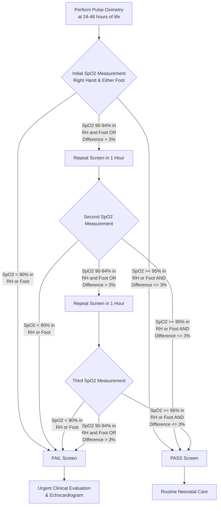

---
{"dg-publish":true,"uptext":"Back to Index (💗 Cardiology)","uplink":"/cardiology/cardiology/","permalink":"/cardiology/pulse-oximetry-in-the-diagnosis-of-critical-congenital-cardiac-disease/","dgPassFrontmatter":true}
---

## Overview

- Routine pulse oximetry screening recommended for all newborns.
- Primary goal: Detect unsuspected critical cyanotic congenital heart disease (CCHD).
- Detects respiratory disorders and primary pulmonary hypertension.
- Overcomes visual limitations; clinical cyanosis easily missed due to dark skin color, poor lighting, or anemia.
- Detects milder forms of hypoxia invisible to naked eye.
- Normal oxygen saturation >98% in infants.
- Threshold for classifying desaturation <95% in room air.

### Target Lesions Detected
| Category                                                       | Specific Critical Congenital Heart Lesions                                                                                                              |
| -------------------------------------------------------------- | ------------------------------------------------------------------------------------------------------------------------------------------------------- |
| **Duct-Dependent Systemic Circulation**                        | Hypoplastic left heart syndrome (HLHS)   Critical aortic valve stenosis   Severe coarctation of the aorta   Interrupted aortic arch            |
| **Duct-Dependent Pulmonary Circulation / Right-Sided Lesions** | Pulmonary atresia with intact ventricular septum (PA/IVS)   Critical pulmonary stenosis   Severe Tetralogy of Fallot (TOF)   Tricuspid atresia |
| **Mixing Lesions / Transposition**                             | D-Transposition of the great arteries (D-TGA) (especially at risk for restrictive atrial septum)                                                        |
| **Severe Venous/Valvular Lesions**                             | Obstructed total anomalous pulmonary venous return (TAPVR)   Congenital mitral and tricuspid valve regurgitation   Neonatal Ebstein anomaly       |
## Screening Protocol

- Timing: Performed between 24 and 48 hours of life.
- Executed before discharge in asymptomatic newborns.
- Measurements required: Pre-ductal (right hand) and post-ductal (either foot).

### Pulse Oximetry Screening Algorithm

|Result Category|Pulse Oximetry Criteria|Clinical Action|
|:--|:--|:--|
|**Pass**|$\ge$ 95% in right hand or foot **AND** $\le$ 3% difference between right hand and foot|Screen passed; routine care.|
|**Fail (Immediate)**|< 90% in either right hand or foot|Urgent echocardiography indicated.|
|**Equivocal**|90–94% in hand or foot **OR** > 3% difference between right hand and foot|Repeat screen once in 1 hour.|
|**Fail (Delayed)**|90–94% **OR** > 3% difference after third consecutive screen|Urgent echocardiography indicated.|

## Follow-up on Positive Screen

- Urgent echocardiography required.
- Careful reexamination of peripheral pulses.
- Four-extremity blood pressure measurements.
- Detailed cardiac auscultation.

## Diagnostic Interpretation of Saturation Discrepancies

### Differential Cyanosis

- Defined as lower extremity saturation lower than right arm saturation (e.g., right wrist 97%, left foot 72%).
- Indicates right-to-left shunting across patent ductus arteriosus.
- Associated lesions: Coarctation of the aorta, interrupted aortic arch, persistent pulmonary hypertension.

### Reverse Differential Cyanosis

- Defined as upper extremity oxygen saturation lower than lower extremity saturation.
- Seen in d-transposition of the great arteries combined with either coarctation of the aorta or persistent pulmonary hypertension of the newborn.

## Technical Limitations

- Accuracy optimal when blood oxygen saturation remains between 90% and 100%.
- Accuracy decreases when blood oxygen saturation drops to 80–90%.
- Devices inaccurate when saturation falls below 40%.

