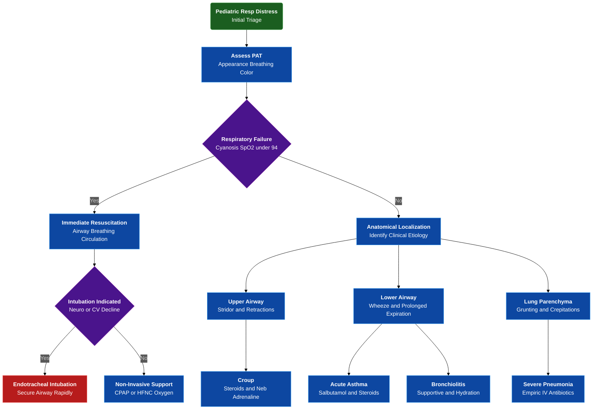

---
{"dg-publish":true,"uptext":"Back to Index (🚑 Emergencies and Critical Care)","uplink":"/emergencies/emergencies-and-critical-care/","permalink":"/emergencies/approach-to-child-with-respiratory-distress/","dgPassFrontmatter":true}
---

## Algorithm

## Initial Assessment And Triage

- Initiate rapid triage utilizing pediatric assessment triangle.
- Perform visual and auditory assessment of appearance, breathing, and color.
- Evaluate appearance utilizing tone, interactiveness, consolability, look, and speech.
- Assess appearance to gather clues regarding brain perfusion and oxygenation.
- Identify abnormal respiratory rates including tachypnea or bradypnea.
- Detect increased work of breathing through nasal flaring and retractions.
- Recognize abnormal respiratory sounds including wheeze, grunt, and stridor.
- Evaluate color for pallor, mottling, or cyanosis.
- Correlate abnormal color with hypoxemia or impending cardiorespiratory failure.
- Categorize children exhibiting tachypnea, increased work of breathing, cyanosis, abnormal sensorium, and room air oxygen saturation less than 94% as experiencing respiratory failure.
- Initiate immediate resuscitation for identified respiratory failure.

## Pathophysiology And Anatomical Localization

### Clinical Correlation And Etiology

|Clinical Signs|Anatomical Localization|Common Etiologies|
|---|---|---|
|Ala nasi flaring, suprasternal retractions, supraclavicular retractions, stridor|Upper airway obstruction|Croup, epiglottitis, foreign body, diphtheria|
|Subcostal retractions, intercostal retractions, prolonged expiration, wheeze|Lower airway obstruction|Asthma, acute bronchiolitis|
|Intercostal retractions, subcostal retractions, grunting, crepitations|Lung parenchyma|Community acquired pneumonia, acute respiratory distress syndrome|
|See-saw breathing, irregular breathing, bradypnea|Central disordered control|Raised intracranial pressure, brain injury|

### Anatomical Mechanisms

- Realize partial obstruction above thoracic inlet causes turbulent airflow.
- Associate upper airway turbulent airflow with harsh high-pitched stridor.
- Understand lower airway obstruction increases airway resistance.
- Link small airway obstruction with air trapping and dynamic hyperinflation.
- Observe expiration becoming active prolonged process resulting in wheezing.
- Recognize parenchymal disease involves alveolar consolidation or pulmonary edema.
- Correlate parenchymal disease with ventilation-perfusion mismatch, intrapulmonary shunting, and severe hypoxemia.

## Primary Assessment And Stabilization

### Airway Management

- Ensure open and maintainable airway.
- Utilize simple positioning including head-tilt-chin lift or sniffing position.
- Perform oral suctioning to clear secretions.
- Prepare advanced interventions if airway remains unmaintainable.

### Breathing And Ventilation Support

- Administer heated humidified 100% supplemental oxygen.
- Utilize non-rebreathing face mask.
- Target oxygen saturation greater than or equal to 94%.
- Use appropriate-sized nasal prongs for infants.
- Set nasal prong flow rate at 1-2 liters per minute.
- Initiate non-invasive respiratory support for severe retractions or failure to maintain adequate oxygen saturation.
- Deploy continuous positive airway pressure or high flow nasal cannula.
- Apply continuous positive airway pressure to provide distending pressure.
- Utilize distending pressure to recruit atelectatic alveoli and reduce work of breathing.
- Avert invasive mechanical ventilation through effective continuous positive airway pressure use.

### Circulation And Hemodynamics

- Monitor heart rate, capillary refill time, and blood pressure.
- Establish immediate intravenous or intraosseous access.
- Suspect concurrent shock with hypotension, prolonged capillary refill, or marked tachycardia.
- Administer rapid isotonic crystalloid fluid boluses.
- Deliver 10-20 milliliters per kilogram of crystalloid for shock management.

### Disability And Neurological Status

- Monitor level of consciousness continuously.
- Identify worsening hypoxia or hypercarbia through neurological changes.
- Detect excessive irritability, lethargy, obtundation, or coma as signs of deterioration.

## Indications For Endotracheal Intubation

|Clinical Category|Specific Indicators For Intubation|
|---|---|
|Oxygenation Failure|Central cyanosis, inability to maintain oxygen saturation greater than or equal to 94% despite continuous positive airway pressure, high flow nasal cannula, or non-invasive ventilation|
|Neurological Decline|Central nervous system signs of severe hypoxia including restlessness, obtunded sensorium, extreme lethargy, seizures, or coma|
|Cardiovascular Compromise|Marked tachycardia, profound bradycardia, or hypotension indicating imminent cardiorespiratory arrest|
|Clinical Worsening|Severe respiratory distress, exhaustion, or visible worsening of respiratory effort while utilizing non-invasive support|

## Disease-Specific Emergency Management

### Acute Asthma

- Administer inhaled salbutamol and inhaled budesonide every 20 minutes for first hour.
- Dose budesonide at 800 micrograms per dose.
- Provide systemic corticosteroids utilizing oral prednisolone or intravenous hydrocortisone.
- Escalate therapy for severe exacerbations.
- Initiate continuous salbutamol nebulization.
- Administer intravenous magnesium sulphate at 50 milligrams per kilogram.
- Utilize intravenous terbutaline for refractory cases.

### Croup

- Provide humidified oxygen using non-threatening approach.
- Administer single dose of oral, intramuscular, or intravenous dexamethasone.
- Dose dexamethasone at 0.6 milligrams per kilogram.
- Deliver nebulized adrenaline for severe distress.
- Use 5 milliliters of 1:1000 undiluted adrenaline solution for nebulization.

### Acute Bronchiolitis

- Provide primarily supportive management.
- Ensure adequate oxygenation and hydration.
- Consider therapeutic trial of nebulized 3% hypertonic saline or adrenaline.
- Avoid routine administration of antibiotics and systemic steroids.

### Severe Pneumonia

- Initiate empiric intravenous antibiotics immediately.
- Administer cefotaxime and amikacin for infants aged 1-2 months.
- Administer ampicillin and gentamicin for children aged 2-59 months.
- Adjust antibiotic regimen if atypical or staphylococcal pneumonia is suspected.