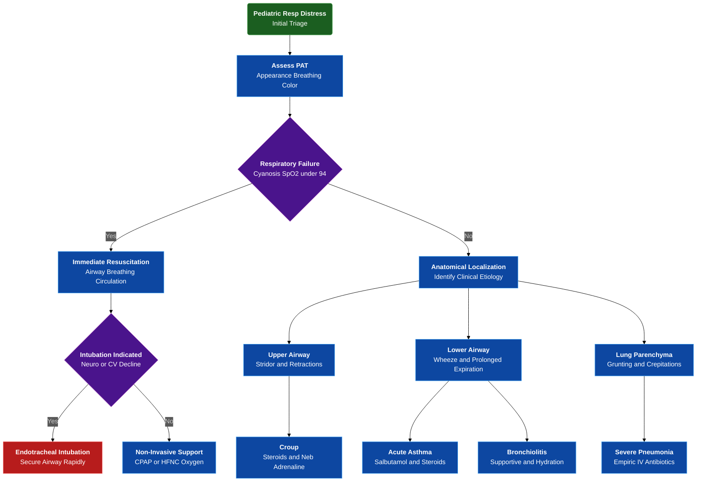

---
{"dg-publish":true,"uptext":"Back to Index (🚑 Emergencies and Critical Care)","uplink":"/emergencies/emergencies-and-critical-care/","permalink":"/emergencies/approach-to-child-with-respiratory-distress/","dgPassFrontmatter":true}
---

## Algorithm

## Initial assessment and triage

### Pediatric assessment triangle

- Triage begins with rapid visual and auditory evaluation.
- Assess child appearance, breathing, and color.

#### Appearance evaluation

- Utilize Ticls mnemonic: Tone, Interactiveness, Consolability, Look/gaze, Speech.
- Provides rapid clues regarding brain perfusion and oxygenation.

#### Breathing assessment

- Identify abnormal respiratory rates including tachypnea or bradypnea.
- Detect increased work of breathing via nasal flaring or retractions.
- Note abnormal airway sounds including wheeze, grunt, or stridor.

#### Color evaluation

- Detect pallor, mottling, or cyanosis.
- Color abnormalities indicate severe hypoxemia or impending cardiorespiratory failure.

#### Respiratory failure categorization

- Identify patients requiring immediate resuscitation.
- Criteria include tachypnea, increased breathing work, cyanosis, abnormal sensorium, and room air oxygen saturation below 94 percent.

## Pathophysiology and anatomical localization

### Anatomical localization guide

|Clinical signs|Anatomical localization|Common etiologies|
|---|---|---|
|Ala nasi flaring, suprasternal/supraclavicular retractions, stridor|Upper airway obstruction|Croup, Epiglottitis, Foreign body, Diphtheria|
|Subcostal/intercostal retractions, prolonged expiration, wheeze|Lower airway obstruction|Asthma, Acute bronchiolitis|
|Intercostal/subcostal retractions, grunting, crepitations|Lung parenchyma|Community acquired pneumonia, Acute respiratory distress syndrome|
|See-saw breathing, irregular breathing, bradypnea|Central disordered control|Raised intracranial pressure, Brain injury|

### Pathophysiological mechanisms

- **Upper airway obstruction:** Partial obstruction above thoracic inlet causes turbulent airflow and harsh, high-pitched stridor.
- **Lower airway obstruction:** Small airway obstruction increases resistance, causing air trapping and dynamic hyperinflation.
- Active, prolonged expiration results in audible wheezing.
- **Parenchymal disease:** Alveolar consolidation or pulmonary edema creates ventilation-perfusion mismatch.
- Results in intrapulmonary shunting and severe hypoxemia.

## Primary assessment and stabilization algorithm

### Airway management

- Ensure airway remains open and maintainable.
- Utilize simple positioning techniques including head-tilt-chin lift or sniffing position.
- Perform oral suctioning to clear excessive secretions.
- Prepare advanced interventions if airway remains unmaintainable.

### Breathing interventions

- Administer heated, humidified 100 percent supplemental oxygen.
- Utilize non-rebreathing face mask targeting oxygen saturation of 94 percent or higher.
- Provide appropriate-sized nasal prongs with 1-2 liters per minute flow rate for infants.

#### Non-invasive respiratory support

- Initiate continuous positive airway pressure or high flow nasal cannula for severe retractions.
- Indicated when patient fails to maintain oxygen saturation above 94 percent.
- Continuous positive airway pressure provides distending pressure to recruit atelectatic alveoli.
- Reduces overall work of breathing and potentially averts invasive mechanical ventilation.

### Circulation assessment

- Monitor heart rate, capillary refill time, and systemic blood pressure.
- Obtain immediate intravenous or intraosseous vascular access.

#### Shock management

- Suspect concurrent shock with hypotension, prolonged capillary refill, or marked tachycardia.
- Administer rapid isotonic crystalloid fluid boluses of 10-20 milliliters per kilogram.

### Disability evaluation

- Continuously monitor baseline level of consciousness.
- Identify worsening hypoxia or hypercarbia presenting as excessive irritability.
- Note progression to lethargy, obtundation, or coma.

## Indications for endotracheal intubation

### Clinical thresholds for invasive ventilation

|Clinical category|Specific indicators for intubation|
|---|---|
|Oxygenation failure|Central cyanosis or inability to maintain oxygen saturation above 94 percent despite non-invasive ventilation|
|Neurological decline|Central nervous system signs of severe hypoxia including restlessness, obtunded sensorium, extreme lethargy, seizures, or coma|
|Cardiovascular compromise|Marked tachycardia, profound bradycardia, or hypotension indicating imminent cardiorespiratory arrest|
|Clinical worsening|Severe respiratory distress, exhaustion, or visible worsening of respiratory effort while on non-invasive support|

## Disease-specific emergency management

### Acute asthma exacerbation

- Administer inhaled salbutamol and repeat inhalation therapy every 20 minutes for the first hour.
- Administer systemic corticosteroids using oral prednisolone or intravenous hydrocortisone.
- Escalate severe exacerbations to continuous salbutamol nebulization.
- Administer intravenous magnesium sulphate at 50 milligrams per kilogram.
- Provide intravenous terbutaline for refractory cases.

### Croup protocol

- Provide humidified oxygen in a calm, non-threatening manner.
- Administer single dose oral, intramuscular, or intravenous dexamethasone at 0.6 milligrams per kilogram.
- Deliver nebulized adrenaline utilizing 5 milliliters of 1:1000 undiluted solution for severe respiratory distress.

### Acute bronchiolitis care

- Management remains primarily supportive focusing on oxygenation and hydration.
- Consider therapeutic trial of nebulized 3 percent hypertonic saline or adrenaline.
- Routine administration of antibiotics and systemic steroids remains strictly not recommended.

### Severe pneumonia treatment

- Initiate empiric intravenous antibiotics immediately upon recognition.
- Administer cefotaxime combined with amikacin for infants aged 1-2 months.
- Administer ampicillin combined with gentamicin for children aged 2-59 months.
- Adjust antibiotic regimen if atypical pathogens or staphylococcal pneumonia suspected clinically.