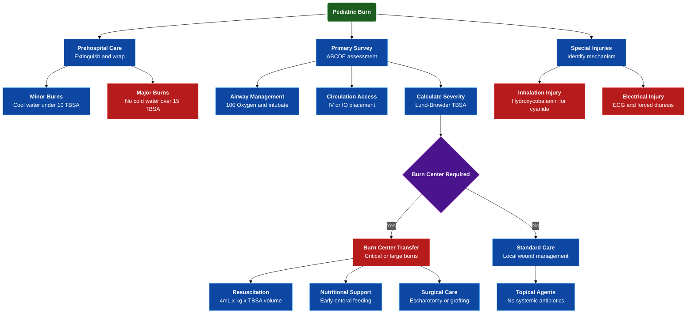

---
{"dg-publish":true,"uptext":"Back to Index (🚑 Emergencies and Critical Care)","uplink":"/emergencies/emergencies-and-critical-care/","permalink":"/emergencies/approach-to-children-with-burns/","dgPassFrontmatter":true}
---

## Algorithm

## Epidemiology And General Principles

- Unintentional fire-related injuries account for approximately 10% of unintentional injury-related pediatric deaths.
- Children face higher mortality risk compared to adults.
- Scald burns represent leading hospitalization cause in children under 4 years, comprising 65% of admissions.
- Flame burns manifest most frequently in children over 5 years.
- Child abuse contributes to approximately 18% of burn injuries.
- Abuse presents typically as glove or stocking distribution, isolated deep trunk burns, or circular cigarette burns.
- Loss of skin integrity precipitates hypothermia, massive fluid loss, and environmental microbial invasion.

## Prehospital And Emergency First Aid

- Wrap victim in blanket immediately at scene.
- Extinguish flames by rolling victim on ground.
- Avoid running with burning clothes.
- Extricate safely to airy environment.
- Prevent continued inhalation of carbon monoxide and cyanide.
- Remove smoldering clothing immediately.
- Remove constricting jewelry to prevent vascular compromise during edema phase.
- Irrigate minor burns under 10% TBSA with cool tap water for 10-20 minutes.
- Cold water application strictly contraindicated for burns exceeding 15% TBSA due to severe hypothermia risk.
- Avoid home remedies including grease, soda, butter, oil, powder, or toothpaste.
- Cover wound strictly with clean dry sheeting or sterile dressing.

## Primary Survey And Acute Resuscitation
### Airway And Breathing Management
- Administer 100% oxygen immediately for facial burns, singed hair, carbonaceous sputum, or suspected smoke inhalation.
- Assess airway strictly for laryngeal edema, stridor, or retractions.
- Perform early elective intubation for any evidence of significant airway compromise.
### Circulation And Hemodynamics
- Obtain intravenous access in non-burned areas preferably.
- Utilize burned areas for vascular access if alternative sites remain unavailable.
- Place intraosseous line if intravenous access fails emergently.
- Replace intraosseous access with central venous line subsequently.
### Disability And Exposure Control
- Perform rapid neurological assessment evaluating hypoxia or carbon monoxide poisoning.
- Expose fully to calculate TBSA accurately.
- Assess concurrent injuries thoroughly.
- Cover immediately with warmed blankets preventing hypothermia.
- Maintain cervical spine precautions for explosion, fall, or high-voltage mechanisms.

## Assessment Of Burn Severity
### Classification Of Burn Depth

- Accurate classification guides treatment and predicts scarring.

| Burn Depth Classification | Anatomical Involvement                       | Clinical Characteristics                                                                | Prognosis And Healing                                                     |
| ------------------------- | -------------------------------------------- | --------------------------------------------------------------------------------------- | ------------------------------------------------------------------------- |
| **First-Degree**          | Confined strictly to epidermis               | Erythematous, dry, painful, lacks blistering.                                           | Heals within one week without scarring.                                   |
| **Second-Degree**         | Epidermis and variable dermis portion        | Moist blebs and blisters; mottled pink/white underlying tissue; exquisitely painful.    | Superficial heals in 7-14 days; deep requires over 3 weeks, leaving scar. |
| **Third-Degree**          | Complete destruction of epidermis and dermis | Leathery, dry, mottled, non-blanching; insensate center due to destroyed nerve endings. | Cannot regenerate; requires surgical excision and skin grafting.          |

### Estimation Of Total Body Surface Area
- Rule of nines remains inaccurate for children under 15 years.
- Larger head-to-body mass ratio dictates specialized assessment.
- Variable extremity growth requires age-specific evaluation tools.
- Utilize Lund and Browder chart for accurate pediatric estimation.
- Utilize child's palmar surface including fingers for rapid 1% TBSA estimation.

## Indications For Burn Center Admission

- Appropriate triage minimizes pediatric morbidity and mortality.

| Clinical Criteria For Burn Center Referral                                               |
| ---------------------------------------------------------------------------------------- |
| Partial-thickness burns involving greater than 10% TBSA.                                 |
| Full-thickness burns involving greater than 5% TBSA at any age.                          |
| Burns involving critical areas: face, hands, feet, genitalia, perineum, or major joints. |
| Electrical burns including high-tension wire and lightning injuries.                     |
| Chemical burns and suspected inhalational injury.                                        |
| Burn injuries complicated by pre-existing medical conditions.                            |
| Concomitant trauma or suspected child abuse/neglect.                                     |

## Fluid Resuscitation And Hemodynamic Monitoring

- Replenish massive fluid losses aggressively.
- Maintain adequate end-organ perfusion.
- Protect ischemic zone without overloading pediatric circulation.
- Initiate rigorous intravenous resuscitation for burns exceeding 10-15% TBSA.
- Institute strict urinary catheterization for continuous output monitoring.

### Resuscitation Formulas And Administration

| Component                   | Calculation And Administration Guidelines                                                                                           |
| --------------------------- | ----------------------------------------------------------------------------------------------------------------------------------- |
| **Resuscitation Volume**    | Volume equals 4 mL multiplied by weight multiplied by percent TBSA burn. Ringer's lactate serves as preferred isotonic crystalloid. |
| **Administration Schedule** | Infuse half calculated volume during first 8 hours post-injury. Infuse remaining half over subsequent 16 hours.                     |
| **Maintenance Fluids**      | Required for children under 20 kg. Provide 5% dextrose in normal saline or Ringer's lactate.                                        |
| **Monitoring Targets**      | Maintain urine output above 1 mL/kg/hr for infants. Target 0.5 mL/kg/hr for children over 20 kg.                                    |

### Hemodynamic Adjustment Protocols

- Increase fluid infusion rate by 10% if urine output falls below target.
- Decrease infusion rate by 10% if urine output exceeds target.
- Recognize tachycardia as unreliable resuscitation marker due to profound hypermetabolism.
- Insert central venous lines for reliable volume delivery in burns over 20% TBSA.
- Adjust second 24-hour fluids accounting for insensible losses and wound exudation as capillary leak seals.

## Analgesia, Sedation, And Nutrition
### Pain And Anxiety Management
- Implement multimodal pain approach addressing wide intensity fluctuations.
- Administer scheduled long-acting opioids for background pain.
- Utilize potent short-acting intravenous opioids for procedural pain.
- Administer midazolam for procedural anxiolysis.
- Schedule gabapentin targeting neuropathic pain.
### Metabolic And Nutritional Support
- Anticipate severe hypermetabolic and catabolic state.
- Target massive protein intake reaching 2-4 g/kg/day for survival.
- Initiate enteral feeding via nasogastric or nasojejunal tube on admission day.
- Preserve gastrointestinal mucosal integrity through early enteral feeding.
- Calculate infant caloric requirements: 2100 Cal/m2 plus 1000 Cal/m2 burn surface area.
- Calculate child caloric requirements: 1800 Cal/m2 plus 1300 Cal/m2 burn surface area.

## Wound Care And Topical Antimicrobial Therapy
### General Wound Management
- Avoid prophylactic systemic antibiotics strictly.
- Systemic antibiotics promote resistant pathogens without preventing sepsis.
- Rely entirely on local topical antimicrobial agents.
- Leave minor burn blisters intact.
- Debride ruptured blisters removing devitalized tissue.

### Specific Topical Agents

| Antimicrobial Agent          | Clinical Characteristics And Adverse Effects                                                                                                                              |
| ---------------------------- | ------------------------------------------------------------------------------------------------------------------------------------------------------------------------- |
| **0.5% Silver Sulfadiazine** | Painless application with soothing effect. Limits fluid loss. Adverse effects include transient leukopenia, skin rash, thrombocytopenia.                                  |
| **Mafenide Acetate**         | Exhibits excellent penetration through thick eschar. Agent of choice for deep burns and cartilaginous surfaces. Induces severe application pain and metabolic acidosis.   |
| **0.5% Silver Nitrate**      | Provides broad-spectrum coverage for sulfa-allergic patients. Causes gray wound staining. Induces severe electrolyte derangements including hyponatremia and hypokalemia. |
### Surgical Intervention
- Perform prompt decompressive escharotomy for circumferential extremity or truncal burns.
- Prevent compartment syndrome and respiratory restriction aggressively.
- Execute early surgical excision of eschar for deep burns exceeding 10% TBSA.
- Perform autologous skin grafting rapidly to prevent systemic sepsis and optimize functional outcomes.

## Management Of Special Burn Injuries
### Inhalational Injuries
- Suspect inhalation injury in closed-space fires.
- Identify singed facial hair, carbonaceous sputum, hoarseness, or altered sensorium.
- Confirm carbon monoxide poisoning via elevated carboxyhemoglobin levels.
- Administer 100% oxygen immediately.
- Oxygen dramatically reduces carbon monoxide elimination half-life from 4 hours to 40 minutes.
- Suspect cyanide toxicity with synthetic material combustion.
- Administer intravenous hydroxycobalamin 70 mg/kg addressing cyanide toxicity.
- Hydroxycobalamin binds cyanide forming stable cyanocobalamin for urinary excretion.
- Avoid amyl nitrite and sodium nitrite strictly due to severe methemoglobinemia induction risk.
### Electrical Injuries
- Anticipate direct contact or arcing mechanisms.
- Characterized distinctly by specific entry and exit wounds.
- Recognize surface burns severely underestimate deep tissue destruction.
- Disconnect patient immediately from power source utilizing non-conductive materials.
- Initiate continuous cardiac monitoring due to fatal arrhythmia risk.
- Anticipate massive muscle necrosis precipitating myoglobinuria.
- Mitigate acute renal failure risk via aggressive fluid resuscitation and forced alkaline diuresis.
- Monitor closely for deep compartment syndrome.
- Perform urgent fasciotomies and aggressive surgical debridement for necrotic muscle.