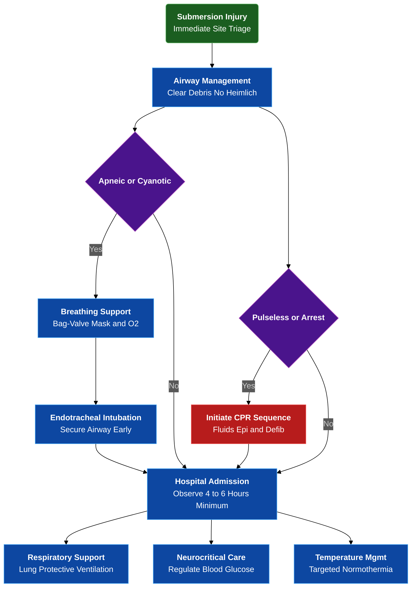

---
{"dg-publish":true,"uptext":"Back to Index (🚑 Emergencies and Critical Care)","uplink":"/emergencies/emergencies-and-critical-care/","permalink":"/emergencies/approach-to-near-drowning/","dgPassFrontmatter":true}
---

## Algorithmic Approach to Drowning and Submersion Injuries

## Pathophysiology and Mechanisms

### Sequence of Events

- Modern medical consensus prefers term drowning for entire process of respiratory impairment from submersion, regardless of survival.
- Primary pathogenic mechanism dictating morbidity and mortality involves global hypoxic-ischemic injury.
- Instinctive drowning response triggered by actual or perceived suffocation.
- Autonomic movements and struggles occur to maintain airway above water.
- Voluntary breath-holding begins, lasting typically <1 minute followed by small volume liquid enters hypopharynx.
- This sensory stimulus triggers protective reflex laryngospasm.
- Laryngospasm prevents fluid aspiration but halts gas exchange.
- Hypoxemia rapidly develops.
- Arterial blood oxyhemoglobin saturation decreases, causing loss of consciousness.
- Profound hypoxia and medullary depression cause laryngospasm relaxation.
- Terminal apnea ensues.
- Passive aspiration of surrounding water and stomach contents into lungs occurs.
- Severe myocardial hypoxia develops within 3-4 minutes.
- Peripheral vasoconstriction, decreased cardiac output, and abrupt circulatory failure follow.
- Cardiac arrhythmias evolve progressively from reflex tachycardia to severe bradycardia.
- Pulseless electrical activity or asystole results ultimately.

### Specific Organ System Pathogenesis

| Organ System           | Pathogenic Mechanisms and Consequences                                                                                                                                                                                                                                                           |
| ---------------------- | ------------------------------------------------------------------------------------------------------------------------------------------------------------------------------------------------------------------------------------------------------------------------------------------------ |
| Central Nervous System | Irreversible hypoxic-ischemic brain injury begins within 3-5 minutes of sustained anoxia.  Secondary cerebral edema develops several hours post-resuscitation.  Intracranial hypertension exacerbates ischemic damage.                                                                     |
| Pulmonary System       | Aspiration of fluid severely compromises lung compliance.  Water washes out pulmonary surfactant.  Alveolar instability, profound ventilation-perfusion mismatch, and severe intrapulmonary shunting occur.  Disruption mimics acute respiratory distress syndrome phenotype.           |
| Osmolar Fluid Shifts   | Theoretical differences exist between fresh water and salt water.  Fresh water causes alveolar fluid absorption.  Salt water draws plasma into alveoli.  Clinical management remains identical. Victims rarely aspirate sufficient volume to cause massive systemic electrolyte shifts. |
| Cardiovascular System  | Hypoxia-induced myocardial depression impairs contractility.  Arterial hypotension predisposes myocardium to infarction and fatal arrhythmias.                                                                                                                                                |
| Systemic and Metabolic | Global hypoperfusion induces acute kidney injury.  Cortical necrosis, disseminated intravascular coagulation, hemolysis, and profound gastrointestinal mucosal sloughing occur.                                                                                                               |

### Impact of Cold Water Immersion

- Immersion in icy water (<15-20 C) induces cold water shock.
- Intense involuntary reflex hyperventilation characterizes cold water shock.
- Severe reduction in breath-holding capability to <10 seconds accelerates water aspiration.
- Severe hypothermia (<28 C) directly suppresses medullary respiratory center.
- Hypothermia impairs myocardial contractility.
- Myocardium becomes highly susceptible to spontaneous ventricular fibrillation or asystole.

## Prehospital and Emergency Resuscitation

### Airway Management and Triage

- Immediate resuscitation initiated at submersion site represents single most critical factor improving neurological outcomes.
- Fundamental goal involves rapid reversal of anoxia and mitigation of secondary hypoxic injury.
- Trained personnel may initiate in-water resuscitation before reaching shore.
- Rapid extrication usually required to deliver effective chest compressions.
- Promptly clear airway of vomitus, debris, or foreign material.
- Abdominal thrusts strictly contraindicated.
- Heimlich maneuver dangerously increases risk of gastric regurgitation and secondary aspiration.
- Routine cervical spine immobilization not indicated for low-impact submersions.
- Apply cervical collars only if strong clinical suspicion of traumatic neck injury exists.
- Traumatic neck injury present in only ~0.5% of cases.

### Breathing and Oxygenation

- Primary insult remains respiratory.
- Initiate rescue breathing immediately if victim apneic or displays ineffective respirations.
- Use positive pressure bag-valve-mask ventilation.
- Supplement ventilation with 100% inspired oxygen.
- Endotracheal intubation indicated for persistent apnea, profound cyanosis, or severe hypoventilation.
- Secure airway early for depressed sensorium.
- Promptly remove wet clothing to halt ongoing conductive and convective heat losses.

### Circulation and Pharmacotherapy

| Intervention               | Specific Actions and Dosages                                                                                                                                                                            |
| -------------------------- | ------------------------------------------------------------------------------------------------------------------------------------------------------------------------------------------------------- |
| Vascular Access            | Establish rapid intravenous or intraosseous access for fluid and drug administration.                                                                                                                   |
| Epinephrine Administration | Primary vasoactive agent for brady-asystolic arrest. Intravenous/Intraosseous dose remains 0.01 mg/kg every 3-5 minutes.  Endotracheal dose of 0.1-0.2 mg/kg utilized if no vascular access present. |
| Volume Expansion           | Administer isotonic crystalloids.  Normal Saline or Lactated Ringer's preferred.  Rapid 10-20 mL/kg boluses augment preload and treat hypovolemia.                                                |
| Defibrillation             | Deliver initial shock of 2 J/kg if shockable rhythm identified.  Ventricular Fibrillation or Pulseless Ventricular Tachycardia require immediate shock.  Deliver 4 J/kg for refractory rhythms.   |
| Resuscitation Sequence     | Full cardiopulmonary resuscitation must commence following standard sequential Airway-Breathing-Circulation if pulseless, severely bradycardic, or profoundly hypotensive.                              |

## Subsequent Hospital Management

### Observation and Diagnostics

- Continuous hospital observation required for minimum 4-6 hours.
- Observation mandatory even if initially asymptomatic.
- Delayed pulmonary edema and progressive hypoxemia manifest during observation window.
- Initial diagnostics include arterial blood gas analysis.
- Complete metabolic panel, complete blood count, and chest radiography mandatory.

### Respiratory and Systemic Support

- Invasive mechanical ventilation required for acute respiratory distress syndrome.
- Implement lung-protective strategies strictly limiting tidal volumes (<5-8 mL/kg).
- Optimize positive end-expiratory pressure to overcome alveolar collapse and intrapulmonary shunting.
- Prophylactic antimicrobial therapy not indicated.
- Initial inflammatory response remains chemical rather than infectious.
- Antibiotics prescribed only based on subsequent radiographic evidence or strong clinical suspicion of bacterial pneumonia.
- Extracorporeal life support utilized successfully in profound, medically refractory acute respiratory distress syndrome or severe reversible cardiac failure.
- Protect gastrointestinal integrity.
- Severe mucosal sloughing mandates strict bowel rest, nasogastric decompression, and gastric acid neutralization.

### Neurological and Temperature Management

#### Neurocritical Care

- Meticulous preservation of adequate oxygenation, ventilation, and cerebral perfusion pressure forms cornerstone of neurocritical care.
- Routine utilization of aggressive therapies to reduce intracranial pressure not proven beneficial.
- Severe fluid restriction, prophylactic hyperventilation, neuromuscular blockade, or barbiturate coma may paradoxically worsen neurological morbidity.
- Tightly regulate blood glucose concentrations.
- Wide glucose fluctuations exacerbate ischemic central nervous system damage. Avoid hypoglycemia and hyperglycemia.

#### Temperature Regulation

- Hyperthermia (>37.5 C) observed in nearly 50% of victims within first 48 hours.
- Aggressively prevent and treat hyperthermia to minimize secondary anoxic brain injury.
- Targeted temperature management considered for comatose survivors.
- Targeting therapeutic hypothermia (33 C) yields no significant survival advantage compared to strict targeted normothermia (36.8 C).
- Utilize controlled active internal and external rewarming measures if accidental severe hypothermia (<30 C) present upon admission.
- Continue rewarming until core temperature reaches 32-34 C.