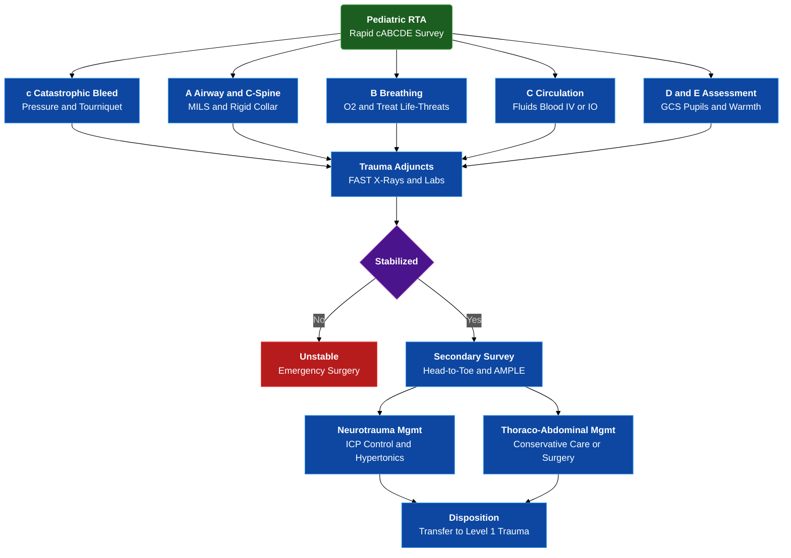

---
{"dg-publish":true,"uptext":"Back to Index (🚑 Emergencies and Critical Care)","uplink":"/emergencies/emergencies-and-critical-care/","permalink":"/emergencies/approach-to-a-child-with-road-traffic-accident-rta/","dgPassFrontmatter":true}
---

## Algorithm

## INTRODUCTION
- Pediatric trauma requires a specialized approach due to unique anatomy (larger head-to-body ratio, compliant chest wall, smaller functional residual capacity).
- Goal: Rapid identification and reversal of life-threatening injuries via the Primary Survey.

## I. PRIMARY SURVEY (cABCDE Approach)
- **C (Catastrophic Hemorrhage):** Identify and control massive external bleeding using direct pressure or tourniquets.
- **A (Airway with C-spine Protection):** 
    - Assess patency (vocalization, breath sounds). 
    - Maintain neutral position (infants) or sniffing position (older children). 
    - Manual In-Line Stabilization (MILS) for C-spine; rigid collar once sized.
- **B (Breathing & Ventilation):**
    - High-flow O2 (15L/min via NRBM).
    - Inspect for tracheal deviation, chest rise, and neck vein distension.
    - Life-threats to exclude: Tension pneumothorax (needle decompression), Open pneumothorax, Massive hemothorax, Flail chest.
- **C (Circulation & Hemorrhage Control):**
    - Assess: Heart rate (earliest sign of shock), CRT (>2 sec), pulse volume, BP (late sign).
    - Access: Two large-bore peripheral IVs; if unsuccessful <90 seconds/3 attempts, proceed to Intraosseous (IO) access.
    - Fluid Resuscitation: 20 mL/kg isotonic crystalloid bolus (repeat up to 40-60 mL/kg if needed).
    - Massive Hemorrhage Protocol: Blood products (10 mL/kg pRBCs) if non-responsive to crystalloids.
- **D (Disability):**
    - GCS (Pediatric version) or AVPU scale. 
    - Pupil size, symmetry, and reaction.
- **E (Exposure & Environment):** 
    - Full undressing for head-to-toe inspection. 
    - Prevent hypothermia (warm fluids, blankets, increased room temperature).

## II. ADJUNCTS TO PRIMARY SURVEY
- FAST Scan (Focused Assessment with Sonography for Trauma).
- Chest X-ray and Pelvic X-ray.
- ABG/VBG, Lactate, Cross-matching, Hemoglobin, Baseline Labs.

## III. SECONDARY SURVEY (Head-to-Toe Evaluation)
- Performed only after stabilization of ABCs.
- **AMPLE History:** Allergies, Medications, Past illness/Pregnancy, Last meal, Events/Environment of RTA.
- **Physical Exam:**
    - Head/Maxillofacial: Palpate for step-offs, Battle sign, Raccoon eyes (Basal skull fracture).
    - Neck/C-spine: Midline tenderness.
    - Thorax: Auscultation, palpation for crepitus.
    - Abdomen: Distension, bruising (Seatbelt sign).
    - Pelvis/Perineum: Pelvic stability, urethral meatus bleeding.
    - Musculoskeletal: Deformities, neurovascular status of limbs.
    - Back: Log-roll to inspect spine and perform PR exam (if indicated).

## IV. DEFINITIVE MANAGEMENT & DISPOSITION
- **Neurotrauma:** ICP management (Head end elevation 30°, Hypertonic saline/Mannitol).
- **Thoraco-abdominal Trauma:** Most pediatric blunt abdominal injuries (Spleen/Liver) are managed conservatively if hemodynamically stable.
- **Surgical Consultation:** Early involvement of pediatric surgery/orthopedics.
- **Transfer:** To a Level 1 Pediatric Trauma Center if local resources are exceeded.

## V. ALGORITHM SUMMARY (MANAGEMENT FLOW)
1. Pre-hospital notification/Triage.
2. Primary Survey (ABCs) + Resuscitation.
3. Stabilized? 
   - Yes: Secondary Survey -> Targeted Imaging (CT) -> Definitive Care.
   - No: Re-evaluate ABCs -> Emergency Surgery/Life-saving interventions.