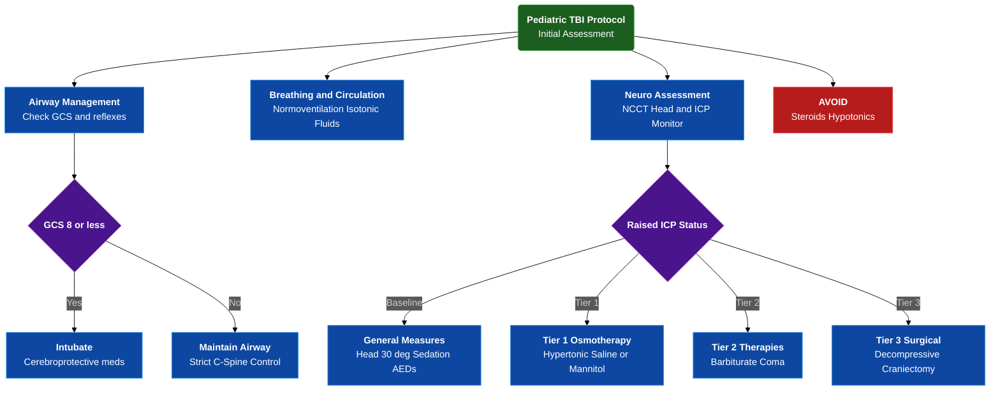

---
{"dg-publish":true,"uptext":"Back to Index (🚑 Emergencies and Critical Care)","uplink":"/emergencies/emergencies-and-critical-care/","permalink":"/emergencies/approach-to-a-child-with-traumatic-brain-injury-tbi/","dgPassFrontmatter":true}
---

## Alogrithm

## Initial Assessment And Stabilization

- Immediate priority demands rapid assessment and stabilization of airway, breathing, and circulation.
- Primary goal involves preventing secondary brain injury from hypoxia and ischemia.

### Airway Management

- Secure airway while strictly maintaining cervical spine stabilization.
- Implement cerebroprotective drug-assisted intubation to prevent reflex spike in intracranial pressure.
- Administer premedications including intravenous lidocaine, thiopental, and short-acting non-depolarizing neuromuscular blocking agents.

#### Indications For Endotracheal Intubation

- Glasgow coma scale score of 8 or less.
- Rapidly declining Glasgow coma scale with drop of 3 or more.
- Absent protective airway reflexes.
- Apnea.
- Signs of impending brain herniation.

### Breathing And Ventilation

- Administer supplemental oxygen immediately to treat or prevent hypoxia.
- Target oxygen saturation greater than 92% and PaO2 between 80-120 mmHg.
- Maintain strict normoventilation targeting PaCO2 between 35-40 mmHg.
- Avoid prophylactic hyperventilation.
- Reserve hyperventilation strictly as temporary rescue measure for acute signs of impending herniation.

### Circulation And Hemodynamics

- Maintain euvolemia and normal mean arterial pressure to ensure adequate cerebral perfusion pressure.
- Utilize isotonic crystalloids such as 0.9% normal saline as fluid of choice.
- Administer fluid boluses of 20 ml/kg normal saline for circulatory failure or hypotension.
- Initiate vasopressors if required to target mean arterial pressure greater than 50th percentile for age.

## Neurological Evaluation And Monitoring

### Clinical Examination

- Perform thorough neurological examination to establish baseline and detect focal deficits.
- Quantify coma depth objectively utilizing modified Glasgow coma scale.
- Assess pupillary size, symmetry, and reactivity to light as critical surrogate markers for brainstem function.
- Identify unilateral fixed and dilated pupil as sign of impending uncal herniation.

### Hemodynamic Targets And Monitoring

- Calculate cerebral perfusion pressure as mean arterial pressure minus intracranial pressure.
- Target minimal acceptable cerebral perfusion pressure greater than 40-50 mmHg for infants and toddlers.
- Target minimal acceptable cerebral perfusion pressure greater than 50-60 mmHg for older children.

#### Invasive Intracranial Pressure Monitoring Indications

- Severe traumatic brain injury with Glasgow coma scale 3-8 after resuscitation plus abnormal admission head CT.
- Severe traumatic brain injury with normal CT accompanied by motor posturing or hypotension.

## Neuroimaging

- Perform non-contrast computed tomography of head as primary rapid imaging modality.
- Identify surgically correctable lesions in emergency setting.
- Evaluate for epidural or subdural hematomas and intraparenchymal hemorrhage.
- Assess for midline shift, effacement of basilar cisterns, and loss of grey-white matter differentiation indicative of diffuse cerebral edema.

## Stepwise Management Of Raised Intracranial Pressure

- Escalate medical management through specific therapeutic tiers based on clinical response and intracranial pressure monitoring.

| Therapeutic Tier           | Interventions And Clinical Targets                                                                                                                                                                                                                                                                                                                                           |
| -------------------------- | ---------------------------------------------------------------------------------------------------------------------------------------------------------------------------------------------------------------------------------------------------------------------------------------------------------------------------------------------------------------------------- |
| **General Measures**       | Maintain head in midline position with 30° elevation to facilitate venous drainage. Ensure cervical collar avoids obstructing venous return.                                                                                                                                                                                                                                 |
| **Metabolic Control**      | Maintain normothermia below 38°C. Treat fever aggressively with antipyretics. Maintain strict blood glucose between 80-120 mg/dL to prevent hyper- and hypoglycemic brain injury.                                                                                                                                                                                            |
| **Sedation And Analgesia** | Administer adequate sedation and analgesia to blunt noxious stimuli. Utilize endotracheal lidocaine prior to suctioning.                                                                                                                                                                                                                                                     |
| **Seizure Prophylaxis**    | Administer prophylactic phenytoin or levetiracetam for 7 days. Indicated in severe traumatic brain injury, parenchymal injury, or depressed skull fractures.                                                                                                                                                                                                                 |
| **Tier 1 Osmotherapy**     | **Hypertonic Saline (3% NaCl):** Preferred agent, particularly in hypovolemia. Administer 5 ml/kg bolus over 30 mins, followed by 0.5-1.5 ml/kg/hr infusion. Target serum sodium 155-160 mEq/L. **Mannitol (20%):** Administer 0.5-1 g/kg bolus every 4-6 hours. Avoid continuous infusions. Contraindicated in hypotension or serum osmolality greater than 320 mOsm/kg. |
| **Tier 2 Therapies**       | **Moderate Hyperventilation:** Target PaCO2 28-34 mmHg. Reserve strictly for acute impending herniation or acute neurological deterioration. **Barbiturate Coma:** Initiate thiopentone or pentobarbital infusion titrated to achieve burst suppression on EEG. Requires invasive hemodynamic monitoring due to profound myocardial depression.                           |
| **Tier 3 Surgical**        | **Decompressive Craniectomy:** Indicated for medically refractory intracranial hypertension with diffuse swelling on CT, or for evacuation of mass lesions.                                                                                                                                                                                                                  |

## Therapies Strictly Contraindicated

- Avoid corticosteroids completely.
- Corticosteroids proven to worsen outcomes with no benefit for traumatic cytotoxic edema.
- Avoid hypotonic fluids strictly.
- Fluids such as 5% dextrose or 0.45% saline increase free water clearance into brain, exacerbating cerebral edema.
- Avoid routine prophylactic hyperventilation.
- Decreasing PaCO2 routinely without signs of herniation induces severe cerebral vasoconstriction, causing secondary ischemic infarction.