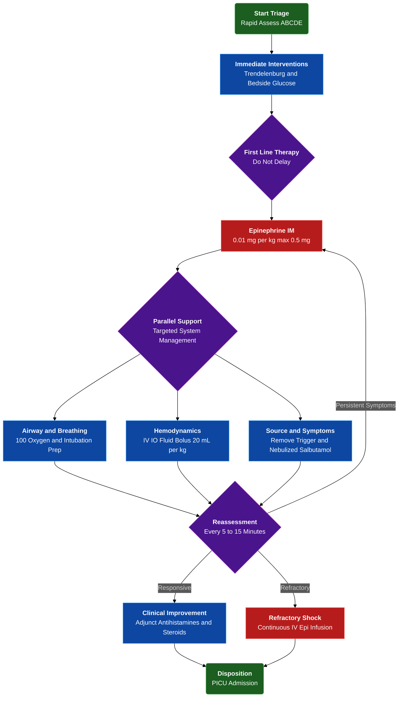

---
{"dg-publish":true,"uptext":"Back to Index (🚑 Emergencies and Critical Care)","uplink":"/emergencies/emergencies-and-critical-care/","permalink":"/emergencies/approach-to-a-child-presenting-with-anaphylaxis/","dgPassFrontmatter":true}
---

## Algorithm

## Pathophysiology And Etiology

### Fundamental Mechanisms

- Represents catastrophic systemic hypersensitivity reaction.
- Characterized by acute multiorgan system dysfunction.
- Progresses rapidly to life-threatening cardiopulmonary compromise.
- Involves massive acute release of chemical mediators.
- Mediators include histamine, leukotrienes, and bradykinin.
- Originates from degranulating mast cells and basophils.

### Triggering Agents

- Requires prior sensitization in susceptible individuals.
- Commonly triggered by insect bites and stings.
- Frequently associated with specific food ingestions.
- Provoked by specific medications and environmental agents.

### Hemodynamic Alterations

- Induces classic distributive shock pattern hemodynamically.
- Sudden histamine release causes profound peripheral vasodilation.
- Promotes severe increase in capillary permeability.
- Drastically reduces systemic vascular resistance.
- Causes sudden fall in both preload and afterload.
- Maldistributes blood flow away from vital end-organs.
- Causes severe intravascular volume depletion via capillary leak and third-spacing.
- Triggers compensatory marked increase in heart rate and cardiac output initially.

## Clinical Manifestations And Recognition

### Presentation Characteristics

- Exhibits sudden catastrophic onset.
- Lacks classical prodromal phase.
- Diagnosis heavily relies on circumstantial history including specific ingestions or stings.
- Manifests via specific multiorgan clinical constellations.

### Systemic Manifestations

|Organ System|Characteristic Clinical Signs|
|:--|:--|
|Cutaneous And Mucosal|Pruritus, urticaria, facial swelling, erythema, profound lip and tongue swelling.|
|Respiratory|Upper airway edema causing stridor and hoarseness; lower airway narrowing causing bronchospasm, wheezing, and dyspnea.|
|Cardiovascular|Tachycardia, flushed warm extremities, bounding pulses, early flash capillary refill, wide pulse pressure, profound hypotension, syncope, shock.|
|Gastrointestinal|Nausea, vomiting, severe abdominal cramps.|

## Emergency Triage And Initial Assessment

### Primary Triage Evaluation

- Mandates immediate rapid triage.
- Utilize Pediatric Assessment Triangle evaluating appearance, work of breathing, and circulation to skin.
- Initiate systematic rapid evaluation of Airway, Breathing, Circulation, and Disability.

### Immediate Resuscitative Interventions

- Place child immediately in Trendelenburg position.
- Ensure supine posture with elevated legs.
- Maximize venous return to heart combatting recognized hypotension or airway threats.
- Perform mandatory bedside serum glucose testing.
- Rule out hypoglycemia in any altered mental status presentation.

## Acute Emergency Management

### First-Line Pharmacotherapy

#### Epinephrine Administration

- Constitutes absolute first-line treatment choice for anaphylactic shock.
- Mandates immediate administration upon clinical recognition.
- Acts on alpha-adrenergic receptors reversing peripheral vasodilation.
- Increases systemic vascular resistance and blood pressure.
- Acts on beta-adrenergic receptors inducing bronchodilation.
- Suppresses further mast cell mediator release directly.

#### Epinephrine Dosing Guidelines

- Utilize 1:1,000 concentration equivalent to 1 mg/mL solution.
- Administer standard pediatric dose of 0.01 mg/kg.
- Utilize strictly intramuscular route.
- Restrict maximum single dose to 0.5 mg for older children or adolescents.
- Repeat dose 2-3 times every 5-15 minutes.
- Indicate repetition for lack of rapid clinical improvement or symptom recurrence.

### Airway And Respiratory Support

#### Oxygenation And Ventilation

- Administer immediate 100% supplemental oxygen.
- Utilize non-rebreather face mask aggressively treating hypoxemia.
- Anticipate emergency advanced airway management requirements.
- Prepare early for endotracheal intubation.
- Intubation indicated for severe upper airway obstruction secondary to progressive epiglottic or laryngeal edema.
- Recognize impending respiratory failure progresses rapidly to complete obstruction.

#### Bronchodilator Therapy

- Administer nebulized beta-agonists.
- Utilize salbutamol alongside intramuscular epinephrine.
- Indicated specifically for prominent bronchospasm and wheezing.

### Hemodynamic Resuscitation

#### Vascular Access And Fluid Expansion

- Establish prompt intravenous or intraosseous access.
- Target restoration of intravascular volume lost to massive vasodilation and capillary leak.
- Administer isotonic crystalloids including Normal Saline or Ringer's Lactate.
- Deliver rapid intravenous boluses of 20 mL/kg.
- Repeat fluid boluses for persistent hypotension or poor perfusion signs.
- Perform continuous reassessment identifying potential fluid overload signs.

### Adjunctive Pharmacotherapy

#### Second-Line Medications

- Consider adjunctive therapies strictly second-line.
- Never delay intramuscular epinephrine administration for adjunctive treatments.

|Medication Class|Drug And Dosage|Clinical Indication|
|:--|:--|:--|
|Antihistamines|Chlorpheniramine or diphenhydramine administered intravenously or orally.|Relieves cutaneous symptoms including severe pruritus and urticaria.|
|Corticosteroids|Hydrocortisone 10 mg/kg intravenously; maximum 100 mg per dose.|Considered for severe symptoms or known asthmatics exhibiting significant persistent bronchospasm after other symptom resolution.|

## Management Of Refractory Anaphylactic Shock

### Advanced Pharmacological Interventions

#### Continuous Epinephrine Infusion

- Suspect refractory anaphylaxis if shock persists despite multiple intramuscular epinephrine doses and adequate volume expansion.
- Initiate continuous intravenous epinephrine infusion.
- Commence continuous infusion at 0.1 micrograms/kg/min.
- Titrate upwards to maximum 1 microgram/kg/min.
- Guide titration via continuous hemodynamic monitoring and clinical response.

### Environmental Control And Disposition

#### Source Eradication

- Ensure complete removal of inciting agent if still present.
- Remove retained insect stingers immediately.
- Discontinue offending intravenous medications or blood products instantaneously.

#### Ongoing Monitoring And Care

- Mandate admission to Pediatric Intensive Care Unit.
- Ensure continuous cardiovascular monitoring.
- Perform serial assessment of tissue perfusion parameters.
- Maintain prolonged continuous airway observation.