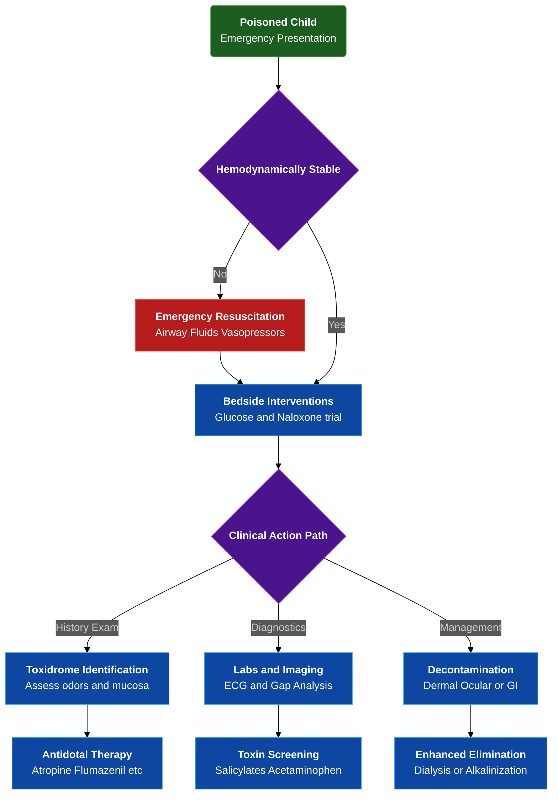

---
{"dg-publish":true,"uptext":"Back to Index (🚑 Emergencies and Critical Care)","uplink":"/emergencies/emergencies-and-critical-care/","permalink":"/emergencies/approach-to-a-child-with-unknown-poisoning/","dgPassFrontmatter":true}
---

## Algorithm

## Initial Stabilization And Resuscitation

- Emergency cardiorespiratory stabilization precedes comprehensive diagnostic testing.
- Require rapid systematic assessment of airway, breathing, circulation, and neurological disability upon presentation.
- Anticipate early elective endotracheal intubation for profound central nervous system depression, absent protective airway reflexes, or acute respiratory failure mitigating pulmonary aspiration risk.
- Manage hypotension aggressively initially using rapid intravenous boluses of isotonic crystalloids including normal saline or lactated Ringer's.
- Utilize direct-acting vasopressors including epinephrine or norepinephrine if hypotension remains refractory to volume expansion.
- Prefer vasopressors particularly if suspecting tricyclic antidepressant or calcium channel blocker toxicity.
- Perform mandatory bedside serum glucose test for altered mental status.
- Treat profound neuroglycopenia immediately using intravenous dextrose; condition perfectly mimics toxic encephalopathy.
- Initiate diagnostic and therapeutic trial of naloxone in cases featuring unexplained coma or significant respiratory depression reversing potential opioid intoxication.

## Clinical Evaluation And History Taking

### Epidemiological And Historical Clues

- Analyze child's age providing critical epidemiological context.
- Under 5 years: Exposures predominantly accidental, often involving single agents including common household products, cosmetics, or unsecured pharmaceuticals.
- Adolescents: Ingestions largely intentional, driven by suicide attempts, substance abuse, or misuse, frequently involving severe polypharmacy.
- Reconstruct scene via meticulous history.
- Establish exact location child found.
- Explore accessibility of medications belonging to older relatives or visitors.
- Screen for underlying psychiatric stress or previous suicide attempts in older youths.

### Physical Examination And Diagnostic Odors

- Perform targeted physical examination identifying classic toxidromes.
- Assess characteristic odors on breath or clothing.
- Bitter almonds: Suggest cyanide.
- Acetone: Suggest salicylates or isopropyl alcohol.
- Garlic: Point to organophosphates or arsenic.
- Mothballs: Indicate camphor or naphthalene exposure.
- Inspect oral cavity revealing excessive salivation suggesting organophosphates or ketamine.
- Identify oral mucosal burns indicating caustic or corrosive ingestion.
- Detect pigmented gum lines establishing hallmark of heavy metal poisoning including lead, mercury, or bismuth.

## Major Toxidromes And Clinical Features

|Toxidrome|Characteristic Clinical Features|Common Causative Agents|
|:--|:--|:--|
|Anticholinergic|Delirium, mydriasis, tachycardia, hyperthermia, dry skin, dry oral mucosa, flushing, urinary retention.|Atropine, antihistamines, tricyclic antidepressants.|
|Cholinergic|Diarrhea, urination, miosis, bradycardia, bronchorrhea, emesis, lacrimation, salivation, muscle fasciculations.|Organophosphates, carbamate pesticides.|
|Sympathomimetic|Agitation, seizures, mydriasis, tachycardia, hypertension, diaphoresis, hyperthermia.|Amphetamines, cocaine, ADHD medications.|
|Opioid|Profound central nervous system depression, respiratory depression, miosis, bradycardia, hypotension, hypothermia.|Morphine, heroin, methadone, buprenorphine.|
|Sedative-Hypnotic|Coma, respiratory depression, normal to decreased heart rate, normal to decreased blood pressure, normal or small pupils.|Benzodiazepines, barbiturates, alcohols, zolpidem.|

## Diagnostic And Laboratory Evaluation

### Basic Investigations

- Require comprehensive laboratory testing assessing multi-organ dysfunction and screening specific highly toxic occult substances.
- Include complete blood count, serum electrolytes, blood urea nitrogen, serum creatinine, liver transaminases, and blood gas analysis.

### Acid-Base And Osmolar Gap Analysis

- Calculate anion gap evaluating high anion gap metabolic acidosis revealing unmeasured toxic anions.
- Identify toxins causing high anion gap metabolic acidosis including methanol, uremia, diabetic ketoacidosis, paraldehyde, iron, isoniazid, lactic acidosis, ethylene glycol, and salicylates.
- Determine osmolar gap indicating unmeasured osmotically active substances including toxic alcohols like methanol, ethanol, ethylene glycol if elevated greater than 10 mOsm.

### Electrocardiography

- Utilize 12-lead electrocardiography rapidly assessing life-threatening cardiotoxicity and specific conduction delays.
- Widened QRS interval suggests dangerous fast sodium channel blockade, classic finding in severe tricyclic antidepressant toxicity requiring immediate intervention.
- Prolonged QTc interval demonstrates interference with potassium rectifier channels predisposing to torsades de pointes.
- Observe prolonged QTc frequently with methadone, phenothiazines, and antipsychotics.

### Specific Toxicology Screening And Radiography

- Recommend quantitative serum screening for acetaminophen and salicylates in all cases of intentional or unknown poisoning.
- Note early acetaminophen and salicylate toxicity may remain asymptomatic but highly amenable to time-sensitive antidotal therapy.
- Note limited utility of urine drugs-of-abuse screens for acute management due to inherent delays and high false positive/negative rates.
- Utilize plain abdominal radiography visualizing specific radiopaque toxins.
- Remember CHIPPED mnemonic: Chloral hydrate/Calcium carbonate, Heavy metals, Iron, Phenothiazines, Play-Doh, Enteric-coated tablets, Dental amalgam/illicit drug packets.

## Decontamination Strategies

### Dermal And Ocular Decontamination

- Mandate immediate, extensive flushing using tepid water or normal saline for minimum 10-20 minutes.
- Strictly avoid water irrigation for highly reactive compounds including elemental sodium, phosphorus, calcium oxide, and titanium tetrachloride.

### Gastrointestinal Decontamination

- Individualize decontamination based on suspected toxin properties, exposure route, clinical stability, and time elapsed.
- Consider syrup of ipecac obsolete and contraindicated; produces variable toxin removal, delays definitive treatments, causes significant adverse outcomes.
- Utilize gastric lavage rarely; consider only within 1 hour of massive, potentially lethal ingestion.
- Avoid gastric lavage strictly in unprotected airway, corrosive ingestion, or volatile hydrocarbon exposure due to extreme aspiration and perforation risk.

### Activated Charcoal

- Represents single most effective gastrointestinal decontamination method.
- Achieves maximum efficacy administered within 1 hour of toxin ingestion.
- Requires completely patent and protected airway prior to administration preventing catastrophic pulmonary aspiration.
- Dose at 1 g/kg.
- Acts via physical adsorption onto highly porous surface.
- Ineffective binding heavy metals, iron, lithium, mineral acids, strong alkalis, toxic alcohols, cyanide, and most hydrocarbons.

### Whole-Bowel Irrigation

- Instill massive volumes of polyethylene glycol electrolyte solution via nasogastric tube.
- Administer 35 mL/kg/hr in children and 1-2 L/hr in adolescents.
- Clears gastrointestinal tract of substances poorly adsorbed by charcoal including iron, heavy metals, lithium, sustained-release pharmaceuticals, and illicit drug packets.

## Techniques For Enhanced Elimination

### Urinary Alkalinization

- Enhances renal excretion of weak acids trapping ionized, polar molecules within renal tubules preventing systemic circulation reabsorption.
- Accomplish administering continuous intravenous sodium bicarbonate infusion maintaining target urine pH 7.5-8.0.
- Serves as primary elimination strategy for severe salicylate, phenobarbital, and methotrexate toxicity.

### Hemodialysis And Hemofiltration

- Clears toxins possessing low volume of distribution, low molecular weight, low plasma protein affinity, and high water solubility rapidly.
- Indicated specifically for severe, life-threatening poisonings involving toxic alcohols, lithium, salicylates, theophylline, and barbiturates.

### Multiple-Dose Activated Charcoal

- Accelerates systemic toxin clearance interrupting enterohepatic circulation.
- Utilizes intestinal mucosa as gastrointestinal dialysis membrane pulling toxins back into gut lumen.
- Administer 0.5 g/kg every 4-6 hours.
- Recommend for life-threatening ingestions involving carbamazepine, dapsone, phenobarbital, quinine, and theophylline.

### Intravenous Lipid Emulsion

- Creates intravascular lipid sink sequestering highly fat-soluble toxins.
- Reduces active concentration mitigating target organ impact.
- Utilize as profound lifesaving intervention in severe cardiotoxicity secondary to bupivacaine, massive calcium channel blocker overdoses, and tricyclic antidepressant poisonings.

## Diagnostic Trials And Antidotal Therapy

- Administer specific, carefully titrated antidotes serving as lifesaving therapeutic intervention and definitive diagnostic tool in undifferentiated comatose child.
- Utilize naloxone starting at 0.1 mg/kg intravenous dose for presumed opioid toxicity characterizing profound respiratory depression and pinpoint pupils.
- Mandate significantly lower naloxone doses if chronic opioid dependence suspected preventing precipitation of severe acute withdrawal.
- Administer flumazenil 0.01 mg/kg reversing severe benzodiazepine-induced central nervous system depression.
- Exercise extreme caution using flumazenil; carries substantial risk unmasking intractable seizures particularly with co-ingested pro-convulsant drugs or underlying seizure disorder.
- Provide rapid diagnostic trial intravenous atropine 0.05 to 0.1 mg/kg for profound cholinergic signs highly suspicious for organophosphate pesticide poisoning.
- Reverse life-threatening muscarinic symptoms including severe bradycardia and bronchorrhea using atropine.