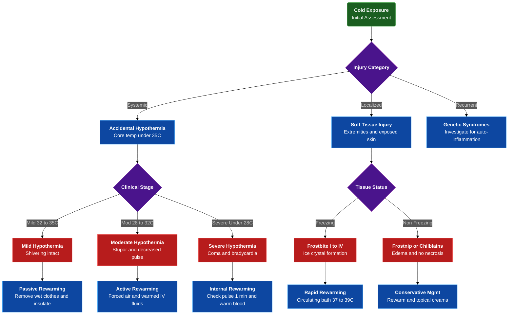

---
{"dg-publish":true,"uptext":"Back to Index (🚑 Emergencies and Critical Care)","uplink":"/emergencies/emergencies-and-critical-care/","permalink":"/emergencies/approach-to-a-child-with-cold-injury/","dgPassFrontmatter":true}
---

## Algorithm

## General Principles

- Occurs when physiological heat generation fails to overcome environmental heat loss.
- Develops even at temperatures above 0°C.
- Heat transfers to environment via radiation, conduction, convection, respiration, and evaporation.
- Categorized broadly into systemic injuries (accidental hypothermia) and localized soft tissue injuries (freezing and non-freezing).

## Systemic Injury: Accidental Hypothermia

### Definition And Pathophysiology

- Defined as unintentional core body temperature drop below 35°C.
- Cerebral function diminishes at 33-34°C.
- Early manifestations include irritability, confusion, and poor decision-making.
- Progresses to lethargy, somnolence, and coma.

### Clinical Staging And Characteristics

|State|Core Temperature|Clinical Characteristics|
|:--|:--|:--|
|Mild|32-35°C|Increased shivering thermogenesis; increased metabolic rate; amnesia and dysarthria; ataxia; apathy; normal blood pressure.|
|Moderate|28-32°C|Stupor; 25% decrease in oxygen consumption; decreased shivering thermogenesis; atrial fibrillation and other dysrhythmias; pulse and cardiac output reduced to two-thirds normal.|
|Severe|<28°C|Coma with loss of cerebrovascular autoregulation; severe bradycardia; hypotension; high risk of unstable tachycardias (ventricular fibrillation) and asystole.|

### Emergency Management

#### General Measures

- Handle gently and keep horizontal to prevent cardiovascular collapse.
- Remove wet clothing immediately.
- Replace with dry clothing and insulation to halt heat loss.

#### Mild Hypothermia Management (32-35°C)

- Initiate passive rewarming using insulation and vapor barriers.
- Provide active external rewarming with heat packs applied to neck, chest, upper torso, axilla, and groin.
- Protect exposed skin from direct burns.
- Support shivering with high-calorie oral fluids and carbohydrates if child remains alert.

#### Moderate Hypothermia Management (28-32°C)

- Deploy active external rewarming to upper torso, chest, axilla, and back utilizing forced-air systems or large heat pads.
- Administer intravenous or intraosseous fluids containing glucose, warmed to 40-42°C.
- Maintain continuous cardiac monitoring due to high risk of unstable arrhythmias from cold heart and acidosis.
- Transfer hemodynamically unstable patients to facilities capable of extracorporeal membrane oxygenation.

#### Severe Hypothermia (<28°C) And Cardiac Arrest

- Assess pulse for up to 1 minute before initiating cardiopulmonary resuscitation.
- Utilize bedside echocardiogram to detect organized electrical activity.
- Initiate cardiopulmonary resuscitation for absent cardiac activity.
- Never withhold cardiopulmonary resuscitation based on temperature unless fatal injury exists or chest compression proves impossible.
- Hold vasoactive medications until core temperature exceeds 30°C.
- Administer vasoactive medications at twice normal dosing interval between 30°C and 35°C.
- Attempt single defibrillation or cardioversion at maximum power.
- Hold further electrical shocks until core temperature exceeds 30°C.
- Initiate active internal rewarming via warm intravenous fluids, extracorporeal blood warming, or hemodialysis alongside extracorporeal membrane oxygenation.

## Localized Soft Tissue Cold Injuries

### Freezing Cold Injury: Frostbite

#### Pathogenesis

- Occurs at or below freezing temperatures.
- Progresses through four phases: prefreeze, freeze-thaw, vascular stasis, and late ischemic.
- Cellular destruction results from intracellular and extracellular ice crystal formation during freeze-thaw phase.
- Exacerbated by ischemic-reperfusion injury and microvascular thrombosis.

#### Clinical Grading Of Frostbite

|Grade|Field Classification|Clinical Features|
|:--|:--|:--|
|Grade I|Superficial|Superficial injury; edema and redness without necrosis; numbness; firm white-yellow plaque; no blisters.|
|Grade II|Superficial|Substantial edema and erythema; clear or milky fluid-filled vesicles and blisters; desquamation forms black eschar.|
|Grade III|Deep|Extends into dermis and vascular plexus; hemorrhagic deeper blisters; blue-gray discoloration; skin necrosis.|
|Grade IV|Deep|Full-thickness freezing of skin, subcutaneous tissue, muscle, tendon, and bone; little edema; mottled red progressing to dry, black, mummified tissue; requires amputation.|

#### Management Of Frostbite

- Protect injured area from cold exposure.
- Remove constricting items including jewelry.
- Strictly prevent refreezing if spontaneous thawing commences.
- Initiate rapid rewarming using circulating water bath heated to 37-39°C for 30 minutes.
- Leave clear blisters intact.
- Never aspirate hemorrhagic bullae.
- Administer pain control medications.
- Ensure updated tetanus prophylaxis.
- Consider adjuvant therapies for severe cases 12-72 hours post-thawing.
- Adjuvant options include vasodilators, antiplatelet drugs, synthetic prostacyclin analogues, or intra-arterial tissue plasminogen activator.

### Non-Freezing Cold Injuries

#### Frostnip

- Associated with vasoconstriction and superficial ice crystal formation.
- Presents with localized numbness and pallor.
- Lacks cellular damage.
- Resolves rapidly upon external warming.

#### Chilblains (Pernio)

- Idiopathic condition triggered by cold, damp exposure.
- Presents as painful, edematous, bluish-red papular or nodular lesions.
- Affects acral locations including fingers, toes, and ears.
- Management requires rewarming, cold avoidance, nonsteroidal anti-inflammatory drugs, and topical soothing creams.

#### Cold-Induced Fat Necrosis

- Results from local cold injury to superficial adipose tissue.
- Presents as raised, erythematous nodules or plaques.
- Appears on face or exposed areas in obese children.
- Follows self-limiting course resolving in 10-20 days.
- Managed conservatively with rewarming and nonsteroidal anti-inflammatory drugs.

## Differential Diagnosis: Genetic And Autoinflammatory Syndromes

- Evaluate children presenting with recurrent cold-induced symptoms very early in life.
- Suspect underlying genetics when rashes, fevers, and arthralgias occur without infectious triggers.

### Familial Cold Autoinflammatory Syndrome

- Represents part of cryopyrin-associated periodic syndromes.
- Caused by variants in NLRP3 gene.
- Triggered exclusively by cold exposure.
- Manifests with nonpruritic urticaria, fever, conjunctivitis, and joint pain.

### Familial Chilblain Lupus

- Inherited as autosomal dominant disorder.
- Caused by variants in TREX1 or SAMHD1 genes.
- Presents with painful, bluish-red acral lesions resembling chilblains.
- Provoked by environmental cold exposure.

### Crisponi Syndrome / Cold-Induced Sweating Syndrome

- Inherited as autosomal recessive disorder.
- Linked to CRLF1 or CLCF1 gene variants.
- Presents with cold-induced profuse sweating.
- Associated with feeding difficulties and facial dysmorphic features.