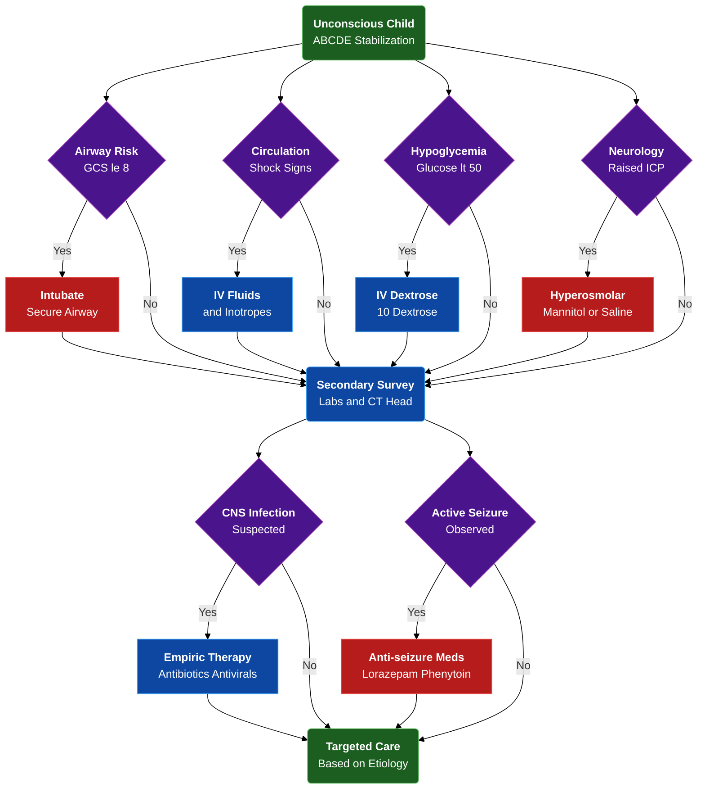

---
{"dg-publish":true,"uptext":"Back to Index (🚑 Emergencies and Critical Care)","uplink":"/emergencies/emergencies-and-critical-care/","permalink":"/emergencies/approach-to-an-unconcious-child/","dgPassFrontmatter":true}
---

## Algorithm

## Definition And Pathophysiology

- Coma Represents Medical Emergency Defined As State Of Unarousable, Sustained Pathologic Unresponsiveness.
- Characterized By Complete Loss Of Arousal And Awareness Lasting Minimum One Hour.
- Ascending Reticular Activating System Maintains Arousal.
- Frontoparietal Networks And Thalamus Maintain Awareness.
- Disruption In Either Pathway Results In Impaired Consciousness.

## Initial Rapid Triage

- Utilize AVPU Scale During Disability Step Of Primary Assessment Pentagon.
- Serves As Rapid, Objective Clinical Scoring Tool To Evaluate Depth Of Consciousness.
- Abnormal Score Necessitates Immediate Checking Of Blood Glucose To Rule Out Hypoglycemia.

|Scale Component|Neurological Response|
|---|---|
|**Alert**|Fully Awake, Aware Of Environment, Interacts Appropriately.|
|**Voice**|Responds Directly To Vocal Stimuli Or Verbal Commands.|
|**Pain**|Exhibits Localizing, Withdrawing, Or Abnormal Posturing To Noxious Stimuli.|
|**Unresponsive**|Exhibits Absolutely No Response To Voice Or Painful Stimuli.|

## Differential Diagnosis

- Etiology Broadly Categorized Based On Primary Site Of Insult.

|Category|Primary Sub-Categories|Specific Etiologies|
|---|---|---|
|**Direct Causes (CNS Insult)**|Infections|Bacterial Meningitis, Viral Meningoencephalitis, Tubercular Meningitis, Cerebral Malaria, Brain Abscess.|
||Vascular|Arterial Ischemic Stroke, Cerebral Venous Sinus Thrombosis, Subarachnoid Hemorrhage, Intracranial Hemorrhage.|
||Space-Occupying Lesions|Central Nervous System Neoplasms, Obstructive Hydrocephalus.|
||Paroxysmal Disorders|Status Epilepticus, Non-Convulsive Status Epilepticus, Todd’s Paralysis, Acute Confusional Migraine.|
||Post-Infectious|Acute Disseminated Encephalomyelitis, Post-Immunization Encephalopathy.|
|**Indirect Causes (Non-CNS)**|Hypoxic-Ischemic|Cardiac Arrest, Profound Shock, Near-Drowning.|
||Toxic-Metabolic|Hypoglycemia, Diabetic Ketoacidosis, Inborn Errors Of Metabolism, Hepatic Encephalopathy, Uremic Encephalopathy.|
||Drugs And Toxins|Sedatives, Opioids, Tricyclic Antidepressants, Organophosphates, Lead Encephalopathy, Snake Bite.|
||Systemic/Endocrine|Hypertensive Encephalopathy, Severe Dyselectrolytemia, Sepsis.|

## Diagnostic Evaluation

### Clinical History Clues

- Sudden Onset Strongly Suggests Trauma, Spontaneous Intracranial Hemorrhage, Seizures, Or Drug Overdose.
- Gradual Progressive Onset Indicates Expanding Mass Lesion, Hydrocephalus, Or Indolent Infection Like Tubercular Meningitis.
- Preceding Fever Indicates Acute Infectious Etiology Or Infection-Triggered Syndromes Like Reye's Syndrome.
- Recurrent Episodic Encephalopathy With Developmental Delay Points Toward Inborn Error Of Metabolism.

### General Physical Examination

|System|Clinical Finding|Diagnostic Clue|
|---|---|---|
|**Vitals**|Tachycardia/Tachypnea|Fever, Shock, Acidosis.|
||Cushing's Triad|Hypertension, Bradycardia, Irregular Breathing Indicate Late Brain Herniation.|
||Hypothermia|Hypoglycemia, Sepsis, Sedative Intoxication.|
|**Skin/Mucosa**|Pallor|Intracranial Bleed, Cerebral Malaria.|
||Icterus|Hepatic Encephalopathy, Complicated Malaria.|
||Petechial Rashes|Meningococcemia, Dengue.|
|**Breath Odor**|Fruity Odor|Diabetic Ketoacidosis.|
||Musty/Fishy Odor|Hepatic Encephalopathy.|
||Garlic Odor|Organophosphate Poisoning.|

### Targeted Neurological Examination

- Objectively Quantify Consciousness Using Modified Glasgow Coma Scale Or Full Outline Of Unresponsiveness Score.
- Examine Fundus Mandatory To Identify Papilledema Or Retinal Hemorrhages.

#### Localizing Neurological Signs

|Examination Parameter|Specific Finding|Anatomical Localization Or Etiology|
|---|---|---|
|**Pupils**|Pinpoint|Pontine Lesion, Opiate/Organophosphate Poisoning.|
||Unilateral Fixed/Dilated|Ipsilateral Uncal Herniation With Oculomotor Nerve Compression.|
||Bilateral Fixed/Dilated|Medullary Lesions, Severe Hypoxic-Ischemic Injury, Sympathomimetic Poisoning.|
|**Eye Movements**|Conjugate Lateral Deviation|Ipsilateral Hemispheric Lesion, Contralateral Seizure Focus.|
||Lateral Gaze Palsy|Central Herniation Compressing Bilateral Sixth Cranial Nerves.|
|**Motor Posturing**|Decorticate (Flexion)|Supratentorial Lesion Above Red Nucleus.|
||Decerebrate (Extension)|Midbrain Or Upper Pontine Involvement.|

## Stepwise Investigations

### First-Line Interventions

- Perform Immediate Bedside Blood Glucose Test Via Reagent Strip.
- Send Complete Blood Count, Arterial Blood Gas, Lactate, And Comprehensive Biochemistry.
- Include Serum Electrolytes, Renal Function Tests, And Liver Function Tests.
- Obtain Blood Cultures, Malaria Rapid Diagnostic Tests, Peripheral Smears, And Tropical Fever Serology In Febrile Children.
- Evaluate Urine Dipstick For Ketones And Reducing Sugars.

### Neuroimaging And Lumbar Puncture

- Perform Non-Contrast Computed Tomography Head Rapidly To Detect Hemorrhage Or Cerebral Edema.
- Perform Lumbar Puncture For Suspected Central Nervous System Infections.
- Defer Lumbar Puncture If Raised Intracranial Pressure, Hemodynamic Instability, Focal Deficits, Or Thrombocytopenia Present.

### Second-Line Diagnostics

- Utilize Magnetic Resonance Imaging For Stroke, Acute Disseminated Encephalomyelitis, Or Herpes Simplex Encephalitis.
- Obtain Electroencephalogram To Rule Out Non-Convulsive Status Epilepticus.
- Send Metabolic Testing Including Blood Ammonia And Tandem Mass Spectrometry For Unexplained Comas.

## Emergency Stabilization And Management

### Resuscitation Priorities

- **Airway:** Maintain Patency Through Positioning Or Suctioning. Intubate Strictly For Glasgow Coma Scale Less Than 8, Impaired Reflexes, Apnea, Or Impending Herniation.
- **Breathing:** Maintain Oxygen Saturation Greater Than 92%. Provide Mechanical Ventilation If Central Hypoventilation Present.
- **Circulation:** Establish Immediate Intravenous Access. Treat Shock With 20 ml/kg Normal Saline Bolus. Initiate Vasopressors If Refractory.
- **Disability:** Treat Blood Glucose Less Than 50 mg/dl With 2 ml/kg 10% Dextrose Bolus. Follow With Continuous Glucose Infusion At 6-8 mg/kg/min.

### Neuroprotection And Intracranial Pressure Management

- Maintain Head Midline With Bed Elevated 15-30 Degrees To Promote Venous Drainage.
- Administer 20% Mannitol Bolus 0.25-1 g/kg Or 3% Hypertonic Saline To Reduce Cerebral Edema.
- Initiate Short-Term Hyperventilation Targeting PaCO2 30-35 mmHg Only For Impending Herniation.
- Treat Seizures Immediately With Intravenous Lorazepam Or Diazepam.
- Load Intravenous Phenytoin 20 mg/kg To Prevent Secondary Brain Injury.
- Treat Fever Aggressively With Antipyretics And Cooling Measures To Prevent Increased Cerebral Metabolism.

### Specific Pharmacological Interventions

|Clinical Suspicion|Targeted Empiric Therapy|
|---|---|
|**Acute Meningitis**|Intravenous Ceftriaxone Combined With Vancomycin.|
|**Herpes Encephalitis**|Intravenous Acyclovir 10-15 mg/kg/dose Every 8 Hours.|
|**Cerebral Malaria**|Intravenous Artesunate.|
|**Opiate Overdose**|Intravenous Naloxone 0.1 mg/kg.|
|**Benzodiazepine Toxicity**|Intravenous Flumazenil.|
|**Inflammatory / Specific Infections**|Intravenous Corticosteroids Indicated For Tubercular Meningitis, Acute Disseminated Encephalomyelitis, Pyogenic Meningitis.|