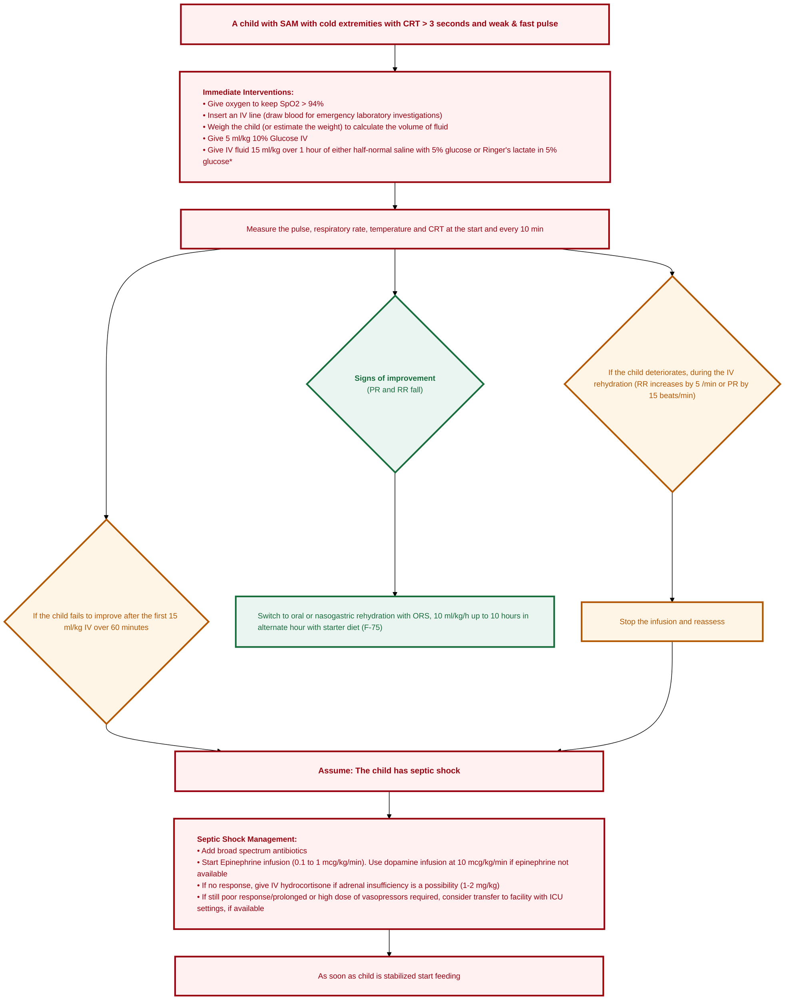

---
{"dg-publish":true,"uptext":"Back to Index (🚑 Emergencies and Critical Care)","uplink":"/emergencies/emergencies-and-critical-care/","permalink":"/emergencies/management-of-sam-patient-in-shock/","dgPassFrontmatter":true}
---

## Algorithm

## Identification Of Shock In Severe Acute Malnutrition

- A child with Severe Acute Malnutrition (SAM) is considered to be in shock if specific clinical signs are present.
- Look for cold extremities.
- Check for a Capillary Refill Time (CRT) that is longer than 3 seconds.
- Palpate for a weak and fast pulse.

## Initial Stabilization And Resuscitation

- Provide oxygen immediately to maintain oxygen saturation (SpO2) above 94%.
- Insert an intravenous (IV) line promptly.
- Draw blood for emergency laboratory investigations at the time of IV insertion.
- Weigh the child accurately.
- Estimate the weight if the child cannot be weighed to calculate fluid volume.
- Administer 5 ml/kg of 10% Glucose IV to prevent or treat hypoglycemia.

## Intravenous Fluid Therapy Protocol

- Do not use standard rapid fluid resuscitation protocols in SAM patients.
- Administer IV fluids slowly and cautiously.

|Fluid Parameter|Recommendation|
|:--|:--|
|**Volume**|15 ml/kg.|
|**Duration**|Administer over 1 hour.|
|**Fluid Choice 1**|Half-normal saline with 5% glucose.|
|**Fluid Choice 2**|Ringer's lactate in 5% glucose.|
|**Special Condition**|If profuse diarrhoea is present (more than 10 loose watery stools in the last 24 hours), repeat 15 ml/kg of fluid over 1 hour.|

## Monitoring During Fluid Resuscitation

- Continuous monitoring is critical to prevent fluid overload.
- Record baseline parameters at the start of the infusion.
- Measure the pulse rate, respiratory rate, temperature, and CRT every 10 minutes.

## Assessment Of Response To Fluid Therapy

### Signs Of Improvement

- Improvement is indicated by a fall in pulse rate and respiratory rate.

|Action Upon Improvement|Details|
|:--|:--|
|**Switch To Oral Route**|Stop IV fluids and switch to oral or nasogastric rehydration.|
|**Rehydration Fluid**|Use Oral Rehydration Salt (ORS) solution.|
|**Volume And Rate**|Give 10 ml/kg/hour for up to 10 hours.|
|**Diet Integration**|Provide ORS in alternate hours with starter diet (F-75).|
|**Feeding**|Start feeding as soon as the child is stabilized.|

### Signs Of Deterioration

- Deterioration during IV rehydration is a critical emergency.
- It is indicated if the respiratory rate increases by 5 breaths per minute.
- It is also indicated if the pulse rate increases by 15 beats per minute.
- Stop the IV infusion immediately.
- Reassess the patient thoroughly.

### Failure To Improve

- If the child fails to improve after the first 15 ml/kg IV fluid over 60 minutes, assume the child has septic shock.

## Management Of Septic Shock In Severe Acute Malnutrition

- Initiate aggressive management for septic shock if fluid resuscitation fails.

### Antimicrobial Therapy

- Add broad-spectrum antibiotics immediately.
- Give third-generation cephalosporins.
- Use Injection Cefotaxime 150 mg/kg/day in 3 divided doses.
- Alternatively, use Injection Ceftriaxone 100 mg/kg/day in 2 divided doses.
- Combine with Injection Gentamicin 7.5 mg as a single dose.
- Do not administer the second dose of Gentamicin until the child has passed urine.
- Continue the antibiotic course for 10-14 days.

### Vasoactive Support

- Start Epinephrine infusion at a dose of 0.1 to 1 mcg/kg/min.
- Use Dopamine infusion at 10 mcg/kg/min if Epinephrine is not available.

### Additional Interventions

- Consider adrenal insufficiency if the shock is unresponsive.
- Administer IV hydrocortisone at a dose of 1-2 mg/kg if no response to vasoactive drugs is seen.
- Consider transferring the patient to a facility with Intensive Care Unit (ICU) settings.
- Transfer is indicated if there is a persistently poor response.
- Transfer is also indicated if prolonged or high doses of vasopressors are required.