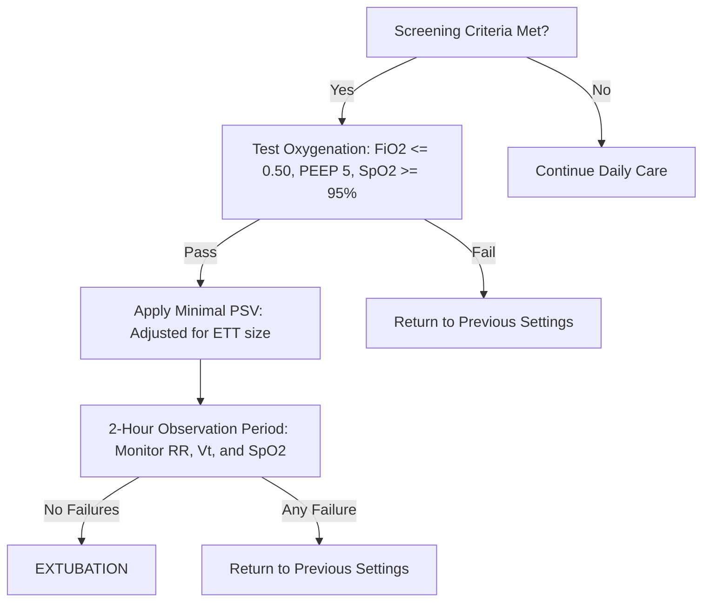

---
{"dg-publish":true,"uptext":"Back to Index (🚑 Emergencies and Critical Care)","uplink":"/emergencies/emergencies-and-critical-care/","permalink":"/emergencies/mechanical-ventilation/","dgPassFrontmatter":true}
---

## Section 1: Introduction to Mechanical Ventilation

Mechanical ventilation is a vital supportive therapy in neonatal and pediatric intensive care units.
* It is designed to assist or take over the physiological work of breathing.
* It maintains adequate pulmonary gas exchange when a child's respiratory system fails.
* It represents a complex interface between engineering and human physiology.

### Historical Evolution of Ventilatory Support

The history of mechanical ventilation illustrates a transition from negative-pressure to positive-pressure systems.
* **Negative-Pressure Systems**:
	* These systems were popularized during the poliomyelitis epidemics of the early-to-mid 20th century.
	* Devices like the "iron lung" enclosed the patient's body in a chamber.
	* They created a periodic vacuum around the chest wall.
	* This vacuum pulled the chest outward, drawing air into the lungs.
	* These devices were bulky, limited access to the patient, and were ineffective in patients with stiff lungs.
* **Positive-Pressure Systems**:
	* These systems emerged in the mid-20th century.
	* They deliver gas directly into the patient's airway under positive pressure.
	* This positive pressure drives gas flow into the lungs by creating a pressure gradient.
	* It successfully overcomes both airway resistance and lung elastic recoil.
	* Early positive-pressure systems were simple, volume-preset or pressure-preset mechanical pumps.
* **Microprocessor-Controlled Ventilators**:
	* Introduced in the late 20th century, these represent the modern standard of care.
	* They utilize high-speed microprocessors and proportional solenoid valves.
	* They continuously monitor patient flow and pressure at the airway.
	* They adjust gas delivery millisecond-by-millisecond based on real-time feedback.
	* They allow for synchronized, patient-responsive ventilation, which minimizes work of breathing.

### Anatomy of a Modern Ventilator System

A modern mechanical ventilator consists of several integrated subsystems that ensure precise gas delivery.
* **Gas Delivery System**:
	* Regulates the intake of high-pressure medical air and oxygen.
	* Proportional solenoid valves mix these gases to the desired fractional concentration of inspired oxygen.
		 * Controlled by the clinician via the: $$FiO_2$$
	* Some ventilators utilize internal turbines or blowers instead of high-pressure gas wall outlets.
* **Patient Circuit**:
	* Comprises double-limb tubing (inspiratory and expiratory limbs).
	* Directs gas to the patient's airway opening via a Y-piece.
	* Includes an inline heated humidifier to warm and saturate the dry gas with water vapor.
* **Expiratory Valve**:
	* Controls the release of gas during the expiratory phase.
	* Restricts gas outflow to maintain a set positive end-expiratory pressure.
		 * Clinically defined as:      $$PEEP$$
* **Monitoring and Sensor Array**:
	* Utilizes high-precision pressure transducers and flow sensors.
	* Flow sensors are typically placed at the ventilator outlet or at the proximal airway (Y-piece).
		 * Proximal flow sensors are highly critical in neonatal ventilation.
		 * They measure small tidal volumes accurately, ignoring circuit compliance loss.
		 * Technologies include hot-wire anemometers and differential pressure pneumotachometers.
* **Microprocessor Control Unit**:
	* Acts as the "brain" of the ventilator.
	* Solves mathematical algorithms to regulate flow, pressure, and volume.
	* Analyzes sensor data to detect patient inspiratory effort and trigger breaths.
	* Executes alarm protocols for patient safety (e.g., high pressure, low minute volume).

---

## Section 2: Physics and Physiology of Respiratory Mechanics

The respiratory system of a neonate or child is not merely a scaled-down version of an adult system.
* It exhibits unique anatomical and physiological properties.
* These properties dictate how the respiratory system responds to positive pressure.

### Neonate and Child vs. Adult Respiratory System

Pediatric patients have specific mechanical vulnerabilities that alter ventilator efficacy.
* **Chest Wall Compliance**:
	* The chest wall of a neonate is highly compliant and cartilaginous.
	* This high compliance offers minimal structural support to the lungs.
	* Consequently, the chest wall tends to collapse inward during respiratory distress.
	* This inward collapse reduces the functional residual capacity.
		 * Defined clinically as:      $$FRC$$
* **Lung Parenchyma**:
	* Premature neonates often suffer from surfactant deficiency.
	* This deficiency increases alveolar surface tension, leading to stiff, low-compliance lungs.
	* The combination of a highly compliant chest wall and stiff lungs results in severe alveolar collapse.
* **Airway Dimensions**:
	* Pediatric airways have small radii.
	* According to physical laws, minor swelling causes a massive increase in resistance.
	* This elevates the work of breathing and risk of muscle fatigue.

### The Equation of Motion

The Equation of Motion is the mathematical foundation of mechanical ventilation.
* It describes the total pressure required to deliver a breath.
* The total pressure ($P_{tot}$) is the sum of pressure from the ventilator ($P_{vent}$) and patient muscles ($P_{musc}$).
* The equation is expressed as:
  $$P_{vent} + P_{musc} = \frac{V}{C} + (R \cdot \dot{V}) + PEEP_i$$
	* Where:
		 * $V$ is the delivered tidal volume.
		 * $C$ is the compliance of the respiratory system.
		 * $R$ is the airway resistance.
		 * $\dot{V}$ is the inspiratory gas flow.
		 * $PEEP_i$ is the total positive end-expiratory pressure (including auto-PEEP).
* **The Elastic Component** ($V/C$):
	* Represents the pressure required to overcome the elastic recoil of the lungs and chest wall.
	* Stiffer lungs (lower compliance) require higher pressure to deliver the same volume.
* **The Resistive Component** ($R \cdot \dot{V}$):
	* Represents the pressure required to overcome frictional resistance to gas flow.
	* Narrower airways or higher flow rates increase this pressure component.
* **The Baseline Component** ($PEEP$):
	* Represents the static pressure present at the end of expiration.
	* Prevents alveolar collapse by keeping the lungs partially inflated.

### Airway Resistance and Poiseuille’s Law

Resistance ($R$) is the friction that opposes gas flow through the airways.
* **Anatomical Distribution**:
	* In normal breathing, approximately 80% of resistance resides in the conducting airways.
	* The nasal passages contribute up to two-thirds of this resistance.
	* The endotracheal tube (ETT) becomes the primary site of resistance in intubated patients.
* **Poiseuille’s Law**:
	* Dictates laminar gas flow through a rigid tube:
    $$R = \frac{8\eta l}{\pi r^4}$$
		 * Where:
			 * $\eta$ is the viscosity of the gas.
			 * $l$ is the length of the tube.
			 * $r$ is the internal radius of the tube.
	* Resistance is inversely proportional to the fourth power of the radius ($r^4$).
* **Pediatric Implications of Airway Narrowing**:
	* A small decrease in airway radius causes an exponential increase in resistance.
	* For example, $1\ mm$ of mucosal edema:
		 * Reduces an adult airway (radius $4\ mm$) to $3\ mm$, increasing resistance by approximately 3-fold.
		 * Reduces an infant airway (radius $2\ mm$) to $1\ mm$, increasing resistance by 16-fold.
	* Clinically, this requires using cuffed tubes to prevent leaks while avoiding excessive tube length.
* **Laminar vs. Turbulent Flow**:
	* High flow rates or narrow tubes cause gas flow to transition from laminar to turbulent.
	* Turbulent flow increases the pressure required to move gas.
	* Heliox (helium-oxygen mixture) is less dense than air.
		 * It restores laminar flow in severe airway obstruction.
		 * It can reduce total airway resistance by up to one-third.

### Compliance, Circuit Loss, and Hysteresis

Compliance ($C$) is the ease with which the respiratory system expands under pressure.
* **Static Compliance** ($C_{stat}$):
	* Measured when gas flow is zero, such as during an end-inspiratory pause.
	* Reflects only the elastic properties of the lungs and chest wall:    $$C_{stat} = \frac{V_t}{P_{plat} - PEEP}$$
		 * Where:
			 * $V_t$ is the tidal volume.
			 * $P_{plat}$ is the plateau pressure.
* **Dynamic Compliance** ($C_{dyn}$):
	* Measured during active breathing, incorporating both elastic and resistive forces:    $$C_{dyn} = \frac{V_t}{PIP - PEEP}$$
		 * Where:
			 * $PIP$ is the peak inspiratory pressure.
* **Circuit Compliance Loss**:
	* Plastic ventilator tubing expands when subjected to positive pressure.
	* Circuit compliance ranges from $0.5$ to $2.0\ mL/cm\ H_2O$.
	* A portion of the ventilator's output volume expands the circuit rather than entering the patient.
	* In infants with stiff lungs, this circuit loss can represent 40% to 80% of the set volume.
	* Modern ventilators compensate for this by delivering additional volume to offset circuit expansion.
* **Pressure-Volume Curve and Hysteresis**:
	* The inflation and deflation paths on a Pressure-Volume (P-V) curve are different.
	* This difference is termed hysteresis, representing the energy required to recruit collapsed alveoli.
	* **Lower Inflection Point** (LIP):
		 * The pressure threshold at which collapsed alveoli begin to open.
		 * Titrating PEEP above the LIP prevents cyclic alveolar collapse.
	* **Upper Inflection Point** (UIP):
		 * The pressure threshold beyond which alveoli become over-distended.
		 * Keeping pressures below the UIP prevents alveolar tissue tearing.

### Time Constants and Respiratory Mechanics Assessment

The Time Constant ($\tau$) is the time required for alveolar pressure and volume to equilibrate.
* **Calculation**:
	* Derived by multiplying compliance and resistance:$$\tau = C \cdot R$$
* **Exponential Gas Transfer**:
	* Pulmonary inflation and deflation follow exponential curves:
		 * $1\ \tau$ allows $63.2\%$ of volume transfer.
		 * $2\ \tau$ allows $86.5\%$ of volume transfer.
		 * $3\ \tau$ allows $95.0\%$ of volume transfer.
		 * $4$ to $5\ \tau$ allow $99\%$ to $99.3\%$ of volume transfer.
	* Ventilator inspiratory and expiratory times must span at least 3 to 5 time constants to prevent gas trapping.

| Population / Pathology | Compliance ($C_{rs}$) | Resistance ($R_{rs}$) | Time Constant ($\tau$) | Clinical Rate Strategy |
| :--- | :--- | :--- | :--- | :--- |
| **Normal Neonates** | $1.0 - 2.0\ mL/cm\ H_2O$ | $30 - 50\ cm\ H_2O/L/s$ | $0.05 - 0.10\ s$ | Fast respiratory rates ($40 - 60\ bpm$) with short inspiratory times ($0.3 - 0.4\ s$). |
| **Normal Children** | $10 - 20\ mL/cm\ H_2O$ | $10 - 20\ cm\ H_2O/L/s$ | $0.15 - 0.30\ s$ | Moderate rates ($20 - 30\ bpm$) with moderate inspiratory times ($0.5 - 0.6\ s$). |
| **Restrictive Disease (RDS/ARDS)** | Severely decreased | Normal | **Abnormally short** | Fast rates with short inspiratory times to prevent lung collapse. |
| **Obstructive Disease (Asthma)** | Normal or increased | Severely increased | **Abnormally long** | Slow rates with prolonged expiratory times to prevent gas trapping. |

## Section 3: The Mechanical Ventilator: Components, Terminologies, and Parameters

A mechanical ventilator operates by sequencing breaths using specific parameters.
* These parameters control the transitions of the respiratory cycle.
* Understanding these phase variables is essential for preventing patient-ventilator dyssynchrony.

### The Four Phase Variables

Every mechanical breath is characterized by four distinct phase variables.
* **1. The Trigger Variable**:
	* Initiates the transition from expiration to inspiration.
	* Can be time-triggered (set frequency) or patient-triggered.
	* **Pressure Triggering**:
		 * The patient inhales, creating a negative pressure deflection.
		 * Once pressure drops below a threshold (e.g., $-0.5$ to $-2.0\ cm\ H_2O$), the breath starts.
		 * High mechanical latency can increase the patient's work of breathing.
	* **Flow Triggering**:
		 * The ventilator circulates a continuous bias flow ($1$ to $5\ L/min$) through the circuit.
		 * When the patient inhales, gas is diverted into the lungs, creating a flow discrepancy.
		 * Flow triggering responds faster than pressure triggering, reducing patient effort.
	* **Neural Triggering (NAVA)**:
		 * Uses a nasogastric catheter with electrodes positioned at the diaphragm.
		 * Detects the electrical activity of the diaphragm.
		 * Represented by the:
        $$EAdi$$
		 * Triggers the breath instantly when the brain commands diaphragmatic contraction.
	* **Trigger Asynchronies**:
		 * *Ineffective triggering*: Patient efforts fail to trigger a breath due to muscle weakness or auto-PEEP.
		 * *Auto-triggering*: Ventilator triggers breaths without patient effort (due to circuit leaks or water).
* **2. The Limit Variable**:
	* Limits the magnitude of pressure, flow, or volume during inspiration.
	* Does not terminate the inspiratory phase.
	* In pressure-limited ventilation, peak pressure is held constant, while flow decelerates.
* **3. The Cycle Variable**:
	* Terminates the inspiratory phase, initiating expiration.
	* **Time-Cycling**:
		 * Inspiration ends when a set inspiratory time ($T_i$) elapses.
		 * Commonly used in mandatory ventilator modes.
	* **Flow-Cycling**:
		 * Inspiration ends when inspiratory flow decays to a set percentage of peak flow.
		 * Typically used in Pressure Support Ventilation (PSV).
		 * The expiratory trigger threshold is adjustable (usually 25% to 40% of peak flow).
	* **Cycling Asynchronies**:
		 * *Premature cycling*: Inspiration ends before patient effort ceases, leading to double-triggering.
		 * *Delayed cycling*: Inspiration continues after the patient begins to exhale, causing distress.
* **4. The Baseline Variable**:
	* Controls the pressure during expiration.
	* Maintained by PEEP to prevent alveolar collapse at the end of the breath.

### Ventilator Parameters and Clinical Settings

The primary parameters adjusted by clinicians during mechanical ventilation are detailed below.

| Parameter | Abbreviation | Normal Pediatric Range | Clinical Significance & Titration |
| :--- | :--- | :--- | :--- |
| **Peak Inspiratory Pressure** | $PIP$ | $15 - 28\ cm\ H_2O$ | Controls tidal volume in pressure modes; must be limited to prevent barotrauma. |
| **Positive End-Expiratory Pressure** | $PEEP$ | $4 - 8\ cm\ H_2O$ | Maintains functional residual capacity; keeps alveoli open at the end of expiration. |
| **Tidal Volume** | $V_t$ | $6 - 8\ mL/kg$ | The volume of gas delivered; titrated based on ideal body weight to prevent volutrauma. |
| **Respiratory Rate** | $RR$ | $12 - 40\ bpm$ | Controls minute ventilation and carbon dioxide clearance ($PaCO_2$). |
| **Inspiratory Time** | $T_i$ | $0.3 - 0.8\ s$ | Determines the duration of gas delivery; adjusted based on patient size and time constants. |
| **Fraction of Inspired Oxygen** | $FiO_2$ | $0.21 - 1.00$ | Controls arterial oxygenation; titrated to the lowest effective level to avoid oxygen toxicity. |
| **Inspiratory Flow** | $Flow$ | $4 - 30\ L/min$ | The speed of gas delivery; adjusted to match patient inspiratory demand and comfort. |

---

## Section 4: Conventional and Advanced Modes of Ventilation

Ventilator modes define the interaction between the machine and the patient.
* Modern ventilators offer conventional and advanced closed-loop modes.
* Selecting the appropriate mode is guided by the patient's underlying pathology.

### Conventional Ventilation Modes

Conventional modes are categorized by how they sequence mandatory and spontaneous breaths.
* **Controlled Mechanical Ventilation (CMV) / Assist-Control (A/C)**:
	* Delivers a set minimum rate of mandatory breaths.
	* Every spontaneous patient effort above the set rate triggers an additional mandatory breath.
	* Ensures a stable minute volume but can lead to hyperventilation if the patient is tachypneic.
* **Synchronized Intermittent Mandatory Ventilation (SIMV)**:
	* Delivers mandatory breaths at a set rate, synchronized with patient effort.
	* Spontaneous breaths between mandatory breaths receive no mandatory volume support.
	* Spontaneous breaths can be supported with Pressure Support ($PS$) to overcome tube resistance.
	* Prevents breath-stacking but can increase the work of breathing if the mandatory rate is too low.
* **Pressure Support Ventilation (PSV)**:
	* A spontaneous, patient-triggered, pressure-limited, and flow-cycled mode.
	* The patient controls the respiratory rate, inspiratory time, and inspiratory flow.
	* Used to support spontaneous breaths during SIMV or as a standalone weaning mode.
* **Volume-Controlled Ventilation (VCV) vs. Pressure-Controlled Ventilation (PCV)**:
	* **VCV**:
		 * Delivers a preset tidal volume ($V_t$) using a constant flow rate.
		 * Airway pressure varies depending on the compliance and resistance of the respiratory system.
		 * Guarantees carbon dioxide clearance but carries a risk of barotrauma if lung compliance drops.
	* **PCV**:
		 * Delivers gas at a preset peak inspiratory pressure ($PIP$).
		 * Tidal volume varies depending on compliance, resistance, and patient effort.
		 * Decelerating flow improves gas distribution, but volume must be monitored to prevent hypoventilation.
* **Pressure-Regulated Volume Control (PRVC) / Volume Guarantee (VG)**:
	* A dual-controlled mode combining the benefits of volume and pressure ventilation.
	* The ventilator delivers a target tidal volume using a pressure-controlled breath.
	* The microprocessor calculates compliance breath-by-breath and adjusts $PIP$ accordingly.
	* Delivers the target volume at the lowest possible airway pressure, protecting the lungs.

### Advanced and Newer Ventilation Modes

Advanced modes use closed-loop feedback or neural inputs to optimize patient-ventilator interaction.
* **Neurally Adjusted Ventilatory Assist (NAVA)**:
	* Utilizes a specialized nasogastric catheter with an array of nine electrodes.
	* Captures the diaphragm's electrical activity ($EAdi$) to trigger and cycle breaths.
	* The ventilator pressure is delivered in proportion to the $EAdi$ signal: $$P_{delivered} = NAVA\ Level \cdot EAdi + PEEP$$
	* Inspiration cycles off when $EAdi$ drops to 70% of its peak value.
	* Negates circuit leaks and pneumatic delays, improving patient comfort.
* **Proportional Assist Ventilation (PAV)**:
	* Adjusts ventilator support in proportion to patient flow and volume.
	* Estimates patient effort by measuring airway resistance and compliance.
	* The clinician sets percentage gains to unload elastic and resistive work:
		 * **Elastic unloading gain**: Delivers pressure in proportion to volume ($cm\ H_2O/mL$).
		 * **Resistive unloading gain**: Delivers pressure in proportion to flow ($cm\ H_2O/L/s$).
	* Preserves the patient's natural breathing pattern and limits over-assistance.
* **Adaptive Support Ventilation (ASV)**:
	* A closed-loop ventilation mode that manages rate and volume.
	* The clinician enters the patient's ideal body weight and target minute ventilation.
	* The ventilator measures the respiratory time constant and calculates the optimal rate:
		 * It uses Otis' equation to minimize the mechanical work of breathing.
	* Automatically transitions between mandatory and spontaneous breathing support.
* **High-Frequency Oscillatory Ventilation (HFOV)**:
	* Delivers very small tidal volumes (often less than dead space) at extreme rates ($5 - 15\ Hz$).
	* Expiration is active, driven by a piston or oscillating diaphragm.
	* Employs the "Open Lung" concept by maintaining a high mean airway pressure ($MAP$).
	* Gas transport occurs through molecular diffusion, convective mixing, and coaxial flow.
	* Rescues patients with severe hypoxemic respiratory failure (e.g., severe ARDS).
* **Airway Pressure Release Ventilation (APRV)**:
	* Delivers continuous positive airway pressure at two levels: High ($P_{high}$) and Low ($P_{low}$).
	* The patient breathes spontaneously at the $P_{high}$ level for most of the cycle ($T_{high}$).
	* Brief pressure releases to $P_{low}$ ($T_{low}$) allow for carbon dioxide clearance.
	* Recruits collapsed alveoli and improves oxygenation while permitting spontaneous effort.

---

## Section 5: Initial Ventilator Settings in PICU and NICU Scenarios

Initiating mechanical ventilation requires matching ventilator settings to the patient's pathology.
* The clinical goal is to support gas exchange while minimizing lung injury.
* Settings must be adjusted based on whether the disease is restrictive or obstructive.

### Pathophysiology-Based Settings

Initial settings for common pediatric and neonatal conditions are outlined below.

| Clinical Scenario | Recommended Mode | PIP / Vt | PEEP | Rate | Ti | Target SpO2 |
| :--- | :--- | :--- | :--- | :--- | :--- | :--- |
| **Neonatal RDS** | PCV-VG / PRVC | $V_t\ 4.0 - 5.0\ mL/kg$ | $5 - 6\ cm\ H_2O$ | $40 - 60\ bpm$ | $0.30 - 0.35\ s$ | $90\% - 94\%$ |
| **Pediatric ARDS** | PRVC / PCV | $V_t\ 5.0 - 6.0\ mL/kg$ | $8 - 12\ cm\ H_2O$ | $20 - 30\ bpm$ | $0.6 - 0.8\ s$ | $88\% - 94\%$ |
| **Severe Asthma** | PCV / VCV | $V_t\ 6.0 - 8.0\ mL/kg$ | $3 - 5\ cm\ H_2O$ | $10 - 15\ bpm$ | $0.8 - 1.0\ s$ | $92\% - 95\%$ |
| **Congenital Diaphragmatic Hernia** | PCV | $PIP\ 20 - 24\ cm\ H_2O$ | $3 - 5\ cm\ H_2O$ | $40 - 60\ bpm$ | $0.30 - 0.35\ s$ | $85\% - 95\%$ |
| **Bronchopulmonary Dysplasia** | SIMV + PS | $V_t\ 8.0 - 10.0\ mL/kg$ | $6 - 8\ cm\ H_2O$ | $15 - 25\ bpm$ | $0.6 - 0.8\ s$ | $92\% - 96\%$ |

### Clinical Scenario Analysis

Different lung pathologies require distinct ventilatory approaches.
* **Neonatal Respiratory Distress Syndrome (RDS)**:
	* Characterized by surfactant deficiency and low lung compliance.
	* Requires a strategy focusing on high respiratory rates and low tidal volumes.
	* Open lung PEEP is titrated to recruit and stabilize surfactant-deficient alveoli.
* **Pediatric Acute Respiratory Distress Syndrome (PARDS)**:
	* Features heterogeneous lung injury with severe inflammation and alveolar edema.
	* Employs the "baby lung" concept, restricting tidal volume to $5 - 6\ mL/kg$.
	* Elevating PEEP is critical to offset atelectasis and recruit functional lung units.
* **Severe Asthma / Obstructive Airway Disease**:
	* Characterized by airway inflammation, bronchospasm, and mucus plugging.
	* The long time constant requires slow rates and short inspiratory times to maximize expiratory time ($T_e$).
	* High PEEP is avoided to prevent dynamic hyperinflation and tension pneumothorax.
* **Congenital Diaphragmatic Hernia (CDH)**:
	* Associated with severe pulmonary hypoplasia and pulmonary hypertension.
	* A gentle ventilation strategy is used, limiting $PIP$ to $<25\ cm\ H_2O$.
	* Mild hypoxemia and permissive hypercapnia are accepted to prevent barotrauma.
* **Bronchopulmonary Dysplasia (BPD)**:
	* Chronic lung disease characterized by high airway resistance and heterogeneous compliance.
	* Requires larger tidal volumes ($8 - 10\ mL/kg$) at slow rates to ensure ventilation of slow-filling alveoli.

---

## Section 6: Titration of Ventilator Parameters

Ventilator titration is guided by arterial blood gas (ABG) analysis and patient physiology.
* Oxygenation and ventilation are managed independently.
* Titration must balance target values against the risk of ventilator-associated lung injury (VALI).

### Oxygenation Titration

Oxygenation is determined by the fractional concentration of oxygen and the mean airway pressure.
* **Adjusting** $FiO_2$:
	* Oxygen concentration is titrated to keep SpO2 within target ranges.
	* $FiO_2$ is weaned to $<0.50$ as soon as tolerated to avoid free radical damage.
* **Adjusting** $PEEP$ and $MAP$:
	* Mean airway pressure ($MAP$) is the average pressure applied to the airway:    $$MAP = K \cdot (PIP - PEEP) \cdot \left(\frac{T_i}{T_i + T_e}\right) + PEEP$$
	* Elevating PEEP increases $MAP$, recruits collapsed alveoli, and improves ventilation-perfusion matching.
	* Excessive PEEP can over-distend alveoli, restrict venous return, and lower cardiac output.

### Ventilation Titration

Ventilation (carbon dioxide clearance) is controlled by minute ventilation ($V_E$).
* **Carbon Dioxide Clearance**:
	* Minute ventilation is the product of tidal volume and respiratory rate:
    $$V_E = V_t \cdot RR$$
	* Adjusting $PIP$ (in pressure modes) or setting $V_t$ (in volume modes) changes tidal volume.
	* Altering the respiratory rate changes the frequency of carbon dioxide clearance.
* **Permissive Hypercapnia**:
	* Minimizes lung injury by accepting elevated $PaCO_2$ ($50 - 70\ mm\ Hg$) and a lower pH ($7.20 - 7.30$).
	* Reduces the required PIP and tidal volume, protecting the "baby lung" from volutrauma.
	* *Contraindications*: Permissive hypercapnia is avoided in patients with intracranial hypertension or pulmonary hypertension.

### Parameter Titration Reference Table

The table below outlines parameter adjustments based on arterial blood gas (ABG) findings.

| ABG Finding | Primary Physiological Problem | Parameter Adjustments (Stepwise) | Clinical Cautions |
| :--- | :--- | :--- | :--- |
| **Respiratory Acidosis**   (pH $< 7.20$, $PaCO_2 > 60$) | Inadequate alveolar ventilation | 1. Increase Respiratory Rate ($RR$).   2. Increase $PIP$ or $V_t$.   3. Increase $T_i$ (if $T_i$ is too short). | Check for gas trapping; ensure expiratory time ($T_e$) is adequate. |
| **Respiratory Alkalosis**   (pH $> 7.45$, $PaCO_2 < 35$) | Excessive alveolar ventilation | 1. Decrease Respiratory Rate ($RR$).   2. Decrease $PIP$ or $V_t$. | Avoid reducing PEEP if oxygenation is compromised. |
| **Hypoxemia**   (pH normal, $PaO_2 < 60$, $SpO_2 < 88\%$) | Ventilation-perfusion mismatch / Shunt | 1. Increase $FiO_2$ (up to $0.50$).   2. Increase $PEEP$ stepwise.   3. Prolong $T_i$ (increases $MAP$). | Watch for hypotension or decreased cardiac output from high PEEP. |
| **Hyperoxia**   (pH normal, $PaO_2 > 100$, $SpO_2 > 98\%$) | Excessive oxygen support | 1. Decrease $FiO_2$ rapidly to $< 0.50$.   2. Wean $PEEP$ (if $PEEP$ is elevated). | Wean oxygen first before reducing recruitment PEEP. |

---

## Section 7: Weaning and Liberation from Mechanical Ventilation

Liberation from the ventilator is the final phase of respiratory support.
* Prolonged mechanical ventilation increases the risk of ventilator-associated pneumonia (VAP).
* It can also lead to diaphragmatic atrophy and structural lung injury.
* Premature extubation carries a risk of respiratory failure, requiring re-intubation.

### Overcoming Imposed Work of Breathing

The endotracheal tube (ETT) acts as a physical bottleneck that increases resistive work.
* According to Poiseuille’s Law, breathing through a narrow tube increases airway resistance.
* Spontaneous, unassisted breaths through an ETT can fatigue a pediatric patient's muscles.
* **Pressure Support Ventilation (PSV)**:
	* Used during weaning to deliver a synchronized pressure boost with each spontaneous breath.
	* This pressure boost is titrated to overcome the resistance of the ETT:
		 * Allowing the patient to work on expanding lung tissue rather than fighting the tube.
	* As patient strength improves, the level of pressure support is gradually reduced.

### PALISI Network Weaning and Extubation Readiness Test Protocol

The Spontaneous Breathing Trial (SBT) and Extubation Readiness Test (ERT) are structured systematically to evaluate clinical readiness.

#### 1. Daily Screening Criteria
The patient is evaluated daily to determine if they are ready for the Extubation Readiness Test (ERT).
* Resolution or improvement of the primary disease process.
* Core temperature between $36.0^\circ C$ and $38.5^\circ C$.
* Adequate perfusion with stable hemodynamics (no or minimal vasopressor support).
* Intact respiratory drive with spontaneous breaths.
* Adequate level of consciousness (responsive or easily rousable).

#### 2. The Extubation Readiness Test (ERT) Protocol
If the screening criteria are met, the ERT is performed to assess spontaneous breathing capacity.
* **Step 1: Oxygenation Challenge**:
	* Set the ventilator to $FiO_2\ 0.50$ and $PEEP\ 5\ cm\ H_2O$.
	* If the patient maintains $SpO_2 \ge 95\%$ for 15 minutes, proceed to Step 2.
	* If $SpO_2$ drops below $95\%$, the test is failed.
* **Step 2: Minimal Pressure Support Trial**:
	* Place the patient on minimal Pressure Support ($PS$), adjusted for ETT size:
		 * **ETT size 3.0 - 3.5 mm**: $PS = 10\ cm\ H_2O$.
		 * **ETT size 4.0 - 4.5 mm**: $PS = 8\ cm\ H_2O$.
		 * **ETT size $\ge$ 5.0 mm**: $PS = 6\ cm\ H_2O$.
	* Maintain PEEP at $5\ cm\ H_2O$ and $FiO_2$ at $\le 0.50$.
* **Step 3: Two-Hour Observation Period**:
	* Monitor the patient on minimal support settings for a duration of 2 hours.
	* The test is failed if any of the following criteria are met during the 2-hour period:
		 * $SpO_2 < 95\%$.
		 * Exhaled spontaneous tidal volume ($V_t$) $< 5\ mL/kg$ of ideal body weight.
		 * Spontaneous respiratory rate ($RR$) falls outside the acceptable range **for age:**
			 * Age $\le$ 6 months: $20 - 60\ bpm$.
			 * Age 6 months - 2 years: $15 - 45\ bpm$.
			 * Age 2 - 5 years: $10 - 35\ bpm$.
			 * Age > 5 years: $10 - 30\ bpm$.****
		 * Signs of increased work of breathing (moderate-to-severe retractions, nasal flaring).
		 * Hemodynamic instability (tachycardia, diaphoresis, or hypotension).
* **Step 4: Clinical Decision**:
	* Patients who pass the 2-hour ERT are considered ready for extubation.
	* If the test is failed, the patient is returned to their previous ventilator settings.

### Pediatric Predictive Indices of Weaning Success

Physiological indices can help predict extubation outcomes.
* **Spontaneous Tidal Volume**:
	* Spontaneous $V_t \ge 5.5\ mL/kg$ indicates adequate muscle strength.
* **Spontaneous Respiratory Rate**:
	* An age-appropriate respiratory rate during spontaneous breathing suggests a stable drive.
* **Rapid Shallow Breathing Index (RSBI)**:
	* In adults, RSBI is calculated as rate divided by tidal volume in liters ($f/V_t$).
	* In children, RSBI is standardized to body weight:$$RSBI_{peds} = \frac{RR}{V_t / Weight}$$
	* Measured in:
      $$breaths/min/mL/kg$$
	* A weight-adjusted RSBI value of $\le 8\ breaths/min/mL/kg$ predicts extubation success.
* **CROP Index**:
	* Combines compliance, rate, oxygenation, and pressure:
    $$CROP = \frac{C_{dyn} \cdot P_{Imax} \cdot \left(\frac{PaO_2}{P_AO_2}\right)}{RR}$$
	* A CROP index of $\ge 0.15\ mL/kg/breaths/min$ is associated with successful liberation.