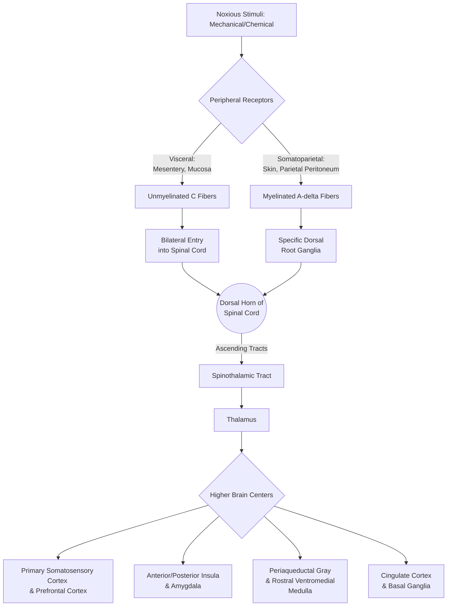

---
{"dg-publish":true,"uptext":"Back to Index (🚑 Emergencies and Critical Care)","uplink":"/emergencies/emergencies-and-critical-care/","permalink":"/emergencies/pain-pathway/","dgPassFrontmatter":true}
---

## Definition and Conceptual Framework of Pain

- The International Association for the Study of Pain (IASP) defines pain as an unpleasant sensory and emotional experience associated with, or resembling that associated with, actual or potential tissue damage.
- The IASP further expands this definition to include six key notes that outline the conceptual framework of the pain pathway:
    - Pain is always a personal experience that is influenced to varying degrees by biologic, psychologic, and social factors.
    - Pain and nociception are distinct and different phenomena; pain cannot be inferred solely from activity in sensory neurons.
    - Through their life experiences, individuals actively learn the concept of pain.
    - A person’s report of an experience as pain must always be respected.
    - Although pain typically serves an adaptive and protective role, it may have adverse effects on an individual's function and social and psychologic well-being.
    - Verbal description is merely one of several behaviors used to express pain; the inability to communicate does not negate the possibility that a human experiences pain.

## The Neurophysiologic Pain Pathway (Nociception)

- Nociception refers to the specific peripheral and central nervous system mechanisms responsible for transmitting nerve impulses associated with tissue damage or noxious stimuli.
- The neurophysiologic pathway encompasses peripheral sensing, spinal cord transmission, and complex central neural connectivity.

### Peripheral Receptors and Nerve Fibers

- The pain pathway begins in the periphery, where specialized nerve fibers transmit signals originating from peripheral mechanoreceptors and chemoreceptors.
- The primary fibers responsible for transmitting these nociceptive impulses are largely, but not exclusively, the small, unmyelinated C fibers and the thinly myelinated A-delta fibers.
- Visceral pain receptors are located in the mesentery, on the serosal surfaces, and within the muscles and mucosa of viscera.
- These visceral receptors typically respond to mechanical stimuli (such as distention or twisting of muscles, serosa, or mesentery) or chemical stimuli (such as acid, inflammation, or ischemia in the mucosa).
- Afferent fibers originating from visceral receptors are predominantly unmyelinated and enter the spinal cord bilaterally at multiple levels, which makes visceral pain characteristically central, dull, aching, and ill-localized.
- In contrast, somatoparietal pain receptors are located in the parietal peritoneum, abdominal wall muscle, and skin.
- Somatoparietal receptors also respond to mechanical and chemical stimuli, but their afferent nerve impulses are carried via myelinated fibers, which conduct signals quickly to specific dorsal root ganglia.
- Because of this myelinated transmission to specific ganglia, somatoparietal pain is perceived as sharp, highly intense, and well-localized to the involved anatomical area.

### Spinal Cord and Ascending Tracts

- Once nociceptive signals reach the spinal cord, synapses occur within the spinal cord’s dorsal horn.
- From the dorsal horn, the neural impulses travel through, but not exclusively through, the spinothalamic tracts to ascend to the higher centers of the brain.
- Referred pain pathways also involve the spinal cord; referred pain occurs when somatic sensory pathways from extra-abdominal sites project to the exact same segments of the spinal cord as the sensory pathways originating from the abdominal wall or viscera.

### Brain Regions, Networks, and Central Processing

- The ultimate experience of pain lies primarily in the strength and patterning of central neural connectivity within the brain.
- Although immediate upstream neural activation originates from inflammatory, structural, or biochemical events, the processes occurring in the spinal cord and the brain heavily influence both the intensity and the duration of the pain.
- Central neural processes in the brain are responsible for determining the location, intensity, and distress associated with the pain experience.
- Multiple brain pathways, regions, and networks are actively involved in both acute and chronic pain perception:
    - **Cortical Regions:** Primary somatosensory cortex, medial prefrontal cortex, posterior cingulate cortex, mid cingulate cortex, posterior parietal cortex, and the supplementary motor area.
    - **Subcortical and Deep Brain Structures:** Thalamus, anterior insula, posterior insula, amygdala, basal ganglia, and the hypothalamus.
    - **Brainstem Structures:** Periaqueductal gray (PAG), parabrachial nuclei, and the rostral ventromedial medulla (RVM).
    - **Neural Networks:** The default mode network, the salience network, and the sensorimotor network.
    - **White Matter Bundles:** The superior longitudinal fasciculus, posterior corona radiata, cingulum bundle, and the corpus callosum.

### Diagrammatic Representation of the Pain Pathway

## Categories of Pain and Clinical Characteristics

- Pain is classified into distinct categories based on the anatomical structures involved and the underlying pathophysiological mechanisms propagating the neural impulses.

| Pain Category        | Definition and Pathway Mechanism                                                                                                                                                                    | Clinical Examples                                                                            | Characteristics                                                                                                                                                                |
| :------------------- | :-------------------------------------------------------------------------------------------------------------------------------------------------------------------------------------------------- | :------------------------------------------------------------------------------------------- | :----------------------------------------------------------------------------------------------------------------------------------------------------------------------------- |
| **Somatic Pain**     | Pain resulting from injury to or inflammation of tissues (e.g., skin, muscle, tendons, bone, joints, fascia, vasculature).                                                                          | Burns, lacerations, fractures, infections, inflammatory conditions.                          | **In skin and superficial structures:** sharp, pulsatile, well localized.**In deep somatic structures:** dull, aching, pulsatile, not well localized.                          |
| **Visceral Pain**    | Pain resulting from injury to or inflammation of viscera. Involves unmyelinated fibers entering the spinal cord bilaterally.                                                                        | Angina, hepatic distention, bowel distention or hypermobility, pancreatitis.                 | Aching and cramping; nonpulsatile; poorly localized (e.g., appendiceal pain perceived around umbilicus) or referred to distant locations (e.g., angina perceived in shoulder). |
| **Neuropathic Pain** | Pain resulting from injury to, inflammation of, or dysfunction of the peripheral or central nervous system. Caused by abnormal excitability in the nervous system that persists after injury heals. | Complex regional pain syndrome (CRPS), phantom limb pain, Guillain-Barré syndrome, sciatica. | Spontaneous; burning; lancinating or shooting; dysesthesias; hyperalgesia; hyperpathia; allodynia; pain may be perceived distal or proximal to site of injury.                 |

## Pathophysiology of Chronic and Neuropathic Pain Pathways

- Acute pain can transition into chronic pain when upstream neural signaling continues to continuously activate central neural circuits, which is often driven by persistent peripheral inflammatory or structural pain-associated processes.
- In many cases, chronic pain develops and is maintained without a definable infectious, inflammatory, metabolic, or structural cause.
- When no peripheral cause is found, centrally mediated pain is recognized as being derived from neural connectivity patterns in the brain that incorporate centers involved in autonomic nervous system control, memory, cognitive centers, and emotional centers.
- The concept of a "sticky nervous system" is used to explain to patients how altered brain connectivity patterns and "top-down" mediators act as the perpetuator of continued chronic pain.
- Neuropathic pain conditions (which constitute $>35\%$ of referrals to chronic pain clinics) are characterized by abnormal excitability in the peripheral or central nervous system that persists well after an initial injury heals or inflammation subsides.
- In specific neuropathic pathways, such as in Primary Erythromelalgia, there is a gain-of-function pathogenic variant (autosomal dominant) in the gene ($SCN9A$) encoding for the $NaV1.7$ neuronal sodium channel located on peripheral C nociceptive fibers.
- This genetic mutation results in the spontaneous depolarization of these C fibers, leading to continuous burning pain pathways being activated.
- Similarly, loss-of-function variants in the exact same $NaV1.7$ channel pathway result in a condition known as congenital indifference to pain, highlighting the critical role of specific sodium channels in nociceptive transmission.

## Biopsychosocial Modulation of Pain Pathways

- The transmission and perception of pain are not strictly biomedical but are heavily modulated by the Biopsychosocial model, which explains interindividual variability in pain perception, chronicity, and impairment.
- **Biologic factors:** Include the child's physical health, central nervous system (CNS) factors affecting pain processing, gender, pubertal status, and specific genetic factors.
- **Cognitive and Affective factors:** Include individual anxiety, fear, negative affect, learned pain behaviors, and the degree of functional disability.
- **Social and Environmental factors:** Include culture, socioeconomic status, the school environment, social/peer interactions, adverse childhood events, and parental/family influences.
- Psychologic factors can directly amplify the perception of pain; for example, feelings of helplessness and lack of control sensitize the child to increasing amounts of pain, leading to catastrophic thinking and hopelessness, which in turn enhance the central pain pathways.
- Conversely, nonpharmacologic interventions (such as Cognitive-Behavioral Therapy, biofeedback, and relaxation) exploit these "top-down" mediators by altering the central neurobiologic mechanisms to effectively reduce the perception of pain and alter the central neural circuits that maintain pain.