---
{"dg-publish":true,"uptext":"Back to Index (🚑 Emergencies and Critical Care)","uplink":"/emergencies/emergencies-and-critical-care/","permalink":"/emergencies/septic-shock-in-children/","dgPassFrontmatter":true}
---

## Definitions in the Sepsis Spectrum

- The terminology and definitions for systemic inflammation and sepsis have evolved, with current pediatric intensive care protocols defining them as follows:

<table><thead><tr><th>Clinical Condition</th><th>Definition & Key Features</th></tr></thead><tbody><tr><td><strong>Systemic Inflammatory Response Syndrome (SIRS)</strong></td><td><ul><li>A hyperinflammatory state that may or may not be associated with a documented infection.</li><li>It represents a cytokine storm syndrome characterized by unregulated inflammation and potentially lethal organ system involvement.</li></ul></td></tr><tr><td><strong>Sepsis</strong></td><td><ul><li>Defined as a life-threatening organ dysfunction caused by a dysregulated host response to an infection.</li></ul></td></tr><tr><td><strong>Severe Sepsis (Sepsis Associated Organ Dysfunction)</strong></td><td><ul><li>Modern guidelines often refer to this state as "sepsis associated organ dysfunction".</li><li>It is defined as a severe infection leading to cardiovascular and/or non-cardiovascular organ dysfunction.</li></ul></td></tr><tr><td><strong>Septic Shock</strong></td><td><ul><li>Defined as a severe infection leading to cardiovascular dysfunction, which includes the presence of hypotension, the need for treatment with a vasoactive medication, or impaired perfusion.</li><li>Pathophysiologically, it manifests as a complex combination of hypovolemic, distributive, and cardiogenic shock.</li></ul></td></tr></tbody></table>

## Criteria for Organ Dysfunction in Sepsis

- To identify sepsis and severe sepsis, organ dysfunction is categorized using specific clinical and laboratory parameters:
<table><thead><tr><th>Organ System</th><th>Dysfunction Criteria</th></tr></thead><tbody><tr><td><strong>Respiratory</strong></td><td><ul><li>PaO2 / FiO2 &lt; 300 (in the absence of cyanotic heart disease or preexisting lung disease).</li><li>PaCO2 &gt; 65 mm Hg, or a 20 mm Hg increase over baseline PaCO2.</li><li>Proven need for &gt; 50% FiO2 to maintain oxygen saturation ≥ 92%.</li><li>Need for non-elective invasive or non-invasive mechanical ventilation.</li></ul></td></tr><tr><td><strong>Neurologic</strong></td><td><ul><li>Glasgow Coma Score ≤ 11.</li><li>Acute change in mental status with a decrease in the Glasgow Coma Score of ≥ 3 points from an abnormal baseline.</li></ul></td></tr><tr><td><strong>Hematologic</strong></td><td><ul><li>Platelet count &lt; 80,000/mm³ or a decline of 50% from the highest value recorded over the past 3 days.</li><li>International Normalized Ratio (INR) &gt; 2.</li></ul></td></tr><tr><td><strong>Renal</strong></td><td><ul><li>Serum creatinine ≥ 2 times the upper limit of normal for age, or a 2-fold increase in baseline creatinine.</li></ul></td></tr><tr><td><strong>Hepatic</strong></td><td><ul><li>Total bilirubin ≥ 4 mg/dl (not applicable for newborns).</li><li>ALT ≥ 2 times the upper limit of normal for age.</li></ul></td></tr></tbody></table>
## Pathophysiology of Septic Shock

- Septic shock in children is a complex pathophysiological state that occurs as a combination of hypovolemic, distributive, and cardiogenic shock mechanisms.
- Unlike adults, who typically present with low systemic vascular resistance (vasomotor paralysis), pediatric septic shock is most frequently associated with low cardiac output and high systemic vascular resistance.
- Almost 60% of pediatric patients present with this low cardiac output and high systemic vascular resistance phenotype, clinically referred to as "cold shock".
- At the onset of tissue hypoperfusion, oxygen consumption and oxygen delivery are initially independent; however, as the organs fail to maintain optimal perfusion pressure due to reduced blood flow, oxygen delivery critically drops.
- When the cellular partial pressure of oxygen falls below critical levels, oxidative phosphorylation fails, triggering the anaerobic cascade.
- Sepsis-Induced Myocardial Dysfunction (SIMD) significantly contributes to the pathophysiology, affecting up to two-thirds of patients with sepsis and presenting either initially or during fluid resuscitation.
- Sepsis and septic shock can manifest broadly as either "cold shock" or "warm shock," primarily differentiated by the patient's compensatory mechanisms and vascular resistance.

|Clinical / Lab Parameters|Cold Shock|Warm Shock|
|:--|:--|:--|
|**Tachycardia**|Present|Present|
|**Pulses**|Feeble|Bounding|
|**Blood pressure**|Normal or decreased (in late stages)|Normal or decreased (in late stages) with wide pulse pressure|
|**Peripheries**|Cool, mottled|Warm|
|**Capillary Refill Time (CRT)**|> 2 seconds|Flash, < 2 seconds|
|**Urine output**|Decreased|Decreased|
|**Sensorium**|Altered|Altered|
|**ScvO2**|< 70%|Usually > 70%|
|**Lactate/ Base deficit**|Increased|Increased|
## Management of Septic Shock

```mermaid
%%{init: {
  "theme": "base",
  "themeVariables": {
    "lineWidth": "3px",
    "lineColor": "#000000",
    "mainBkg": "#f2f7fa",
    "nodeBorder": "#1a446c",
    "textColor": "#1a446c",
    "edgeColor": "#000000"
  }
}}%%

graph TD
    %% Node Styles for Decision Diamonds (Using a slight variant color family)
    classDef decision fill:#fff0f5,stroke:#8b0000,stroke-width:2px,color:#8b0000;
    classDef note fill:#fdf6e3,stroke:#b58900,stroke-width:2px,color:#b58900;

    A["0 min<br>Recognize decreased mental status and perfusion.<br>Begin high flow O2. Establish IV/IO access."] 
    --> B["5 min<br>Initial resuscitation: Push boluses of 20 cc/kg isotonic<br>saline or colloid up to & over 60 cc/kg until perfusion improves or<br>unless rales or hepatomegaly develop.<br>Correct hypoglycemia & hypocalcemia. Begin antibiotics."]

    B --> N1["If 2nd PIV start<br>inotrope."]:::note
    
    B --> Q1{"shock not reversed?"}:::decision
    
    Q2{"shock not reversed?"}:::decision
    Q3{"shock not reversed?"}:::decision
    Q4{"shock not reversed?"}:::decision

    Q1 -->|Yes| C["15 min<br>Fluid refractory shock: Begin inotrope IV/IO.<br>use atropine/ketamine IV/IO/IM<br>to obtain central access & airway if needed.<br>Reverse cold shock by titrating central dopamine<br>or, if resistant, titrate central epinephrine<br>Reverse warm shock by titrating central norepinephrine."]

    C --> N2["dose range:<br>dopamine up to<br>10 mcg/kg/min,<br>epinephrine<br>0.05 to 0.3<br>mcg/kg/min."]:::note

    C --> Q2
    
    Q2 -->|Yes| D["60 min<br>Catecholamine resistant shock: Begin hydrocortisone<br>if at risk for absolute adrenal insufficiency"]
    
    D --> E["Monitor CVP in PICU, attain normal MAP-CVP & ScvO2 > 70%"]
    
    E --> F["Cold shock with<br>normal blood pressure:<br>1. Titrate fluid & epinephrine,<br>ScvO2 > 70%, Hgb > 10g/dL<br>2. If ScvO2 still < 70%<br>Add vasodilator with volume<br>loading (nitrovasodilators,<br>milrinone, imrinone, & others)<br>Consider levosimendan"]
    
    E --> G["Cold shock with<br>low blood pressure:<br>1. Titrate fluid & epinephrine,<br>ScvO2 > 70%, Hgb > 10 g/dL<br>2. If still hypotensive<br>consider norepinephrine<br>3. If ScvO2 still < 70% consider<br>dobutamine, milrinone,<br>enoximone or levosimendan"]
    
    E --> H["Warm shock with<br>low blood pressure:<br>1. Titrate fluid & norepinephrine,<br>ScvO2 > 70%,<br>2. If still hypotensive<br>consider vasopressin,<br>terlipressin or angiotensin<br>3. If ScvO2 still < 70%<br>consider low dose epinephrine"]

    F --> Q3
    G --> Q3
    H --> Q3
    
    Q3 -->|Yes| I["Persistent catecholamine resistant shock: Rule out and correct pericardial effusion, pneumothorax,<br>& intra-abdominal pressure > 12 mm/Hg.<br>Consider pulmonary artery, PiCCO, or FATD catheter, &/or doppler ultrasound to guide<br>fluid, inotrope, vasopressor, vasodilator and hormonal therapies.<br>Goal C.I. > 3.3 & < 6.0 L/min/m2"]
    
    I --> Q4
    
    Q4 -->|Yes| J["Refractory shock: ECMO"]
```

Management of Septic Shock(AHA)

Initial Management of Septic Shock (Surving Sepsis Guidelienes)

Fluid and Vasopressor in Septic Shock (Surviving Sepsis Guidelines)
### Early Recognition and Therapeutic Endpoints

- The initial hours following the diagnosis of sepsis and septic shock are termed the "golden hours," and aggressive interventions during this window are heavily associated with higher survival rates and reduced multi-organ dysfunction.
- Delayed diagnosis and delays in transport or initiating treatment are major contributors to loss of the "golden hours" and poor initial management.
- Management is fundamentally based on Early Goal Directed Therapy (EGDT), which utilizes clinical and laboratory parameters to titrate therapeutic endpoints.
- The specific therapeutic endpoints targeted during the resuscitation of septic shock include:
    - Normalization of the heart rate for the child's age.
    - Capillary refill time of $\le$ 2 seconds.
    - Well-felt dorsalis pedis pulses with no differential between peripheral and central pulses.
    - Warm extremities.
    - Normal range of systolic blood pressure and pulse pressure.
    - Urine output > 1 ml/kg/h.
    - Return to baseline mental status, tone, and posture.
    - Normal range respiratory rate.
    - Normal blood lactate and Superior Vena Caval oxygen saturation (ScvO2) $\ge$ 70%.

### Stepwise Algorithmic Approach

- **The First 5 minutes:** Recognize decreased mental status and poor perfusion, administer high-flow oxygen, and rapidly establish intravenous (IV) or intraosseous (IO) access.
- **5 to 40 minutes (Initial Fluid Resuscitation):** Infuse boluses of 20 ml/kg of isotonic saline, up to a total of 40-60 ml/kg, titrated to achieve the therapeutic goals of shock resolution.
- Throughout fluid administration, clinicians must carefully monitor the patient for signs of fluid overload, such as the development of rales or hepatomegaly.
- Correct any identified hypoglycemia and hypocalcemia immediately, and initiate broad-spectrum antibiotics (typically a third-generation cephalosporin and an aminoglycoside).
- **40 minutes (Fluid Refractory Shock):** If hypotension and/or poor perfusion persist despite adequate intravascular volume repletion (40-60 ml/kg), the patient is in fluid refractory shock, warranting the initiation of vasoactive drug therapy via a central venous line.
- **After 60 minutes (Catecholamine Refractory Shock):** A child not responding to initial vasoactive infusions requires transfer to the Pediatric Intensive Care Unit (PICU) for invasive monitoring (CVP and arterial blood pressure) and advanced interventions, including the consideration of corticosteroids.

### Fluid Resuscitation Strategies

- Isotonic crystalloids, such as Normal Saline (0.9% NaCl) or Ringer's Lactate, are the recommended fluids for initial resuscitation due to their rapid distribution, availability, and fewer side effects.
- Current guidelines prefer balanced salt solutions (like Ringer's Lactate) over Normal Saline to prevent hyperchloremic acidosis and [[Nephrology/Acute Kidney Injury\|acute kidney injury]], except in specific conditions like raised intracranial tension or hyponatremia.
- The use of synthetic colloids (e.g., hydroxyethyl starch solutions) is strictly not recommended, as they increase the risk of [[Nephrology/Acute Kidney Injury\|acute kidney injury]], coagulopathy, and mortality.
- Fluids should be administered as rapid boluses of 10-20 ml/kg over 15-20 minutes or 5-10 minutes, but they must be immediately discontinued if clinical signs of fluid overload develop (e.g., increasing liver span, jugular venous distension, pulmonary edema).