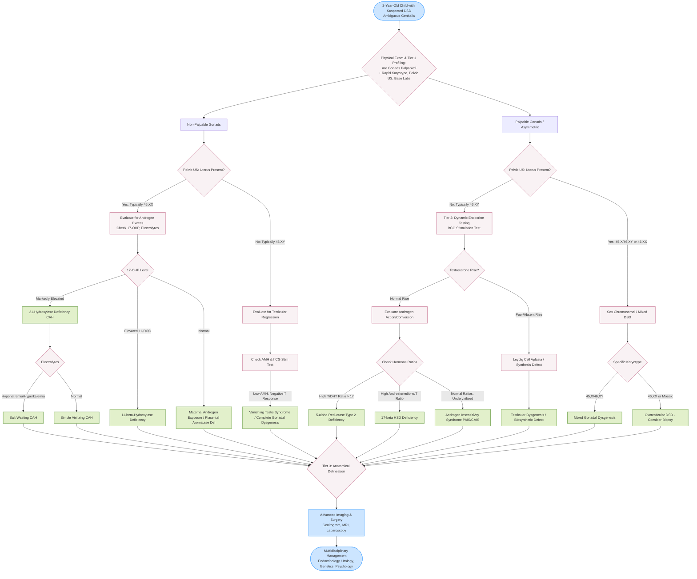

---
{"dg-publish":true,"permalink":"/endocrinology/approach-to-dsd-in-2-year-old/","dgPassFrontmatter":true}
---

## Conceptual Framework & Epidemiology

- **Definition:** DSD represents discrepancies among chromosomal, gonadal, and genital sex.
- **Prevalence:** Approximately 1 in 4,000 infants born with DSD. Rises significantly if encompassing all variations (cryptorchidism, isolated hypospadias).
- **Pathophysiology:** Disruption in meticulous choreography of endocrine, paracrine, and autocrine signaling pathways governing fetal gonadal development.
- **2-Year-Old Context:** Presentation at 2 years often delayed. Typical presentations include discovery of inguinal masses (testes in AIS or uterus in persistent Müllerian duct syndrome), progressive virilization in children raised as girls (5α-reductase deficiency or non-classic CAH), or investigation of syndromic developmental delays. HPG axis is physiologically dormant at this age (post-mini-puberty); basal gonadotropins and testosterone are uninformative, necessitating dynamic stimulation testing.

## Classification & Molecular Etiology

DSD classification relies heavily on karyotype, dividing into three main categories.

### 46,XX DSD

Characterized by female karyotype with virilized external genitalia or ovotesticular development.

|Etiology Category|Specific Defect / Gene|Pathophysiology & Clinical Features|
|:--|:--|:--|
|**Androgen Excess (CAH)**|_CYP21A2_ (21-Hydroxylase)|Most common 46,XX DSD. Salt-wasting or simple virilizing. Elevated 17-OHP.|
||_CYP11B1_ (11β-Hydroxylase)|Virilization with arterial hypertension. Elevated 11-deoxycortisol.|
||_HSD3B2_ (3β-HSD)|Salt-wasting, mild virilization, elevated Δ5 steroids.|
||_POR_ (P450 Oxidoreductase)|Antley-Bixler syndrome (craniosynostosis, radiohumeral synostosis). Ambiguity in both sexes.|
|**Maternal Androgen Exposure**|Placental Aromatase Deficiency|Maternal virilization during pregnancy, fetal virilization.|
||Exogenous Androgens|Progestational drugs or maternal virilizing tumors.|
|**Disorders of Gonadal Development**|_SRY_ Translocation|46,XX Testicular DSD (XX male). Translocation of _SRY_ onto X chromosome. Testicular tissue present.|
||_SOX9_ Duplication / _RSPO1_|Ovotesticular DSD or Testicular DSD. _RSPO1_ defect associated with palmoplantar hyperkeratosis.|

### 46,XY DSD

Characterized by male karyotype with incomplete virilization, ambiguous, or female external genitalia.

|Etiology Category|Specific Defect / Gene|Pathophysiology & Clinical Features|
|:--|:--|:--|
|**Disorders of Gonadal Development**|_WT1_|Denys-Drash syndrome, WAGR syndrome. Dysgenetic testes, Wilms tumor, renal failure.|
||_SF1_ (_NR5A1_)|Dysgenetic testes, primary adrenal failure, Müllerian structures absent.|
||_SOX9_|Campomelic dysplasia (skeletal dysplasia, bowing of long bones).|
||_SRY_, _DHH_, _ATRX_|Complete or partial gonadal dysgenesis (Swyer syndrome).|
|**Disorders of Androgen Synthesis**|_LHCGR_|Leydig cell hypoplasia. High LH, low testosterone.|
||_SRD5A2_ (5α-Reductase Type 2)|Normal testosterone, low DHT. High T/DHT ratio (>17). Virilization occurs at puberty.|
||_CYP17A1_|Hypertension, hypokalemia, sexual infantilism.|
||_HSD17B3_|17β-HSD type 3 deficiency. Low testosterone, high androstenedione.|
|**Disorders of Androgen Action**|_AR_ (Androgen Receptor)|Complete (CAIS) or Partial (PAIS). High LH, high testosterone. Female or ambiguous phenotype.|

### Sex Chromosomal DSD

|Karyotype|Clinical Syndrome|Features|
|:--|:--|:--|
|**45,X/46,XY**|Mixed Gonadal Dysgenesis|Asymmetrical gonads (streak gonad on one side, dysgenetic testis on other). Müllerian structures often present.|
|**46,XX/46,XY**|Chimerism|Ovotesticular DSD (True hermaphroditism). Both ovarian and testicular tissue present.|

## Clinical Evaluation

### Detailed Historical Assessment

- **Family History:** Unexplained neonatal deaths (salt-wasting CAH), consanguinity (autosomal recessive disorders), infertility, delayed puberty.
- **Maternal History:** Virilization during pregnancy (placental aromatase deficiency, maternal luteoma), ingestion of progestational/androgenic agents.
- **Infancy History:** Neonatal salt-wasting crises (failure to thrive, recurrent vomiting, lethargy, polyuria) strongly implicate 21-OHD or 3β-HSD deficiency.
- **Pedigree Analysis:** Amenorrheic aunts or partially virilized uncles suggest X-linked inheritance (e.g., Androgen Insensitivity Syndrome).

### Physical Examination & Genital Assessment

- **General Examination:** Assess for hyperpigmentation (ACTH excess in CAH), dehydration, or hypertension (11β-OHD, 17α-OHD).
- **Syndromic Stigmata:**
    - _Smith-Lemli-Opitz:_ 2-3 toe syndactyly, microcephaly, ptosis, cleft palate.
    - _CHARGE Syndrome:_ Coloboma, heart defects, choanal atresia, ear anomalies.
    - _Denys-Drash:_ Renal anomalies, Wilms tumor.
    - _Campomelic Dysplasia:_ Bowed limbs, skeletal dysplasia.
- **Genital Anatomy:**
    - **Prader Staging:** Grade I (clitoromegaly only) to Grade V (male-appearing genitalia with cryptorchidism).
    - **Palpation of Gonads:** Crucial step. Bilateral palpable gonads below the inguinal ring are almost always testes; virtually excludes 46,XX CAH. Absence of palpable gonads in a virilized child mandates ruling out CAH. Asymmetrical gonads suggest mixed gonadal dysgenesis or ovotesticular DSD.
    - **Phallus/Urethra:** Measure stretched penile length (micropenis <2.5 cm in neonate, <2 SD for age). Identify urethral meatus position (hypospadias) and presence of chordee.
    - **Müllerian Structures:** Confirm presence/absence via rectal examination or ultrasound.

## Diagnostic Algorithms & Investigations

### Tier 1: Baseline Biochemical & Genetic Profiling

- **Karyotype:** Rapid blood karyotype (FISH/Microarray) is mandatory and dictates the diagnostic algorithm.
- **Serum 17-OHP:** Essential to rule out 21-hydroxylase deficiency. Elevated in classic CAH.
- **Electrolytes & Blood Gas:** Assess for hyponatremia, hyperkalemia, and metabolic acidosis (salt-wasting CAH) or hypokalemia (11β-OHD, 17α-OHD).
- **Anti-Müllerian Hormone (AMH):** Assesses Sertoli cell function and presence of functioning testicular tissue. Low AMH with absent Müllerian structures indicates vanishing testis syndrome.

### Tier 2: Dynamic Endocrine Testing (2-Year-Old Specifics)

- **Rationale:** At 2 years of age, spontaneous HPG axis activity is suppressed. Basal LH, FSH, and testosterone levels are physiologically low and uninterpretable.
- **hCG Stimulation Test:** Mandatory to assess Leydig cell capacity for testosterone synthesis.
    - Protocol: Administer hCG (e.g., 5,000 IU IM daily for 3 days).
    - Interpretations:
        - Normal testosterone rise: Excludes Leydig cell aplasia and major biosynthetic defects. Points towards AIS, 5α-reductase deficiency, or anatomical defects.
        - Absent/Poor testosterone rise: Indicates gonadal dysgenesis, vanished testes, or severe biosynthetic enzyme defect.
- **Testosterone/DHT Ratio:** Measured post-hCG stimulation. Ratio >17 confirms 5α-reductase type 2 deficiency.
- **Androstenedione/Testosterone Ratio:** Differentiates 17β-HSD3 deficiency.
- **GnRH Analogue Test:** Evaluates pituitary gonadotropin reserve if central hypogonadism suspected, though less reliable in early childhood compared to mini-puberty or adolescence.

### Tier 3: Anatomical Delineation

- **Pelvic Ultrasound:** First-line imaging. Identifies Müllerian structures (uterus, upper vagina) and locates intra-abdominal gonads.
- **Genitogram:** Contrast study to define internal ductal anatomy, level of vaginal fusion with urogenital sinus.
- **MRI/Laparoscopy:** Resolves complex anatomical relationships or identifies dysgenetic gonads/streak gonads deep in the pelvis. Laparoscopy permits gonadal biopsy for histological diagnosis (e.g., differentiating ovotesticular DSD).

## Multidisciplinary Management & Interventions

### Collaborative Team & Psychological Counseling

- **Team Composition:** Pediatric endocrinologist, pediatric urologist/surgeon, geneticist, neonatologist, and behavioral health professional (psychologist/psychiatrist).
- **Communication Protocol:** Honest, sensitive communication. Avoid gender-specific pronouns prematurely (use "your baby", "your child"). Avoid terms like "hermaphrodite"; utilize neutral terms like "gonads" and "phallus".
- **Psychosocial Support:** Address parental anxiety, guilt, and fears of social stigmatization. Provide connections to support groups (e.g., CARES foundation, AIS support groups).

### Sex of Rearing Assignment

- Best predictor of gender identity is sex of rearing, though exceptions exist.
- **Decision Factors:** Potential for future sexual and reproductive function, anatomical status, surgical feasibility, and degree of prenatal brain androgenization.
- **46,XX CAH:** Reared as females. Excellent potential for fertility and sexual function with appropriate medical and surgical management.
- **46,XY CAIS:** Reared as females. Female gender identity is universal.
- **46,XY PAIS:** Sex assignment is challenging. Depends heavily on degree of virilization and penile response to exogenous testosterone.
- **46,XY 5α-Reductase Deficiency:** Virilization occurs at puberty. Many reared as females in childhood transition to male gender identity at puberty. Male rearing is often advised if diagnosed early.

### Medical Therapy

- **CAH (21-OHD):** Glucocorticoid replacement (Hydrocortisone 12-15 mg/m²/day in 3 divided doses) to suppress ACTH and adrenal androgens. Mineralocorticoid replacement (Fludrocortisone 0.05-0.1 mg/day) and sodium chloride supplementation for salt-wasting. Stress dosing required during illness.
- **Androgen Trial:** In completely virilized genetic males (e.g., micropenis, PAIS reared as male), short course of testosterone (e.g., 25 mg testosterone enanthate IM monthly for 3 doses) assesses phallic growth potential and induces penile enlargement.

### Surgical Considerations & Neoplasia Risk

- **Genitoplasty:** Indications and timing remain controversial. Shared decision-making is paramount.
    - _Females (CAH):_ Clitoroplasty and urogenital sinus repair. Early surgery (approx 1 year of age) favored by some centers to reduce urinary tract infections, while others advocate delaying vaginoplasty until puberty to prevent vaginal stenosis.
    - _Males (Hypospadias/Chordee):_ Typically performed in stages during early childhood.
- **Gonadectomy:** Indicated to prevent malignancy (gonadoblastoma, dysgerminoma) in dysgenetic gonads containing Y-chromosome material (e.g., 45,X/46,XY mixed gonadal dysgenesis, 46,XY complete gonadal dysgenesis).
    - In CAIS, gonadectomy is often deferred until post-puberty to allow spontaneous estrogen-induced feminization from testicular aromatization.

## Long-Term Surveillance & Prognosis

- **Transition of Care:** Structured transition to adult endocrinology and urology teams is essential for monitoring long-term hormonal replacement, bone health, and sexual function.
- **Fertility:** Highly variable. Excellent in optimally managed 46,XX CAH. Rare in mixed gonadal dysgenesis or XX males. Assisted reproductive technologies (ART) increasingly utilized.
- **Psychosexual Outcome:** Ongoing psychological evaluation required. Gender dysphoria may arise, requiring specialized psychological and medical support. Quality of life deeply dependent on early, honest disclosure and robust familial and medical support systems.