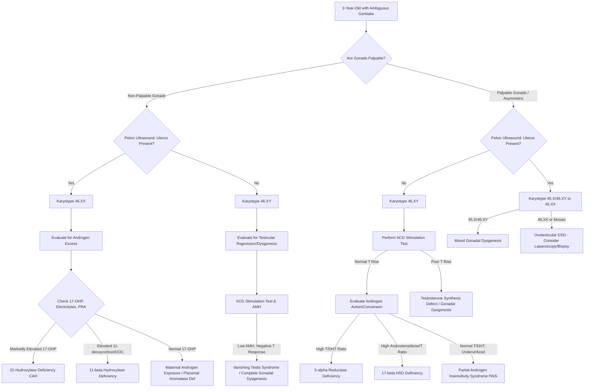

---
{"dg-publish":true,"permalink":"/endocrinology/approach-to-dsd/","dgPassFrontmatter":true}
---

## Initial Clinical Evaluation

### Comprehensive Medical and Family History

- The evaluation of a two-year-old child presenting with ambiguous genitalia begins with a meticulous, multigenerational family history, which provides critical clues to the underlying etiology.
- The clinician must specifically inquire about a family history of unexplained neonatal or infant deaths, which is highly suggestive of missed salt-wasting congenital adrenal hyperplasia (CAH).
- A history of consanguinity increases the risk for autosomal recessive conditions, such as steroidogenic enzyme defects (e.g., 21-hydroxylase deficiency, 11-beta-hydroxylase deficiency, 5-alpha-reductase deficiency).
- The presence of infertility, primary ovarian insufficiency, primary amenorrhea, or unexpected gynecomastia in extended family members should be documented, as these may represent milder phenotypic expressions of certain disorders of sex development (DSD).
- For X-linked disorders such as complete or partial androgen insensitivity syndrome (CAIS/PAIS), an inquiry regarding affected maternal relatives (e.g., amenorrheic aunts or partially virilized uncles) is essential.
- The maternal prenatal history must be extensively reviewed for exposure to exogenous androgens, progestins, estrogens, or potential environmental endocrine disruptors during gestation.
- Maternal virilization during pregnancy (e.g., deepening of voice, clitoromegaly, severe acne) should be queried, as it strongly points to a maternal androgen-secreting tumor (e.g., luteoma, arrhenoblastoma) or fetal placental aromatase deficiency.

### Detailed Physical Examination

- A systemic physical examination must be conducted to identify any associated dysmorphic features or congenital anomalies, as genital ambiguity frequently occurs as a component of broader genetic syndromes.
- The clinician must assess for midline facial defects, cleft palate, microcephaly, craniosynostosis, and distal limb anomalies (e.g., syndactyly of the second and third toes in Smith-Lemli-Opitz syndrome).
- Skin examination should note hyperpigmentation of the genitalia, nipples, or palmar creases, which results from excessive adrenocorticotropic hormone (ACTH) secretion characteristic of primary adrenal insufficiency in CAH.
- The genital examination must systematically document the symmetry of the external genitalia, as asymmetry (e.g., differing labioscrotal fold appearance or a unilateral palpable gonad) strongly suggests mixed gonadal dysgenesis (45,X/46,XY) or an ovotesticular DSD.
- Palpation of the inguinal canals, labioscrotal folds, and lower abdomen is the most crucial clinical step; structures palpable in the labioscrotal region are almost exclusively testes (or rarely, ovotestes), indicating the presence of testicular tissue and an underlying Y chromosome.
- The degree of labioscrotal or labiourethral fusion must be assessed, documenting whether fusion progresses from posterior to anterior.
- The phallus must be accurately measured in the fully stretched state (dorsal length from the pubic ramus to the tip of the glans, excluding foreskin) and its diameter recorded.
- In female-appearing genitalia, clitoromegaly is defined by a clitoral length typically greater than 1.0 cm or a clitoral index (length times width) significantly exceeding normal limits.
- The precise location of the urethral meatus must be identified (e.g., perineal, penoscrotal, midshaft).
- The presence of a single perineal opening implies a urogenital sinus, commonly seen in severely virilized 46,XX infants.
- The anogenital distance should be measured as the ratio between the anus and the posterior fourchette divided by the distance between the anus and the base of the phallus.
- The overall extent of virilization should be clinically staged using the Prader classification (Grade I representing a female with clitoromegaly to Grade V representing a completely male-appearing genitalia with a penile urethra and cryptorchidism).

## First-Line Laboratory Investigations

### Genetic and Cytogenetic Testing

- A peripheral blood karyotype is the foundational test to confirm chromosomal sex and direct the subsequent diagnostic algorithm.
- Because standard G-banded karyotyping may take several days, rapid identification of sex chromosomes using fluorescent in situ hybridization (FISH) or polymerase chain reaction (PCR) for X and Y chromosome markers is recommended to expedite decision-making.
- Clinicians must recognize that a standard peripheral karyotype may miss low-level mosaicism or cell lines restricted entirely to gonadal tissue.
- Chromosomal microarray analysis (CMA) or array comparative genomic hybridization (aCGH) is increasingly utilized to identify submicroscopic genomic DNA imbalances, deletions, or copy number variants associated with DSDs (e.g., deletions at 9p24.3 involving DMRT1).
- Targeted molecular genetic testing or next-generation sequencing (DSD gene panels or whole-exome sequencing) may be required to identify specific single-gene mutations affecting gonadal development (e.g., SRY, WT1, SOX9, SF1/NR5A1, DAX1) or androgen synthesis/action (e.g., AR, SRD5A2, HSD17B3).

### Baseline Biochemical and Endocrine Profiling

- In a 2-year-old child, the hypothalamic-pituitary-gonadal (HPG) axis is physiologically quiescent; the transient postnatal activation ("mini-puberty") ceases by 6 to 8 months of age, meaning basal levels of gonadotropins (LH, FSH) and sex steroids (testosterone, estradiol) will be naturally low and not definitively diagnostic.
- Despite this quiescence, baseline serum electrolytes (sodium, potassium), blood glucose, and plasma renin activity (PRA) must be evaluated immediately to exclude a life-threatening salt-wasting crisis associated with adrenal insufficiency (e.g., 21-hydroxylase or 3-beta-hydroxysteroid dehydrogenase deficiency).
- Measurement of serum 17-hydroxyprogesterone (17-OHP) is mandatory, particularly if gonads are not palpable, as markedly elevated levels definitively diagnose classic 21-hydroxylase deficiency, the most common cause of 46,XX DSD.
- Additional adrenal precursor profiling, including androstenedione, 11-deoxycortisol, dehydroepiandrosterone (DHEA), and 17-hydroxypregnenolone, is necessary to delineate specific steroidogenic blocks.
- Serum anti-Mullerian hormone (AMH) and Inhibin B are crucial basal markers of Sertoli cell presence and function; normal male levels in a 2-year-old strongly indicate the presence of functioning testicular tissue, even if the gonads are cryptorchid or intra-abdominal.

## Dynamic Endocrine Testing

### Human Chorionic Gonadotropin (hCG) Stimulation Test

- Because basal testosterone levels are physiologically prepubertal at 2 years of age, a human chorionic gonadotropin (hCG) stimulation test is required to assess Leydig cell capacity for testosterone biosynthesis.
- The protocol typically involves an intramuscular injection of hCG (e.g., 1500 to 5000 IU) administered over several days, followed by the measurement of serum testosterone and dihydrotestosterone (DHT).
- An inadequate testosterone response (e.g., minimal rise from baseline) indicates gonadal dysgenesis, Leydig cell aplasia, vanishing testes syndrome, or a severe testosterone biosynthetic defect.
- A robust rise in testosterone confirms the presence of functional Leydig cells.
- In the presence of a normal testosterone response but inadequate virilization, an elevated testosterone-to-DHT ratio indicates 5-alpha-reductase type 2 deficiency, whereas an elevated androstenedione-to-testosterone ratio points to 17-beta-hydroxysteroid dehydrogenase type 3 deficiency.
- If the testosterone response is robust but the child has ambiguous or female external genitalia, an androgen receptor defect (Partial or Complete Androgen Insensitivity Syndrome) is highly suspected.

### ACTH Stimulation Test

- An adrenocorticotropic hormone (ACTH) stimulation test using intravenous cosyntropin is utilized when baseline adrenal precursors (like 17-OHP) are equivocal or to confirm milder, non-classic forms of congenital adrenal hyperplasia.
- The test also helps identify rare enzymatic defects like 3-beta-hydroxysteroid dehydrogenase deficiency (evidenced by a high ratio of delta-5 to delta-4 steroids) or P450 oxidoreductase (POR) deficiency.

## Radiologic and Anatomic Evaluation

### Pelvic and Abdominal Imaging

- A pelvic and abdominal ultrasound is the primary, non-invasive imaging modality to assess internal anatomy, specifically to determine the presence or absence of a uterus and to locate the gonads, kidneys, and adrenal glands.
- The presence of a uterus, combined with symmetric genital ambiguity and non-palpable gonads, strongly favors the diagnosis of a virilized 46,XX female with CAH.
- The absence of a uterus in an undermasculinized child implies the successful fetal secretion of AMH by Sertoli cells, pointing toward a 46,XY DSD.
- Magnetic Resonance Imaging (MRI) of the pelvis may provide superior anatomical resolution for identifying Mullerian structures or evaluating urinary tract abnormalities, though it often requires sedation in a 2-year-old child.

### Endoscopy and Laparoscopy

- Endoscopic evaluation (cystoscopy/vaginoscopy) is utilized to define the precise internal urogenital anatomy, such as locating the vaginal-urethral confluence and identifying a urogenital sinus.
- Retrograde genitograms (contrast studies) can be performed alongside endoscopy to visually map the urethra, vagina, and potential uterine cavity, which is vital for surgical planning.
- When biochemical and imaging studies are inconclusive, diagnostic laparoscopy is indicated to visually evaluate intra-abdominal gonads and internal duct structures.
- During laparoscopy, gonadal biopsies may be obtained to define the exact histological composition (e.g., differentiating streak gonads, dysgenetic testes, normal ovaries, or an ovotestis with both seminiferous tubules and ovarian follicles) and to assess for the presence of pre-malignant changes (e.g., carcinoma in situ or gonadoblastoma).

## Diagnostic Algorithms

## Interpretation by Etiological Classification

### 46,XX DSD (Disorders of Ovarian Development and Androgen Excess)

- The underlying pathophysiology of 46,XX DSD typically involves excessive prenatal androgen exposure acting on a female fetus.
- Classic 21-hydroxylase deficiency accounts for over 90% of these cases; diagnostic confirmation relies on demonstrating massive elevations in serum 17-OHP, accompanied by elevated androstenedione and potentially hyponatremia/hyperkalemia.
- In the rare instance of 11-beta-hydroxylase deficiency, the child will present with virilization accompanied by severe hypertension and hypokalemia driven by the accumulation of the mineralocorticoid precursor deoxycorticosterone (DOC).
- P450 oxidoreductase (POR) deficiency causes virilization in 46,XX children through the alternative "backdoor" pathway to DHT; it is uniquely associated with maternal virilization during pregnancy and severe skeletal dysplasias like Antley-Bixler syndrome.
- In the absence of elevated adrenal precursors, the diagnostic approach must investigate external sources of androgens, necessitating evaluation of the mother for virilizing ovarian tumors (e.g., luteoma) or determining if placental aromatase deficiency was present.

### 46,XY DSD (Disorders of Testicular Development and Androgen Action)

- The diagnostic challenge is substantial in 46,XY DSD, as up to 50% of cases remain without a precise molecular diagnosis despite exhaustive evaluation.
- If basal AMH is low and the hCG test yields no testosterone response, the diagnosis points toward defects in testicular development, including complete or partial gonadal dysgenesis.
- Genetic analysis is directed toward genes regulating early gonadal fate, such as SRY, WT1 (Denys-Drash syndrome), SOX9 (Campomelic dysplasia), and SF-1/NR5A1.
- If the hCG test yields a normal testosterone surge, the defect lies in androgen utilization or terminal enzymatic conversion.
- An elevated testosterone-to-DHT ratio specifically identifies 5-alpha-reductase type 2 deficiency (SRD5A2 mutation), a condition where individuals often exhibit profound spontaneous virilization later at puberty.
- If both testosterone and DHT levels respond robustly to hCG, but the 46,XY child exhibits marked ambiguity or isolated hypospadias, Partial Androgen Insensitivity Syndrome (PAIS) caused by an androgen receptor (AR) gene mutation is the primary diagnostic consideration.
- The presence of a uterus and fallopian tubes in an otherwise fully or partially virilized 46,XY male (identified on ultrasound) establishes the diagnosis of Persistent Mullerian Duct Syndrome, caused by defects in the AMH gene or its type II receptor.

### Sex Chromosome DSD and Ovotesticular DSD

- A karyotype demonstrating 45,X/46,XY mosaicism establishes the diagnosis of mixed gonadal dysgenesis; these children exhibit extreme phenotypic variability and typically possess one dysgenetic testis and a contralateral streak gonad, along with persistent Mullerian structures.
- If clinical findings indicate asymmetry (e.g., a palpable gonad on one side and a hemi-uterus on the other), the diagnostic workup must strongly consider an Ovotesticular DSD.
- Definitive diagnosis of Ovotesticular DSD strictly requires histological confirmation via gonadal biopsy, demonstrating both ovarian tissue containing follicles and testicular tissue containing seminiferous tubules within the same individual.