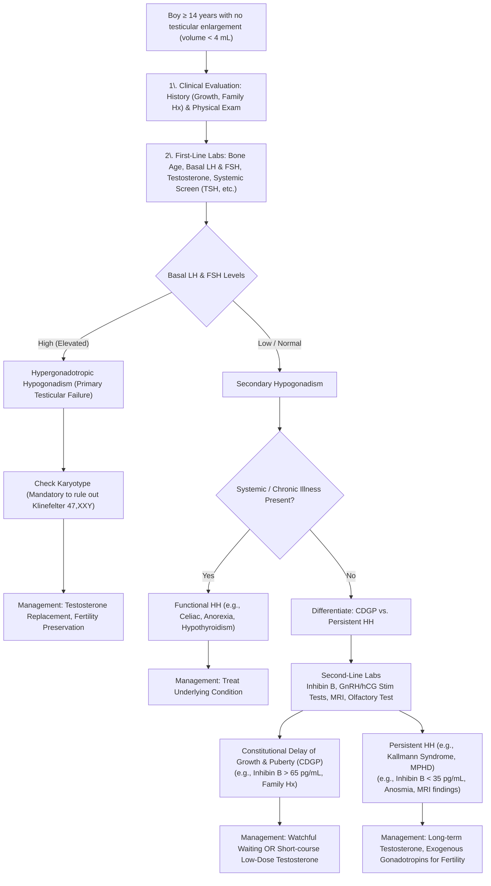

---
{"dg-publish":true,"permalink":"/endocrinology/delayed-puberty-in-boys/","dgPassFrontmatter":true}
---

## Overview & Definition

- **Definition:** Absence of testicular enlargement (volume < 4 mL or length < 2.5 cm) by 14 years of age.
- **Alternate Definition:** Lack of pubertal changes 2 to 2.5 Standard Deviations (SD) later than population mean.
- **Epidemiology:** More common in boys than girls.
- **Key Nuance:** Presence of pubic hair (adrenarche) does not exclude delayed puberty (gonadarche).

## Etiological Classification

|Category|Frequency|Pathophysiology|Key Examples|
|:--|:--|:--|:--|
|**Constitutional Delay of Growth & Puberty (CDGP)**|65-80%|Transient delay in Hypothalamic-Pituitary-Gonadal (HPG) axis activation.|Self-limited delayed puberty; strong family history.|
|**Functional Hypogonadotropic Hypogonadism (FHH)**|10-20%|Transient HPG suppression secondary to underlying systemic, nutritional, or endocrine conditions.|Celiac disease, Crohn disease, anorexia nervosa, excessive exercise.|
|**Persistent Hypogonadotropic Hypogonadism (HH)**|~10%|Permanent gonadotropin (LH/FSH) deficiency. Hypothalamic or pituitary defect.|Kallmann syndrome, isolated HH, multiple pituitary hormone deficiency (MPHD).|
|**Hypergonadotropic Hypogonadism**|5-10%|Primary gonadal failure. Loss of negative feedback elevates LH/FSH.|Klinefelter syndrome (47,XXY), vanishing testes, chemotherapy/radiation.|

## Detailed Etiology & Pathophysiology

### Constitutional Delay of Growth and Puberty (CDGP)

- **Pathogenesis:** Extreme variation of normal pubertal timing. Delayed maturation of HPG axis.
- **Genetics:** Highly heritable. 50-75% report family history of delayed puberty. Inheritance patterns include autosomal dominant, autosomal recessive, X-linked, and bilineal.
- **Molecular Defects:** Mutations in _IGSF10_ cause delayed migration of GnRH neurons from olfactory bulbs to hypothalamus during embryogenesis. _LIN28B_ variants also implicated.
- **Growth Pattern:** Normal birth size. Growth deceleration between 6 months and 2 years. Tracks along lower percentiles. Delayed skeletal maturation (bone age).
- **Clinical Course:** Endogenous puberty eventually occurs. Adult height usually reaches genetic target range, though pubertal growth spurt magnitude may be diminished.
### Functional (Transient) Hypogonadotropic Hypogonadism

- **Pathogenesis:** Adaptive suppression of HPG axis to conserve energy during chronic stress or negative energy balance.
- **Nutritional:** Anorexia nervosa, malnutrition.
- **Systemic Illness:** Celiac disease, inflammatory bowel disease, cystic fibrosis, chronic renal failure, sickle cell anemia, thalassemia.
- **Endocrine:** Hypothyroidism, poorly controlled diabetes mellitus, hyperprolactinemia.
- **Excessive Exercise:** Elite athletes, wrestlers ("making weight").
### Persistent Hypogonadotropic Hypogonadism (HH)

Characterized by low LH, low FSH, and low testosterone.

#### Kallmann Syndrome & Normosmic HH

- **Kallmann Syndrome (KS):** HH combined with anosmia/hyposmia. Defective GnRH neuronal migration from olfactory placode.
- **Genetics:** _ANOS1_ (_KAL1_) (X-linked). _FGFR1_, _PROK2_, _PROKR2_, _FGF8_, _CHD7_, _NSMF_.
- **Isolated/Normosmic HH:** _GNRHR_, _GNRH1_, _KISS1R_ (encodes kisspeptin receptor), _TAC3_ (neurokinin B), _TACR3_.
- **Reversibility:** ~10% of IHH cases achieve normal reproductive endocrine activity in adulthood despite carrying loss-of-function mutations (e.g., _FGFR1_, _TAC3_).

#### Multiple Pituitary Hormone Deficiencies (MPHD)

- **Transcription Factor Defects:** Mutations in _PROP1_, _HESX1_, _LHX3_, _LHX4_, _SOX3_ cause multiple pituitary hormone deficiencies including HH. _PROP1_ mutations may present with late-onset HH.
- **Congenital Malformations:** Holoprosencephaly, septo-optic dysplasia.

#### Syndromic HH

- **Prader-Willi Syndrome:** HH + hyperphagia + obesity. Involves both hypothalamic dysfunction and primary testicular dysfunction.
- **Adrenal Hypoplasia Congenita (AHC):** X-linked mutation in _NR0B1_ (_DAX1_). Fetal adrenal cortex normal, adult zone fails to develop. HH presents in adolescence.
- **Other Syndromes:** Bardet-Biedl, Alström, Laurence-Moon.
- **Genetic Obesity:** Leptin (_LEP_), Leptin receptor (_LEPR_), _PCSK1_ mutations cause obesity and HH.

#### Acquired HH

- **Tumors:** Craniopharyngioma, glioma, germinoma, pituitary adenoma (prolactinoma).
- **Infiltrative:** Langerhans cell histiocytosis, hemochromatosis, sarcoidosis.
- **Iatrogenic:** Cranial radiation, neurosurgery, chronic glucocorticoids, opiates.

### Hypergonadotropic Hypogonadism (Primary Testicular Failure)

Characterized by elevated LH and FSH, low testosterone.

#### Klinefelter Syndrome (47,XXY)

- **Incidence:** 1 in 500 to 667 males.
- **Pathophysiology:** Prepubertal testes relatively normal. Puberty onset initiates massive germ cell apoptosis, seminiferous tubule hyalinization, and fibrosis.
- **Clinical Features:** Small firm testes (<5 mL), tall stature (eunuchoid habitus), microphallus, gynecomastia (50-80%), learning disabilities.
- **Height Mechanism:** Extra copy of _SHOX_ gene on pseudoautosomal region of X chromosome causes tall stature.

#### Other Primary Testicular Defects

- **Congenital Anorchia (Vanishing Testes Syndrome):** 46,XY males with normal external genitalia but absent testes. Suggests testicular loss between 14th week and birth. Undetectable Anti-Müllerian Hormone (AMH), absent testosterone response to hCG.
- **Acquired Damage:** Chemotherapy (alkylating agents, platinum), testicular radiation, bilateral torsion, mumps orchitis, trauma.
- **Steroidogenic Defects:** 5a-reductase deficiency, 17,20-lyase deficiency, 17b-HSD3 deficiency.
- **Testicular Dysgenesis Syndrome:** Environmental endocrine disruptors (phthalates, bisphenol A) linked to cryptorchidism, hypospadias, low sperm count.

## Clinical Evaluation

### Medical History

- **Growth Pattern:** Review prior height/weight records. Growth deceleration <3 cm/year suggests specific disease.
- **Systemic Symptoms:** GI distress (Celiac/IBD), headache/visual changes (CNS tumor), anosmia/hyposmia (Kallmann).
- **Neonatal History:** Micropenis or cryptorchidism at birth suggests congenital HH. Prolonged jaundice, hypoglycemia suggests hypopituitarism.
- **Family History:** Parental pubertal timing, heights, infertility. Self-limited DP in parent strongly suggests CDGP.

### Physical Examination

- **Anthropometry:** Calculate growth velocity. Measure upper-to-lower segment ratio and arm span. Arm span >5 cm greater than height indicates eunuchoid habitus (hypogonadism). Underweight suggests chronic illness/eating disorder; obesity suggests specific genetic syndromes (_LEPR_, _PCSK1_, Prader-Willi).
- **Genital Examination:**
    - _Testicular Volume:_ Use Prader orchidometer. Volume $\ge$ 4 mL indicates onset of central puberty.
    - _Penile Length:_ Assess stretched penile length. Micropenis indicates inadequate prenatal testosterone.
    - _Scrotum:_ Check for cryptorchidism, bifid scrotum, hypospadias.
- **Secondary Sex Characteristics:** Differentiate Tanner genital stage from pubic hair stage.
- **General Exam:** Neurologic/visual field exam, olfactory testing (sense of smell), dysmorphic features.

## Diagnostic Investigations

### First-Line Investigations

|Investigation|Rationale & Interpretation|
|:--|:--|
|**Bone Age (Left Hand/Wrist X-ray)**|Delayed >2 years typical in CDGP, but lacks specificity. Assesses remaining growth potential. Advanced bone age excludes CDGP.|
|**Basal LH & FSH (Morning)**|Differentiates primary vs. secondary hypogonadism. High FSH/LH = Hypergonadotropic (primary). Low/normal LH/FSH = CDGP or HH. _Assay Note:_ Use ultrasensitive ICMA/IFMA assays (detection <0.1 IU/L).|
|**Serum Testosterone (8 AM)**|Evaluates Leydig cell function. Level $\ge$ 20 ng/dL (0.7 nmol/L) predicts onset of pubertal signs within 12-15 months.|
|**IGF-1**|Screens for Growth Hormone (GH) deficiency. Compare to bone-age-matched norms.|
|**Systemic Screen**|CBC, ESR, CRP, Cr, Electrolytes, LFTs, Celiac serology (tTG-IgA), TSH, Free T4 to rule out chronic occult disease.|
|**Serum Prolactin**|Elevated in prolactinoma or pituitary stalk disruption.|

### Second-Line Investigations (Differentiating CDGP vs. HH)

|Investigation|Methodology & Interpretation|
|:--|:--|
|**GnRH / GnRH Agonist Test**|Peak LH > 5-8 IU/L suggests onset of central puberty (CDGP). Peak LH < 0.8 IU/L suggests HH, though prepubertal CDGP can also yield low responses.|
|**hCG Stimulation Test**|Evaluates Leydig cell capacity. Lower peak testosterone observed in HH compared to CDGP.|
|**Serum Inhibin B**|Marker of Sertoli cell function. Inhibin B < 35 pg/mL highly specific for HH in prepubertal boys. Inhibin B > 65 pg/mL suggests CDGP. Undetectable = anorchia.|
|**MRI Brain / Pituitary**|Indicated if signs of CNS lesion, multiple pituitary deficiencies, or severe delay without spontaneous onset by age 15-18.|
|**Olfactory Testing**|UPSIT (University of Pennsylvania Smell Identification Test) identifies hyposmia/anosmia (Kallmann syndrome).|
|**Karyotype**|Mandatory for hypergonadotropic presentation to rule out Klinefelter syndrome (47,XXY).|
|**Genetic Testing**|Gene panels for _ANOS1_, _FGFR1_, _CHD7_, _TAC3_ etc., when HH is suspected.|

## Management & Therapeutics

### 1. Constitutional Delay of Growth and Puberty (CDGP)

- **Watchful Waiting:** Observation with reassurance is appropriate if psychosocial distress is minimal.
- **Low-Dose Testosterone Therapy:**
    - _Indication:_ Psychosocial distress, bullying, severe anxiety over lack of growth/development.
    - _Regimen:_ Testosterone enanthate or cypionate 50-100 mg Intramuscularly (IM) every 4 weeks for 3 to 6 months.
    - _Goal:_ Induces secondary sexual characteristics, promotes growth spurt, jump-starts endogenous puberty without unduly advancing bone age or compromising adult height.
    - _Follow-up:_ Halt after 3-6 months. Reassess endogenous testosterone and testicular volume. If spontaneous puberty does not resume, consider second course or re-evaluate for HH.
- **Alternative (Experimental) Therapies:**
    - _Aromatase Inhibitors (Letrozole/Anastrozole):_ Delays epiphyseal fusion by blocking estrogen synthesis. May increase final adult height, but safety concerns (vertebral deformities, altered spermatogenesis) limit routine use; FDA non-approved.
    - _Anabolic Steroids:_ Oxandrolone (1.25-2.5 mg/day PO). Weak androgenic effect; carries hepatotoxicity risk. Rarely used.

### 2. Persistent Hypogonadotropic Hypogonadism (HH)

- **Testosterone Replacement (Virilization):**
    - _Initiation:_ Can begin around age 12-14.
    - _Escalation:_ Start at 50 mg IM every 4 weeks. Increase by 50 mg increments every 6-12 months over 3 years.
    - _Adult Maintenance:_ 100-200 mg IM every 2 weeks, or daily transdermal testosterone gel (1%).
    - _Limitation:_ Exogenous testosterone does not induce testicular growth or spermatogenesis.
- **Fertility Induction (Spermatogenesis):**
    - _Regimen:_ Requires exogenous gonadotropins. hCG (500-3000 IU 2-3x/week) + Recombinant human FSH (75-225 IU 2-3x/week) administered Subcutaneously (SC).
    - _Pulsatile GnRH:_ Delivered via SC pump (if pituitary intact). Most physiologic, but highly complex.

### 3. Hypergonadotropic Hypogonadism (e.g., Klinefelter Syndrome)

- **Testosterone Replacement:** Initiate when LH/FSH rise above normal and testosterone falls. Titrate to adult dosing (e.g., 200-250 mg every 3-4 weeks IM or transdermal gel).
- **Fertility Preservation:** Sperm counts decline rapidly during puberty in Klinefelter syndrome. Consider sperm banking in early puberty. Adult paternity achievable via micro-dissection Testicular Sperm Extraction (microTESE) coupled with Intracytoplasmic Sperm Injection (ICSI).
- **Gynecomastia Management:** Aromatase inhibitors largely ineffective. Surgical reduction often required for severe psychosocial distress.
- **Comorbidity Screening:** Monitor fasting glucose, lipids, HbA1c, and bone mineral density (increased risk for metabolic syndrome and osteopenia).

## Prognosis & Long-Term Consequences

- **Adult Height:** CDGP adult height may be slightly below genetic target, but generally normal.
- **Bone Health:** Late pubertal timing directly causes decreased peak Bone Mineral Density (BMD) in adulthood, increasing long-term osteopenia risk.
- **Psychosocial:** Untreated significant delay correlates with transient academic and emotional difficulties.