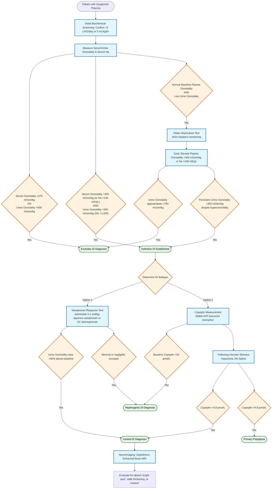

---
{"dg-publish":true,"permalink":"/endocrinology/diabetes-insipidus/","dgPassFrontmatter":true}
---

## Definition and Pathophysiology

- Diabetes insipidus (DI) represents a state of impaired water conservation characterized by pathologic polyuria and compensatory polydipsia.
- Polyuria defined strictly as urine output exceeding 5 mL/kg/hr or 2 L/m2/day.
- Biochemical hallmark comprises low urine osmolality (<300 mOsm/kg) concurrent with elevated plasma osmolality (>300 mOsm/kg) or hypernatremia (serum sodium >146 mEq/L).
- Normal fluid homeostasis depends on arginine vasopressin (AVP), also termed antidiuretic hormone (ADH).
- AVP synthesized in hypothalamic paraventricular and supraoptic nuclei.
- Transported via axonal projections for storage and secretion from posterior pituitary.
- AVP binds V2 receptors in renal collecting duct and thick ascending limb of loop of Henle.
- Receptor activation triggers cyclic AMP-dependent insertion of aquaporin-2 (AQP2) water channels into apical membrane.
- Facilitates free water reabsorption down osmotic gradient into hypertonic renal medullary interstitium.
- Deficient AVP production causes Central (neurogenic) DI.
- Resistance to AVP action at renal tubule causes Nephrogenic DI (NDI).

## Etiological Classification

|Category|Central Diabetes Insipidus|Nephrogenic Diabetes Insipidus|
|:--|:--|:--|
|**Genetic Defects**|Autosomal dominant (AVP-NPII variants). Wolfram syndrome (DIDMOAD) via autosomal recessive _WFS1_ or _WFS2/CISD2_ mutations.|X-linked recessive (_AVPR2_ / V2 receptor mutations). Autosomal recessive/dominant (_AQP2_ water channel mutations).|
|**Malformations**|Septo-optic dysplasia, holoprosencephaly, anencephaly. Familial pituitary hypoplasia with absent stalk.|Polycystic kidney disease, medullary cystic disease.|
|**Neoplasms**|Craniopharyngioma, germinoma, pinealoma. Optic glioma, hematologic malignancies (leukemia).|Infiltrating lesions rarely (amyloidosis).|
|**Infiltrative / Inflammatory**|Langerhans cell histiocytosis, neurosarcoidosis. Lymphocytic infundibuloneurohypophysitis.|Sarcoidosis.|
|**Infectious**|Meningitis (tuberculous, bacterial), encephalitis. Congenital cytomegalovirus, toxoplasmosis.|None directly; secondary to systemic effects.|
|**Trauma / Vascular**|Neurosurgery, head trauma, cerebral hemorrhage. Hypoxic brain death.|Sickle cell anemia (vascular sickling in renal medulla).|
|**Metabolic / Endocrine**|Increased AVP metabolism during pregnancy (placental vasopressinase).|Chronic hypercalcemia, severe hypokalemia.|
|**Drugs / Toxins**|Ethanol, phenytoin, opiate antagonists, alpha-adrenergic agents.|Lithium, demeclocycline, foscarnet, amphotericin, methicillin, rifampin.|

## Clinical Manifestations

- Presentation exists across a continuum of severity determined by age and degree of AVP defect.
- Older children present with sudden onset polyuria, nocturia, enuresis, and intense polydipsia.
- Craving for ice-cold water classically highly suggestive.
- Infants manifest nonspecific signs: irritability, failure to thrive, recurrent unexplained fever, and hypernatremic dehydration.
- Excessive water ingestion limits caloric intake, causing severe nutritional failure to thrive.
- Chronic massive urine volumes provoke nonobstructive hydronephrosis, hydroureter, and megabladder.
- Mental retardation and intracerebral calcifications (frontal lobes/basal ganglia) occur in X-linked NDI following repeated dehydration episodes.
- Concurrent cortisol deficiency (as seen in combined pituitary hormone deficiency) restricts free water clearance, masking polyuria until glucocorticoid therapy is initiated.
- Post-neurosurgical DI classically follows a "triphasic response".
    - Phase 1: Transient DI (12-48 hours) caused by local edema suppressing AVP.
    - Phase 2: Syndrome of inappropriate antidiuresis (SIAD) lasting up to 10 days, driven by unregulated AVP release from necrotic neurons.
    - Phase 3: Permanent DI ensuing if >90% of vasopressin neurons destroyed.

## Diagnostic Evaluation

### Initial Biochemical Screening

- Confirm pathologic polyuria (>2 L/m2/day or 5 mL/kg/hr).
- Measure concurrent serum osmolality, serum sodium, urine osmolality, and urine specific gravity.
- Definitive DI established if serum osmolality >300 mOsm/kg (or Na >146 mEq/L) simultaneously occurs with urine osmolality <300 mOsm/kg (specific gravity <1.005).
- Serum osmolality <270 mOsm/kg or urine osmolality >600 mOsm/kg excludes DI diagnosis.
### Water Deprivation Test

- Indicated solely for patients with polyuria exhibiting low urine osmolality but normal baseline plasma osmolality.
- Conducted strictly inpatient due to profound dehydration risk.
- Goal: Elevate plasma osmolality >300 mOsm/kg (or Na >146 mEq/L) to provide maximal physiological stimulus for AVP release and renal concentration.
- Monitor body weight, vital signs, urine output, and serial osmolality.
- Terminate test immediately if weight loss exceeds 5%, serum Na exceeds 146 mEq/L, or urine osmolality appropriately surpasses 750 mOsm/kg (excluding DI).
- Persistent urine osmolality <300 mOsm/kg despite hyperosmolality confirms DI.

### Vasopressin Response Test

- Differentiates central DI from NDI following confirmation of DI.
- Administer aqueous vasopressin injection (0.1 unit/kg) or subcutaneous desmopressin.
- Urine osmolality rising >50% above baseline dictates central DI diagnosis.
- Minimal or negligible increase diagnostic for NDI.

### Copeptin Measurement

- Copeptin constitutes the stable carboxy-terminus of the AVP precursor.
- Validated superior biomarker compared to direct AVP measurement.
- Baseline copeptin >20 pmol/L unequivocally confirms NDI without requiring fluid deprivation.
- Following osmotic stimulus (hypertonic 3% saline), copeptin <4.9 pmol/L confirms central DI; >4.9 pmol/L indicates primary polydipsia.

### Neuroimaging

- Gadolinium-enhanced brain MRI mandatory for confirmed central DI.
- Normal posterior pituitary demonstrates characteristic hyperintense "bright spot" on T1-weighted images.
- "Bright spot" characteristically absent or attenuated in central DI.
- Thickened pituitary stalk highly suggestive of Langerhans cell histiocytosis or lymphocytic infundibuloneurohypophysitis.
- Essential to rule out occult germinomas, craniopharyngiomas, or midline malformations (septo-optic dysplasia).

## Differential Diagnosis

|Condition|Distinguishing Features|
|:--|:--|
|**Primary Polydipsia**|Compulsive water drinking. Characterized by baseline hyponatremia or low-normal serum osmolality. Normal posterior pituitary bright spot on MRI. Copeptin >4.9 pmol/L following hypertonic stimulus.|
|**Osmotic Diuresis**|Elevated urine output driven by solute load. Occurs in Diabetes Mellitus (glycosuria), mannitol administration, or post-obstructive diuresis.|
|**Tubulopathy / Salt Loss**|Polyuria with associated electrolyte wasting. Includes Bartter syndrome, Gitelman syndrome, and renal tubular acidosis.|

## Management

### Central Diabetes Insipidus

- **Pharmacotherapy:** Desmopressin (DDAVP), a synthetic AVP analog with potent V2-specific antidiuretic activity and prolonged half-life, remains treatment of choice.
- Formulations include oral tablets, sublingual melts, or intranasal preparations.
- Oral dosing typically 25 to 300 mcg every 8 to 12 hours.
- Intranasal dosing (10 mcg/0.1 mL spray or rhinal tube) offers rapid onset.
- **Safety Protocol:** Strict mandate to allow 1-hour urinary "breakthrough" daily before next dose administration. Prevents continuous antidiuresis leading to fatal water intoxication/hyponatremia.
- **Infant Management:** Desmopressin avoided due to high obligate fluid intake causing hyponatremia. Managed primarily with high-volume fluid therapy utilizing low-renal-solute formulas (e.g., human milk). Thiazide diuretics employed to induce mild hypovolemia, enhancing proximal water reabsorption.
- **Acute Post-Neurosurgical DI:** Managed with continuous intravenous aqueous vasopressin infusion (1.5 mU/kg/hr) due to rapid onset and short half-life (5-10 mins). Allows rapid titration and prevents masking of impending SIAD phase.

### Nephrogenic Diabetes Insipidus

- Treatment of underlying cause mandatory (correct hypokalemia/hypercalcemia, withdraw offending drugs like lithium).
- **Dietary Modification:** Ensure adequate calories. Restrict sodium/solute load to minimize obligatory urine volume.
- **Pharmacotherapy:** Combination therapy utilizing hydrochlorothiazide combined with amiloride or indomethacin.
- Thiazides induce mild volume depletion, triggering compensatory proximal tubular sodium/water reabsorption.
- Indomethacin further decreases polyuria via prostaglandin inhibition mechanisms affecting renal blood flow.
- High-dose DDAVP occasionally effective in partial V2 receptor defects.