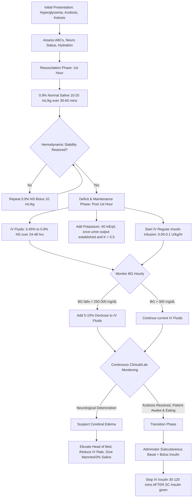

---
{"dg-publish":true,"permalink":"/endocrinology/management-of-dka/","dgPassFrontmatter":true}
---

## Definition and Diagnostic Criteria

- Diabetic Ketoacidosis (DKA) is a life-threatening acute metabolic decompensation resulting from an absolute or relative deficiency of circulating insulin combined with an excess of counterregulatory hormones (glucagon, catecholamines, cortisol, and growth hormone).
- The biochemical criteria for diagnosing DKA in children include all of the following:
    - Hyperglycemia: Blood glucose > 200 mg/dL (11 mmol/L).
    - Metabolic Acidosis: Venous pH < 7.3 or serum bicarbonate < 15 mEq/L.
    - Ketosis: Blood beta-hydroxybutyrate (BOHB) $\ge$ 3 mmol/L, moderate or large urine ketones ($\ge$ 2+), or blood ketones > 1.5 mmol/L.
- DKA severity is classified based on the degree of acidosis:
    - Mild DKA: Venous pH 7.25–7.35; Bicarbonate 16–20 mEq/L.
    - Moderate DKA: Venous pH 7.15–7.25; Bicarbonate 10–15 mEq/L.
    - Severe DKA: Venous pH < 7.15; Bicarbonate < 10 mEq/L.

## Initial Evaluation and Triage

- Immediate assessment must focus on the adequacy of the airway, breathing, and circulation (ABC).
- The degree of clinical dehydration must be meticulously assessed, though calculating fluid deficits using clinical signs is difficult because intravascular volume is often better maintained in hypertonic states. In moderate DKA, assume 5% to 7% dehydration, and in severe DKA, assume 7% to 10% dehydration.
- A careful neurological evaluation (including Glasgow Coma Scale, pupillary response, and cranial nerve examination) is mandatory to establish a baseline and screen for early signs of cerebral edema.
- Children require admission to a Pediatric Intensive Care Unit (PICU) if they are younger than 2 to 5 years, have severe DKA (pH < 7.1), exhibit an altered level of consciousness, or have a blood glucose > 1000 mg/dL.
- A "critical sample" should be drawn immediately for baseline laboratory evaluation, including serum glucose, electrolytes, BOHB, blood urea nitrogen (BUN), creatinine, osmolality, venous blood gas, and complete blood count.
- An electrocardiogram (ECG) must be obtained immediately to evaluate for T-wave changes associated with life-threatening hyperkalemia or hypokalemia before laboratory potassium results are available.

## Algorithm for DKA Management

## Fluid Resuscitation and Replacement

- Fluid therapy is the primary initial intervention; it aims to restore circulating volume, improve glomerular filtration, and enhance the renal clearance of glucose and ketones.
- **Initial Resuscitation:** Administer a bolus of 10 to 20 mL/kg of 0.9% Normal Saline (isotonic saline) over 30 to 60 minutes. If peripheral perfusion remains poor, the bolus should be repeated.
- **Deficit Replacement:** After the initial resuscitation, the remaining fluid deficit (typically 5-10% of body weight) plus daily maintenance requirements should be replaced evenly over 24 to 48 hours.
- The replacement fluid should be 0.45% to 0.9% sodium chloride, or a balanced salt solution like Ringer's lactate or Plasmalyte.
- Total fluid administration must be carefully monitored to avoid exceeding 4 L/m2/day, as excessive and rapid fluid administration has historically been linked to an increased risk of cerebral edema.
- Effective serum osmolality ($2 \times [Na] + [glucose]$) should be monitored; a rapid decline indicates excess free water entering the vascular space, increasing cerebral edema risk.
- Once the blood glucose drops below 250 to 300 mg/dL, 5% to 10% Dextrose must be added to the intravenous fluids to prevent hypoglycemia while allowing continuous insulin infusion to clear the ketosis. A two-bag system (one bag with 0% dextrose, one with 10% dextrose, with identical electrolytes) is highly recommended for easy titration.

## Insulin Therapy

- Insulin administration arrests hepatic gluconeogenesis, halts peripheral lipolysis, and stops ketogenesis.
- Insulin must _never_ be given as an initial IV bolus, as early bolus administration is an independent risk factor for the development of cerebral edema and can precipitate shock.
- Insulin therapy should commence 1 to 2 hours _after_ the initiation of fluid resuscitation, once plasma glucose is no longer falling rapidly from hemodilution alone.
- **Continuous Intravenous Infusion:** Administer regular insulin at a continuous rate of 0.05 to 0.1 Units/kg/hour. In infants and very mild DKA cases, the lower rate of 0.05 U/kg/hr or even 0.03 U/kg/hr is preferred.
- The therapeutic goal is to decrease serum glucose by 50 to 100 mg/dL/hour.
- If blood glucose drops below 100 mg/dL despite 10% Dextrose infusion, dextrose can be increased to 12.5%, or the insulin rate can be cautiously decreased, but insulin must not be stopped entirely while acidosis persists.
- If continuous IV infusion is unavailable, subcutaneous rapid-acting insulin (lispro/aspart) can be used for mild-to-moderate DKA, starting at 0.3 U/kg, followed by 0.1 U/kg every hour or 0.15-0.2 U/kg every 2-3 hours.

## Electrolyte and Acid-Base Management

### Potassium

- Despite total body potassium depletion (deficits of 3–6 mEq/kg), initial serum potassium levels may be normal or elevated due to the extracellular shift caused by acidosis and insulin deficiency.
- Once insulin is started and acidosis corrects, potassium rapidly shifts back intracellularly, posing a severe risk of life-threatening hypokalemia.
- Potassium replacement (typically 40 mEq/L in the IV fluid) must begin as soon as urine output is documented and the serum potassium is < 5.5 mEq/L.
- If the patient presents with profound hypokalemia (< 2.5 mEq/L), aggressive potassium replacement must begin immediately, and insulin therapy must be delayed until levels recover > 2.5 mEq/L to prevent arrhythmias.
- Replacement should be provided as a mixture of potassium chloride and potassium phosphate or acetate to avoid hyperchloremic metabolic acidosis.

### Sodium

- Serum sodium is falsely lowered by hyperglycemia (pseudohyponatremia); it decreases by 1.6 mEq/L for every 100 mg/dL elevation in glucose above normal.
- The "corrected sodium" must be calculated frequently: $Measured Na + 2 \times ([Glucose - 100] / 100)$.
- As glucose falls, the measured serum sodium should progressively increase. A failure of sodium to rise, or a rapid decline in corrected sodium, implies excessive free water retention and is a major warning sign for impending cerebral edema.

### Phosphate

- Intracellular phosphate depletion is common; however, routine replacement does not significantly alter clinical outcomes.
- Replacement is strictly indicated if levels fall below 1 mg/dL to prevent muscle weakness, respiratory failure, or rhabdomyolysis.
- It is safely administered by combining potassium phosphate with potassium chloride in the maintenance fluids.

### Acid-Base (Bicarbonate)

- The routine administration of sodium bicarbonate is strictly contraindicated.
- Bicarbonate therapy paradoxicallly worsens central nervous system acidosis, exacerbates hypokalemia, and is an independent risk factor for the development of cerebral edema.
- The underlying metabolic acidosis will correct physiologically with adequate fluid and insulin administration as BOHB is metabolized to regenerate endogenous bicarbonate.
- Bicarbonate is reserved exclusively for patients with profound acidemia (pH < 6.9) associated with severe hemodynamic compromise or life-threatening hyperkalemia exhibiting ECG changes.

## Clinical and Laboratory Monitoring

- Rigorous monitoring on a standardized flowchart is mandatory.
- **Hourly Monitoring:** Assess vital signs, strict fluid input and output, blood glucose (via bedside glucometer), and detailed neurological status (Glasgow Coma Scale, pupil size, heart rate).
- **Every 2-4 Hours Monitoring:** Measure serum electrolytes, venous pH, pCO2, BUN, and blood BOHB or urine ketones.
- Point-of-care BOHB is superior to urine dipsticks, as urine tests utilize the nitroprusside reaction which measures acetoacetate but not BOHB. As DKA resolves, BOHB converts to acetoacetate, rendering urine ketones persistently positive despite clinical improvement.
- The anion gap ($Na - [Cl + HCO_3]$) should be tracked; however, aggressive normal saline resuscitation often causes a non-anion gap hyperchloremic metabolic acidosis, which can mask the resolution of ketoacidosis if relying solely on pH and bicarbonate.

## Transition to Subcutaneous Insulin

- The transition from IV to subcutaneous (SC) insulin should only be initiated when the ketoacidosis is fully resolved (pH > 7.30, Bicarbonate > 15 mEq/L, BOHB < 1 mmol/L, or anion gap closed), the patient is fully conscious, and they are able to tolerate oral feeds without emesis.
- A dose of basal insulin (glargine, detemir, or NPH) along with a rapid-acting bolus insulin must be administered prior to stopping the IV infusion.
- To prevent rebound hyperglycemia and recurrent ketogenesis, the continuous IV insulin infusion must be maintained for 15 to 30 minutes after giving a rapid-acting SC insulin analog, or 1 to 2 hours after regular SC insulin, ensuring overlapping insulin action.

## Management of Complications: Cerebral Edema

- Cerebral edema is the most devastating acute complication, occurring in 0.5% to 1% of pediatric DKA episodes, accounting for 60% to 90% of DKA-related mortality.
- **Risk Factors:** Age younger than 5 years, newly diagnosed diabetes, severe acidosis at presentation, low pCO2, high BUN, early insulin boluses, and the use of alkali (bicarbonate) therapy.
- **Pathophysiology:** Initially thought to be driven purely by osmotic shifts from rapid hypotonic fluids, recent evidence suggests an ischemia-reperfusion injury model featuring cerebral hypoperfusion followed by reactive hyperemia and vasogenic edema.
- **Clinical Presentation:** Warning signs include the new onset of severe headache, vomiting, inappropriate slowing of the heart rate (bradycardia), rising blood pressure, lethargy, irritability, cranial nerve palsies (especially the 6th nerve), pupillary asymmetry, and papilledema.
- **Emergency Intervention:**
    - Treatment must be initiated immediately upon clinical suspicion; do not delay therapy to await cranial imaging (CT/MRI).
    - Elevate the head of the bed to 30 degrees.
    - Reduce the rate of intravenous fluid administration.
    - Administer intravenous Mannitol (0.5 to 1.0 g/kg over 20 minutes) or 3% Hypertonic Saline (5 mL/kg) immediately.
    - Ensure the patient is in the ICU, and consider intubation only if airway protection is needed, as aggressive hyperventilation may worsen cerebral ischemia.