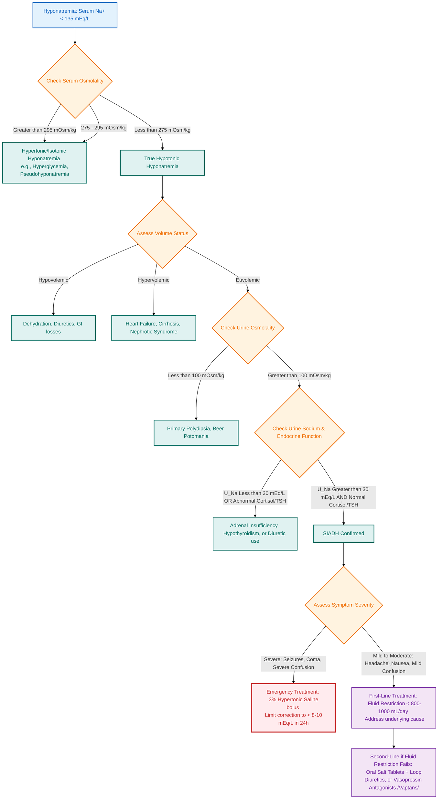

---
{"dg-publish":true,"uptext":"Back to Index (🧪Endocrinology)","uplink":"/endocrinology/endocrinology/","permalink":"/endocrinology/siadh/","dgPassFrontmatter":true}
---

## Definition and Pathophysiology

- Characterized by primary elevation in vasopressin (AVP/ADH) secretion or inappropriate activation of vasopressin V2 receptors.
- Impaired free water clearance leads to water retention and dilutional hyponatremia (serum sodium <135 mEq/L).
- Subsequent extracellular fluid expansion triggers compensatory mechanisms:
    - Suppression of renin-angiotensin-aldosterone system.
    - Elevation of atrial natriuretic peptide (ANP).
- Compensatory mechanisms induce marked natriuresis, resulting in normal-to-high urine sodium despite systemic hyponatremia.
- Net clinical state: Euvolemic or slightly hypervolemic hyponatremia with inappropriately concentrated urine.

## Etiological Classification

| Category                   | Specific Pathologies                                                                                                                                                                                                       |
| :------------------------- | :------------------------------------------------------------------------------------------------------------------------------------------------------------------------------------------------------------------------- |
| **Central Nervous System** | Encephalitis, [[Neurology/Meningitis\|meningitis]] (tuberculous, bacterial), brain tumor (glioma, craniopharyngioma, germinoma), head trauma, brain malformations, [[Neurology/Hydrocephalus\|hydrocephalus]], Guillain-Barre syndrome, subarachnoid hemorrhage, postictal state. |
| **Pulmonary Disorders**    | Pneumonia (viral/RSV, bacterial), tuberculosis, aspergillosis, [[Respiratory/Asthma\|asthma]], [[Respiratory/Cystic Fibrosis\|cystic fibrosis]].                                                                                                                                    |
| **Malignancy**             | Thymoma, lymphoma, Ewing sarcoma, leukemia.                                                                                                                                                                                |
| **Pharmacologic Agents**   | Carbamazepine, oxcarbazepine, chlorpropamide, cyclophosphamide, vinblastine, vincristine, cisplatin, tricyclic antidepressants (imipramine, amitriptyline), SSRIs (fluoxetine, sertraline), haloperidol.                   |
| **Postoperative**          | Second phase of "triple-phase response" post-hypothalamic/pituitary surgery (caused by unregulated AVP release from dying neurons; lasts up to 10 days).                                                                   |
| **Genetic (NSIAD)**        | Nephrogenic Syndrome of Inappropriate Antidiuresis: Gain-of-function activating mutations in V2 receptor gene (_AVPR2_). X-linked. Features undetectable AVP levels.                                                       |
| **Miscellaneous**          | Prolonged nausea, pain, AIDS, acute intermittent porphyria.                                                                                                                                                                |

## Clinical Manifestations

- Presentation dictated by severity and rapidity of hyponatremia onset.
- **Chronic/Mild:** Often completely asymptomatic.
- **Acute/Severe (Serum Na <120 mEq/L):**
    - Water entry into cells causes cerebral edema/neuronal swelling.
    - Manifestations include lethargy, confusion, psychosis, generalized seizures, coma, and potential cerebral herniation.

## Diagnostic Evaluation

- **Serum Chemistry:**
    - Hyponatremia (Sodium <135 mEq/L).
    - Low effective serum osmolality (<270 mOsm/kg).
    - Low blood urea nitrogen (BUN).
    - Low serum uric acid (differentiates from hypovolemic hyponatremia where uric acid is high).
- **Urine Chemistry:**
    - Inappropriately concentrated urine (Osmolality >100 mOsm/kg, often >800 mOsm/kg).
    - High urine sodium (>30 mEq/L).
- **Hormonal/Biomarker Profiling:**
    - High vasopressin levels (except in NSIAD where levels are suppressed/undetectable).
    - Copeptin measurement (carboxy-terminus of AVP precursor) coupled with hypertonic saline infusion useful for subtype classification.
- **Clinical Status:**
    - Normal or high intravascular volume (euvolemia/hypervolemia).
    - Normal blood pressure; absence of orthostasis.
    - Absence of peripheral edema.
    - Normal adrenal and thyroid function (mandatory exclusion).

## Differential Diagnosis

| Feature                  | SIADH             | Cerebral Salt Wasting (CSW)     | Systemic Dehydration | Primary Polydipsia      |
| :----------------------- | :---------------- | :------------------------------ | :------------------- | :---------------------- |
| **Pathophysiology**      | Excess AVP action | Excess ANP/natriuretic peptides | Fluid/salt loss      | Compulsive water intake |
| **Intravascular Volume** | Normal or High    | Low (Hypovolemia)               | Low                  | Normal or High          |
| **Blood Pressure**       | Normal            | Decreased/Orthostatic           | Decreased            | Normal                  |
| **Urine Sodium**         | High (>30 mEq/L)  | Very High (>150 mEq/L)          | Low (<20-30 mEq/L)   | Normal                  |
| **Serum Uric Acid**      | Low               | Normal or High                  | High                 | Normal                  |
| **BUN**                  | Low               | High                            | High                 | Low/Normal              |
| **Vasopressin Level**    | High              | Low (Suppressed)                | High                 | Low                     |

## Management

### Chronic, Euvolemic, or Mild SIADH

- **Primary Therapy:** Strict oral fluid restriction. Limit intake to 1000 mL/m2/day (covers obligate renal solute load and insensible losses).
- **Pharmacologic Adjuncts (if fluid restriction compromises nutrition/growth):**
    - **Urea:** Oral administration induces safe osmotic diuresis. Highly effective in pediatric SIADH and NSIAD.
    - **Vaptans (Tolvaptan, Conivaptan):** Non-peptide V2 receptor antagonists (aquaretics). Produce rapid free water excretion. _Caveats:_ Not FDA approved in children. Risk of excessively rapid overcorrection, hepatotoxicity, and extreme thirst. Ineffective in NSIAD (activating V2 mutations).
    - **Demeclocycline/Lithium:** Induce nephrogenic DI. Historically used but limited in pediatrics due to significant renal and systemic toxicity.

### Acute, Severe, or Symptomatic SIADH (Na <120 mEq/L with neurological compromise)

- **Medical Emergency:** Immediate intervention required to reverse cerebral edema.
- **Hypertonic Saline:** Administer 3% Sodium Chloride intravenously.
    - Standard guide: 12 mL/kg of 3% NaCl raises serum sodium by approximately 10 mEq/L.
- **Correction Limits (Critical):**
    - Raise serum sodium _only_ high enough to resolve critical mental status changes.
    - Maximum correction rate: **0.5 mEq/L/hr** or **12 mEq/L/24 hr**.
    - _Complication of rapid correction:_ Central Pontine Myelinolysis (Osmotic Demyelination Syndrome). Causes irreversible axonal demyelination and permanent brain damage within 24-48 hours.
- **Contraindications:** Avoid isotonic (0.9%) saline. Administering normal saline in SIADH frequently worsens hyponatremia because the sodium is rapidly excreted while the free water is retained.