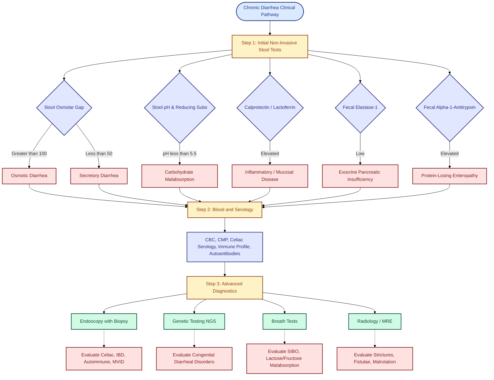

---
{"dg-publish":true,"uplink":"/gastrointestinal/gastroenterology/","uptext":"Back to Index (🍴 Gastroenterology)","permalink":"/gastrointestinal/chronic-diarrhea/","dgPassFrontmatter":true}
---

## Definitions And Terminology

- **Acute diarrhea:** Episode lasts <14 days.
- **Persistent diarrhea:** Presumed infectious etiology; starts acutely, persists ≥14 days.
- **Chronic diarrhea:** Insidious onset; duration >2 weeks in children. Defined quantitatively as stool volume >20 g/kg/day.

## Epidemiology And Global Burden

- Significant global health challenge; high mortality in developing nations.
- Accounts for high disability-adjusted life years (DALYs) lost.
- Persistent diarrhea causes up to 50% of diarrhea-related deaths.
- Malnutrition-diarrhea bidirectional cycle increases severity and duration.

## Pathophysiology And Mechanisms

### Osmotic Diarrhea

- Caused by unabsorbed, osmotically active solutes drawing water into intestinal lumen.
- Fermentation of unabsorbed carbohydrates by colonic microflora produces short-chain organic acids and gas.
- Diarrhea improves or ceases with fasting.
- Stool osmolality > measured electrolytes; ion gap >100 mOsm/kg.
- Stool pH acidic; reducing substances present.

### Secretory Diarrhea

- Active electrolyte and water secretion into intestinal lumen.
- Results from inhibition of neutral NaCl absorption or increased electrogenic chloride secretion.
- Persists during fasting state.
- High volume watery stools.
- Stool ion gap <50 mOsm/kg.

### Inflammatory And Mucosal Disease

- Enterocyte damage causes exudation of mucus, blood, protein.
- Decreased absorptive surface area secondary to villous atrophy.
- Increased intestinal permeability; protein-losing enteropathy.
- Fecal leukocytes, calprotectin, lactoferrin elevated.

### Motility Disorders

- Rapid transit decreases contact time for digestion/absorption.
- Delayed transit promotes small intestinal bacterial overgrowth (SIBO), causing bile salt deconjugation and fat malabsorption.

## Etiological Classification

### Age-Based Classification

| Age Group              | Watery Diarrhea Causes                                                                                                                                                                                                         | Bloody/Inflammatory Causes                                                                                                                              | Fatty Diarrhea Causes                                                               |
| :--------------------- | :----------------------------------------------------------------------------------------------------------------------------------------------------------------------------------------------------------------------------- | :------------------------------------------------------------------------------------------------------------------------------------------------------ | :---------------------------------------------------------------------------------- |
| **<6 Months**          | Cow milk protein allergy Lymphangiectasia Post-enteritis syndrome Immunodeficiency Microvillus inclusion disease Tufting enteropathy Glucose-galactose malabsorption Congenital sodium/chloride diarrhea. | Cow milk protein allergy CMV colitis Very early onset IBD Hirschsprung enterocolitis Necrotizing enterocolitis.                             | Cystic fibrosis Cholestasis.                                                     |
| **6 Months - 5 Years** | Toddler diarrhea [[Gastrointestinal/Celiac disease\|Celiac disease]] Post-enteritis syndrome Giardiasis Short bowel syndrome Bacterial overgrowth.                                                                                                      | Cow milk protein allergy CMV colitis Hirschsprung enterocolitis Pseudomembranous colitis, Ulcerative colitis Crohn disease Tuberculosis. | Cystic fibrosis, Chronic pancreatitis Cholestasis Shwachman-Diamond syndrome. |
| **>5 Years**           | [[Gastrointestinal/Celiac disease\|Celiac disease]] Giardiasis Lactose intolerance Irritable bowel syndrome (IBS) Short bowel syndrome Immunodeficiency Drugs.                                                                                    | Ulcerative colitis Crohn disease Tuberculosis Pseudomembranous colitis Radiation colitis.                                                   | Chronic pancreatitis Cystic fibrosis, Cholestasis.                               |

### Mechanistic Classification

|Mechanism|Representative Conditions|
|:--|:--|
|**Secretory**|Cholera, toxigenic _E. coli_, VIPoma, neuroblastoma, congenital chloride diarrhea, microvillus inclusion disease, tufting enteropathy.|
|**Osmotic**|Lactase deficiency, sucrase-isomaltase deficiency, glucose-galactose malabsorption, excessive fruit juice/sorbitol ingestion, laxative abuse.|
|**Mucosal Invasion/Inflammatory**|_Salmonella_, _Shigella_, _Campylobacter_, _Yersinia_, Amebiasis, Crohn disease, Ulcerative colitis, [[Gastrointestinal/Celiac disease\|Celiac disease]], Autoimmune enteropathy.|
|**Decreased Surface Area**|Short bowel syndrome, severe [[Gastrointestinal/Celiac disease\|celiac disease]], rotavirus enteritis.|
|**Motility Defects**|Hyperthyroidism, chronic intestinal pseudo-obstruction, Hirschsprung disease.|

## Diagnostic Evaluation

### History And Clinical Clues

- **Onset:** Neonatal onset suggests congenital diarrheal disorders (CDDs) or anatomic defects.
- **Dietary association:** Introduction of cow milk (allergy), wheat ([[Gastrointestinal/Celiac disease\|celiac disease]]), fruit juices/sucrose (carbohydrate malabsorption).
- **Stool characteristics:**
    - Watery, explosive, acidic: Carbohydrate malabsorption.
    - Bulky, foul-smelling, pale, greasy: Fat malabsorption/pancreatic insufficiency.
    - Blood/mucus: Colitis, IBD, [[Gastrointestinal/Dysentery\|dysentery]], cow milk protein allergy.
    - Undigested food particles: Toddler diarrhea.
- **Associated symptoms:**
    - Nighttime waking to defecate: Organic etiology (IBD).
    - Recurrent respiratory infections: Cystic fibrosis, immunodeficiency.
    - Polyhydramnios in pregnancy: Congenital chloride/sodium diarrhea, microvillus inclusion disease.
    - Fever, joint pain, rashes: IBD, autoimmune enteropathy.

### Physical Examination

- Anthropometry: Plot weight, length/height, head circumference. Determine degree of stunting/wasting.
- Hydration status: Assess mucous membranes, skin turgor, sunken eyes, capillary refill.
- Edema: Indicates protein-losing enteropathy (lymphangiectasia, severe mucosal disease).
- Abdomen: Distension (malabsorption, SIBO), hepatosplenomegaly, surgical scars.
- Perianal region: Excoriation (acidic stools), skin tags, fissures, fistulae (Crohn disease).
- Systemic signs: Clubbing (cystic fibrosis, celiac, IBD), dermatitis herpetiformis (celiac), alopecia (autoimmune).

### Stepwise Diagnostic Algorithm

#### Step 1: Initial Non-Invasive Testing

| Investigation                        | Rationale / Interpretation                                                                                               |
| :----------------------------------- | :----------------------------------------------------------------------------------------------------------------------- |
| **Stool pH & Reducing Substances**   | pH < 5.5 and positive reducing substances (>2+) indicate carbohydrate malabsorption.                                     |
| **Stool Osmolar Gap**                | Measured osmolality - 2x(Na + K). >100 mOsm/kg indicates osmotic diarrhea;  <50 mOsm/kg indicates secretory diarrhea. |
| **Stool Electrolytes**               | Cl > 90 mmol/L suggests congenital chloride diarrhea.  Na > 70 mmol/L suggests congenital sodium diarrhea.            |
| **Fecal Calprotectin / Lactoferrin** | Elevated levels indicate intestinal inflammation (IBD, severe enteropathy).                                              |
| **Fecal Elastase-1**                 | Low levels indicate exocrine pancreatic insufficiency (Cystic fibrosis, Shwachman-Diamond).                              |
| **Fecal Alpha-1-Antitrypsin**        | Elevated levels indicate protein-losing enteropathy.                                                                     |
| **Microbiology**                     | Culture, ova/parasites, _C. difficile_ toxin, viral NAAT.                                                                |

#### Step 2: Blood And Serological Investigations

- Complete blood count, ESR, C-reactive protein.
- Comprehensive metabolic panel (electrolytes, renal/liver function, albumin, calcium, phosphate).
- Celiac serology: Tissue transglutaminase (tTG) IgA, total serum IgA.
- Immune profile: Immunoglobulins (IgG, IgA, IgM), lymphocyte subsets, HIV serology.
- Autoantibodies: Anti-enterocyte, anti-goblet cell antibodies (Autoimmune enteropathy).

#### Step 3: Advanced Diagnostics (Imaging And Endoscopy)

- **Breath Tests:** Hydrogen breath test for lactose/fructose/sucrose malabsorption or SIBO.
- **Sweat Chloride Test:** Rule out cystic fibrosis.
- **Endoscopy with Biopsy:** Esophagogastroduodenoscopy and ileocolonoscopy. Essential for [[Gastrointestinal/Celiac disease\|celiac disease]], IBD, eosinophilic gastroenteritis, autoimmune enteropathy, microvillus inclusion disease.
    - Electron microscopy: Required for microvillus inclusion disease.
    - PAS staining: Highlights apical inclusions in microvillus inclusion disease.
- **Radiology:** Magnetic resonance enterography (MRE) or small bowel follow-through for evaluating strictures, fistulae, malrotation.
- **Genetic Testing:** Next-generation sequencing panels for congenital diarrheal disorders (e.g., _MYO5B_, _EPCAM_, _SLC26A3_).

## Specific Disease Entities

### Persistent Infectious Diarrhea

- Develops sequentially after acute infection.
- Associated with malnutrition, immune compromise, lack of exclusive breastfeeding.
- Common pathogens: Enteroaggregative _E. coli_ (EAEC), Enteropathogenic _E. coli_ (EPEC), _Cryptosporidium_, _Shigella_, _Campylobacter_, _Giardia lamblia_.
- Leads to patchy villous atrophy, poor intestinal repair, increased permeability.
- Judicious antibiotic use required based on specific pathogen identification.

### Congenital Diarrheal Disorders (CDDs)

#### Microvillus Inclusion Disease (MVID)

- Autosomal recessive defect in _MYO5B_ or _STX3_ genes altering apical membrane trafficking.
- Presents first days of life with massive, life-threatening secretory diarrhea (100-500 mL/kg/day).
- Histology: Diffuse villous atrophy, hypoplastic crypts, no inflammation.
- Hallmarks: Periodic acid-Schiff (PAS)-positive apical inclusions (light microscopy); internalized microvilli / secretory granules (electron microscopy).
- CD10 immunostaining shows cytoplasmic (not linear brush border) reactivity.
- Management: Total parenteral nutrition (TPN) dependent; potential intestinal transplant.

#### Tufting Enteropathy (Congenital Epithelial Dysplasia)

- Autosomal recessive defect in _EPCAM_ gene affecting epithelial cell adhesion.
- Presents first weeks of life with severe secretory diarrhea.
- Histology: Focal epithelial "tufts" (teardrop-shaped aggregations of enterocytes) at villus tips.
- Management: TPN dependent; intestinal transplantation.

#### Tricho-Hepato-Enteric Syndrome (Phenotypic Diarrhea)

- Autosomal recessive defects in _TTC37_ or _SKIV2L_.
- Triad: Intractable diarrhea, woolly/fragile hair (trichorrhexis nodosa), hepatic fibrosis/cirrhosis.
- Associated with facial dysmorphism, immune defects, intrauterine growth restriction.

#### Congenital Chloride Diarrhea

- Autosomal recessive defect in _SLC26A3_ (apical Cl-/HCO3- exchanger).
- Presents prenatally with polyhydramnios/dilated bowel loops.
- Secretory diarrhea, profound metabolic alkalosis, hypochloremia, hypokalemia.
- Fecal chloride >90 mmol/L.
- Management: Lifelong enteral substitution of KCl and NaCl.

### Autoimmune Enteropathy

- Unexplained, severe secretory diarrhea starting typically <6 months age.
- Pathogenesis: T-cell mediated destruction; circulating anti-enterocyte/anti-goblet cell autoantibodies.
- Histology: Villous blunting, deep crypt lymphocytosis, numerous apoptotic bodies, minimal surface intraepithelial lymphocytosis, absence of goblet/Paneth cells.
- IPEX Syndrome (Immune dysregulation, Polyendocrinopathy, Enteropathy, X-linked): _FOXP3_ gene mutation. Presents with enteropathy, type 1 diabetes, severe eczema.
- Management: Immunosuppression (corticosteroids, cyclosporine, tacrolimus, sirolimus, infliximab); TPN; hematopoietic stem cell transplant for monogenic forms (IPEX).

### [[Gastrointestinal/Celiac disease\|Celiac Disease]]

- Immune-mediated enteropathy triggered by gluten in genetically susceptible (HLA-DQ2/DQ8) individuals.
- Presentation: Chronic diarrhea, failure to thrive, abdominal distension, muscle wasting.
- Non-classical signs: Short stature, iron-deficiency anemia, delayed puberty, osteoporosis, elevated transaminases.
- Serology: Tissue transglutaminase (tTG) IgA, Endomysial antibody (EMA) IgA.
- Histology: Increased intraepithelial lymphocytes, crypt hyperplasia, villous atrophy (Marsh classification).
- Management: Strict lifelong gluten-free diet.

### Toddler Diarrhea (Functional Diarrhea)

- Onset between 6 and 60 months age.
- Painless passage of ≥4 large, unformed stools daily.
- Stools often contain undigested vegetables/food particles.
- No failure to thrive; child is well-nourished and active.
- No nighttime waking to defecate.
- Etiology: Rapid transit time, excessive fluid/fruit juice (fructose/sorbitol) intake, low fat/fiber diet.
- Management: Reassurance. "4 F" rule: Normal fluid, normal fat, adequate fiber, restrict excessive fruit juices.

### Carbohydrate Malabsorption

- Secondary lactase deficiency common post-gastroenteritis.
- Stools explosive, watery, highly acidic causing severe perianal excoriation.
- Diagnosed via acidic stool pH, positive reducing substances, hydrogen breath test.

### Cow Milk Protein Allergy (CMPA)

- Non-IgE mediated enteropathy; presents early infancy.
- Symptoms: Diarrhea, bloody stools, vomiting, failure to thrive.
- Management: Maternal dairy elimination (if breastfed) or extensively hydrolyzed/amino acid-based formula. Resolves by 2-3 years age.

## Management Protocol

### Acute Resuscitation And Stabilization

- Treat severe dehydration with intravenous fluids (Ringer's lactate or normal saline).
- Correct electrolyte imbalances (hypokalemia, hypomagnesemia, acidosis/alkalosis).
- Avoid total parenteral nutrition unless severe enteropathy precludes enteral absorption.

### Nutritional Rehabilitation

- Central pillar of persistent diarrhea management. Enteral feeding strictly preferred to restore mucosal architecture.
- Stepwise algorithmic dietary approach:
    - **Diet A (Reduced Lactose):** Yogurt/curd-based diets, rice, cereals. Suitable for mild/moderate cases.
    - **Diet B (Lactose-Free):** Extensively hydrolyzed protein formula. Used if Diet A fails (worsening diarrhea/dehydration).
    - **Diet C (Monosaccharide-Free / Amino Acid-Based):** Amino acid formula. Used if Diet B fails, indicating severe mucosal damage.
- Provide energy-dense diets aiming for >100 kcal/kg/day and protein 2-3 g/kg/day.
- Provide medium-chain triglycerides (MCTs) for fat malabsorption.

### Micronutrient Supplementation

- Malnutrition and mucosal damage lead to profound deficits.
- **Zinc:** Essential for mucosal repair, immune function. 5 mg/day for 14 days.
- **Vitamin A:** High dose recommended for mucosal integrity.
- **Iron:** Initiate only _after_ diarrhea resolves to prevent worsening oxidative stress and pathogen proliferation.
- **Additional:** Folic acid, copper, magnesium, multivitamin supplementation at twice Recommended Dietary Allowance (RDA) for 2-4 weeks.

### Pharmacotherapy And Advanced Interventions

- **Antibiotics:** Avoid empirical use. Indicated only for proven specific bacterial infections (e.g., _Shigella_, _Campylobacter_, cholera), _C. difficile_, parasitic infections (_Giardia_, _Entamoeba_), or severe sepsis/malnutrition.
- **Anti-motility agents:** (Loperamide, diphenoxylate) Strictly contraindicated in children; risk of ileus, toxic megacolon, and prolonged pathogen shedding.
- **Probiotics:** _Lactobacillus rhamnosus_ GG or _Saccharomyces boulardii_ may shorten duration of viral/post-infectious diarrhea, though evidence in chronic severe diarrhea is limited.
- **Pancreatic Enzyme Replacement Therapy (PERT):** For cystic fibrosis, Shwachman-Diamond syndrome.
- **Immunosuppression:** Systemic corticosteroids, calcineurin inhibitors (cyclosporine, tacrolimus), biologic agents (infliximab, vedolizumab) strictly for autoimmune enteropathy and IBD.
- **Surgery/Transplantation:** Total parenteral nutrition and eventual intestinal transplantation reserved for irreversible congenital diarrheal disorders (MVID, Tufting enteropathy).