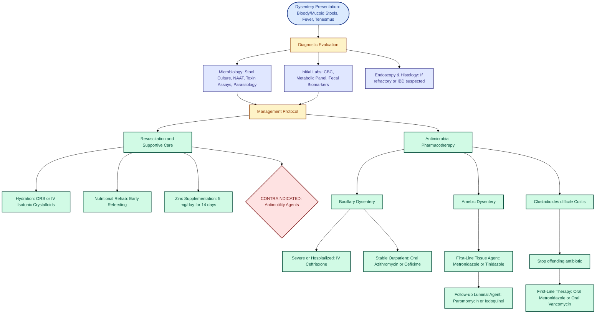

---
{"dg-publish":true,"uplink":"/gastrointestinal/gastroenterology/","uptext":"Back to Index (🍴 Gastroenterology)","permalink":"/gastrointestinal/dysentery/","dgPassFrontmatter":true}
---

## Definition And Classification

### Core Definition

- Presence of grossly visible blood in stools.
- Consequence of colonic mucosal infection by bacterial or amebic pathogens.
- Differentiated from acute watery diarrhea; denotes inflammatory enterocolitis.
- Frequent, small-volume mucoid stools.
- Accompanied by fever, abdominal pain, tenesmus (ineffectual defecation, straining, suprapubic discomfort).
- Clinically distinct from non-inflammatory bloody diarrhea (larger volume, minimal systemic toxicity).

### Primary Categories

- **Bacillary [[Gastrointestinal/Dysentery\|Dysentery]]:** Bacterial etiology; significantly more common in pediatric populations.
- **Amebic [[Gastrointestinal/Dysentery\|Dysentery]]:** Parasitic etiology; insidious onset; less frequent in children.

## Etiology And Pathogens

|Pathogen Category|Specific Organisms|Clinical Signatures|
|:--|:--|:--|
|**Bacterial (Bacillary)**|_Shigella_ species (_S. dysenteriae, S. flexneri, S. boydii, S. sonnei_)|Most common cause globally. _S. flexneri_ dominates developing nations; _S. dysenteriae_ causes severe epidemics.|
||Enteroinvasive _Escherichia coli_ (EIEC)|Genetically/clinically resembles _Shigella_; watery diarrhea progressing to [[Gastrointestinal/Dysentery\|dysentery]].|
||Enterohemorrhagic _E. coli_ (EHEC)|Causes hemorrhagic colitis; massive bloody stools; high risk of [[Nephrology/Hemolytic uremic syndrome (HUS)\|hemolytic uremic syndrome (HUS)]].|
||_Salmonella_ (Nontyphoidal)|Fever, cramps, vomiting; prolonged shedding; risk of bacteremia in infants/immunocompromised.|
||_Campylobacter jejuni_|High fever, severe abdominal pain mimicking appendicitis; aphthoid ulcers on endoscopy.|
||_Yersinia enterocolitica_|Prolonged symptoms; pseudoappendicitis (right lower quadrant pain); exudative pharyngitis.|
||_Clostridioides difficile_|Post-antibiotic onset; pseudomembranous colitis.|
|**Parasitic (Amebic)**|_Entamoeba histolytica_|Insidious onset; causes deep flask-shaped mucosal ulcers; potential extraintestinal dissemination ([[Gastrointestinal/Liver Abscess\|liver abscess]]).|
|**Viral**|Adenovirus (types 11 & 21)|Rare cause of [[Gastrointestinal/Dysentery\|dysentery]]; typically seen in immunocompromised hosts.|

## Pathophysiology

### Mechanisms Of Mucosal Invasion

- Pathogens traverse intestinal epithelial barrier.
- _Shigella_ pathogenesis: Invades M cells, utilizes cell-cell and basolateral invasion.
- Induces macrophage apoptosis, releasing interleukin-1β (IL-1β) and IL-8.
- Triggers massive polymorphonuclear leukocyte (neutrophil) transmigration.
- Disrupts tight junction proteins (claudin-1, ZO-1); dephosphorylates occludin.
- Epithelial barrier destruction creates microabscesses and frank mucosal ulcerations.

### Toxin-Mediated Damage

- Enterotoxins induce secretory fluid loss early in disease course (watery diarrhea phase).
- Shiga toxin (_S. dysenteriae_ type 1, EHEC): Inhibits cellular protein synthesis.
- Triggers endothelial damage, precipitating microangiopathic hemolytic anemia, thrombocytopenia, and [[Nephrology/Acute Kidney Injury\|acute kidney injury]] (HUS).

## Clinical Features

### Acute Disease Progression

- Incubation period: Typically 1-5 days.
- Prodrome: High fever, malaise, anorexia, occasional vomiting.
- Initial phase: Watery, large-volume diarrhea.
- Dysenteric phase: Transition to frequent, small-volume stools mixed with overt blood and mucus.
- Abdominal examination: Diffuse tenderness, hyperactive or hypoactive bowel sounds.

### Pathogen-Specific Manifestations

- **Shigellosis:** High fever >40°C, severe tenesmus, potential neurological manifestations (seizures).
- **Amebiasis:** Gradual, insidious onset; less prominent fever; right upper quadrant pain if [[Gastrointestinal/Liver Abscess\|liver abscess]] present.

## Differential Diagnosis

|Disease Category|Key Differentiating Features|
|:--|:--|
|**Intussusception**|Episodic severe colicky pain; red currant-jelly stools (blood and mucoid exudate); palpable right upper quadrant mass; target sign on ultrasound.|
|**Cow Milk Protein Allergy**|Occurs in infants; bloody loose stools; eczema; anemia; resolves with maternal dietary restriction or hypoallergenic formula.|
|**Inflammatory Bowel Disease (IBD)**|Chronic course (>2-4 weeks); weight loss; extraintestinal manifestations (aphthous ulcers, joint pains, [[Misc/Erythema Nodosum\|erythema nodosum]], iritis); family history.|
|**Necrotizing Enterocolitis**|Premature neonates; abdominal distension; feed intolerance; systemic hemodynamic instability; pneumatosis intestinalis on radiography.|
|**Pseudomembranous Colitis**|Recent broad-spectrum antibiotic exposure; _C. difficile_ toxins A/B positive.|
|**Vasculitides**|Henoch-Schönlein purpura (palpable purpura, arthritis, hematuria); Hemolytic Uremic Syndrome (pallor, oliguria, petechiae).|
|**Anal Fissure**|Painful defecation; hard stools; blood streaking on stool exterior; visible mucosal tear.|

## Complications

### Intestinal Complications

- **Toxic Megacolon:** Colonic dilation >6 cm; risk of imminent rupture; associated with _Shigella_, _C. difficile_, EHEC, _E. histolytica_.
- **Intestinal Perforation:** High mortality; free air under diaphragm on upright radiograph.
- **Rectal Prolapse:** Secondary to severe tenesmus and perineal muscle fatigue.
- **Amebic Specific:** Amebic appendicitis, colonic strictures, amebomas (granulomatous masses).

### Extraintestinal Complications

- **Renal:** Hemolytic uremic syndrome (_S. dysenteriae_ type 1, STEC).
- **Neurological:** Seizures, encephalopathy (_Shigella_, STEC).
- **Rheumatologic:** Reactive arthritis, [[Misc/Erythema Nodosum\|erythema nodosum]] (_Shigella_, NTS, _Campylobacter_, _Yersinia_).
- **Neuromuscular:** [[Neuromuscular/Guillain-Barré Syndrome\|Guillain-Barré syndrome]] (_Campylobacter jejuni_).
- **Hepatic:** Amebic [[Gastrointestinal/Liver Abscess\|liver abscess]] (_E. histolytica_).

## Diagnostic Evaluation

### Laboratory Investigations

- **Complete Blood Count (CBC):** Assess for leukocytosis, bandemia (leukemoid reaction in _Shigella_); evaluate smear for schistocytes (HUS screen).
- **Metabolic Panel:** Assess baseline renal function (BUN, Creatinine) and profound dyselectrolytemia (hypokalemia, metabolic acidosis).
- **Fecal Biomarkers:** Elevated fecal calprotectin or lactoferrin denotes mucosal inflammation.
- **Stool Microscopy:** Numerous polymorphonuclear leukocytes indicate invasive bacterial colitis. Pyknotic or absent leukocytes suggest amebic [[Gastrointestinal/Dysentery\|dysentery]] (amebae destroy neutrophils).

### Microbiological Assays

- **Stool Culture:** Isolate _Salmonella_, _Shigella_, _Campylobacter_ (requires microaerobic conditions, 42°C), _Yersinia_.
- **Toxin Assays:** _C. difficile_ toxin A/B EIA, Glutamate Dehydrogenase (GDH) antigen test, [[Genetics/NAAT\|NAAT]].
- **Molecular Panels:** Multiplex PCR / Nucleic Acid Amplification Tests ([[Genetics/NAAT\|NAAT]]) highly sensitive for rapid pathogen identification.
- **Parasitology:** Enzyme immunoassay (EIA) or PCR for _E. histolytica_; direct microscopy for trophozoites/cysts (requires minimum 3 separate samples).

### Endoscopy And Histology (If Refractory or IBD Suspected)

- **Campylobacter:** Friable mucosa, aphthoid ulcers, crypt abscesses, neutrophilic infiltrate.
- **Shigella:** Patchy mucosal edema, loss of vascular pattern, pseudomembranes, crypt depletion.
- **E. histolytica:** Deep, flask-shaped ulcer craters covered with purulent necrotic material.

## Management Protocol

### Resuscitation And Supportive Care

- **Hydration:** Primary intervention. Utilize low-osmolarity [[Gastrointestinal/Oral Rehydration Solution\|Oral Rehydration Solution]] (ORS) for mild-moderate dehydration.
- **Intravenous Therapy:** Isotonic crystalloid fluid resuscitation (20 mL/kg bolus) mandated for shock, severe dehydration, or intractable vomiting.
- **Nutritional Rehabilitation:** Continue breastfeeding; institute early refeeding with age-appropriate unrestricted diet to repair mucosa.
- **Zinc Supplementation:** Administer 5 mg/day elemental zinc for 14 days #recent. Reduces severity, duration, and prevents recurrence.
- **Contraindications:** Strictly avoid antimotility agents (loperamide, diphenoxylate). Prolong pathogen clearance, exacerbate tissue invasion, precipitate toxic megacolon/ileus.

### Antimicrobial Pharmacotherapy

#### Bacillary [[Gastrointestinal/Dysentery\|Dysentery]] (Empiric and Directed)

- Do not delay therapy for culture results in toxic patients.
- **Severe/Hospitalized Cases:** Intravenous Ceftriaxone (50-100 mg/kg/day for 3-5 days) represents first-line empiric therapy.
- **Stable/Outpatient Cases:** Oral Azithromycin (10-12 mg/kg/day on day 1, followed by 5-6 mg/kg/day for 4 days) or Oral Cefixime.
- **Fluoroquinolones:** Ciprofloxacin (15 mg/kg/dose BID for 3 days) highly effective but restricted use in pediatrics unless alternative unavailable or pathogen sensitivity confirmed.
- **Refractory Shigellosis:** Adjust therapy based strictly on local resistance patterns and culture sensitivities.

#### Amebic [[Gastrointestinal/Dysentery\|Dysentery]]

- **First-Line Tissue Agent:** Metronidazole (15 mg/kg/day divided TID for 5-7 days) or Tinidazole (50 mg/kg single dose, max 2 g, for 3 days).
- **Follow-up Luminal Agent:** Mandatory eradication of colonized cysts post-metronidazole therapy to prevent relapse. Utilize Paromomycin (25-35 mg/kg/day divided TID for 7 days) or Iodoquinol.

#### Clostridioides difficile Colitis

- Immediate cessation of offending antibiotic.
- **First-Line Therapy:** Oral Metronidazole (30 mg/kg/day divided QID) or Oral Vancomycin (40 mg/kg/day divided QID for 10-14 days). Oral Vancomycin preferred for severe/fulminant disease.
- **Recurrent/Refractory:** Pulsed-tapered Oral Vancomycin, Fidaxomicin, or Fecal Microbiota Transplantation (FMT).