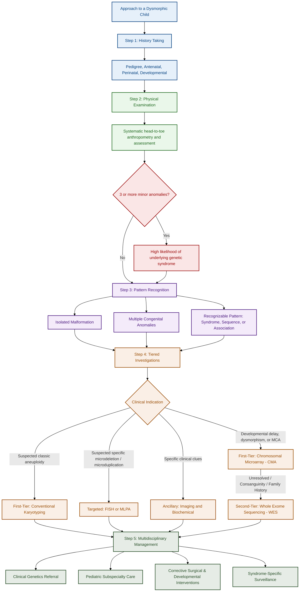

---
{"dg-publish":true,"uptext":"Back to Index (🧬 Genetics)","uplink":"/genetics/genetics/","permalink":"/genetics/approach-to-a-dysmorphic-child/","dgPassFrontmatter":true}
---

## Algorithm

## Definition And Objectives

- A dysmorphic child exhibits one or more congenital anomalies or unusual physical features that fall outside the normal phenotypic spectrum for age, sex, and ethnicity.
- These features may occur as isolated defects, multiple congenital anomalies (MCA), or as part of a recognizable pattern such as a syndrome, sequence, association, or field defect.
- The primary objectives of systematic evaluation include establishing a precise diagnosis, detecting life-threatening or correctable anomalies early, providing accurate genetic counseling, and guiding multidisciplinary management and long-term surveillance.

## Step 1: History Taking

- **Pedigree:** Construct a three-generation pedigree emphasizing consanguinity, recurrent miscarriages, neonatal deaths, intellectual disability, or known genetic disorders in relatives.
- **Antenatal History:** Document maternal age, parity, teratogen exposure (alcohol, anticonvulsants, isotretinoin, [[Infectious Diseases/TORCH Infections\|TORCH infections]]), maternal diabetes, and prenatal ultrasound anomalies (intrauterine growth restriction, oligohydramnios, structural defects).
- **Perinatal History:** Note gestational age, birth weight, Apgar scores, NICU admission, feeding difficulties, and neonatal seizures.
- **Developmental And Systemic History:** Assess age at attainment of milestones, developmental regression, behavioral issues, recurrent infections, and cardiac or skeletal symptoms.

## Step 2: Physical Examination

A systematic head-to-toe assessment is essential to document all findings with precise terminology.

|Examination Area|Key Features To Assess|
|:--|:--|
|**Anthropometry**|Serial plotting of weight, length, and head circumference; classify proportionate versus disproportionate growth, [[Neurology/Microcephaly\|microcephaly]], or macrocephaly.|
|**Craniofacial**|Head shape, fontanelle status, eye spacing (hypertelorism/hypotelorism), palpebral fissure slant, epicanthal folds, ear position/shape, cleft lip/palate, and micrognathia.|
|**Neck And Trunk**|Short/webbed neck, pectus excavatum/carinatum, scoliosis, heart murmurs, abdominal organomegaly, and ambiguous genitalia.|
|**Limbs And Extremities**|Digit number and arrangement (polydactyly, syndactyly, clinodactyly), single palmar crease, limb reduction defects, and joint contractures.|
|**Skin And Neurological**|Pigmentary changes (cafe-au-lait macules), muscle tone (hypotonia/hypertonia), deep tendon reflexes, and [[Neurology/Primitive Reflexes\|primitive reflexes]].|

- The presence of three or more minor anomalies significantly increases the likelihood of an underlying genetic syndrome.

## Step 3: Pattern Recognition And Classification

- Categorize the findings as an isolated malformation, multiple congenital anomalies, or a recognizable pattern.
- Differentiate between a sequence (a cascade of defects arising from a single primary anomaly, such as Pierre-Robin sequence), an association (non-random co-occurrence of anomalies without a single known etiology, such as VACTERL), and a syndrome (multiple anomalies related by a single genetic or chromosomal etiology, such as Down syndrome or Trisomy 18).

## Step 4: Tiered Investigations

Adopt a hypothesis-driven approach, prioritizing least invasive and highest-yield testing.

|Testing Tier|Investigation Modality|Clinical Indication|
|:--|:--|:--|
|**First-Tier Genetic**|Chromosomal Microarray (CMA)|First-line for developmental delay, intellectual disability, dysmorphism, or multiple congenital anomalies; detects copy number variants.|
|**First-Tier Genetic**|Conventional [[Genetics/Karyotyping\|Karyotyping]]|Suspected classic aneuploidy (e.g., Trisomy 21) or to detect balanced rearrangements.|
|**Targeted Testing**|FISH or MLPA|Suspected specific microdeletion or microduplication (e.g., 22q11.2 deletion syndrome, [[Genetics/Williams Syndrome\|Williams syndrome]]).|
|**Second-Tier Genetic**|Whole [[Genetics/Sanger Sequencing\|Exome Sequencing]] (WES)|Unresolved cases, consanguinity, or strong family history following a negative CMA; utilizes a trio approach (proband plus parents).|
|**Ancillary**|Imaging and Biochemical|Echocardiography for murmurs, renal ultrasound, skeletal survey, brain MRI, and metabolic screening (e.g., urine glycosaminoglycans) based on specific clinical clues.|

## Step 5: Multidisciplinary Management Planning

- **Referral:** Facilitate early referral to a clinical geneticist for variant interpretation, syndrome confirmation, and recurrence risk counseling.
- **Subspecialty Care:** Involve pediatric subspecialists such as cardiologists, neurologists, nephrologists, and orthopedists for comorbidity management.
- **Interventions:** Plan corrective surgical interventions for clefts, cardiac defects, or limb anomalies, and initiate early developmental therapies (physiotherapy, speech therapy).
- **Surveillance:** Implement syndrome-specific surveillance protocols (e.g., tumor screening in Beckwith-Wiedemann syndrome, thyroid function monitoring in Down syndrome).