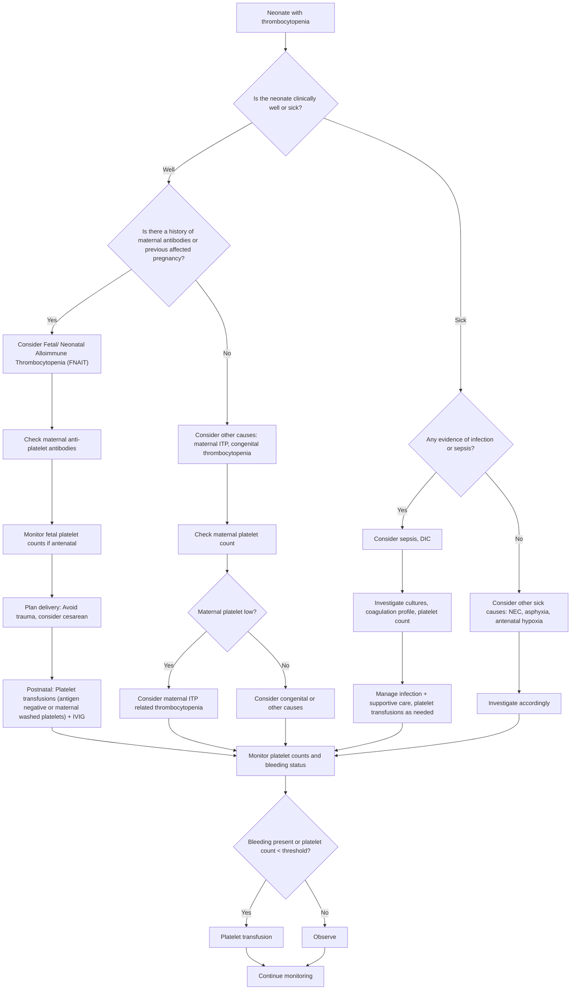

---
{"dg-publish":true,"permalink":"/hematology/platelet-disorders/","noteIcon":""}
---

 1.  
2. Write differential diagnosis of a 5-year-old child with petechial rash with fever. How will you manage a child with idiopathic thrombocytopenic purpura (DNB 2004/2)4+6
3. 
4. Various treatment modalities in acute ITP (DNB 2006/1)10
5. Write in brief regarding the etiology and management of idiopathic thrombocytopenic purpura (ITP) (DNB 2011/1)4+6
6. Discuss the treatment options for acute ITP in a 14-year-old girl child (DNB 2013/1)10
7. An 8-year-old girl has presented with epistaxis, bleeding gum and ecchymotic patches over trunk. Her platelet count is 20,000/cubic mm. Discuss the differential diagnosis with specific clinical investigative pointers. Plan the diagnostic work up for this child (DNB 2013/2)3+3+2+2
8. Management of ITP (DNB 2017/1)5
9. Management of ITP in children (DCH 2024/1)5
10. Management of chronic ITP (DNB 2018/2)
11. Management of 1st episode of ITP (DNB 2019/2)5
12. 
13. Immune Thrombocytopenic Purpura – Management Guidelines (DNB 2021/2)5
14. Outline the management of recurrent ITP in a six year old child (DNB 2024/2)5

> [!example] PYQ
> 1. Discuss etiopathogenesis, diagnosis and management of a Bleeding Neonate (DNB 2006/2)10 

## Etiology 
### Disorders of primary hemostasis
- Thrombocytopenia
	- Neonatal alloimmune thrombocytopenia
	- bacterial and fungal sepsis 
	- viruses like CMV and rubella
	- Thrombosis
	- large hemangiomas - Kasabach-Merritt syndrome
- Platelet function disorder
	- Glanzmann's thrombasthenia 
	- Bernard-Soulier syndrome
### Disorders of secondary hemostasis
- Vitamin K deficiency
	- Early (0-24 hrs)
	- Classic (2-7 days)
	- Late ( 2 wks to 6 months)
- Liver diseases
	- gestational alloimmune liver disease
- DIC
- NEC
- Hemophilia
- Von Willebrand factor
## Diagnosis 
| Investigation          | Finding                                                                                                                           |
| ---------------------- | --------------------------------------------------------------------------------------------------------------------------------- |
| History                | history of ITP, any medication use in pregnancy                                                                                   |
| physical               | to classify neonate as well or sick. well neonates usually have defect of primary hemostasis or vit k def. sick neonates have DIC |
| CBC                    | thrombocytopenia                                                                                                                  |
| PS                     | red cell morphology                                                                                                               |
| PT/INR, aPTT           | prolonged in vit K def                                                                                                            |
| mixing study           | to identify presence of inhibitor                                                                                                 |
| Fibrinogen and D dimer | low in DIC                                                                                                                        |
| DCT                    | positive in autoimmune hemolysis                                                                                                  |
| Apt test               | to differentiate between maternal and fetal blood                                                                                 |
| factor assays          | low in hemophilias                                                                                                                |
| USG cranium            | intracranial bleeding                                                                                                             |
| PIVKA                  | more sensitive marker of vitamin K def                                                                                            |
## Treatment
- Stabilization - ABC
- Vitamin K infusion 1 mg/kg IV
- Platelet transfusion (PlaNeT 2 Trail - conservative platelet transfusion till less than 25 x 109) - washed maternal platelets are preferred in NAIT
- FFP transfusion - replenish most coagulation factors
- IVIG - for NAIT if plt < 30 x 109 and bleeding
- Factor concentrates for hemophilia
- cryoprecipitate for DIC

> [!success] PYQ
> 1. Management of Neonatal Thrombocytopenic Purpura (DNB 2000/1)15
> 2. Discuss the approach to neonate with thrombocytopenia with specific reference to causes and investigations (DNB 2019/2)6
> 3. Neonatal thrombocytopenia (DNB 2023/2)5
> 4. Neonatal alloimmune thrombocytopenia (NAIT) (DNB 2024/2)5
## Approach to neonate with thrombocytopenia
<!-- htmlmin:ignore -->

<!-- /htmlmin:ignore -->
## NAIT
