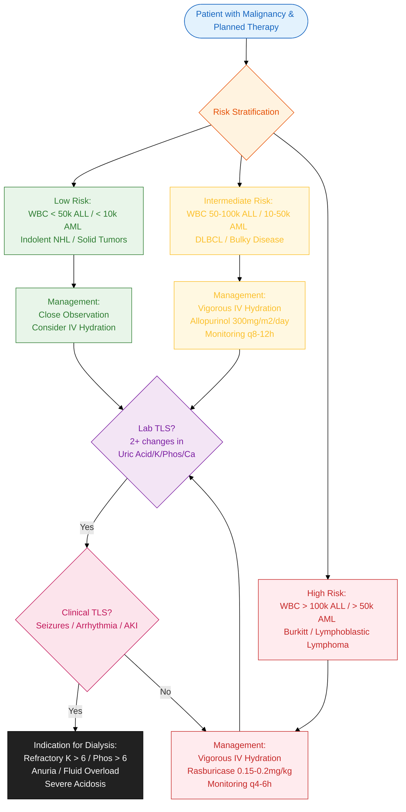

---
{"dg-publish":true,"uptext":"Back to Index(🩸 Hematology and Oncology)","uplink":"/hematology/hematology/","permalink":"/hematology/tumor-lysis-syndrome/","dgPassFrontmatter":true}
---

## Algorithm

## Introduction And Pathophysiology

- Life-threatening oncologic emergency.
- Arises due to rapid release of intracellular metabolites from dying tumor cells.
- Metabolite release exceeds excretory capacity of kidneys.
- Occurs typically within 12-48 hours of initiating chemotherapy.
- Occurs prior to therapy in patients with massive tumor burden or rapid cell proliferation.
- Infrequently reported in Hodgkin lymphoma, neuroblastoma, and hepatoblastoma.
- Complications include renal insufficiency, cardiac arrhythmias, seizures, disseminated intravascular coagulation, and death.

### Mechanisms Of Renal Dysfunction

Multiple mechanisms contribute to acute kidney injury during tumor lysis syndrome (TLS):

- Precipitation of uric acid crystals within renal tubules.
- Precipitation of xanthine crystals. Occurs when urine pH exceeds 7.5 and following initiation of allopurinol.
- Precipitation of calcium phosphate within renal microvasculature and tubular system. Occurs when product of serum calcium and phosphate exceeds 60.
- Massive cytokine release causing systemic inflammation and hypotension.

## Diagnostic Criteria

Diagnosis encompasses both laboratory derangements and clinical manifestations.

### Laboratory Tumor Lysis Syndrome

Defined as $\ge$ 25% increase from baseline (or absolute value exceeding cut-offs) in $\ge$ 2 of the following serum biochemical parameters:

- **Uric Acid:** >8 mg/dL.
- **Potassium:** >6 mEq/L.
- **Phosphorus:** >6.5 mg/dL.
- **Corrected Serum Calcium:** <7 mg/dL.

### Clinical Tumor Lysis Syndrome

Defined as the presence of laboratory TLS accompanied by specific clinical manifestations:

- Seizures.
- Cardiac arrhythmias.
- Acute kidney injury.

## Risk Stratification By Malignancy Type

|Stratification Criteria|Acute Lymphoblastic Leukemia|Acute Myeloid Leukemia|Non-Hodgkin Lymphoma|Solid Tumors|
|:--|:--|:--|:--|:--|
|**Low Risk**|White blood cell count <50,000/mm³|White blood cell count <10,000/mm³|Indolent NHL|All patients|
|**Intermediate Risk**|White blood cell count 50,000-100,000/mm³|White blood cell count 10,000-50,000/mm³|Diffuse large B-cell lymphoma|Tumors exhibiting rapid proliferation or expected rapid response to therapy|
|**High Risk**|White blood cell count >100,000/mm³|White blood cell count >50,000/mm³|Burkitt lymphoma, Lymphoblastic lymphoma|Not applicable|

## Risk-Based Management Algorithm

|Risk Category|Clinical Indicators|Recommended Management Approach|
|:--|:--|:--|
|**Low Risk**|Uric acid <7.5 mg/dL. Indolent NHL.|Close observation. Consider intravenous hydration.|
|**Intermediate Risk**|Uric acid <8 mg/dL. Elevated lactate dehydrogenase. DLBCL. Bulky disease >10 cm. Rapid proliferation tumors.|Frequent monitoring. Vigorous intravenous hydration. Initiate allopurinol. Initiate rasburicase if hyperuricemia develops.|
|**High Risk**|Uric acid >8 mg/dL. Burkitt lymphoma (Stage III/IV). Lymphoblastic lymphoma (Stage III/IV). Preexisting renal failure.|Frequent monitoring. Vigorous intravenous hydration. Initiate rasburicase immediately. Repeat rasburicase doses based on uric acid levels.|

## Principles Of Prevention And Monitoring

### Clinical And Laboratory Surveillance

- Implement strict measurement of fluid intake and urine output.
- Monitor serum electrolytes, calcium, phosphorus, potassium, uric acid, blood urea nitrogen, and creatinine every 4-12 hours.
- Evaluate complete blood counts 1-2 times daily.
- Institute continuous respiratory, central nervous system, and cardiac telemetry monitoring if hyperkalemia or hypocalcemia develops.
- Obtain baseline laboratory values prior to therapy initiation.

### Promotion Of Renal Excretion

- Target urine output >100 mL/m²/hour.
- Target urine specific gravity <1.010.
- Administer intravenous hydration at minimum two times maintenance rate.
- Utilize diuretics to augment output only if patient lacks hypotension or hypovolemia.
- **First-line diuretic:** Furosemide 0.5-1 mg/kg per dose.
- **Second-line diuretic:** Mannitol 0.5 g/kg per dose.

## Management Of Specific Metabolic Derangements

### Hyperuricemia

- **Pathophysiology:** Breakdown of malignant cell nucleic acids. Can cause uric acid nephropathy.
- **Allopurinol:** Xanthine oxidase inhibitor. 
	- Prevents further accumulation of uric acid. 
	- Dose: 300 mg/m²/day or 10 mg/kg/day orally (maximum 800 mg/day). 
	- Intravenous alternative: 200 mg/m²/day (maximum 600 mg/day).
- **Rasburicase:** Recombinant urate oxidase enzyme. 
	- Actively degrades existing uric acid. 
	- Dose: 0.15-0.2 mg/kg/day intravenously. 
	- May repeat dose. 
	- Indicated for high-risk patients or established hyperuricemia.
	- **Contraindications:** 
		- Assess glucose-6-phosphate dehydrogenase (G6PD) status prior to rasburicase administration. 
		- Rasburicase causes severe methemoglobinemia or profound hemolytic anemia in G6PD-deficient patients.
- **Urinary Alkalization:** Target urine pH 7.0-7.5 to prevent uric acid crystallization. Must discontinue alkalization immediately upon chemotherapy initiation or rasburicase administration. Elevated pH actively promotes dangerous xanthine and calcium phosphate crystal precipitation.

### Hyperkalemia

- **Pathophysiology:** Massive release of intracellular potassium. Causes arrhythmias and cardiac arrest.
- **Precaution:** Exclude pseudohyperkalemia caused by leukemic cell lysis inside the laboratory collection tube. Avoid any potassium in intravenous fluids unless dangerously low.
- **Mild/Asymptomatic:** Manage via vigorous hydration and loop diuretics.
- **Pharmacologic Clearance:** Sodium polystyrene sulfonate (Kayexalate) 1 g/kg every 6 hours combined with sorbitol 50-150 mL. Removes 1 mEq potassium per liter per gram of resin over 24 hours.
- **Acute Shift/Stabilization:** Sodium bicarbonate, calcium gluconate, glucose, and insulin.

### Hyperphosphatemia And Hypocalcemia

- **Pathophysiology:** Intracellular phosphate release causes hyperphosphatemia. Subsequent precipitation with calcium leads to metastatic calcification, hypocalcemic tetany, photophobia, and pruritus.
- **Phosphate Management:** Aggressive hydration and forced diuresis. Stop urinary alkalinization. Administer oral aluminum hydroxide (150 mg/kg/day) or sevelamer to bind intestinal phosphate. Implement low-phosphate diet.
- **Calcium Management:** Treat strictly for symptomatic hypocalcemia (e.g., tetany). Administration of calcium in asymptomatic patients exacerbates calcium phosphate precipitation.
- **Calcium Dosing:** 10 mg/kg of elemental calcium (0.5-1.0 mL/kg of 10% calcium gluconate). Discontinue immediately upon symptom resolution.
- **Contraindication:** Never administer calcium in the same intravenous line as sodium bicarbonate.

## Indications For Renal Replacement Therapy (Dialysis)

Hemodialysis or hemofiltration represents the definitive intervention for refractory TLS complications. Specific indications include:

- Progressive renal failure accompanied by hyperkalemia, hyperphosphatemia, oliguria, anuria, or volume overload unresponsive to diuretic measures.
- Presence of severe hyperphosphatemia (>6 mg/dL) combined with hypercalcemia (promotes irreversible deposition in renal interstitium and tubular system).
- Estimated glomerular filtration rate falls below 50%.
- Persistent hyperkalemia featuring QRS interval widening on electrocardiogram and/or serum potassium level >6 mEq/L.
- Severe, intractable metabolic acidosis.
- Volume overload absolutely unresponsive to aggressive diuretic therapy.
- Anuria accompanied by overt uremic symptoms (e.g., encephalopathy).
- Severe symptomatic hypocalcemia unresponsive to initial calcium replacement.
- Refractory hypertension (blood pressure >150/90 mmHg) with inadequate urine output persisting 10 hours after treatment initiation.
- Development of congestive heart failure secondary to fluid and metabolic derangements.