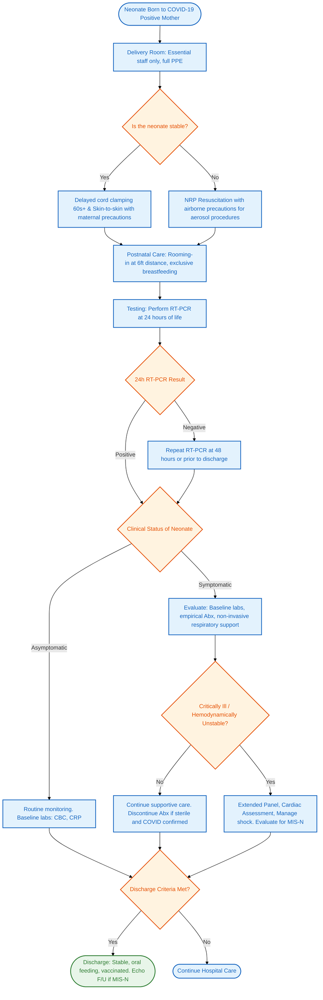

---
{"dg-publish":true,"uplink":"/infectious-diseases/infectious-diseases/","uptext":"Back to Index (Infectious Diseases)","permalink":"/infectious-diseases/approach-to-a-neonate-born-to-a-covid-19-positive-mother/","dgPassFrontmatter":true}
---

## Algorithm

## Introduction And Core Principles

- Management strictly requires balancing infection prevention against the promotion of physiological bonding and exclusive breastfeeding.
- Vertical transmission risk remains low, approximating 3% to 8%.
- Evidence firmly establishes that the benefits of rooming-in and breastfeeding vastly outweigh the risks of horizontal viral transmission when appropriate precautions are rigorously implemented.

## Delivery Room Management Algorithm

| Clinical Action            | Specific Guidelines                                                                                                                                                                                                                        |
| -------------------------- | ------------------------------------------------------------------------------------------------------------------------------------------------------------------------------------------------------------------------------------------ |
| **Staff Preparation**      | Minimize attending personnel to essential staff only; strictly mandate full Personal Protective Equipment including N95 masks, face shields, gowns, and gloves.                                                                            |
| **Cord Clamping**          | Perform Delayed Cord Clamping for at least 60 seconds in vigorous term and preterm infants, provided maternal stability allows.                                                                                                            |
| **Skin-To-Skin Contact**   | Encourage immediate contact for stable neonates to promote thermoregulation and bonding; mandate maternal medical mask usage and rigorous hand hygiene prior to holding the infant.                                                        |
| **Neonatal Resuscitation** | Strictly follow standard Neonatal Resuscitation Program guidelines. Perform aerosol-generating procedures, such as suctioning or intubation, utilizing strict airborne precautions, ideally maintaining a 6-foot distance from the mother. |

## Postnatal Care And Isolation Protocols

- Routine separation of mother and neonate is actively discouraged by global and national guidelines.
- Maintain rooming-in to facilitate breastfeeding, keeping the neonatal cot at least 2 meters (6 feet) from the maternal head when not actively feeding, utilizing physical barriers if space is restricted.
- Exclusive breastfeeding remains strongly recommended because the SARS-CoV-2 virus is not conclusively viable in breast milk.
- Mothers must practice rigorous respiratory hygiene, wearing a triple-layer mask, and wash hands with soap and water for at least 20 seconds before and after neonatal contact.
- Provide a healthy, vaccinated, COVID-negative caregiver or utilize expressed breast milk if the mother is too ill to provide direct care.

## Neonatal Testing Strategy

|Testing Parameter|Protocol Details|
|---|---|
|**Timing And Method**|Perform nucleic acid amplification testing via RT-PCR at 24 hours of life. Repeat testing at 48 hours or prior to discharge if the initial test is negative.|
|**Sample Collection**|Utilize nasopharyngeal or oropharyngeal swabs.|
|**Positive <24 Hours**|Strongly suggests intrauterine or intrapartum viral transmission.|
|**Positive >48 Hours**|Strongly suggests horizontal postnatal transmission from the mother or the environment.|

## Clinical Evaluation And Monitoring

### Clinical Manifestations

- The vast majority exceeding 90% of exposed neonates remain completely asymptomatic.
- Symptomatic neonates frequently mimic bacterial sepsis or respiratory distress syndrome.
- Respiratory signs encompass tachypnea, grunting, nasal flaring, and oxygen desaturations.
- Systemic and neurological signs include temperature instability, lethargy, hypotonia, and rare seizures.
- Gastrointestinal signs feature feeding intolerance, vomiting, and diarrhea.

### Laboratory Evaluation Algorithm

| Evaluation Tier        | Recommended Investigations                                                                                                                                        |
| ---------------------- | ----------------------------------------------------------------------------------------------------------------------------------------------------------------- |
| **Baseline Screening** | • Complete blood count to identify lymphopenia or leukocytosis;  • C-reactive protein evaluation.                                                              |
| **Extended Panel**     | For critically ill infants, evaluate cytokine storm and coagulopathy utilizing  • D-dimer • Ferritin • LDH • Procalcitonin • Liver Function Tests. |
| **Cardiac Assessment** | In the presence of hemodynamic instability to exclude myocardial dysfunction, evaluate • Troponin-I  • NT-proBNP                                            |

## Management Of Symptomatic Neonates

### Supportive And Pharmacological Therapy

- Implement non-invasive respiratory support utilizing CPAP or HFNC as the first-line intervention for respiratory distress.
- Mandate the use of viral filters on expiratory limbs of respiratory circuits to protect healthcare personnel.
- Restrict intubation and mechanical ventilation strictly for severe respiratory failure or shock.
- Manage shock with careful fluid resuscitation and initiate inotropes, such as epinephrine or dobutamine, for myocardial dysfunction or hypotension.
- Initiate empirical antibiotics pending blood culture results due to frequent clinical overlap with bacterial sepsis; discontinue antibiotics if cultures return sterile and COVID-19 is confirmed.
- Corticosteroids and prophylactic anticoagulation are not routinely recommended for acute neonatal COVID-19 unless specific criteria for severe refractory shock or confirmed thrombotic events are met.

### Multisystem Inflammatory Syndrome In Neonates (MIS-N)

- MIS-N constitutes a distinct hyperinflammatory condition occurring secondary to the transplacental transfer of maternal SARS-CoV-2 IgG antibodies.
- Clinical presentation features profound cardiac dysfunction, arrhythmias, coronary artery dilation, and Persistent Pulmonary Hypertension of the Newborn.
- Fever is notably absent in the majority of documented cases.
- Severe cases mandate immediate immunomodulation utilizing Intravenous Immunoglobulin administered at 2 g/kg alongside Methylprednisolone.

## Discharge Criteria And Follow-Up

- Authorize discharge when the neonate demonstrates physiological stability, adequate oral feeding, and consistent weight gain.
- Administer routine birth immunizations, including BCG, OPV, and Hepatitis B vaccines, strictly prior to discharge.
- Counsel parents comprehensively regarding danger signs, including fast breathing, chest indrawing, lethargy, and temperature instability.
- Mandate follow-up echocardiography at 2 to 6 weeks for infants recovering from severe neonatal COVID-19 or MIS-N to assess coronary arteries and ventricular function.