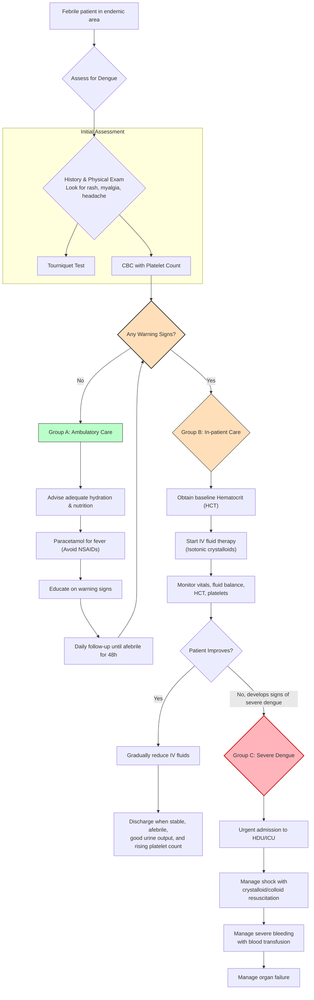
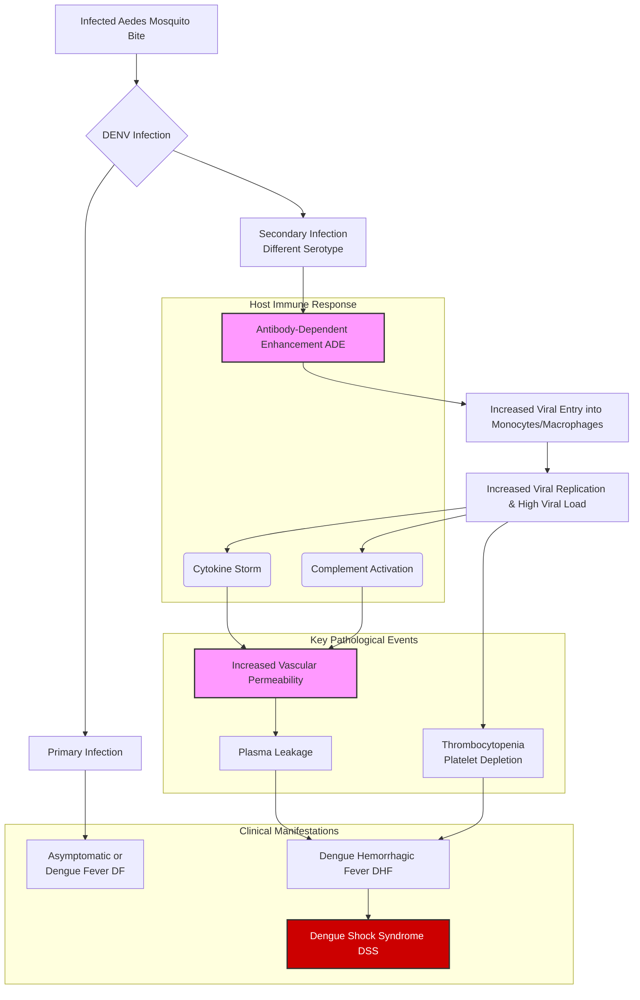
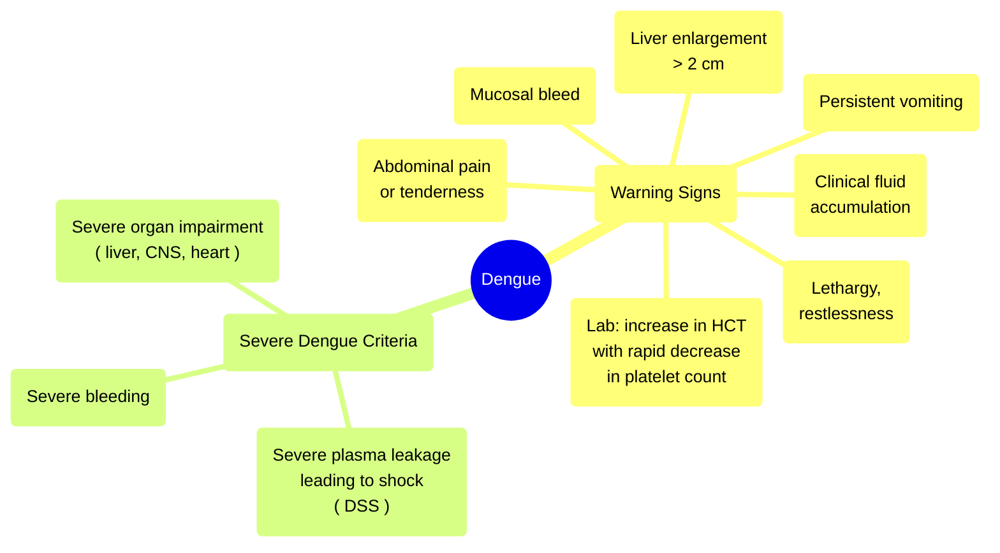

---
{"dg-publish":true,"permalink":"/infectious-diseases/dengue/"}
---

## Approach to dengue
  <!-- htmlmin:ignore -->

<!-- /htmlmin:ignore -->

## Introduction

- Dengue is a rapidly spreading mosquito-borne viral disease caused by the dengue virus, which belongs to the Flavivirus genus of the Flaviviridae family. 
- It has become a major public health problem globally, with a 30-fold increase in incidence over the last five decades. 
- The disease is endemic in more than 128 countries, with the South-East Asia and Western Pacific regions being the most seriously affected. In India, dengue is hyper-endemic, and all four serotypes (DENV-1, DENV-2, DENV-3, and DENV-4) have been reported. 
- These serotypes are antigenically similar but different enough to elicit cross-protection for only a few months after infection; infection with one serotype confers lifelong immunity to that specific serotype only.

- The virus is transmitted by female _Aedes_ mosquitoes, primarily _Aedes aegypti_ and _Aedes albopictus_. 
- _Aedes aegypti_ is highly anthropophilic, breeds in man-made water containers, and is a daytime feeder. 
- The eggs of _Aedes_ mosquitoes can withstand desiccation for more than a year, posing a significant challenge for control.

## Pathophysiology

The pathophysiology of dengue is complex and involves the interplay of viral replication and the host immune response. The core mechanisms leading to severe disease include Antibody-Dependent Enhancement (ADE), cytokine storm, vasculopathy, and coagulopathy.

<!-- htmlmin:ignore -->

<!-- /htmlmin:ignore -->

### Antibody-Dependent Enhancement (ADE)

- Secondary infection is the major risk factor for severe disease. 
- When a person previously infected with one serotype is infected by a different serotype, pre-existing non-neutralizing antibodies bind to the new virus but fail to neutralize it. 
- Instead, these antibody-virus complexes facilitate the entry of the virus into Fc-gamma receptor-bearing cells (monocytes and macrophages), leading to increased viral replication and higher viral load. 
- This phenomenon amplifies the immune response, contributing to severity.

### Cytokine Storm

- Infected dendritic cells and macrophages present the antigen to T cells. 
- The activation of CD4+ and CD8+ T cells leads to the production of cytokines such as Interferon-gamma (IFN-γ), Tumor Necrosis Factor-alpha (TNF-α), and various interleukins (IL-2, IL-6, IL-8, IL-10). 
- In secondary infections, memory T cells react rapidly, resulting in an uncontrolled release of cytokines, known as a "cytokine storm". 
- This exaggerated immune response is directly responsible for vascular leakage and coagulopathy.

### Vasculopathy and Plasma Leakage

- The hallmark of severe dengue is increased vascular permeability leading to plasma leakage into serous cavities (pleural, peritoneal, and pericardial spaces). 
- This vasculopathy is caused by the disruption of the endothelial glycocalyx and endothelial dysfunction triggered by cytokines and viral proteins like NS1. 
- The NS1 viral protein can directly activate Toll-like receptor-4 and disrupt the endothelial cell monolayer integrity. 
- Plasma leakage results in hemoconcentration (rising hematocrit), hypovolemia, and potentially shock.

### Coagulopathy and Thrombocytopenia

- multifactorial
- Thrombocytopenia (low platelet count) occurs due to bone marrow suppression, peripheral sequestration, and destruction of platelets by cross-reactive anti-NS1 antibodies and complement activation. 
- Coagulopathy is characterized by prolonged Activated Partial Thromboplastin Time (aPTT), reduced fibrinogen, and disseminated intravascular coagulation (DIC) in severe cases. 
- The release of heparin-like molecules from the damaged endothelial glycocalyx also contributes to the bleeding tendency.

## Clinical Manifestations and Phases

The clinical course of dengue illness is dynamic and passes through three phases: the febrile phase, the critical phase, and the convalescent phase.

### Febrile Phase

- This phase typically lasts 2–7 days and is characterized by the sudden onset of high-grade fever, often biphasic. 
- Associated symptoms include severe headache, retro-orbital pain, myalgia, arthralgia (break-bone fever), facial flushing, and skin erythema. 
- A positive tourniquet test and minor hemorrhagic manifestations like petechiae or epistaxis may be seen. 
- Laboratory findings show progressive leukopenia and a decrease in platelet count.

### Critical Phase

- This phase usually begins at defervescence (when fever drops), typically on days 3–7 of illness. It lasts for 24–48 hours and is characterized by increased capillary permeability. 
- Plasma leakage results in hemoconcentration, where the hematocrit rises 20% or more above baseline. Significant plasma leakage can lead to shock (Dengue Shock Syndrome - DSS), defined by narrow pulse pressure (<20 mmHg), hypotension, cold clammy extremities, and delayed capillary refill. 
- Severe organ impairment (hepatitis, encephalitis, myocarditis) and severe bleeding may also occur during this phase.

### Convalescent (Recovery) Phase

- After 24–48 hours of the critical phase, extravascular fluid is reabsorbed into the circulation. 
- The patient's general well-being improves, appetite returns, and hemodynamic status stabilizes. 
- A characteristic rash, described as "isles of white in a sea of red," may appear along with generalized pruritus. 
- Bradycardia and electrocardiographic changes are common in this phase. Care must be taken to avoid fluid overload during this period.

## Disease Classification

The World Health Organization (WHO) classifies dengue into three categories to guide management:

1. **Dengue without Warning Signs (Group A):** Patients with fever and two or more symptoms like nausea, vomiting, rash, aches, and leukopenia, but no warning signs.
2. **Dengue with Warning Signs (Group B):** Patients presenting with any of the following warning signs requiring strict observation:
    - Abdominal pain or tenderness.
    - Persistent vomiting.
    - Clinical fluid accumulation (ascites, pleural effusion).
    - Mucosal bleeding.
    - Lethargy or restlessness.
    - Liver enlargement >2 cm.
    - Laboratory: Increasing hematocrit concurrent with rapidly decreasing platelet count.
3. **Severe Dengue (Group C):** Defined by the presence of one or more of the following:
    - Severe plasma leakage leading to shock or respiratory distress.
    - Severe bleeding as evaluated by the clinician.
    - Severe organ involvement (AST/ALT >1000, impaired consciousness, myocardial dysfunction).
<!-- htmlmin:ignore -->

<!-- /htmlmin:ignore -->

## Diagnosis

Diagnosis involves clinical assessment and laboratory confirmation.

### Laboratory Methods

- **NS1 Antigen:** Detectable from day 1 of fever up to day 5-6. It is highly specific and indicates active viremia.
- **IgM Antibody (MAC-ELISA):** Detectable after day 5 of illness and persists for 1–3 months. It indicates recent infection.
- **IgG Antibody:** In primary infection, IgG appears after 1–2 weeks and persists for life. In secondary infection, IgG rises rapidly and to high titers (often >1:1280) within the first few days.
- **PCR:** Detects viral nucleic acid in the early phase (viremic stage). It can identify the specific serotype.
- **Hematology:** Leukopenia and thrombocytopenia are hallmark findings. Rising hematocrit is an objective evidence of plasma leakage.

### Tourniquet Test

- This clinical test assesses capillary fragility. 
- The blood pressure cuff is inflated midway between systolic and diastolic pressure for 5 minutes. The test is positive if >10 petechiae per square inch appear. 
- It helps in early diagnosis but may be negative in profound shock.

## Management Principles

Management is supportive and revolves around judicious fluid therapy to maintain intravascular volume during the critical phase of plasma leakage.

### Triage and Grouping

- **Group A (Home Management):** Patients without warning signs who can tolerate oral fluids and have normal urine output.
- **Group B (In-patient Management):** Patients with warning signs or high-risk co-morbidities (infants, pregnancy, diabetes, obesity).
- **Group C (Emergency Management):** Patients with severe dengue, shock, or severe organ impairment.

### Group A: Management of Mild Dengue

Patients are managed at home with bed rest and adequate oral hydration (ORS, fruit juices). Fever is managed with paracetamol (10-15 mg/kg/dose). NSAIDs like aspirin and ibuprofen must be avoided as they increase bleeding risk and cause gastritis. Patients and caregivers must be educated to monitor for warning signs and return to the hospital immediately if they develop.

### Group B: Management of Dengue with Warning Signs

Admission is required. The goal is to prevent shock.

1. **Baseline Investigations:** Obtain hematocrit (HCT) before fluid therapy if possible, along with CBC, liver, and renal function tests.
2. **Fluid Therapy:** Isotonic crystalloids (Normal Saline or Ringer's Lactate) are preferred.
3. **Infusion Rate Algorithm**:
    - Start with 5–7 mL/kg/hour for 1–2 hours.
    - Monitor vital signs and hematocrit.
    - If stable/improving: Reduce to 3–5 mL/kg/hour for 2–4 hours.
    - Further reduce to 2–3 mL/kg/hour for 2–4 hours.
    - If the patient deteriorates or HCT rises, increase the fluid rate to 5–10 mL/kg/hour.
    - Fluids are usually tapered and stopped after 24–48 hours when the plasma leak resolves.
4. **Monitoring:** Vitals every 1–4 hours, urine output 4–6 hourly, and HCT 6–12 hourly. Target urine output is 0.5 mL/kg/hour.

### Group C: Management of Severe Dengue (Shock)

These patients require emergency treatment, preferably in an ICU. Management differs for compensated versus decompensated shock.

#### Compensated Shock

Signs include tachycardia, tachypnea, cool peripheries, delayed capillary refill (>2s), but systolic blood pressure is maintained (pulse pressure may be narrow, <20 mmHg).

1. **Fluid Resuscitation:** Administer isotonic crystalloids at 10–20 mL/kg over 1 hour.
2. **Reassessment:**
    - **Improvement:** Gradually reduce fluids: 10 mL/kg/hr (1-2 hrs) → 7 mL/kg/hr (2 hrs) → 5 mL/kg/hr (4 hrs) → 3 mL/kg/hr.
    - **No Improvement:** Check HCT.
        - If HCT is high/rising: Give a second bolus of 10–20 mL/kg over 1 hour. Colloids (dextran 40 or gelatin) may be considered if crystalloids fail.
        - If HCT is falling/low with shock: Suspect severe bleeding. Transfuse Whole Blood (10 mL/kg) or Packed RBCs (5 mL/kg).

#### Decompensated (Hypotensive) Shock

Signs include unrecordable BP, profound hypotension, and absent peripheral pulses.

1. **Aggressive Resuscitation:** Administer 20 mL/kg of crystalloid or colloid as a rapid bolus over 15–30 minutes.
2. **Reassessment:**
    - **Improvement:** Switch to crystalloid infusion 10 mL/kg/hr for 1 hour, then taper gradually as per the compensated shock protocol.
    - **No Improvement:** Review HCT.
        - If HCT high: Repeat bolus 10–20 mL/kg (colloid preferred) over 15-30 minutes. Up to 3 boluses can be given.
        - If HCT low: Transfuse blood immediately.
    - **Refractory Shock:** If shock persists despite adequate fluid volume (approx. 40-60 ml/kg total), initiate inotropes (epinephrine/norepinephrine/dopamine). Evaluate for other causes like acidosis, hypocalcemia, hypoglycemia, or occult hemorrhage.

### Management of Hemorrhage

Prophylactic platelet transfusion is not recommended, even with counts <20,000/mm³, as it does not reduce bleeding risk and may cause fluid overload. Therapeutic transfusion is indicated only for:

- Severe bleeding with thrombocytopenia.
- Profound shock with falling hematocrit (indicating internal bleeding).
- Massive bleeding causing hemodynamic instability. Fresh Frozen Plasma (FFP) or cryoprecipitate is used for coagulopathy with bleeding.

### Management of Fluid Overload

Fluid overload is a common iatrogenic complication caused by excessive fluid administration or continuing fluids into the recovery phase. Signs include eyelid puffiness, tachypnea, respiratory distress, and pulmonary edema.

- **Management:** Stop intravenous fluids immediately.
- **Diuretics:** Administer Furosemide (0.1–0.5 mg/kg/dose) if the patient is hemodynamically stable.
- **If Shock + Fluid Overload:** This implies plasma leakage is still active or there is pump failure. Use colloids carefully to maintain intravascular volume while depleting extravascular fluid, or consider inotropes.

### Management of Other Complications

- **Encephalopathy:** Manage airway and oxygenation. Control seizures with anticonvulsants. Treat hepatic encephalopathy with lactulose and correct hypoglycemia/electrolyte imbalances. Reduce intracranial pressure if needed (head elevation, mannitol/3% saline).
- **Acute Kidney Injury (AKI):** Maintain perfusion. If fluid unresponsive or fluid overloaded, consider renal replacement therapy (dialysis).
- **Hemophagocytic Lymphohistiocytosis (HLH):** A rare, life-threatening hyper-inflammatory syndrome characterized by persistent fever, pancytopenia, and high ferritin. It may require steroids or IVIG.

## Dengue in Specific Populations

### Pediatrics

Children are at higher risk for severe dengue and shock due to their smaller vascular volume and higher capillary permeability.

- **Infants:** Infants <1 year are a high-risk group. They may present with shock without distinct prior clinical changes. Fluids should be managed with extreme caution, often using 0.45% saline in young infants.
- **Neonatal Dengue:** Can present as sepsis-like illness. History of maternal fever is crucial.

### Comorbidities

- **Pregnancy:** Dengue in pregnancy carries risks of hemorrhage, vertical transmission, and fetal distress. Fluid management is challenging due to physiological hypervolemia. Delivery during the critical phase carries a high risk of massive postpartum hemorrhage.
- **Obesity:** Ideal body weight must be used for fluid calculations to avoid overdose.
- **Co-infections:** Co-infection with Malaria, Typhoid, or Chikungunya is possible and complicates management. Treatment for co-infections (e.g., antimalarials, antibiotics) should be initiated if suspected/confirmed.

## Discharge Criteria

Patients can be discharged when they meet the following criteria:

- Afebrile for 48 hours without antipyretics.
- Clinical improvement and good appetite.
- Stable hematocrit.
- Rising trend in platelet count (usually >50,000/mm³).
- No respiratory distress or organ dysfunction.