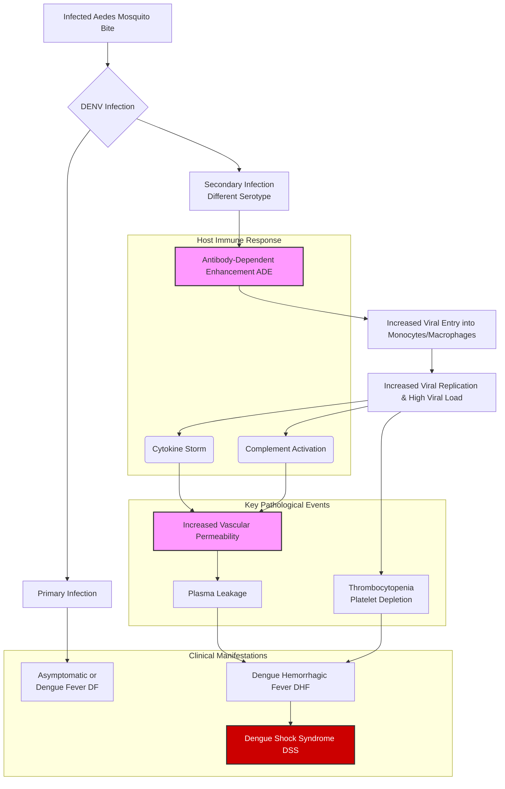
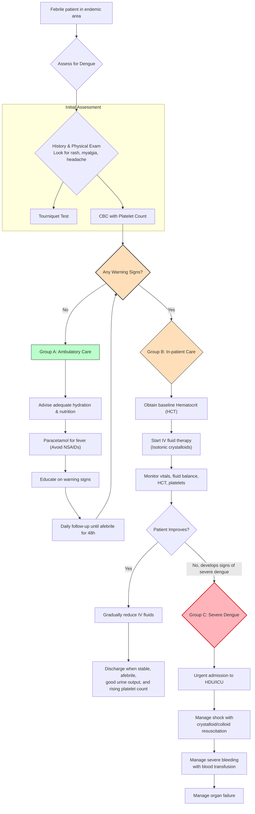
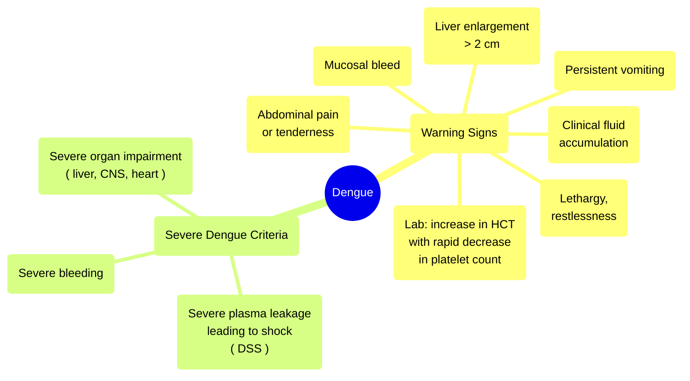

---
{"dg-publish":true,"permalink":"/infectious-diseases/dengue/","noteIcon":""}
---

1. Discuss the management of Dengue Shock Syndrome (DNB 1997/1)10
2. 
3. Dengue Fever (DNB 2003/2)15
4. Define DHF and DSS and outline the treatment of DSS (DNB 2005/1)10 
5. Diagnosis and management of DHF and DSS (DNB 2006/1)10
6. Outline the WHO criteria for diagnosis of dengue hemorrhagic fever. Draw an algorithm for volume replacement for a child with DHF and >20% increase in hematocrit (DNB 2009/1)3+7
7. Define DHF and DSS. How does DHF differ from dengue fever with hemorrhage? Describe treatment of DSS (DNB 2009/2)2+2+1+5
8. Classify severity of dengue hemorrhagic fever. Write in brief the management of dengue shock syndrome (DNB 2011/1)4+6
9. What are the fluid, metabolic and biochemical changes in a child with severe dengue? Discuss the underlying pathophysiology (DNB 2013/1)10
10. Define severe dengue and describe the WHO guidelines for its management. Enumerate the indications for transfusion in dengue (DNB 2014/1)2+6+2
11. Describe the WHO guidelines for its management.Enumerate complications of Severe Dengue (DNB 2016/1)4+4
12. 
13. 
14. Fluid therapy in DHF (DNB 2019/1)5
15. Fluid management in Dengue Shock Syndrome and its complications (DNB 2019/2)5 
16. 
17. 
18. Management of Dengue Shock Syndrome (DNB 2022/2)5,(DCH 2024/1)5
19. 
20. Severe dengue management in 15 kg child (DCH 2023/2)5
21. Management of a 10-year-child with dengue shock (DNB 2024/1)5
> [!faq] PYQ
> 1. Pathogenesis of bleeding and shock in Dengue fever (DNB 1998/2)10
> 2. Pathophysiology of Dengue fever (DNB 2021/2)5
> 3. Classification of dengue fever (DNB 2022/2)5
> 4. Dengue and its classification (DCH 2023/2)5

## Pathophysiology of Dengue
<!-- htmlmin:ignore -->

<!-- /htmlmin:ignore -->
### Antibody dependent enhancement (ADE)
- DENV taken up by dendritic cells
- DENV has 3 proteins
	- envelope E
	- precursor membrane pre-M
	- NS1
- E protein specific antibodies - neutralization of infection
- pre-M protein specific antibodies - weak neutralization, help in ADE
- NS1 specific antibodies - non-neutralizing, complement mediated lysis of cells
- Non-neutralizing antibody-virus complex - enter host cells
- virus replicated
### cytokine storm
- CD4+, CD8+ cells specific to DENV cause lysis of virus infected cells and produce cytokines like INF - γ, TNF - α, lymphotoxin, IL-2, IL12, IL6, IL10
- more vigorous with previous infections
- augmented response
### Vasculopathy
- occurs in 3rd to 7th day of life
- plasma leakage - mild to profound shock
- Anti-NS1 act as autoantibodies and cross react with platelets and non-infected endothelial cells ⟶ resulting in disturbance in capillary platelets
- can cause
	- hemoconcentration
	- pleural effusion
	- ascites
	- multi-organ dysfunction
### Coagulopathy
- multifactorial
- release of heparan sulphate and chondroitin sulphate from glycocalyx ⟶ coagulopathy
- thrombocytopenia ⟶ increases the severity of bleeding
- lab features
	- ↓ Fibrinogen
	- ↓ platelets
	- ↑ APTT
	- DIC
## Clinical features
- Fever  of 2 to 7 days or more with 
	- Headache
	- Retro-orbital pain
	- Myalgia
	- Arthralgia
	- Rash
	- Haemorrhagic Manifestations
	- Thrombocytopenia or Leucopenia
	- Warning signs and symptoms
### Febrile phase
- sudden rise in temperature ≥ 38.5° C
- associated with above clinical features in the first 2-7 days
- maculopapular or rubelliform rash in 3rd to 4th fever
- bleeding manifestations may be observed
- facial puffiness, conjunctival congestion,  pharyngeal erythema, lymphadenopathy, and hepatomegaly
### Critical phase
- after 3rd or 4th day of fever
- characterized by vasculopathy and coagulopathy
- leading to plasma leakage, excessive hemoconcentration, bleeding, eventually leading to shock and organ dysfunction
- watchout for warning signs

### Convalescent phase
- lasts 2-3 days
- return of extravasated fluid into capillaries
- develops a convalescent rash characterized by confluent erythematous eruption with sparing areas of normal skin
- pruritic rash

## Approach to dengue
  <!-- htmlmin:ignore -->

<!-- /htmlmin:ignore -->

## Severe Dengue
>[!faq] PYQ
>1. Define severe dengue (DNB 2016/1)2

- patients who have progressed form mild to moderate dengue ⟶
	- severe plasma leakage leading to 
		- shock
		- fluid accumulation with respiratory distress
	- severe bleeding
	- severe organ dysfunction
	- AST, ALT ≥ 1000 units/L
	- impaired consciousness ⟶ GCS < 9
- Risk factors for severe dengue
	- children less than <10
	- elderly > 65
	- obesity
	- pregnancy
	- hemolytic diseases
	- peptic ulcer
	- CHD
	- chronic diseases like DM, SHTN, obstructive lung disease, chronic liver failure, chronic renal failure
	- patients on long term steroids and NSAIDs
<!-- htmlmin:ignore -->

<!-- /htmlmin:ignore -->

## Lab features
> [!faq] PYQ
> 1.  Diagnostic lab tests for dengue fever (DNB 2018/1)4

- ELISA based NS1 antigen 
	- high specificity and sensitivity
	- early identification
- IgM ELISA 
	- detectable by day 5 of illness
	- may persists up to 90 days
	- used in areas where dengue is not endemic for population based sero- surveillance
- Isolation of Dengue virus
	- collected from liver, spleen, lymph node, thymus and mosquitoes
	- detectable in first 5 days
	- not much role in clinical management
- PCR
	- RT-PCR has replaced isolation of virus 
	- standard of detection of dengue
- IgG ELISA
	- differentiate primary and secondary infections
	- indication of past infection
- serological tests
	- not much used
		- Hemagglutination-Inhibition (HI)
		- Complement fixation (CF)
		- Neutralization test (NT)
- Rapid diagnostic tests
	- results within 15 to 25 minutes
	- higher rate of false positives compared to standard tests
	- sensitivity and specificity varies from batch to batch
	- not recommended

