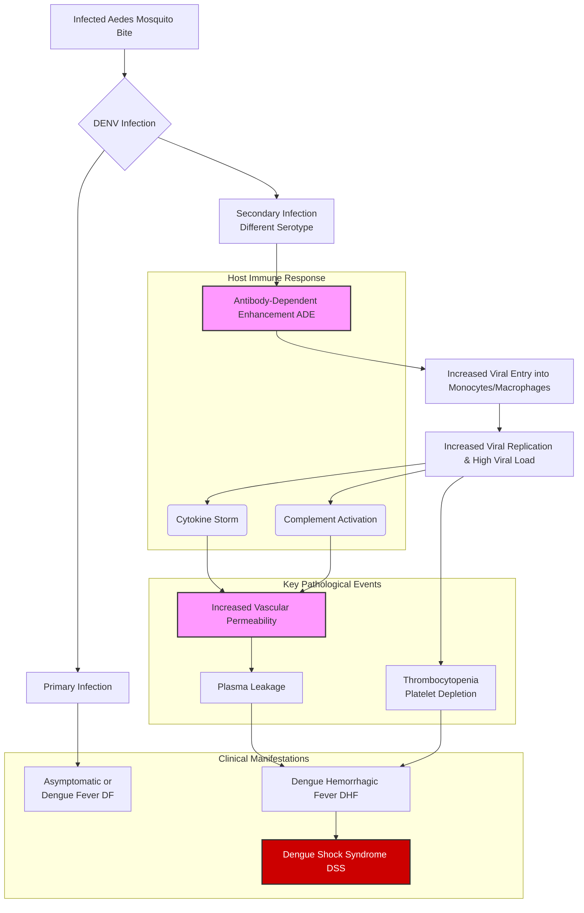
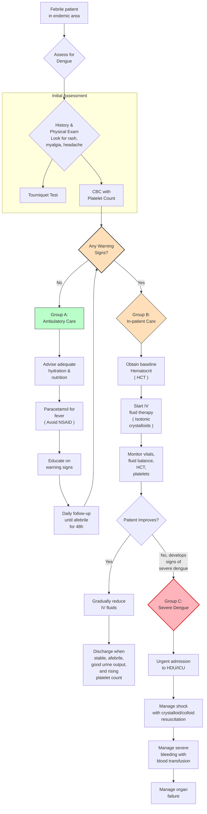
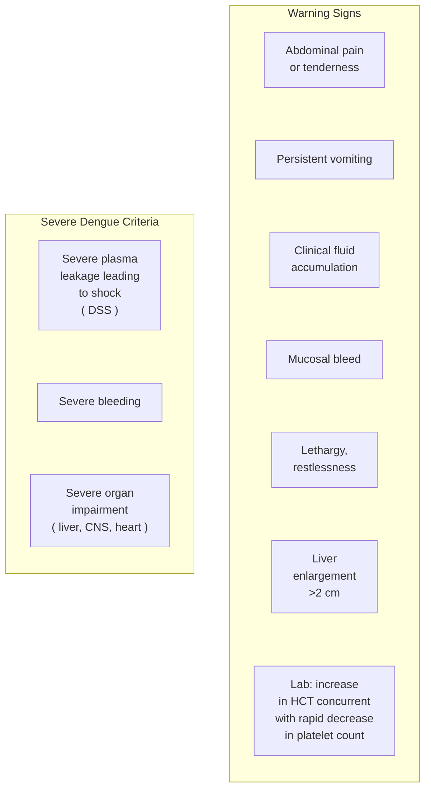

---
{"dg-publish":true,"permalink":"/infectious-diseases/dengue/","noteIcon":""}
---

## Pathophysiology of Dengue
<!-- htmlmin:ignore -->

<!-- /htmlmin:ignore -->
### Antibody dependent enhancement (ADE)
- DENV taken up by dendritic cells
- DENV has 3 proteins
	- envelope E
	- precursor membrane pre-M
	- NS1
- E protein specific antibodies - neutralization of infection
- pre-M protein specific antibodies - weak neutralization, help in ADE
- NS1 specific antibodies - non-neutralizing, complement mediated lysis of cells
- Non-neutralizing antibody-virus complex - enter host cells
- virus replicated
### cytokine storm
- CD4+, CD8+ cells specific to DENV cause lysis of virus infected cells and produce cytokines like INF - γ, TNF - α, lymphotoxin, IL-2, IL12, IL6, IL10
- more vigorous with previous infections
- augmented response
### Vasculopathy
- occurs in 3rd to 7th day of life
- plasma leakage - mild to profound shock
- Anti-NS1 act as autoantibodies and cross react with platelets and non-infected endothelial cells ⟶ resulting in disturbance in capillary platelets
- can cause
	- hemoconcentration
	- pleural effusion
	- ascites
	- multi-organ dysfunction
### Coagulopathy
- multifactorial
- release of heparan sulphate and chondroitin sulphate from glycocalyx ⟶ coagulopathy
- thrombocytopenia ⟶ increases the severity of bleeding
- lab features
	- ↓ Fibrinogen
	- ↓ platelets
	- ↑ APTT
	- DIC
## Clinical features
- Fever  of 2 to 7 days or more with 
	- Headache
	- Retro-orbital pain
	- Myalgia
	- Arthralgia
	- Rash
	- Haemorrhagic Manifestations
	- Thrombocytopenia or Leucopenia
	- Warning signs and symptoms
### Febrile phase
- sudden rise in temperature ≥ 38.5° C
- associated with above clinical features in the first 2-7 days
- maculopapular or rubelliform rash in 3rd to 4th fever
- bleeding manifestations may be observed
- facial puffiness, conjunctival congestion,  pharyngeal erythema, lymphadenopathy, and hepatomegaly
### Critical phase
- after 3rd or 4th day of fever
- characterized by vasculopathy and coagulopathy
- leading to plasma leakage, excessive hemoconcentration, bleeding, eventually leading to shock and organ dysfunction
- watchout for warning signs

### Convalescent phase
- lasts 2-3 days
- return of extravasated fluid into capillaries
- develops a convalescent rash characterized by confluent erythematous eruption with sparing areas of normal skin
- pruritic rash

## Approach to dengue
<!-- htmlmin:ignore -->

<!-- /htmlmin:ignore -->
Dengue severity classification
<!-- htmlmin:ignore -->

<!-- /htmlmin:ignore -->
### clinical classification of dengue
