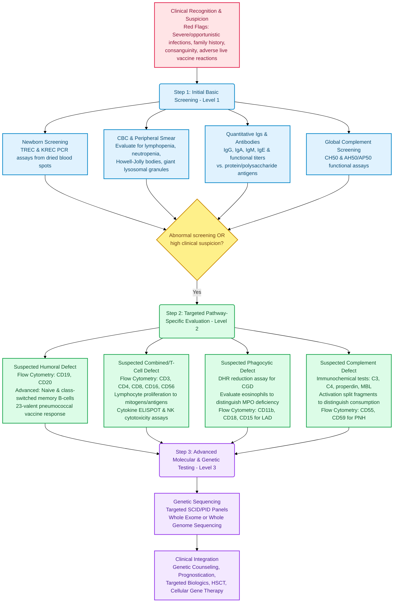

---
{"dg-publish":true,"uptext":"Back to Index (🦠 Infectious Diseases)","uplink":"/infectious-diseases/infectious-diseases/","permalink":"/infectious-diseases/immunology/algorithmic-approach-to-a-child-with-suspected-immune-dysfunction/","dgPassFrontmatter":true}
---

## Algorithm

## Clinical Recognition And Suspicion

The initial diagnosis of primary immune deficiency diseases is frequently delayed. This delay occurs because the individual disease incidence is rare and there is often a low index of suspicion. The presenting symptoms can easily mimic common, non-specific childhood illnesses.

Physicians must be acutely aware of specific clinical red flags. These red flags mandate a thorough immunologic evaluation. A high burden of recurrent or sentinel infections is the most common reason to initiate an immunologic workup.

### 10 Clinical Red Flags for Primary Immunodeficiency (PID)

According to the Jeffrey Modell Foundation and international expert consensus, the following clinical features should raise suspicion of a Primary Immunodeficiency in pediatric patients:

1.  **Eight or more new ear infections** within one year.
2.  **Two or more serious sinus infections** within one year.
3.  **Two or more months of antibiotics** with little effect.
4.  **Two or more pneumonias** within one year.
5.  **Failure of an infant to gain weight** or grow normally.
6.  **Recurrent, deep skin or organ abscesses.**
7.  **Persistent thrush in the mouth or fungal infection on the skin** after age one.
8.  **Need for intravenous antibiotics** to clear infections.
9.  **Two or more deep-seated infections** including septicemia.
10. **A family history** of primary immunodeficiency.
### Clinical Clues Guiding The Diagnostic Algorithm

Specific patterns of infection and physical findings help guide the initial laboratory evaluation toward a specific compartment of the immune system.

|Defective Compartment|Characteristic Clinical Clues|Offending Pathogens|
|:--|:--|:--|
|**B-Cell (Humoral)**|Recurrent upper and lower respiratory tract bacterial infections. Reduced levels of immunoglobulins.|Encapsulated bacteria (_Streptococcus pneumoniae_, _Haemophilus influenzae_). Severe _Giardia lamblia_ gastrointestinal infections.|
|**T-Cell (Combined)**|Systemic illness following live virus vaccination. Chronic oral candidiasis after 6 months of age. Failure to thrive. Intractable chronic diarrhea. Absent tonsils or lymph nodes.|Opportunistic infections like _Pneumocystis jirovecii_, _Mycobacterium avium-intracellulare_, and severe viral infections.|
|**Phagocyte**|Severe skin, liver, or lymph node abscesses. Severe periodontitis and poor wound healing. Delayed umbilical cord separation.|Catalase-positive organisms such as _Staphylococcus aureus_, _Aspergillus_, and atypical mycobacteria.|
|**Complement**|Recurrent sepsis or severe meningitis. Presence of early-onset autoimmune diseases, such as systemic lupus erythematosus.|Blood-borne encapsulated bacteria (_Streptococcus_, _Pneumococcus_, _Neisseria_).|

## Step 1: Initial Basic Screening (Level 1 Testing)

The first level of testing relies on broadly available screening tools. It begins in the neonatal period and extends to initial laboratory blood tests for symptomatic children.

### Newborn Screening

- Newborn screening enables the early detection of severe combined immunodeficiency before symptoms arise.
- The screening heavily relies on a quantitative polymerase chain reaction assay.
- This assay measures T-cell receptor excision circles from dried blood spots.
- T-cell receptor excision circles are DNA byproducts formed during the V(D)J rearrangement of T-cell receptor chains.
- They do not replicate during cell division.
- Therefore, they serve as an accurate marker for quantifying recent thymic emigrants.
- A low or absent count raises high suspicion for severe combined immunodeficiency.
- In some regions, kappa excision circles are assayed simultaneously.
- Kappa excision circles identify infants with severe B-cell defects, such as congenital agammaglobulinemia.

### Complete Blood Count And Peripheral Smear

- For symptomatic children, basic screening must begin with a complete blood count with differential.
- Persistent lymphopenia is a critical finding.
- Lymphopenia strongly suggests severe combined immunodeficiency or another combined T-cell defect.
- Severe neutropenia provides diagnostic clues for congenital phagocytic disorders.
- A marked neutrophilic leukocytosis without obvious pus formation is a hallmark of leukocyte adhesion deficiency.
- The peripheral blood smear must be carefully reviewed.
- Howell-Jolly bodies on a smear indicate isolated congenital asplenia.
- The presence of giant lysosomal granules establishes the diagnosis of Chédiak-Higashi syndrome.

### Quantitative Immunoglobulins And Specific Antibodies

- Quantitative serum immunoglobulin levels must be accurately measured.
- This specifically includes the measurement of IgG, IgA, IgM, and IgE.
- Patient values must be compared to age-matched and race-matched normal values.
- Assessing antibody responses to prior routine vaccinations evaluates functional antibody production.
- Functional capacity is tested by measuring titers against protein antigens like diphtheria and tetanus.
- Functional capacity is also tested against polysaccharide antigens like pneumococcus.

### Global Complement Screening

- The total hemolytic complement activity assay serves as the best initial screening test.
- The CH50 assay screens the functional activity of the classical complement pathway.
- It measures the complement-mediated lytic destruction of antibody-sensitized sheep erythrocytes.
- The AH50 or AP50 assay screens the functional activity of the alternative complement pathway.

## Step 2: Targeted Pathway-Specific Evaluation (Level 2 Testing)

If the initial basic screening reveals abnormalities, the algorithm branches into specific, targeted evaluations. This targeted approach is also warranted if clinical suspicion remains high despite completely normal initial screening tests.

### Evaluation Of Suspected Antibody (Humoral) Deficiencies

- Flow cytometry is strictly essential to demonstrate the presence or absence of circulating B cells.
- It utilizes specific surface markers, primarily CD19 and CD20, to enumerate B-cell populations.
- A complete absence of CD19+ B cells confirms congenital agammaglobulinemia, such as X-linked agammaglobulinemia.
- Specific antibody deficiency is suspected in patients over 2 years of age who have normal total immunoglobulins but suffer recurrent infections.
- The gold standard for diagnosing specific antibody deficiency involves evaluating the response to the 23-valent pneumococcal polysaccharide vaccine.
- An antibody titer of 1.3 mg/mL is generally considered the protective threshold.
- Advanced flow cytometry is utilized to enumerate specific percentages of naive B cells, memory B cells, and class-switched memory B cells.
- A deficiency in class-switched memory B cells helps diagnose common variable immunodeficiency.

### Evaluation Of Suspected Cell-Mediated (T-Cell And Combined) Deficiencies

- Flow cytometry precisely quantifies total T lymphocytes and their specific subsets.
- Markers used include CD3 for total T cells, CD4 for T-helper cells, and CD8 for cytotoxic T cells.
- The ratio of CD4+ to CD8+ T cells is calculated.
- Significant alterations in this ratio can indicate an underlying immunodeficiency.
- Flow cytometry distinguishes naive T cells (CD45RA) from memory T cells (CD45RO).
- This differentiation helps identify conditions like maternal engraftment or Omenn syndrome.
- Natural killer cells are enumerated using surface markers CD16 and CD56.

#### Functional Assays For T-Cell And Natural Killer Cell Activity

|Assay Type|Methodology And Diagnostic Thresholds|
|:--|:--|
|**Lymphocyte Proliferation**|T-cells are stimulated with specific antigens (tetanus toxoid) or mitogens like phytohemagglutinin. A proliferative response to phytohemagglutinin of less than 10% compared to a normal control definitively confirms a severe combined immunodeficiency.|
|**Advanced In Vitro Tests**|Measurement of T-cell cytokine production is performed utilizing ELISPOT assays. Intracellular phosphorylation events are assessed following specific cytokine stimulation.|
|**Natural Killer Cytotoxicity**|Functional killing capacity is measured using flow cytometry-based killing assays or traditional radioactive chromium release cytotoxicity assays.|
|**Degranulation Testing**|Activation-induced degranulation is assessed by measuring the upregulation of CD107a on the natural killer cell surface via flow cytometry.|

### Evaluation Of Suspected Phagocytic Defects

- Functional evaluation of the neutrophil respiratory burst screens for chronic granulomatous disease.
- The dihydrorhodamine reduction assay via flow cytometry is the gold standard diagnostic test.
- It evaluates oxidant production through increased fluorescence.
- The fluorescence increases when the dye is successfully oxidized by intracellular hydrogen peroxide.
- This flow cytometric assay has largely replaced the older nitroblue tetrazolium slide test.
- Severe myeloperoxidase deficiency can cause a falsely positive dihydrorhodamine result for neutrophils.
- Evaluating the patient's eosinophils reliably differentiates the two conditions.
- Eosinophils still reduce dihydrorhodamine normally in myeloperoxidase deficiency, but they fail to do so in chronic granulomatous disease.
- If a leukocyte adhesion deficiency is suspected, flow cytometry evaluates specific surface adhesive glycoproteins.
- The diagnosis of type 1 deficiency relies on demonstrating the absence or severe reduction of CD11b and CD18.
- The diagnosis of type 2 deficiency relies on demonstrating the specific absence of the sialyl Lewis X antigen (CD15).

### Evaluation Of Suspected Complement Deficiencies

- A negative or abnormally low CH50 or AH50 screening assay mandates specific immunochemical tests.
- These tests are required to define the precise underlying defect.
- Radial immunodiffusion, enzyme-linked immunosorbent assays, and nephelometry are utilized.
- These techniques definitively quantify individual complement components such as C3, C4, properdin, and mannose-binding lectin.
- It is crucial to distinguish primary genetic defects from acquired complement consumption.
- Acquired consumption frequently occurs in active immune complex diseases.
- This distinction relies on measuring specific complement activation products and split fragments.
- These measured fragments include C3a, C4d, Ba, Bb, and the soluble terminal complement complex sC5b-9.
- If paroxysmal nocturnal hemoglobinuria is suspected, flow cytometry is the standard diagnostic technique.
- It detects abnormally reduced surface levels of specific complement regulatory proteins, namely CD55 and CD59.

## Step 3: Advanced Molecular And Genetic Testing (Level 3 Testing)

Targeted genetic testing serves as the final and most definitive step in the diagnostic algorithm.

### Modalities And Utility

- Targeted gene sequencing is the most definitive method of diagnosis for the vast majority of primary immunodeficiency disorders.
- Sequencing is frequently performed by requesting a specific severe combined immunodeficiency gene panel.
- Broader primary immunodeficiency gene panels, whole exome sequencing, or whole genome sequencing are routinely employed.
- Establishing a precise genetic etiology confirms the exact condition following abnormal functional laboratory results.

### Clinical Application And Management Impact

- Identifying specific pathogenic gene variants provides accurate genetic counseling and allows for prenatal diagnosis.
- Genetic diagnosis predicts the clinical prognosis of the disease.
- In primary immune regulatory disorders, standard functional immunological testing is frequently completely normal.
- Therefore, next-generation sequencing is strictly necessary to establish a diagnosis in these immune regulatory conditions.
- Identifying the exact mutation provides crucial guidance for the use of targeted biological therapies.
- The specific variant also dictates the feasibility and conditioning requirements for definitive treatments.
- Such definitive treatments frequently include hematopoietic stem cell transplantation or advanced cellular gene therapy.