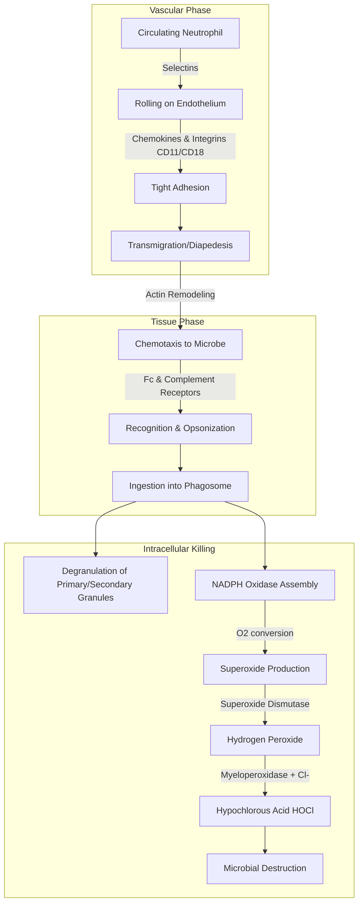

---
{"dg-publish":true,"uptext":"Back to Index (🦠 Infectious Diseases)","uplink":"/infectious-diseases/infectious-diseases/","permalink":"/infectious-diseases/immunology/functions-of-phagocytes/","dgPassFrontmatter":true}
---

## Introduction To The Phagocytic System

- The phagocytic system serves as the rapid effector arm of the innate immune response.
- It consists of two major cell types.
    - Granulocytes include neutrophils, eosinophils, and basophils.
    - Mononuclear phagocytes include circulating monocytes and tissue macrophages.
- Phagocytes primarily perform large-particle ingestion and microbial killing.
- They initiate acquired immunity by releasing chemotactic signals to attract dendritic cells.
- Primary defects in phagocyte function account for less than twenty percent of primary immunodeficiencies.
- Phagocyte defects classically present with deep tissue infections, adenitis, osteomyelitis, or cutaneous lesions.

## Hematopoiesis And Phagocyte Kinetics

### Neutrophil Maturation

- Hematopoietic progenitor cells reside in the bone marrow.
- Pluripotential stem cells give rise to common myeloid progenitor cells.
- These differentiate into committed single-lineage progenitors.
- Myelopoiesis is regulated by glycoproteins like granulocyte colony-stimulating factor (G-CSF) and granulocyte-macrophage colony-stimulating factor (GM-CSF).
    - These growth factors stimulate cell division and induce transcription factors.
    - The transcription factor PU.1 is essential for myelopoiesis.
- Intramedullary granulocyte maturation involves nuclear condensation and granule accumulation.
    - Promyelocytes acquire peroxidase-positive azurophilic (primary) granules.
    - Myelocytes and metamyelocytes subsequently acquire specific (secondary) granules.
    - Tertiary granules and secretory vesicles develop in the final maturation stage.

### Neutrophil And Monocyte Kinetics

|Kinetic Parameter|Neutrophils|Mononuclear Phagocytes|
|---|---|---|
|Average time in mitosis|7 to 9 days|30 to 48 hours|
|Average time in postmitosis|3 to 7 days|Not applicable|
|Average circulating half-life|6 hours|36 to 104 hours|
|Average daily turnover rate|1.8 × 10^8 cells/kg|1.8 × 10^9 cells/kg|
|Average survival in tissues|Hours to days|Months|
## The Phagocytic Response

### Vascular Adherence And Transmigration

- Circulating neutrophils detect low levels of chemokines from sites of infection.
- Neutrophils loosely adhere to the endothelium through low-affinity receptors called selectins.
- They roll along the endothelium to form the marginated pool.
- Inflammatory effectors trigger changes in surface adhesion molecules.
- Neutrophils undergo qualitative and quantitative changes in beta-2 integrin adhesion receptors (CD11/CD18).
- Tight adhesion occurs between neutrophils and endothelial cells.
- The neutrophil transmigrates through the endothelium into the tissue.

### Chemotaxis And Recognition

- The neutrophil senses a gradient of chemokines and migrates to the infection site.
- Migration involves rounds of **receptor engagement, signal transduction, and actin microfilament remodeling.**
- Neutrophils recognize pathogens via specific receptors.
    - Fc immunoglobulin receptors.
    - Complement receptors.
    - Toll-like receptors.

### Ingestion And Phagosome Formation

- Neutrophils ingest microbes that are coated by opsonins.
    - Opsonins include immunoglobulins and complement components like C3b.
- Pathogens are engulfed into a closed vacuole termed the phagosome.

### Intracellular Killing Mechanisms

#### Degranulation

- Neutrophil granule membranes fuse with the phagosome membrane.
- Fusion delivers potent antimicrobial proteins and small peptides into the phagosome.

#### Oxidative Burst (NADPH Oxidase Pathway)

- The nicotinamide adenine dinucleotide phosphate (NADPH)-dependent oxidase assembles at the phagosome membrane.
- Cytosolic components (p67phox, p47phox, p40phox, and Rac2) translocate to the membrane.
- They combine with the transmembrane flavocytochrome b558 (composed of gp91phox and p22phox).
- The active oxidase generates superoxide from molecular oxygen.
- Superoxide decomposes to form hydrogen peroxide and singlet oxygen.
- Myeloperoxidase from azurophil granules catalyzes the reaction of hydrogen peroxide with chloride ions.
- This reaction creates hypochlorous acid, a potent microbicidal agent.

## Diagram Of Phagocytosis And Oxidative Burst

## Primary Immunodeficiencies Affecting Phagocytes

- Genetic defects can interrupt normal phagocyte physiology at multiple stages.

### Defects In Neutrophil Production

- Severe congenital neutropenia is characterized by an arrest in myeloid maturation at the promyelocyte stage.
- It commonly results from pathogenic variants in the ELANE gene.
- Recessive forms arise from variants in HAX1 or G6PC3.
- Patients lack adequate peripheral neutrophils to combat pyogenic infections.

### Defects In Adhesion And Chemotaxis

- Leukocyte adhesion deficiency type 1 results from an absence of CD11/CD18 beta-2 integrins.
    - Neutrophils cannot adhere firmly to intercellular adhesion molecules.
    - Patients exhibit striking neutrophilia but infections lack pus formation.
- Leukocyte adhesion deficiency type 2 is caused by a loss of fucosylation.
    - It affects the generation of sialyl Lewis X, which is critical for low-affinity rolling.
- Leukocyte adhesion deficiency type 3 is caused by pathogenic variants in KINDLIN3.
    - It results in impaired integrin activation and severe bleeding tendencies.

### Defects In Microbicidal Activity

- Chronic granulomatous disease is caused by the failure to express functional NADPH oxidase components.
    - Pathogenic variants affect gp91phox, p22phox, p47phox, or p67phox.
    - Neutrophils phagocytose bacteria normally but fail to produce superoxide.
    - Patients suffer recurrent infections from catalase-positive organisms like Staphylococcus aureus and Aspergillus.
- Myeloperoxidase deficiency prevents the conversion of hydrogen peroxide to hypochlorous acid.
    - It is usually clinically silent but may present with disseminated candidiasis in diabetics.

### Defects In Degranulation And Vesicular Trafficking

- Chédiak-Higashi syndrome involves an autosomal recessive defect in the LYST gene.
    - It causes disordered coalescence of lysosomal granules.
    - Neutrophils contain abnormally giant primary granules.
    - Secondary lysosomes have reduced contents of hydrolytic enzymes.
    - This results in impaired killing of microorganisms and progressive neuropathy.
- Specific granule deficiency arises from the functional loss of myeloid transcription factors.
    - It leads to an absence of secondary granules and their contents, impairing bactericidal activity.

## Summary Of Selected Phagocyte Disorders

| Disorder Category | Specific Disease                | Gene/Defect            | Impaired Physiological Function     |
| ----------------- | ------------------------------- | ---------------------- | ----------------------------------- |
| Adhesion          | Leukocyte adhesion deficiency 1 | CD18                   | Tight adherence and transmigration, |
| Adhesion          | Leukocyte adhesion deficiency 2 | GDP-fucose transporter | Selectin-mediated rolling,          |
| Microbicidal      | Chronic granulomatous disease   | gp91phox, p47phox      | NADPH oxidase respiratory burst,    |
| Microbicidal      | Myeloperoxidase deficiency      | Missense variant       | Generation of hypochlorous acid,    |
| Degranulation     | Chédiak-Higashi syndrome        | LYST                   | Granule fusion and exocytosis,      |
| Degranulation     | Specific granule deficiency     | Gfi-1 or C/EBP epsilon | Formation of specific granules      |