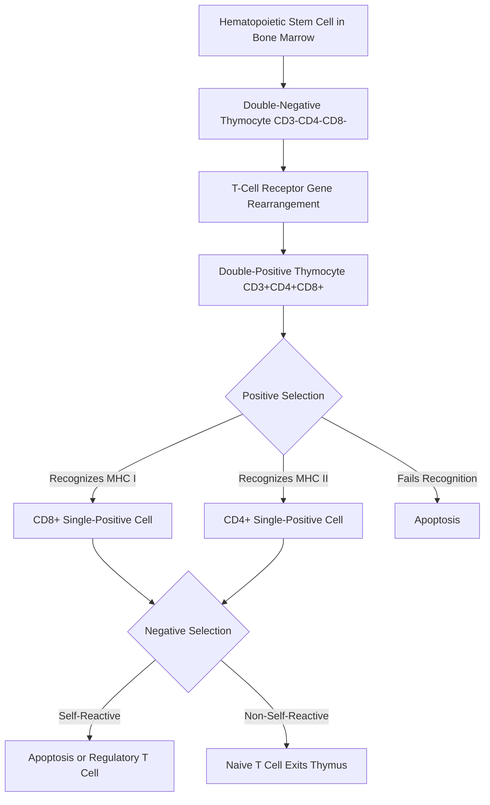
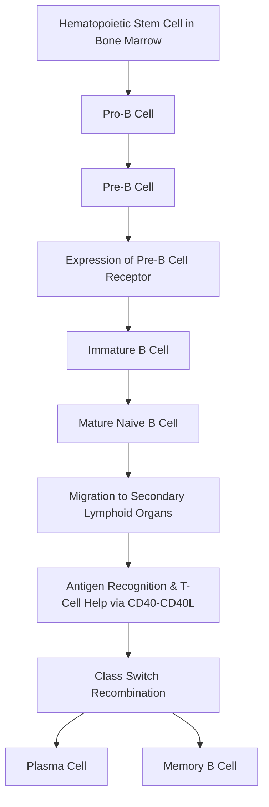

---
{"dg-publish":true,"uplink":"/infectious-diseases/infectious-diseases/","uptext":"Back to Index (Infectious Diseases)","dgPassFrontmatter":true,"permalink":"/infectious-diseases/maturation-of-b-and-t-cells/"}
---

## Overview of Lymphocyte Development

The immune system relies on the coordinated maturation of T and B lymphocytes. Both cell types originate from hematopoietic stem cells in the bone marrow. They undergo rigorous developmental stages to acquire antigen specificity. They must also achieve self-tolerance. Genetic defects at any stage of this maturation process result in primary immunodeficiency diseases. These diseases present with recurrent infections, autoimmunity, or autoinflammation.

## Maturation of T Lymphocytes

### Early Development in the Thymus

- Thymocyte precursors leave the bone marrow.
- They enter the thymus for further development.
- Initially, these precursors do not express CD3, CD4, or CD8 markers.
    - These are known as double-negative T cells.
- The cells undergo rearrangement of their T-cell receptor genes.
    - This involves variable, diversity, and joining gene segments.
    - The process generates a large variety of antigen recognition receptors.
    - T-cell receptor excision circles are formed during this rearrangement.
- Thymocytes eventually express CD3 along with both CD4 and CD8.
    - This stage is known as the double-positive thymocyte stage.

### Selection Processes

- Positive Selection
    - The newly formed T-cell receptor must recognize major histocompatibility complex molecules.
    - Receptors recognizing MHC class I develop into CD8 single-positive cells.
    - Receptors recognizing MHC class II develop into CD4 single-positive cells.
    - Thymocytes that fail this recognition die by neglect.
- Negative Selection
    - Single-positive thymocytes are tested for self-reactivity.
    - Cells with receptors that strongly recognize self-proteins undergo apoptosis.
    - This process eliminates self-reactive clones.
    - It is crucial for establishing central tolerance.
    - Some self-reactive cells survive to become regulatory T cells.
        - These cells express FOXP3.
        - They help prevent autoimmune diseases.
- Emigration
    - Non-self-reactive cells leave the thymus.
    - They exit as naive single-positive T cells.
    - These are referred to as recent thymic emigrants.

### T-Cell Maturation Pathway

## Primary Immunodeficiency Syndromes Affecting T-Cell Maturation

### Severe Combined Immunodeficiencies

- Severe combined immunodeficiencies are pediatric immunologic emergencies.
- They represent the most severe form of primary immunodeficiency.
- Patients possess very small thymuses lacking thymocytes.
- Pathogenic variants in crucial development genes arrest maturation.
    - T-B- Natural Killer+ SCID
        - Caused by RAG1 or RAG2 defects.
        - Involves defective variable, diversity, and joining recombination.
        - Also caused by Artemis deficiency.
    - T-B- Natural Killer- SCID
        - Caused by adenosine deaminase deficiency.
        - Results in the accumulation of toxic purine nucleosides.
        - Leads to the death of developing lymphocytes.
    - T-B+ Natural Killer- SCID
        - Caused by common gamma chain variants.
        - Represents X-linked SCID.
        - Leads to abnormal signaling via interleukin receptors.
        - Also caused by JAK3 deficiency.

### Defects in Thymic Development

- DiGeorge Syndrome
    - Involves chromosome 22q11.2 deletions.
    - Disrupts the development of the third and fourth pharyngeal pouches.
    - Leads to hypoplasia or aplasia of the thymus.
    - Impairs the environment necessary for T-cell maturation.
    - Results in variable T-cell lymphopenia.
- FOXN1 Deficiency
    - Causes winged helix nude syndrome.
    - Results in very low T cells.
    - Associated with an abnormal thymic epithelium.

### Defects in T-Cell Signaling and Function

- ZAP-70 Deficiency
    - CD8 T cells are absent or very low.
    - CD4 T cells develop in adequate numbers.
    - CD4 T cells are defective in proliferation and function.
- Major Histocompatibility Complex Class II Deficiency
    - Bare lymphocyte syndrome.
    - Impairs positive selection of CD4 T cells in the thymus.
    - Leads to low or absent CD4 T cells.
- Major Histocompatibility Complex Class I Deficiency
    - Impairs positive selection of CD8 T cells.
    - Results in very low or absent CD8 T cells.

### Tabular Summary of T-Cell Deficiencies

|**Disorder**|**Affected Gene**|**Inheritance**|**Maturation Defect / Pathogenesis**|
|:--|:--|:--|:--|
|Common gamma chain deficiency|IL2RG|X-linked|Abnormal signaling via common gamma chain interleukin receptors.|
|RAG1/RAG2 deficiency|RAG1, RAG2|Autosomal recessive|Defective variable, diversity, joining recombination.|
|Adenosine deaminase deficiency|ADA|Autosomal recessive|Accumulation of toxic purine nucleosides killing precursors.|
|Artemis deficiency|DCLRE1C|Autosomal recessive|Defective variable, diversity, joining recombination with radiation sensitivity.|
|DiGeorge syndrome|TBX1 (22q11.2)|Autosomal dominant|Thymic aplasia or hypoplasia disrupting T-cell environment.|
|MHC Class II deficiency|CIITA, RFX5, RFXANK, RFXAP|Autosomal recessive|Absent MHC II impairs CD4 positive selection.|
|MHC Class I deficiency|TAP1, TAP2, TAPBP, B2M|Autosomal recessive|Absent MHC I impairs CD8 positive selection.|

## Maturation of B Lymphocytes

### Bone Marrow Development

- B-cell development begins in the bone marrow.
- Hematopoietic stem cells commit to the B-cell lineage.
- The sequence progresses through distinct cellular stages.
    - Pro-B cell stage initiates the process.
    - Pre-B cell stage involves the pre-B cell receptor.
    - Immature B cell stage follows.
    - Mature B cell stage completes marrow development.
- Pre-B Cell Receptor Assembly
    - The membrane form of the mu heavy chain is synthesized.
    - It pairs with a surrogate light chain.
    - The surrogate light chain is composed of VpreB and lambda 5.
    - Signal transducing chains Ig-alpha and Ig-beta associate with the complex.
- Selection and Tolerance
    - Bone marrow selection removes self-reacting B cells.
    - This occurs by clonal deletion or anergy.

### Antigen-Dependent Phase and Class Switching

- Mature B cells migrate to peripheral lymphoid tissues.
- They interact with antigens in secondary lymphoid organs.
- Recognition of the antigen by the B-cell receptor occurs.
- T-cell help is required for full activation.
    - Helper T cells provide costimulatory interactions.
    - CD40 on the B cell interacts with CD40 ligand on the T cell.
    - Interleukins 4 and 5 are secreted by T cells.
- Class Switch Recombination
    - B cells switch expression from IgM to IgG, IgA, or IgE.
    - This changes the heavy chain constant region.
    - The variable region remains unaltered to preserve antigen specificity.
- Terminal differentiation produces plasma cells.
    - Plasma cells secrete large amounts of antibodies.
    - Memory B cells are also generated for long-term immunity.

### B-Cell Maturation Pathway

## Primary Immunodeficiency Syndromes Affecting B-Cell Maturation

### Agammaglobulinemias

- X-Linked Agammaglobulinemia
    - Caused by a pathogenic variant in the Bruton tyrosine kinase gene.
    - Bruton tyrosine kinase is essential for B-cell differentiation and maturation.
    - Maturation arrests at the pre-B cell stage.
    - Leads to a profound defect in B-lymphocyte development.
    - Results in an absence of circulating B cells.
    - Patients have small to absent tonsils and unpalatable lymph nodes.
- Autosomal Recessive Agammaglobulinemia
    - Clinically indistinguishable from X-linked agammaglobulinemia.
    - Affects males and females equally.
    - Caused by variants in components of the pre-B cell receptor.
    - Defective genes include the mu heavy chain.
    - Defects in surrogate light chain lambda 5 also cause this.
    - Ig-alpha and Ig-beta signaling molecule defects block maturation.
    - B-cell linker adaptor protein variants arrest development.

### Class Switch Recombination Defects

- Often referred to as Hyper-IgM syndromes.
- Characterized by normal or elevated IgM levels.
- IgG, IgA, and IgE levels are low or absent.
- Represents a failure of the class switch recombination process.
- X-Linked Hyper-IgM
    - Caused by variants in the CD40 ligand gene.
    - CD40 ligand is expressed on activated helper T cells.
    - B cells are normal but fail to receive switching signals from T cells.
- Autosomal Recessive Hyper-IgM
    - Caused by intrinsic B-cell defects.
    - Activation-induced cytidine deaminase gene variants block switching.
    - Uracil DNA glycosylase variants produce a similar defect.
    - CD40 receptor variants also arrest class switching.

### Common Variable Immunodeficiency

- Hypogammaglobulinemia develops after an initial period of normal function.
- Peripheral B cells are often present in normal numbers.
- Blood B cells fail to differentiate into immunoglobulin-producing cells.
- Patients show a deficiency of switched memory B cells.
- Polygenic inheritance is common.
- Known gene defects include BAFF receptor, CD19, CD20, and CD21.
- Immune dysregulation genes like CTLA4 and LRBA can manifest as common variable immunodeficiency.

### Tabular Summary of B-Cell Deficiencies

| **Disorder**                           | **Affected Gene**       | **Inheritance**      | **Maturation Defect / Pathogenesis**                                     |
| :------------------------------------- | :---------------------- | :------------------- | :----------------------------------------------------------------------- |
| X-Linked Agammaglobulinemia            | BTK                     | X-linked             | Arrest at pre-B cell stage; absence of antibody production.              |
| Autosomal Recessive Agammaglobulinemia | IGHM                    | Autosomal recessive  | Loss of mu heavy chain; arrests early B-cell development.                |
| Autosomal Recessive Agammaglobulinemia | IGLL1                   | Autosomal recessive  | Loss of surrogate light chain; arrests pre-B cell receptor formation.    |
| Autosomal Recessive Agammaglobulinemia | CD79A, CD79B            | Autosomal recessive  | Loss of Ig-alpha or Ig-beta required for pre-B cell receptor signaling.  |
| X-Linked Hyper-IgM Syndrome            | CD40LG (CD154)          | X-linked             | Defective CD40L on T cells fails to signal B-cell class switching.       |
| Autosomal Recessive Hyper-IgM          | AID                     | Autosomal recessive  | Defective intrinsic B-cell class switch recombination mechanism.         |
| Autosomal Recessive Hyper-IgM          | CD40                    | Autosomal recessive  | Defective CD40 receptor on B cells; fails to receive T-cell signal.      |
| Common Variable Immunodeficiency       | CD19, CD20, CD21, BAFFR | Variable / Polygenic | Failure of B-cell differentiation into plasma cells; low memory B cells. |

## Combined and Syndromic Deficiencies

- Some defects affect maturation pathways critical to both T and B cells or broadly disrupt immune homeostasis.
- Wiskott-Aldrich Syndrome
    - X-linked recessive disorder.
    - Caused by variants in the Wiskott-Aldrich syndrome protein.
    - Results in defective actin filament assembly.
    - T cells lose their markedly fimbriated surface.
    - T cells are unable to provide adequate help to B cells.
    - Impairs humoral immune response to polysaccharide antigens.
- Ataxia-Telangiectasia
    - Autosomal recessive disorder.
    - Involves defective DNA repair enzymes.
    - Progressive decrease in T cells occurs.
    - Interferes with variable, diversity, joining recombination and class isotype switching.
- Tregopathies
    - IPEX syndrome involves a defect in the FOXP3 gene.
    - Inhibits the development and function of regulatory T cells.
    - Normal T-cell maturation in the thymus is disrupted.
    - Results in unrestrained T-cell activation and proliferation.
    - Presents with severe, early-onset multiorgan autoimmunity.