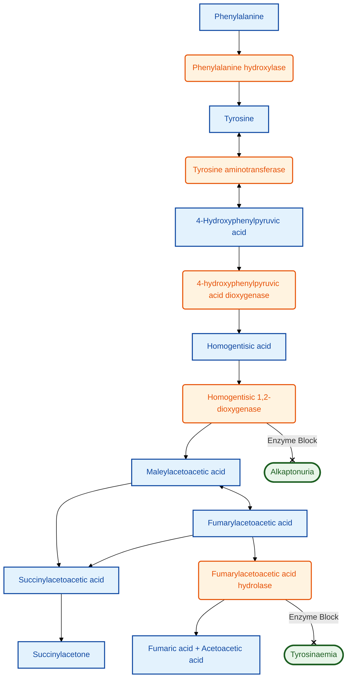

---
{"dg-publish":true,"uplink":"/metabolic-disorders/metabolic-disorders/","uptext":"Back to Index (Metabolic Disorders)","permalink":"/metabolic-disorders/alkaptonuria/","dgPassFrontmatter":true}
---

## Definition And Etiology

- Autosomal recessive disorder of tyrosine metabolism characterized by the accumulation of Homogentisic Acid (HGA).
- Caused by the deficiency of the enzyme Homogentisate 1,2-dioxygenase (HGD).
- Results from pathogenic variants in the _HGD_ gene located on chromosome 3q13.
- Affects approximately 1 in 250,000 individuals, with a higher prevalence noted in Slovakia and the Dominican Republic.

## Pathophysiology

- **Metabolic Block:** Failure to convert Homogentisic Acid (HGA) to Maleylacetoacetic Acid in the normal tyrosine catabolic pathway.
- **Pigment Formation:** Marked accumulation of HGA in blood and urine leads to its oxidation into benzoquinone acetic acid, which subsequently polymerizes to form a dark pigment known as Alkapton.
- **Ochronosis:** The Alkapton pigment exhibits a high affinity for connective tissues, including cartilage, skin, and sclera.
- **Tissue Degeneration:** Deposition of this pigment causes progressive tissue weakness, structural damage, and severe degeneration over decades.

## Clinical Features

The disease typically evolves progressively through three distinct clinical stages spanning a patient's lifetime.

| Disease Stage          | Age Of Onset                     | Clinical Manifestations                                                                                                                                                                                                                                                                                                                                                                                                 |
| ---------------------- | -------------------------------- | ----------------------------------------------------------------------------------------------------------------------------------------------------------------------------------------------------------------------------------------------------------------------------------------------------------------------------------------------------------------------------------------------------------------------- |
| **Asymptomatic Stage** | Infancy And Childhood            | Normal growth and development. Dark urine is the only early symptom, turning black upon standing or when alkalinized (e.g., washing diapers with soap). Often unrecognized or misdiagnosed.                                                                                                                                                                                                                             |
| **Ochronosis Stage**   | Young Adulthood (3rd–4th Decade) | Blue-black pigmentation of connective tissues.  Ears show slate-blue discoloration of cartilage and black earwax.  Eyes show brown/black pigment spots on the sclera (Osler's sign).  Skin shows axillary and inguinal pigmentation.                                                                                                                                                                           |
| **Arthropathy Stage**  | Adulthood                        | Severe degenerative arthritis resembling early-onset osteoarthritis.  Spine shows loss of lumbar lordosis, ankylosis, and severe back pain. Large joints (knees, hips, shoulders) develop severe secondary osteoarthritis. Cardiovascular system develops calcification and stenosis of aortic or mitral valves, alongside coronary artery calcification.  Genitourinary system develops black prostatic calculi. |

## Investigations

Diagnosis relies on characteristic screening tests and specific confirmatory modalities.

|Investigation Type|Findings|
|---|---|
|**Urine Visual Test**|Urine turns black upon prolonged standing or the addition of alkali (NaOH).|
|**Urine Chemical Tests**|Positive Benedict’s test (HGA acts as a reducing agent). Negative Clinistix test (Glucose oxidase specific). Transient purple-black color upon Ferric Chloride testing.|
|**Confirmatory Testing**|Gas Chromatography-Mass Spectrometry (GC-MS) demonstrates massive elevation of HGA in urine.|
|**Radiological Evaluation**|Spine X-ray shows pathognomonic calcification of intervertebral discs. Narrowing of disc spaces and vertebral fusion mimic the "Bamboo spine" appearance of Ankylosing Spondylitis.|
|**Genetic Analysis**|Molecular analysis confirms mutations in the _HGD_ gene.|

## Differential Diagnosis

Conditions presenting with dark urine must be differentiated from [[Metabolic Disorders/Alkaptonuria\|Alkaptonuria]].

- Porphyria (urine turns dark on standing).
- Hemoglobinuria or Myoglobinuria.
- Drug-induced discoloration (Methyldopa, Metronidazole).
- Melaninuria secondary to Melanoma.

## Management

The primary therapeutic goal is to reduce HGA production and manage degenerative complications.

|Therapy Category|Modality And Rationale|
|---|---|
|**Specific Pharmacotherapy**|**Nitisinone (NTBC):** Inhibits 4-hydroxyphenylpyruvate dioxygenase, functioning upstream of the defect to prevent HGA formation. Reduces HGA levels by 95% and slows the progression of ochronosis and cardiac pathology. Induces hypertyrosinemia, requiring dietary protein restriction to prevent corneal crystals.|
|**Dietary Modification**|Restriction of phenylalanine and tyrosine intake reduces the overall HGA load, though maintenance is difficult long-term.|
|**Vitamin Supplementation**|**High-Dose Ascorbic Acid (Vitamin C):** Prevents the oxidation of HGA to its polymerized pigment but does not reduce absolute HGA levels. Clinical efficacy remains doubtful.|
|**Surgical And Supportive**|Physiotherapy and adequate analgesia for arthropathy. Joint replacement surgery (hip/knee) for severe, crippling arthritis. Valve replacement surgery for severe aortic stenosis.|

## Prognosis

- Overall life expectancy remains generally normal.
- Morbidity is extremely high in later life due to the development of severe, crippling ochronotic arthropathy and progressive cardiovascular disease.