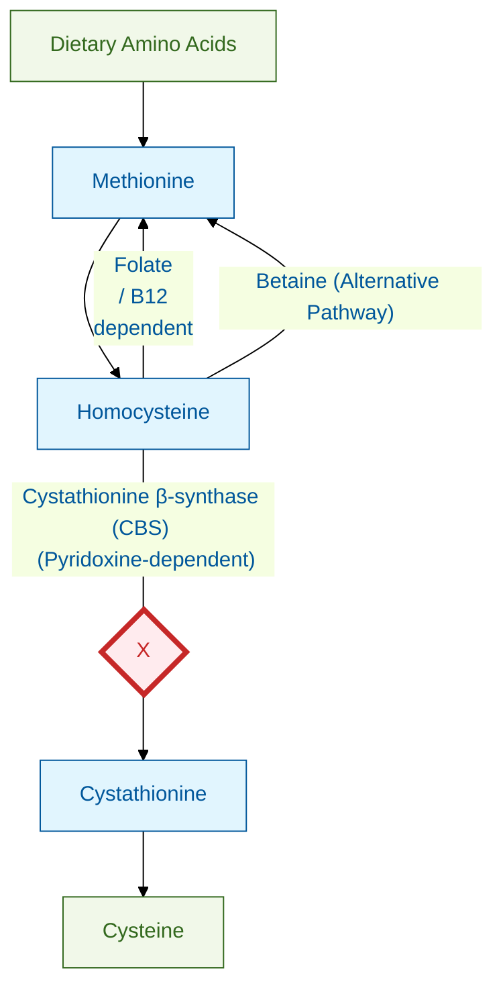

---
{"dg-publish":true,"uplink":"/metabolic-disorders","uptext":"Back to Index (Metabolic Disorders)","permalink":"/metabolic-disorders/homocystinuria/","dgPassFrontmatter":true}
---

## Definition And Etiology

- Autosomal recessive disorders of sulfur amino acid metabolism characterized by the accumulation of homocysteine in blood and urine.
- Classic [[Metabolic Disorders/Homocystinuria\|Homocystinuria]] results from a deficiency of Cystathionine $\beta$-Synthase (CBS), requiring Vitamin B6 as a cofactor.
- Other forms result from defects in homocysteine remethylation, such as Methylene Tetrahydrofolate Reductase (MTHFR) deficiency or Cobalamin (Vitamin B12) processing defects.

## Pathophysiology

### Biochemical Defect

|Defect Type|Enzyme/Cofactor|Biochemical Consequences|
|---|---|---|
|**Classic**|Cystathionine $\beta$-Synthase (CBS), Vitamin B6|Failure to convert homocysteine to cystathionine. Leads to elevated homocysteine, elevated methionine, and low cysteine (cysteine becomes an essential amino acid).|
|**Remethylation**|MTHFR, Methionine Synthase, Vitamin B12|Failure to convert homocysteine back to methionine. Leads to elevated homocysteine and low methionine.|

### Mechanism Of Toxicity

- Elevated homocysteine causes severe endothelial injury, leading to a high risk of thrombosis.
- Elevated metabolites interfere with collagen and elastin cross-linking via fibrillin-1 inhibition.
- Homocysteine acts as an NMDA receptor agonist, leading to neurotoxicity and seizures.

## Clinical Features

Patients typically appear normal at birth, with multisystem involvement developing over time.

|System|Clinical Manifestations|
|---|---|
|**Ocular**|Ectopia lentis (lens dislocates downward and inward), severe myopia, glaucoma, retinal detachment. Dislocation usually occurs by 3–4 years of age.|
|**Skeletal**|Marfanoid habitus, tall stature, arachnodactyly, scoliosis, severe osteoporosis.|
|**Vascular**|Thromboembolism (represents the major cause of mortality).|
|**CNS**|Intellectual disability (variable IQ 30–75), psychiatric disorders (anxiety, depression, obsessive-compulsive behavior), seizures in ~20% of patients.|
|**Cutaneous**|Distinctive malar flush on cheeks, fair skin, and fair hair (hypopigmentation).|

## Investigations

### Screening Tests

- **Cyanide-Nitroprusside Test:** Urine turns deep red/magenta, detecting sulfhydryl groups. False negatives can occur with low protein intake, and false positives occur in cystinuria.
- **[[neonatalogy/Newborn Screening\|Newborn Screening]] (NBS):** Detects elevated methionine. Note that it may miss B6-responsive forms or remethylation defects where methionine levels are low.

### Confirmatory Tests

- **Plasma Amino Acids:** Classic form shows elevated methionine, elevated homocysteine, and low cysteine. Remethylation defects show low methionine and elevated homocysteine.
- **Plasma Total Homocysteine (tHcy):** Markedly elevated (>100 µmol/L; Normal <15 µmol/L).
- **Enzyme Assay:** CBS activity measured in cultured fibroblasts or liver biopsy.
- **Genetic Analysis:** Mutation analysis of the _CBS_ gene located on chromosome 21q22.3.

### Pyridoxine (B6) Challenge Test

- Administer 100–500 mg of Vitamin B6 daily to determine B6 responsiveness (a key prognostic factor).
- A significant drop in plasma homocysteine and methionine implies B6-Responsive [[Metabolic Disorders/Homocystinuria\|Homocystinuria]], which carries a milder phenotype.

## Management

### Specific Therapy

|Therapy|Indication And Rationale|
|---|---|
|**Vitamin B6 (Pyridoxine)**|First-line for B6-responsive patients (~50%). High dose (200–500 mg/day) aiming to maintain plasma homocysteine <50 µmol/L. Requires co-supplementation with Folate and Vitamin B12 to optimize remethylation.|
|**Dietary Restriction**|For B6-non-responsive patients. Low methionine diet restricting animal protein (meat, dairy, eggs) and utilizing a methionine-free medical formula containing essential Cysteine.|
|**Betaine (Trimethylglycine)**|Adjunct for non-responsive cases. Donates a methyl group to remethylate homocysteine to methionine. Requires monitoring to prevent cerebral edema if Methionine exceeds 1000 µmol/L.|

### Supportive Care

- **Anticoagulation:** Not routinely indicated prophylactically, but aggressive intravenous hydration is absolutely mandatory during surgery or illness to prevent thromboembolism.
- **Ocular and Skeletal:** Regular ophthalmology follow-up for surgical management of dislocated lenses. Calcium and Vitamin D supplementation for bone health.

## Prognosis

- **Untreated:** Poor life expectancy due to severe vascular events, with a 50% mortality rate by age 20–30.
- **Treated:** B6-responsive patients have an excellent prognosis with normal intelligence and lifespan if treated early. B6-non-responsive patients have good outcomes if diet and Betaine are started in the neonatal period, though late treatment cannot reverse established intellectual disability or lens dislocation.