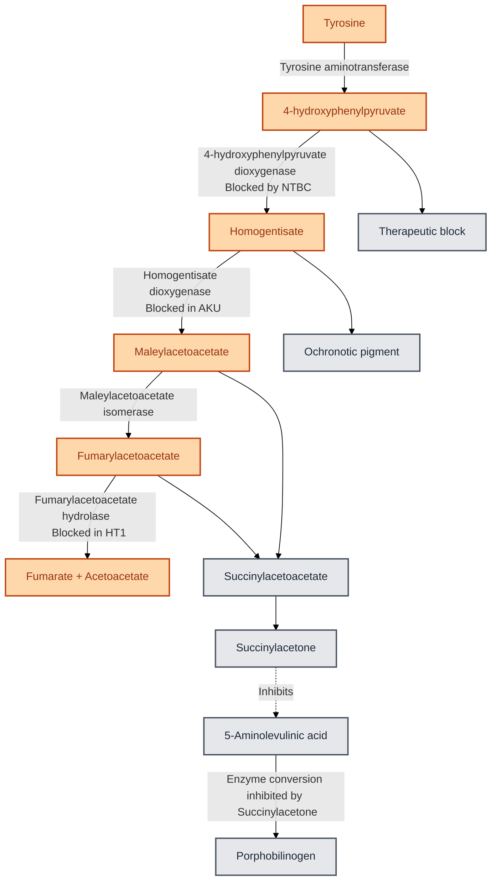

---
{"dg-publish":true,"uplink":"/metabolic-disorders/metabolic-disorders/","uptext":"Back to Index (Metabolic Disorders)","permalink":"/metabolic-disorders/tyrosinemia/","dgPassFrontmatter":true}
---

## Overview

- Tyrosinemia represents a group of autosomal recessive inborn errors of tyrosine metabolism.
- Disorders are characterized by elevated blood tyrosine levels (hypertyrosinemia) and specific organ damage depending on the exact enzymatic defect.
- Tyrosine is an aromatic amino acid essential for the synthesis of dopamine, norepinephrine, epinephrine, melanin, and thyroxine.

## Classification Of Tyrosinemia

| Feature                   | Tyrosinemia Type I                  | Tyrosinemia Type II                          | Tyrosinemia Type III                         | Transient Tyrosinemia                |
| :------------------------ | :---------------------------------- | :------------------------------------------- | :------------------------------------------- | :----------------------------------- |
| **Alternate Name**        | Hepatorenal Tyrosinemia             | Oculocutaneous Tyrosinemia (Richner-Hanhart) | 4-HPPD Deficiency                            | Transient Tyrosinemia of the Newborn |
| **Enzyme Defect**         | Fumarylacetoacetate Hydrolase (FAH) | Tyrosine Aminotransferase (TAT)              | 4-Hydroxyphenylpyruvate Dioxygenase (4-HPPD) | Delayed maturation of 4-HPPD         |
| **Gene**                  | _FAH_ (15q25.1)                     | _TAT_ (16q22.2)                              | _HPD_ (12q24.31)                             | None (Maturational delay)            |
| **Pathognomonic Marker**  | Elevated Succinylacetone (SA)       | Extreme Hypertyrosinemia (>1,200 µmol/L)     | Absent Succinylacetone                       | High Tyrosine and Phenylalanine      |
| **Primary Target Organs** | Liver, Kidneys, Peripheral Nerves   | Eyes, Skin, Central Nervous System           | Central Nervous System                       | Usually asymptomatic                 |

## Tyrosinemia Type I (Hepatorenal Tyrosinemia)

### Pathophysiology

- Caused by deficiency of Fumarylacetoacetate Hydrolase (FAH), the final enzyme in the tyrosine catabolic pathway.
- Leads to accumulation of upstream metabolites Fumarylacetoacetate and Maleylacetoacetate, which are reduced to the toxic metabolite Succinylacetone (SA).
- Succinylacetone acts as a mitochondrial toxin that inhibits the Krebs cycle and oxidative phosphorylation.
- Succinylacetone is an alkylating agent causing DNA damage, cell death, and oncogenesis in the liver and kidneys.
- Succinylacetone potently inhibits 5-aminolevulinate dehydratase, causing accumulation of 5-aminolevulinic acid (ALA) and resulting in porphyria-like neurotoxic crises.

### Clinical Features

- **Acute Infantile Form (<6 months):**
    - Acute liver failure, jaundice, coagulopathy with bleeding, and ascites.
    - Sepsis-like presentation with fever, vomiting, and irritability.
    - Characteristic "boiled cabbage" odor due to methionine metabolites.
- **Chronic Childhood Form (>6 months):**
    - **Hepatic:** Chronic micronodular cirrhosis, failure to thrive, and high risk of Hepatocellular Carcinoma (HCC).
    - **Renal:** Renal Fanconi syndrome causing phosphaturia, glycosuria, and aminoaciduria, resulting in Vitamin D-resistant rickets.
    - **Neurologic:** Porphyria-like crises triggered by infection, manifesting as painful peripheral neuropathy, extensor hypertonia, and respiratory failure requiring ventilation.

### Investigations

- **Diagnostic Marker:** Elevated Succinylacetone in blood or urine is pathognomonic.
- **Newborn Screening (NBS):** Succinylacetone is the preferred target, as testing tyrosine alone misses cases.
- **Biochemistry:**
    - Elevated plasma Tyrosine, Methionine, and Phenylalanine.
    - Markedly elevated Alpha-fetoprotein (AFP), often >100,000 ng/mL.
    - Prolonged PT/aPTT indicating coagulopathy.
    - Elevated urinary 5-ALA.

### Management

- **Pharmacotherapy:** Nitisinone (NTBC) at 1–2 mg/kg/day is the mainstay of therapy.
    - Inhibits 4-Hydroxyphenylpyruvate Dioxygenase (4-HPPD) upstream of the defect, preventing formation of toxic Succinylacetone.
    - Causes secondary hypertyrosinemia, requiring dietary management.
- **Dietary Modification:** Low Phenylalanine and Tyrosine diet using special metabolic formulas to prevent NTBC-induced hypertyrosinemia complications.
- **Liver Transplantation:** Indicated for acute liver failure refractory to medical therapy, confirmed or suspected Hepatocellular Carcinoma, or poor response to Nitisinone.

## Tyrosinemia Type II (Oculocutaneous Tyrosinemia)

### Pathophysiology And Clinical Features

- Caused by deficiency of cytosolic Tyrosine Aminotransferase (TAT).
- Extreme hypertyrosinemia (>1,200 µmol/L) leads to tyrosine crystal deposition in ocular and cutaneous tissues.
- **Ocular:** Presents early (<1 year) with photophobia, tearing, and bilateral herpetiform corneal ulcers that stain poorly with fluorescein.
- **Cutaneous:** Painful palmoplantar hyperkeratosis on pressure points.
- **Neurologic:** Mild to moderate intellectual disability in 50% of cases.

### Management

- Strict dietary restriction of Phenylalanine and Tyrosine leads to rapid resolution of skin and eye lesions.

## Tyrosinemia Type III

### Pathophysiology And Clinical Features

- Caused by deficiency of 4-Hydroxyphenylpyruvate Dioxygenase (4-HPPD).
- Exceedingly rare disorder presenting with neurological symptoms including seizures, ataxia, and intellectual disability.
- Characterized by absent Succinylacetone and absence of liver or kidney damage.
- Treated exclusively with dietary restriction of Phenylalanine and Tyrosine.

## Transient Tyrosinemia Of The Newborn

### Pathophysiology And Management

- Caused by delayed maturation of the 4-HPPD enzyme combined with high protein intake.
- Common in premature infants (up to 30%) and typically asymptomatic, though it may cause lethargy and poor feeding.
- Resolves spontaneously within 2 months.
- Managed with reduced protein intake and Vitamin C supplementation to hasten enzyme maturation.