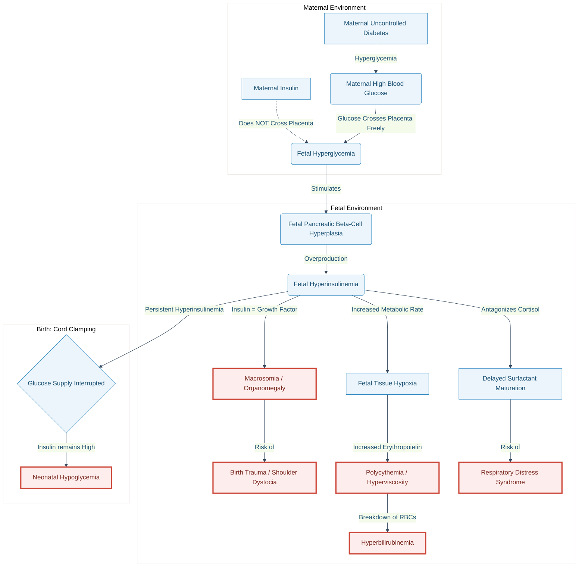

---
{"dg-publish":true,"permalink":"/neonatalogy/infants-of-diabetic-mother/","dgPassFrontmatter":true}
---

## 1. Introduction & Pathophysiology
* **Definition:** Neonate born to a mother with pre-existing diabetes (Type 1 or 2) or gestational diabetes (GDM).
<!-- htmlmin:ignore -->

<!-- /htmlmin:ignore -->
* **Core Pathophysiology (Pedersen Hypothesis):**
   * Maternal Hyperglycemia $\rightarrow$ Fetal Hyperglycemia (transplacental).
   * Fetal pancreatic $\beta$-cell hyperplasia $\rightarrow$ **Fetal Hyperinsulinemia**.
   * Postnatal separation from placenta $\rightarrow$ interruption of glucose supply + persistent hyperinsulinemia $\rightarrow$ **Hypoglycemia**.
   * Hyperinsulinemia acts as a fetal growth hormone $\rightarrow$ Macrosomia/Organomegaly.
   * Fetal metabolic demand $\rightarrow$ Intrauterine Hypoxia $\rightarrow$ increased [[Hematology/Erythropoietin\|Erythropoietin]] $\rightarrow$ **Polycythemia**. 

## 2. Metabolic Complications
### A. [[Neonatalogy/Neonatal Hypoglycemia\|Neonatal Hypoglycemia]] (Most Common)
- Blood glucose < 40 mg/dL (plasma glucose < 45 mg/dL) irrespective of age, though operational thresholds vary.
- Onset usually within **1-2 hours** of life.
* **Clinical Features:**
    * Often asymptomatic.
    * **Neurogenic:** Jitteriness, tremors, sweating, tachycardia, pallor.
    * **Neuroglycopenic:** Lethargy, poor suck, weak cry, apnea, cyanosis, seizures, coma.
* **Management (Algorithm):**
    * **Asymptomatic (20–40 mg/dL):** Trial of oral feeds (Breast milk preferred); recheck in 1 hour. If still <40 mg/dL $\rightarrow$ IV fluids.
    * **Symptomatic or <20 mg/dL:**
        * **Bolus:** 2 ml/kg of 10% Dextrose.
        * **Maintenance:** IV Glucose infusion @ 6–8 mg/kg/min.
        * **Titration:** Increase by 2 mg/kg/min (max 12 mg/kg/min) to maintain BGL > 50 mg/dL.

### B. Hypocalcemia & Hypomagnesemia
* **[[Neonatalogy/Neonatal Hypocalcemia\|Neonatal Hypocalcemia]]** Usually occurs within first 24–72 hours due to functional hypoparathyroidism and maternal hypomagnesemia.
* **Hypomagnesemia:** Caused by maternal renal wasting of magnesium; correlates with severity of hypocalcemia.

## 3. Hematological Complications

### A. [[Neonatalogy/Polycythemia\|Polycythemia]] & Hyperviscosity Syndrome
* Venous hematocrit $\ge$ 65% or Hb > 22 g/dL.
* **Pathophysiology:** Fetal hypoxemia (placental insufficiency or high metabolic rate) $\rightarrow$ increased erythropoiesis.
* **Clinical Features:** **CVS**: Plethora (ruddy complexion), cyanosis. **CNS:** Lethargy, jitteriness, seizures, infarcts.  **Cardiopulmonary:** Tachypnea, tachycardia, respiratory distress, cardiomegaly (pulmonary plethora). **GI:** Poor feed, vomiting, Necrotizing Enterocolitis (NEC). **Renal:** Oliguria, renal vein thrombosis. **Metabolic:** Hypoglycemia, jaundice.
* Manageed with Hydration and partial exchange traansfusion

### B. Hyperbilirubinemia
* Secondary to polycythemia (increased RBC mass breakdown) and immature hepatic conjugation.

### C. Thrombocytopenia
* Mild, transient; associated with polycythemia/hyperviscosity.

## 4. Respiratory Complications
* **[[Neonatalogy/Respiratory Distress Syndrome\|Respiratory Distress Syndrome]] (RDS):** Delayed surfactant maturation due to antagonism of cortisol by insulin.
* **Transient Tachypnea of Newborn (TTN):** Common in infants delivered via elective CS (associated with macrosomia).

## 5. Congenital Anomalies (Embryopathy)
* Occurs due to hyperglycemia during organogenesis (First Trimester).
* **Cardiac:** Hypertrophic Cardiomyopathy (septal hypertrophy - transient), [[Cardiology/Transposition of great arteries\|Transposition of Great Arteries]] (TGA), [[Cardiology/VSD\|VSD]].
* **CNS:** [[Neurology/Neural Tube Defects\|Neural tube defects]], Anencephaly.
* **Skeletal:** Caudal Regression Syndrome (Sacral Agenesis) – most specific to IDM.
* **Gastrointestinal:** Small Left Colon Syndrome, Situs Inversus.
* **Renal:** Renal vein thrombosis (associated with polycythemia).

## 6. Growth Abnormalities
* **Macrosomia (LGA):** Birth weight > 90th percentile or > 4000g. Risk of birth trauma (shoulder dystocia, Erb’s palsy, clavicle fracture) and asphyxia.
* **IUGR (SGA):** Seen in mothers with severe diabetic vasculopathy (placental insufficiency).

## 7. Long-term Outcome
* **Neurodevelopment:**
    * Symptomatic hypoglycemia linked to white matter abnormalities and executive function deficits.
    * Polycythemia-associated hyperviscosity may cause micro-infarcts but PET benefits on long-term outcome are debated.
* **Metabolic:** Increased risk of childhood obesity and early-onset Type 2 Diabetes (Metabolic programming).