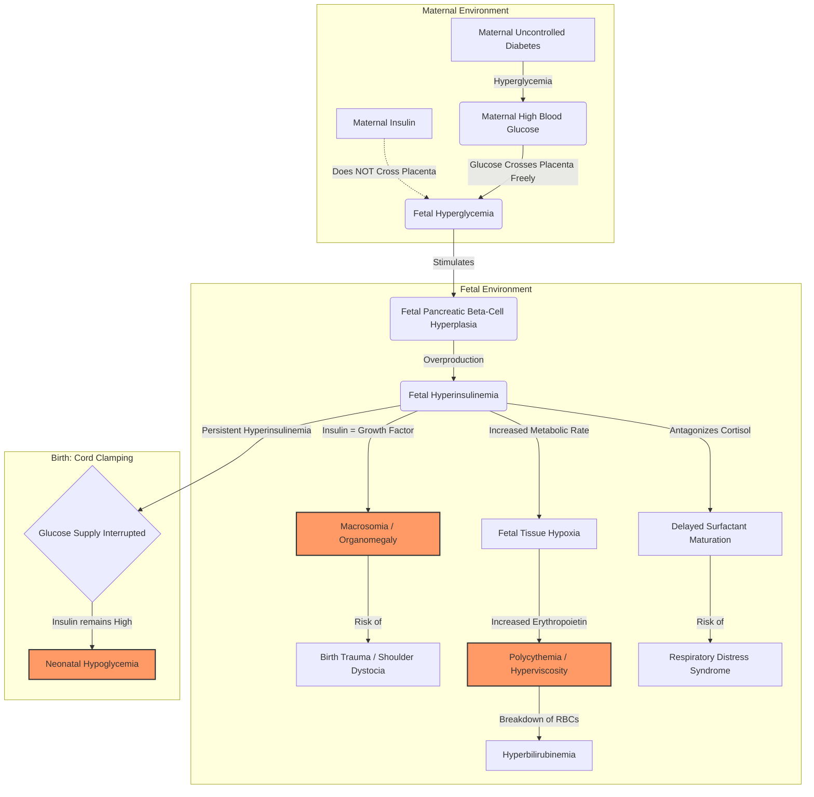
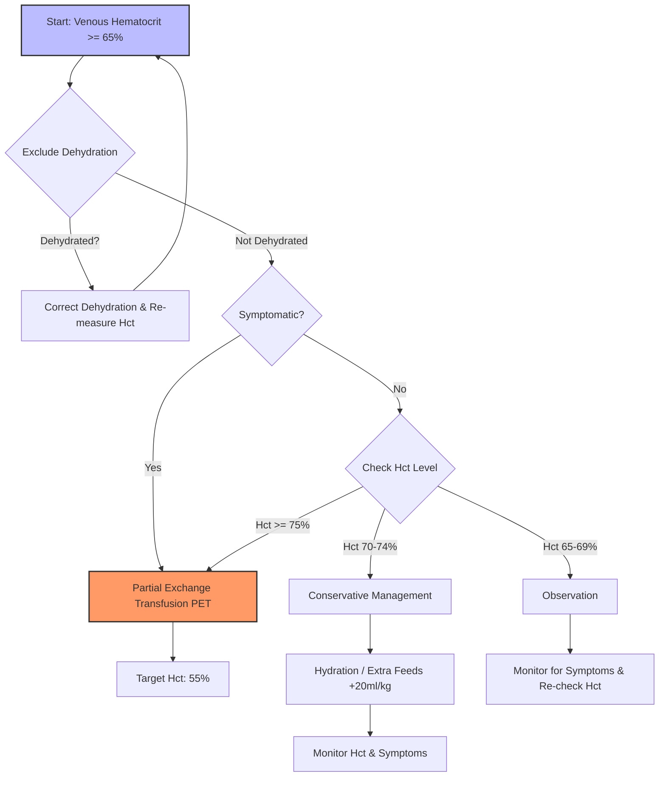

---
{"dg-publish":true,"permalink":"/neonatalogy/infants-of-diabetic-mother/"}
---

## 1. Introduction & Pathophysiology
* **Definition:** Neonate born to a mother with pre-existing diabetes (Type 1 or 2) or gestational diabetes (GDM).
* **Core Pathophysiology (Pedersen Hypothesis):**
<!-- htmlmin:ignore -->

<!-- /htmlmin:ignore -->
   * Maternal Hyperglycemia $\rightarrow$ Fetal Hyperglycemia (transplacental).
   * Fetal pancreatic $\beta$-cell hyperplasia $\rightarrow$ **Fetal Hyperinsulinemia**.
   * Postnatal separation from placenta $\rightarrow$ interruption of glucose supply + persistent hyperinsulinemia $\rightarrow$ **Hypoglycemia**.
   * Hyperinsulinemia acts as a fetal growth hormone $\rightarrow$ Macrosomia/Organomegaly.
   * Fetal metabolic demand $\rightarrow$ Intrauterine Hypoxia $\rightarrow$ increased Erythropoietin $\rightarrow$ **Polycythemia**.

## 2. Metabolic Complications

### A. Hypoglycemia (Most Common)
* **Definition:** Blood glucose < 40 mg/dL (plasma glucose < 45 mg/dL) irrespective of age, though operational thresholds vary.
* **Timing:**
    * Onset usually within **1-2 hours** of life.
    * Rarely occurs after 12 hours (range 0.8–8.5 hours).
* **Mechanism:** Transient Hyperinsulinism (Acquired).
* **Clinical Features:**
    * Often asymptomatic.
    * **Neurogenic:** Jitteriness, tremors, sweating, tachycardia, pallor.
    * **Neuroglycopenic:** Lethargy, poor suck, weak cry, apnea, cyanosis, seizures, coma.
* **Screening Protocol:**
    * **Target:** All IDMs are high-risk.
    * **Schedule:** 2, 6, 12, 24, 48, and 72 hours of life.
    * **Method:** Point-of-care strip (screening) followed by laboratory confirmation if low.
* **Management (Algorithm):**
    * **Asymptomatic (20–40 mg/dL):** Trial of oral feeds (Breast milk preferred); recheck in 1 hour. If still <40 mg/dL $\rightarrow$ IV fluids.
    * **Symptomatic or <20 mg/dL:**
        * **Bolus:** 2 ml/kg of 10% Dextrose.
        * **Maintenance:** IV Glucose infusion @ 6–8 mg/kg/min.
        * **Titration:** Increase by 2 mg/kg/min (max 12 mg/kg/min) to maintain BGL > 50 mg/dL.
    * **Resistant Hypoglycemia:** If unstable despite GIR > 12 mg/kg/min, suspect other causes or severe hyperinsulinism; may require Hydrocortisone, Diazoxide (caution in SGA), or Octreotide.

### B. Hypocalcemia & Hypomagnesemia
* **Hypocalcemia:** Usually occurs within first 24–72 hours due to functional hypoparathyroidism and maternal hypomagnesemia.
* **Hypomagnesemia:** Caused by maternal renal wasting of magnesium; correlates with severity of hypocalcemia.

## 3. Hematological Complications

### A. Polycythemia & Hyperviscosity Syndrome
* **Definition:** Venous hematocrit $\ge$ 65% or Hb > 22 g/dL.
* **Incidence:** Occurs in ~15% of term SGA/LGA infants; risk increased in IDM.
* **Pathophysiology:** Fetal hypoxemia (placental insufficiency or high metabolic rate) $\rightarrow$ increased erythropoiesis.
* **Clinical Features:**
    * **Cutaneous:** Plethora (ruddy complexion), cyanosis.
    * **CNS:** Lethargy, jitteriness, seizures, infarcts.
    * **Cardiopulmonary:** Tachypnea, tachycardia, respiratory distress, cardiomegaly (pulmonary plethora).
    * **GI:** Poor feed, vomiting, Necrotizing Enterocolitis (NEC).
    * **Renal:** Oliguria, renal vein thrombosis.
    * **Metabolic:** Hypoglycemia, jaundice.
* **Screening:** Check hematocrit at 2 hours; repeat at 6, 12, 24, 48 hours if indicated.
* **Management:**
<!-- htmlmin:ignore -->

<!-- /htmlmin:ignore -->
* **Asymptomatic:**
	* Hct 65–69%: Monitor.
	* Hct 70–74%: Hydration (Feed/IV) to encourage hemodilution
	* Hct $\ge$ 75%: Partial Exchange Transfusion (PET).
   * **Symptomatic (Hct > 65%):** Partial Exchange Transfusion (PET).
   * **PET Details:**
	    - $$ volume\;of\; blood \;to\; be \;exchanged \;\;= \;\; \frac{blood\; vol \times (observe\; Hct - Desired\; Hct)}{Observed\; Hct}$$
        * Desired Hct: 55%. Fluid: Normal Saline.

### B. Hyperbilirubinemia
* Secondary to polycythemia (increased RBC mass breakdown) and immature hepatic conjugation.

### C. Thrombocytopenia
* Mild, transient; associated with polycythemia/hyperviscosity.

## 4. Respiratory Complications
* **Respiratory Distress Syndrome (RDS):** Delayed surfactant maturation due to antagonism of cortisol by insulin.
* **Transient Tachypnea of Newborn (TTN):** Common in infants delivered via elective CS (associated with macrosomia).

## 5. Congenital Anomalies (Embryopathy)
* Occurs due to hyperglycemia during organogenesis (First Trimester).
* **Cardiac:** Hypertrophic Cardiomyopathy (septal hypertrophy - transient), Transposition of Great Arteries (TGA), VSD.
* **CNS:** Neural tube defects, Anencephaly.
* **Skeletal:** Caudal Regression Syndrome (Sacral Agenesis) – most specific to IDM.
* **Gastrointestinal:** Small Left Colon Syndrome, Situs Inversus.
* **Renal:** Renal vein thrombosis (associated with polycythemia).

## 6. Growth Abnormalities
* **Macrosomia (LGA):** Birth weight > 90th percentile or > 4000g. Risk of birth trauma (shoulder dystocia, Erb’s palsy, clavicle fracture) and asphyxia.
* **IUGR (SGA):** Seen in mothers with severe diabetic vasculopathy (placental insufficiency).

## 7. Long-term Outcome
* **Neurodevelopment:**
    * Symptomatic hypoglycemia linked to white matter abnormalities and executive function deficits.
    * Polycythemia-associated hyperviscosity may cause micro-infarcts but PET benefits on long-term outcome are debated.
* **Metabolic:** Increased risk of childhood obesity and early-onset Type 2 Diabetes (Metabolic programming).