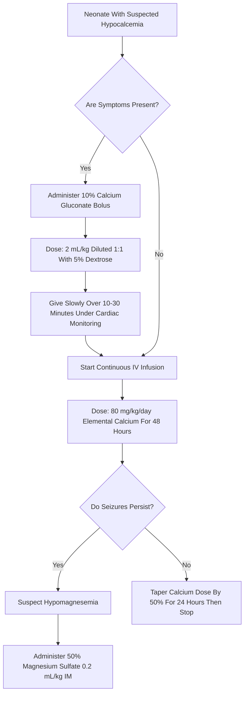

---
{"dg-publish":true,"uptext":"Back to Index (Neonatology)","uplink":"/neonatology/","permalink":"/neonatalogy/neonatal-hypocalcemia/","dgPassFrontmatter":true}
---

## Definition

- Neonatal hypocalcemia is a common clinical and laboratory abnormality.
- The definition relies on total serum calcium (tSCa) or ionized serum calcium (iSCa) cutoffs.
- These cutoffs vary between preterm and term neonates.

|Gestation|Total Serum Calcium|Ionized Serum Calcium|
|---|---|---|
|Preterm|< 7 mg/dL (1.75 mmol/L)|< 4 mg/dL (1 mmol/L)|
|Term|< 8 mg/dL (2 mmol/L)|< 4.8 mg/dL (1.2 mmol/L)|

## Pathophysiology And Calcium Homeostasis

- Calcium is actively transferred from the mother to the fetus during the last trimester.
- Total calcium concentration in cord blood is significantly higher than in maternal serum.
- Parathyroid hormone (PTH) and calcitonin do not cross the placental barrier.
- Fetal mineral ion homeostasis is mostly independent of vitamin D.
- After birth, serum calcium levels start decreasing.
- This postnatal drop reaches a nadir of 7.5 to 8.5 mg/dL in healthy term neonates by day 2 of life.
- The drop is related to decreased PTH levels and end-organ unresponsiveness to PTH.
- Hyperphosphatemia and hypomagnesemia by 12 to 24 hours of age also contribute to this drop.
- Body calcium exists mainly in the skeleton (99%) and extracellular fluid (1%).
- Extracellular fluid calcium is 40% albumin-bound, 10% anion-bound, and 50% ionized.
- Ionized serum calcium is the crucial active form for biochemical processes.
- Total serum calcium estimation is a poor substitute for measuring ionized serum calcium.
- Falsely low ionized calcium may be recorded in alkalosis or with heparin contamination.

## Classification And Etiology

- Hypocalcemia is classified into early-onset and late-onset categories.

### Early-Onset Neonatal Hypocalcemia (ENH)

- Presents within the first 72 to 96 hours of life.
- Usually requires short-term calcium supplementation.

|Risk Factor|Mechanism|
|---|---|
|Prematurity|Decreased in-utero transfer of calcium and diminished target organ responsiveness to PTH.|
|Infants of diabetic mothers|Increased maternal urinary magnesium losses leading to decreased PTH function in the neonate.|
|Perinatal asphyxia|Cellular damage, renal dysfunction, and phosphate load.|
|Maternal factors|Maternal hyperparathyroidism or severe maternal vitamin D deficiency.|

### Late-Onset Neonatal Hypocalcemia (LNH)

- Usually presents after 96 hours of life, typically at the end of the first week.
- Often symptomatic and generally caused by a high phosphate intake.

|Etiology|Examples|
|---|---|
|Increased phosphate load|Cow milk feeding or renal insufficiency.|
|Hypoparathyroidism|DiGeorge's syndrome, CATCH 22 syndrome, or maternal hyperparathyroidism.|
|Iatrogenic causes|Citrated blood products, loop diuretics, lipid infusion, or bicarbonate therapy.|
|Other conditions|Hypomagnesemia, malabsorption, hepatobiliary disease, or vitamin D deficiency.|

## Clinical Presentation

### Asymptomatic Presentation

- Early-onset hypocalcemia is frequently asymptomatic and incidentally detected on screening.

### Symptomatic Presentation

- Symptoms represent neuromuscular irritability and cardiac involvement.
- Neuromuscular signs include jitteriness, myoclonic jerks, exaggerated startle, and seizures.
- Cardiac signs include tachycardia, heart failure, and decreased contractility.
- Other non-specific symptoms include apnea, cyanosis, tachypnea, vomiting, and laryngospasm.

## Diagnosis And Evaluation

### First-Line Investigations

- Ionized calcium measurement is the preferred mode for diagnosis.
- Electrocardiogram (ECG) may show a prolonged QT interval.
- QTc greater than 0.45 seconds suggests hypocalcemia.
- A diagnosis based only on ECG criteria yields a high false-positive rate.
- Suspected cases on ECG must be confirmed with serum calcium measurement.

### Second-Line Investigations (For Late-Onset Or Resistant Cases)

- Required if hypocalcemia persists or presents late.
- Include serum phosphate, magnesium, alkaline phosphatase, parathormone (PTH), and 25-hydroxyvitamin D.

|Disorder|Serum Phosphate|Serum Parathormone|Other Findings|
|---|---|---|---|
|Hypoparathyroidism|High|Low|Low 25-OH D.|
|Pseudohypoparathyroidism|High|High|Low 25-OH D.|
|Hypomagnesemia|Low|High|Low Magnesium.|
|Vitamin D Dependent Rickets|Low|High|High Alkaline Phosphatase.|

## Management

- Early-onset asymptomatic hypocalcemia requires 80 mg/kg/day of elemental calcium for 48 hours.
- This translates to 8 mL/kg/day of 10% calcium gluconate.
- Symptomatic neonates require emergency intravenous bolus therapy under cardiac monitoring.

### Treatment Of Resistant Hypocalcemia

- Symptomatic hypocalcemia unresponsive to adequate calcium is usually due to hypomagnesemia.
- Administer two doses of 0.2 mL/kg of 50% magnesium sulfate injection deeply intramuscularly 12 hours apart.
- Late-onset hypocalcemia with high phosphate load requires discontinuation of animal milk.
- Hypoparathyroidism requires calcium supplementation along with active vitamin D therapy.

## Precautions And Complications

- Bradycardia and arrhythmia are known side effects of bolus intravenous calcium.
- Bolus doses must be diluted 1:1 with 5% dextrose and given slowly.
- Hepatic necrosis may occur if an umbilical venous catheter tip lies in a portal vein branch.
- The umbilical artery catheter must never be used for giving calcium injections.
- Accidental injection into the umbilical artery causes arterial spasms and intestinal necrosis.
- Extravasation of calcium into subcutaneous tissue causes severe tissue necrosis.
- Intravenous sites must be checked frequently during infusion.