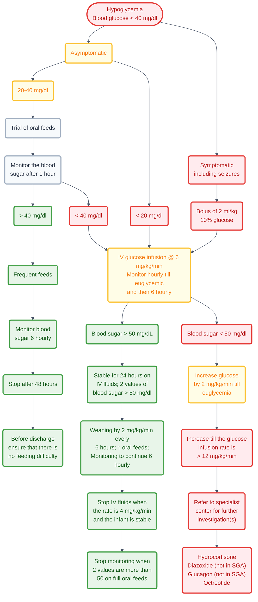

---
{"dg-publish":true,"uptext":"Back to Index (Neonatology)","uplink":"/neonatology/","permalink":"/neonatalogy/neonatal-hypoglycemia/","dgPassFrontmatter":true}
---

## Definition And Physiology

- There is no universal definition for neonatal hypoglycemia.
- The World Health Organization defines hypoglycemia as a blood glucose level less than 45 mg/dL (2.2 mmol/L).
- The operational threshold for intervention is a blood glucose level less than 40 mg/dL (plasma glucose less than 45 mg/dL), irrespective of the infant's age.
- Glucose provides 60% to 70% of fetal energy needs through transplacental facilitated diffusion.
- At birth, the severing of the umbilical cord abruptly interrupts the glucose source.
- The newborn responds by initiating hepatic glycogenolysis and gluconeogenesis.
- Blood glucose levels typically fall to a low point in the first 1 to 2 hours of life.
- This transient drop is termed transitional neonatal hypoglycemia.
- Levels subsequently stabilize at 65 to 70 mg/dL by 3 to 4 hours of age.

## Etiology And Classification

- Causes of neonatal hypoglycemia can be classified based on the underlying physiological mechanism.

| Mechanism                      | Common Causes                                                                                                  |
| ------------------------------ | -------------------------------------------------------------------------------------------------------------- |
| High Insulin (Hyperinsulinism) | Infant of diabetic mother, perinatal asphyxia, Beckwith-Wiedemann syndrome, genetic mutations (ABCC8, KCNJ11). |
| Decreased Stores Or Production | Prematurity, small for gestational age.                                                                        |
| Increased Utilization          | Sepsis, shock, hypothermia, respiratory distress, polycythemia.                                                |
| Endocrine Deficiency           | Adrenal insufficiency, congenital hypopituitarism.                                                             |
| Inborn Errors Of Metabolism    | Glycogen storage disease, galactosemia, maple syrup urine disease.                                             |
|                                |                                                                                                                |

## Clinical Presentation

- Many neonates with low blood sugar values remain completely asymptomatic.
- Symptomatic hypoglycemia presents with neurogenic and neuroglycopenic signs.
- Neurogenic (autonomic) symptoms result from a sympathetic nervous discharge.
- These include jitteriness, tremors, sweating, sudden pallor, tachypnea, and tachycardia.
- Neuroglycopenic symptoms occur due to a deficient glucose supply to the brain.
- These include stupor, lethargy, apathy, cyanosis episodes, apneic spells, a weak and high-pitched cry, feeding difficulty, convulsions, and coma.

## Screening Protocol

- Routine screening is not recommended in healthy, breastfed, term appropriate-for-gestational-age infants.
- Screening is mandatory for high-risk and sick neonates.

|Category Of Infants|Time Schedule For Blood Glucose Monitoring|
|---|---|
|At-Risk Neonates (Premature, Small for gestational age, Large for gestational age, Infant of diabetic mother)|2, 6, 12, 24, 48, and 72 hours of life.|
|Sick Neonates (Sepsis, asphyxia, shock)|Every 6 to 8 hours during the acute phase.|
|Neonates On Parenteral Nutrition|Every 6 to 8 hours for the initial 72 hours, then once daily.|

- Point-of-care devices provide rapid results but are less accurate at lower glucose levels.
- A low point-of-care value must be acted upon immediately while awaiting laboratory confirmation.
- Blood samples for laboratory testing must be collected in tubes containing glycolytic inhibitors like fluoride.

## Management

### Asymptomatic Hypoglycemia

- The primary approach is to initiate feeding, preferably direct breastfeeding.
- If the infant cannot suck, expressed breast milk should be given by spoon or paladai.
- Buccal dextrose gel (200 mg/kg) can be applied to the dried buccal mucosa, followed by feeding.
- Blood glucose must be rechecked 30 minutes after feeding or gel administration.
- Intravenous fluids are considered if glucose levels remain very low despite feeding.

### Symptomatic Hypoglycemia

- Symptomatic infants must be treated immediately with intravenous fluids.
- A mini bolus of 2 mL/kg of 10% dextrose (200 mg/kg) is administered intravenously over 1 minute.
- This is followed by a continuous intravenous glucose infusion at a rate of 6 to 8 mg/kg/minute.
- Blood glucose levels are rechecked after 30 minutes.
- If blood glucose remains below 50 mg/dL, the glucose infusion rate is increased in steps of 2 mg/kg/minute.
- The maximum standard glucose infusion rate is 12 mg/kg/minute.
- The glucose infusion rate in mg/kg/minute is calculated as: (Dextrose percentage × volume in mL/kg/day) / 144.

### Persistent Or Refractory Hypoglycemia

- Refractory hypoglycemia is defined by a glucose infusion requirement exceeding 12 mg/kg/minute.
- Hyperinsulinism is the most common cause of persistent hypoglycemia.
- A critical sample must be drawn at the time of hypoglycemia (blood glucose less than 40 mg/dL).
- The critical sample assay includes glucose, insulin, cortisol, growth hormone, beta-hydroxybutyrate, and free fatty acids.
- Detectable insulin (greater than 2 mIU/L) with low free fatty acids and low ketones confirms hyperinsulinism.
- Pharmacologic treatments for refractory cases include hydrocortisone, diazoxide, and octreotide.

## Complications And Prognosis

- Symptomatic and prolonged hypoglycemia is associated with a high risk of neurodevelopmental disability.
- The occipital cortex and subcortical white matter are the typical brain regions injured by hypoglycemia.
- Affected children may exhibit visuo-motor problems, poor executive function, low literacy, and numeracy issues in later childhood.
- Magnetic resonance imaging performed at 4 to 6 weeks helps estimate the extent of hypoglycemic brain injury.