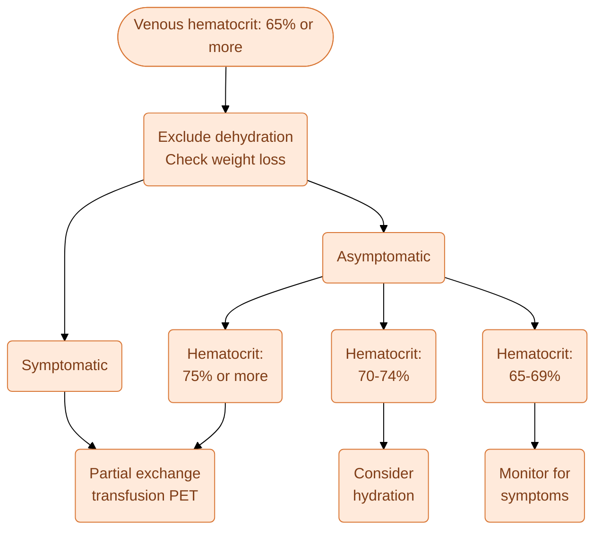

---
{"dg-publish":true,"uptext":"Back to Index (Neonatology)","uplink":"/neonatology/","permalink":"/neonatalogy/polycythemia/","dgPassFrontmatter":true}
---

## Definition

- Polycythemia is defined as an increase in hematocrit levels greater than two standard deviations above the mean for gestation and postnatal age.
- It is diagnosed when the peripheral venous hematocrit is 65% or more.
- Alternatively, it is diagnosed when the venous hemoglobin concentration is greater than 22 g/dL.
- Hyperviscosity is defined as a viscosity greater than 14.6 centipoise at a shear rate of 11.5 per second.
- The incidence of polycythemia varies from 1.5% to 4% of all live births.

## Pathophysiology And Hyperviscosity

- The viscosity of blood is directly proportional to hematocrit and plasma viscosity. It is inversely proportional to the deformability of red blood cells.
- The relationship between viscosity and hematocrit is nearly linear up to a hematocrit of 60% to 65%.
- Blood viscosity increases exponentially at a hematocrit of 70% or greater.
- Increased viscosity impairs tissue oxygenation and decreases blood flow. This leads to an increased risk of microthrombus formation.
- Microthrombi can cause significant damage if they occur in the cerebral cortex, kidneys, and adrenal glands.
- In the early postnatal period, hematocrit peaks around 2 hours of age. It may normally reach up to 71% due to transudation of fluid out of the intravascular space.
- Hematocrit gradually declines to 68% by 6 hours and stabilizes by 12 to 24 hours of life.

## Etiology And Risk Factors

- The causes of polycythemia can be categorized into increased erythropoiesis and secondary transfusions.

|Mechanism|Specific Causes|
|---|---|
|Increased Erythropoiesis (Intrauterine Hypoxia)|Placental insufficiency, small for gestational age (SGA), post-maturity, gestational hypertension.|
|Increased Erythropoiesis (Other Maternal Factors)|Maternal smoking, severe maternal heart disease, drugs like propranolol, maternal diabetes.|
|Increased Erythropoiesis (Fetal Factors)|Neonatal hyperthyroidism or hypothyroidism, congenital adrenal hyperplasia, Beckwith-Wiedemann syndrome.|
|Increased Erythropoiesis (Chromosomal)|Trisomy 13, Trisomy 18, Trisomy 21 (Down syndrome).|
|Secondary To Transfusions|Delayed cord clamping (intentional or unassisted delivery).|
|Secondary To Transfusions|Maternal-to-fetal transfusion, twin-to-twin transfusion syndrome.|

## Clinical Features

- Most infants with polycythemia are asymptomatic. Approximately 50% of neonates develop one or more symptoms.
- The symptoms are often non-specific and may be related to underlying conditions.

|System|Clinical Findings|
|---|---|
|Central Nervous System|Hypotonia, sleepiness, irritability, jitteriness, seizures, and cerebral venous thrombosis. Late signs include motor deficits and lower IQ scores.|
|Cardiorespiratory|Tachypnea, respiratory distress, cyanosis, plethora, tachycardia, and heart murmur. Echocardiography may show decreased cardiac output and increased pulmonary resistance.|
|Gastrointestinal|Poor suck, vomiting, feed intolerance, abdominal distension, and necrotizing enterocolitis (NEC).|
|Renal|Oliguria, hematuria, transient hypertension, and renal vein thrombosis.|
|Metabolic|Hypoglycemia, hypocalcemia, and jaundice.|
|Hematology|Mild thrombocytopenia and rare thrombosis.|
|Miscellaneous|Priapism, testicular infarction, and peripheral gangrene.|

## Screening Protocol

- Routine screening of asymptomatic newborns is not recommended.
- Screening is indicated for high-risk neonates. These include SGA, large for gestational age (LGA), and infants of diabetic mothers.
- Mono-chorionic twins (especially the larger twin) and infants with morphological features of intrauterine growth restriction require screening.
- The initial screening is performed at 2 hours of life. If levels are high, it is repeated at 6, 12, 24, and 48 hours.
- A peripheral venous sample is preferred. Capillary samples overestimate the hematocrit by 5% to 15%.
- High capillary hematocrit values must always be confirmed with a venous sample.

## Management

### Initial Assessment

- Exclude dehydration before diagnosing polycythemia. Check for excessive weight loss greater than 10% to 15%.
- If dehydration is present, correct it by increasing fluid or feed intake. Re-evaluate the hematocrit after correcting dehydration.
- Exclude associated metabolic problems like hypoglycemia.

### Management Based On Symptoms And Hematocrit

- Management depends on the presence of symptoms and the absolute venous hematocrit value.

#### Symptomatic Neonates

- If the venous hematocrit is 65% or more and the neonate is symptomatic, partial exchange transfusion (PET) is indicated.
- Symptoms like jitteriness may persist for 1 to 2 days following PET despite lowering the hematocrit.

#### Asymptomatic Neonates

- Hematocrit 65% to 69%: Merely observe the infant. Monitor for symptoms and repeat the hematocrit in 4 to 6 hours.
- Hematocrit 70% to 74%: Manage conservatively with hydration. Add extra fluids or feeds of 20 mL/kg/day to achieve hemodilution.
- Hematocrit 75% or more: These infants are usually managed with PET.

### Partial Exchange Transfusion (PET) Procedure

- PET involves removing a calculated volume of blood and replacing it with normal saline. The target hematocrit is 55%.
- Crystalloids like 0.9% normal saline are preferred over colloids. They are less expensive, equally effective, and carry no risk of transfusion-associated infections.
- The peripheral venous route is considered safer than the umbilical venous route. Umbilical vein use for PET may be associated with an increased incidence of NEC.
- The volume of exchange is calculated using the following formula:
$$Volume (mL) = \frac{Blood volume \times (Observed \ Hematocrit - Desired \ Hematocrit)}{ Observed \ Hematocrit.}$$
- The assumed blood volume is approximately 80 to 90 mL/kg for term babies. It is 90 to 100 mL/kg for preterm babies.
- As a general rule of thumb, the volume of blood exchanged is usually 15 to 20 mL/kg of body weight.

### Outcomes Of Therapy

- PET rapidly reverses physiological abnormalities associated with hyperviscosity. It improves cerebral blood flow, cardiac function, and capillary perfusion.
- There are no proven long-term neurodevelopmental benefits of PET in asymptomatic infants or those with minor symptoms.