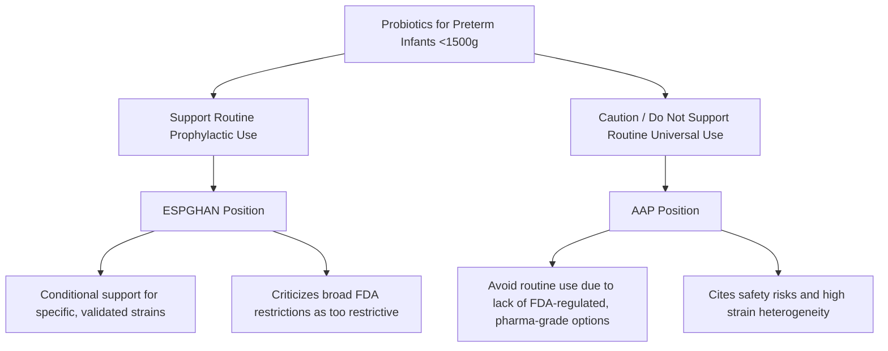
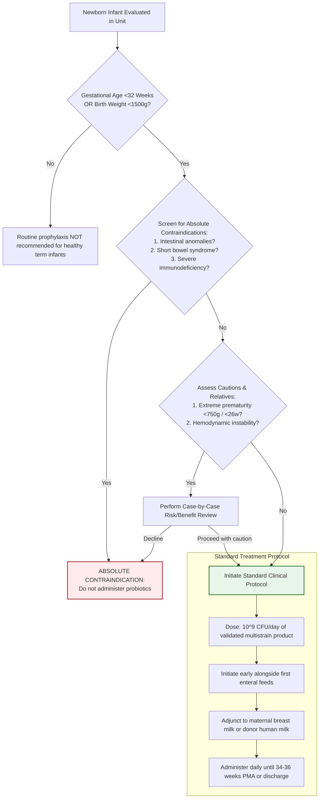

---
{"dg-publish":true,"permalink":"/neonatalogy/probiotics-in-neonates/","dgPassFrontmatter":true}
---

## 1. Introduction

- **Definition:** Live microorganisms which, when administered in adequate amounts, confer a health benefit on the host.
- **Clinical Goal:** Establish a healthy commensal microbiome in the preterm gut to prevent dysbiosis, pathological colonization, and systemic inflammation.
- **Clinical Scope:** Strongest evidence supports use in preterm, Very Low Birth Weight (VLBW) and Extremely Low Birth Weight (ELBW) infants. Evidence for healthy, full-term neonates remains sparse.

## 2. Mechanisms of Action

Probiotics support gut integrity and immune maturation through several pathways:

- **Barrier Enhancement:** Strengthens epithelial tight junctions, upregulates tight junction proteins (occludin, ZO-1), and reduces permeability ("leaky gut").
- **Competitive Inhibition:** Outcompetes pathogens for essential nutrients and mucosal receptor sites.
- **Immunomodulation:** Upregulates anti-inflammatory cytokines (IL-10) and downregulates pro-inflammatory cytokines (TNF-alpha, IL-6).
- **Trophic Mucosal Effects:** Upregulates mucin production and ferments carbohydrates into Short-Chain Fatty Acids (SCFAs) to nourish colonocytes.

## 3. Clinical Effectiveness (Preterm & ELBW Infants)

Prophylactic probiotics provide established therapeutic benefits in high-risk preterm infants:

- **VLBW (<1500g) Infants:** Probiotics consistently reduce severe necrotizing enterocolitis (NEC ≥ Stage II), reduce all-cause mortality, and shorten the time to reach full enteral feeds.
- **ELBW (<1000g) / Extremely Preterm (<28 weeks) Infants:** Benefits for NEC and mortality are observed, though the overall quality of evidence is lower and the effect on late-onset sepsis is less definitive.

### Key Clinical Outcomes

| **Outcome (Preterm Cohort)** | **Clinical Effect of Probiotics**                      | **Optimal Pattern**                                                      |
| ---------------------------- | ------------------------------------------------------ | ------------------------------------------------------------------------ |
| **NEC (Stage II or higher)** | Significant reduction (Number Needed to Treat ~ 20–25) | Multistrain preparations containing _Bifidobacterium infantis_           |
| **All-Cause Mortality**      | Modest, statistically significant reduction            | Multistrain products                                                     |
| **Late-Onset Sepsis**        | Small-to-moderate reduction in culture-proven sepsis   | Multistrain combinations; certain single-strains plus bovine lactoferrin |
| **Feeding Tolerance**        | Faster transition to full enteral feeds                | Various single and multistrain regimens                                  |

## 4. Strains, Dosage, and Protocol

- **Common Strains:** _Bifidobacterium_ species (_B. infantis_, _B. lactis_, _B. bifidum_, _B. breve_) and _Lactobacillus_ species (_L. rhamnosus_ GG, _L. acidophilus_, _L. reuteri_). _Saccharomyces boulardii_ (yeast) is generally avoided in patients with central lines due to fungemia risk.
- **Dosage:** Typically 10^9 Colony Forming Units (CFU) per day (1 billion CFU/day).
- **Timing:** Initiate early, alongside first enteral feeds, and continue daily until 34–36 weeks Post-Menstrual Age (PMA) or discharge.
- **Composition:** Multistrain combinations are widely considered more effective than single-strain regimens.

## 5. Safety, Quality Control, and Adverse Events

- **Product Quality:** Probiotics are widely sold as unregulated dietary supplements. Commercial preparations vary in purity and composition. Clinical protocols must mandate pharmaceutical-grade, third-party tested, or strictly validated preparations.
- **Probiotic Sepsis (Bacteremia/Fungemia):** Rare but confirmed cases of bloodstream translocation exist. This risk underscores the need for strict quality surveillance.
- **Absolute Contraindications:**
    - Known structural intestinal anomalies (e.g., gastroschisis, omphalocele).
    - Short Bowel Syndrome (risk of D-lactic acidosis).
    - Primary or severe secondary immunodeficiency disorders.
- **Relative Contraindications/Precautions:** Extreme prematurity (<750g or <26 weeks) or acute hemodynamic instability/active phase of NEC (hold doses during acute clinical deterioration).

## 6. Guidelines and Expert Disagreements

Professional societies remain divided regarding routine, universal administration of probiotics:

- **ESPGHAN:** Offers a conditional recommendation supporting specific strains (such as _L. rhamnosus_ GG or a combination of _B. infantis_, _B. lactis_, and _S. thermophilus_). They advocate for a nuanced approach utilizing selected, verified strains rather than blanket restrictions.
- **AAP:** Concludes that current evidence does not support routine universal administration, citing a lack of regulated pharmaceutical-grade products, high strain heterogeneity, and potential safety concerns in the most fragile infants.

## 7. Evidence in Term Neonates

- There are currently no medical consensus guidelines supporting or recommending prophylactic probiotics in healthy, full-term newborns. A single large trial showed that a specific synbiotic preparation reduced sepsis in late-preterm and term low-birth-weight infants, but these findings cannot be generalized to standard healthy term infants.

## 8. Summary Clinical Pathway

