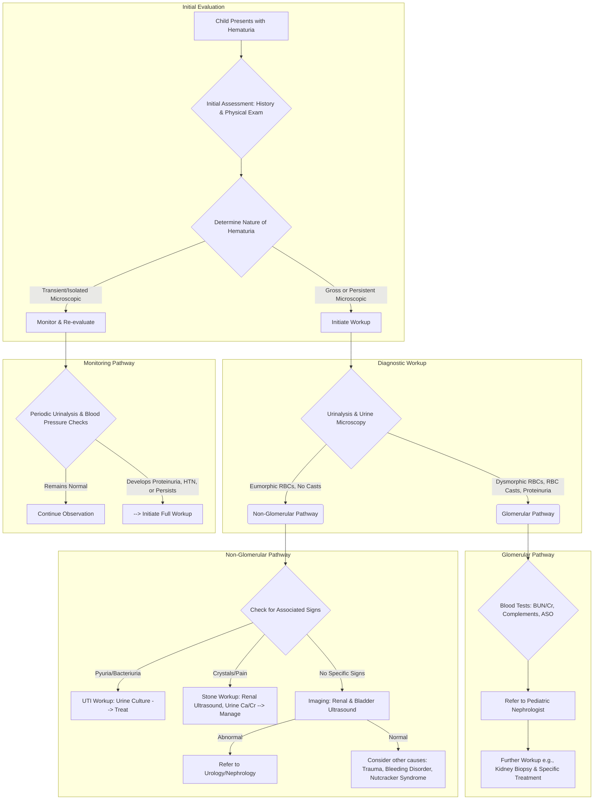

---
{"dg-publish":true,"permalink":"/nephrology/approach-to-hematuria/","noteIcon":"","dgPassFrontmatter":true}
---

## Differential Diagnosis of Hematuria in a 3-Year-Old

- Hematuria is clinically defined as the persistent presence of more than 5 red blood cells (RBCs) per high-power field (hpf) in uncentrifuged urine, or more than 3 RBCs/hpf in a centrifuged sediment.
- The differential diagnosis for a 3-year-old presenting with hematuria is broad and is primarily divided into glomerular and non-glomerular etiologies.
- Upper urinary tract sources of hematuria originate within the nephron, including the glomerulus, tubular system, or interstitium.
- Lower urinary tract sources originate from the pelvicalyceal system, ureter, bladder, or urethra.

|Category|Specific Etiologies|Clinical Correlates|
|:--|:--|:--|
|**Glomerular**|Postinfectious Glomerulonephritis (PIGN)|Often follows a streptococcal throat or skin infection; presents with edema, oliguria, and hypertension.|
||IgA Nephropathy|Coincides with upper respiratory or gastrointestinal infections; presents with recurrent gross hematuria.|
||IgA Vasculitis (Henoch-Schönlein Purpura)|Systemic vasculitis presenting with a palpable purpuric rash, arthritis, abdominal pain, and nephritis.|
||Hemolytic Uremic Syndrome (HUS)|Follows gastrointestinal illness; presents with microangiopathic hemolytic anemia, thrombocytopenia, and acute kidney injury.|
||Alport Syndrome / Thin Basement Membrane Disease|Hereditary conditions presenting with persistent microscopic hematuria and a family history of kidney failure or deafness.|
||Membranoproliferative Glomerulonephritis|Presents with mixed nephritic-nephrotic picture and persistent hypocomplementemia.|
||Lupus Nephritis|Associated with systemic lupus erythematosus; presents with systemic signs such as rash and joint pain.|
|**Non-Glomerular**|Urinary Tract Infection (UTI)|The most common cause of gross hematuria; presents with dysuria, frequency, and fever.|
||Idiopathic Hypercalciuria|Common metabolic cause; can present with painless gross or microscopic hematuria, or dysuria.|
||Urolithiasis (Kidney Stones)|Presents with severe renal colic, flank pain, and hematuria.|
||Anatomic Abnormalities|Includes hydronephrosis, multicystic dysplastic kidney, polycystic kidney disease, or Wilms tumor; often presents with a palpable abdominal mass.|
||Trauma|Hematuria following blunt or penetrating injury to the abdomen or back.|
||Coagulopathy / Bleeding Disorders|Hemophilia or thrombocytopenia can cause spontaneous urinary tract bleeding.|
||Chemical / Hemorrhagic Cystitis|Associated with adenovirus infections or nephrotoxic medications like cyclophosphamide.|

## Clinical Evaluation and Diagnostic Approach

### History and Physical Examination

- A meticulous history is required, focusing on the color of the urine (brown/cola-colored suggests glomerular; bright red suggests lower tract), timing in relation to the urinary stream, and associated symptoms like abdominal pain or dysuria.
- The clinician must inquire about recent upper respiratory, skin, or gastrointestinal infections, which can precipitate IgA nephropathy, postinfectious glomerulonephritis, or HUS.
- A family history of deafness, renal disease, polycystic kidneys, or urolithiasis is critical for diagnosing hereditary conditions like Alport syndrome or idiopathic hypercalciuria.
- Physical examination should assess for hypertension, facial or peripheral edema, and signs of heart failure, which are classic indicators of acute glomerulonephritis.
- The skin and joints should be examined for purpuric rashes and arthritis, suggesting IgA vasculitis or lupus, while the abdomen is palpated to rule out distended bladder, hydronephrosis, or tumors.
- Examination of the external genitalia is necessary to identify anatomic abnormalities, meatal stenosis, or local perineal irritation.

### Distinguishing Glomerular vs. Non-Glomerular Hematuria

|Feature|Glomerular Hematuria|Non-Glomerular Hematuria|
|:--|:--|:--|
|**Urine Color**|Brown, cola, tea-colored, or smoky.|Bright red or pink.|
|**Clots**|Absent.|Often present.|
|**Proteinuria**|Usually >100 mg/dL (significant).|Usually <100 mg/dL (minimal).|
|**RBC Morphology**|>30% dysmorphic RBCs (acanthocytes).|>90% isomorphic (normal shape) RBCs.|
|**Casts**|RBC casts commonly present.|Absent.|

### Laboratory and Imaging Evaluation

- Urinalysis and phase-contrast microscopy are the first steps to quantify RBCs, detect RBC casts, and assess for dysmorphic cells characteristic of glomerular bleeding.
- A urine culture is mandatory to exclude urinary tract infection, especially in patients with dysuria or fever.
- A spot urine calcium-to-creatinine ratio is obtained; a value >0.2 mg/mg in children over 2 years of age suggests hypercalciuria.
- Blood tests should include a complete blood count (CBC), serum electrolytes, blood urea nitrogen (BUN), serum creatinine, and serum albumin to evaluate overall kidney function and detect complications.
- Serum complement levels (C3 and C4) are crucial for differentiation; C3 is transiently low in poststreptococcal GN, persistently low in membranoproliferative GN, and both C3 and C4 are low in lupus nephritis.
- Serological testing for antistreptolysin O (ASO) and anti-DNAse B titers confirms a preceding streptococcal infection.
- Renal and bladder ultrasonography is the primary imaging modality to rule out anatomic abnormalities, hydronephrosis, cystic disease, urolithiasis, and tumors.
- A kidney biopsy is indicated for patients with gross hematuria or persistent microscopic hematuria accompanied by decreased renal function, severe proteinuria, hypertension, or persistent hypocomplementemia lasting beyond 8 to 12 weeks.

## Management of Hematuria

### Asymptomatic Isolated Microscopic Hematuria

- Children with asymptomatic, isolated microscopic hematuria and a completely normal initial evaluation require conservative monitoring.
- Blood pressure and urinalysis should be checked every 3 months until the hematuria resolves; extensive diagnostic testing or invasive procedures like cystoscopy are usually unnecessary and costly.
- Referral to a pediatric nephrologist is recommended if the asymptomatic hematuria persists for more than 1 year or if proteinuria or hypertension develops.

### Acute Glomerulonephritis (e.g., Poststreptococcal GN)

- The management of acute poststreptococcal glomerulonephritis is primarily supportive, aimed at treating the acute consequences of kidney dysfunction, volume overload, and hypertension.
- Sodium, potassium, and fluid intake must be strictly restricted until serum creatinine levels normalize and adequate diuresis is established.
- Mild to moderate edema and volume-dependent hypertension are managed with oral loop diuretics, such as furosemide (1-3 mg/kg).
- Patients with severe pulmonary edema, hypertensive emergencies, or congestive heart failure require intravenous furosemide (2-4 mg/kg) and continuous infusions of vasodilators or antihypertensive agents (e.g., nitroprusside, labetalol, or calcium channel blockers).
- Antibiotic therapy (e.g., penicillin) is administered if there is evidence of active streptococcal infection at the time of diagnosis, though it does not alter the natural history of the glomerulonephritis.
- Dialysis is infrequently required but is indicated in children with severe oliguria, life-threatening electrolyte disturbances (e.g., hyperkalemia), or fluid overload refractory to medical management.

### IgA Vasculitis (Henoch-Schönlein Purpura) Nephritis

- Patients with mild kidney involvement (isolated microscopic hematuria or low-grade proteinuria) are monitored closely with weekly urinalysis and blood pressure checks during the active phase of the disease.
- For persistent proteinuria (>0.5–1 g/d/1.73 m²), conservative treatment with angiotensin-converting enzyme (ACE) inhibitors or angiotensin receptor blockers (ARBs) for at least 6 months is recommended to reduce proteinuria and slow disease progression.
- In patients with moderate to severe nephritis (nephrotic-range proteinuria, reduced glomerular filtration rate, or >50% crescents on biopsy), aggressive immunosuppressive therapy is indicated.
- Treatment regimens typically involve intravenous methylprednisolone pulses for 3 days, followed by a 3-month course of oral prednisone combined with immunosuppressive agents like azathioprine or mycophenolate mofetil.
- For the most severe, rapidly progressive crescentic presentations, therapy with cyclophosphamide or plasmapheresis in conjunction with corticosteroids is utilized to prevent end-stage kidney disease.

### Hemolytic Uremic Syndrome (HUS)

- The diagnosis of HUS requires immediate hospitalization, as it is characterized by the triad of microangiopathic hemolytic anemia, thrombocytopenia, and acute kidney injury.
- The management of typical, Shiga toxin-associated HUS is primarily supportive, involving meticulous fluid and electrolyte balance, correction of volume deficits, and aggressive control of hypertension.
- Red blood cell transfusions are often necessary due to brisk and recurrent hemolysis; however, platelet transfusions are generally contraindicated as they may exacerbate microvascular thrombosis.
- Early institution of dialysis is indicated for patients who become significantly oliguric or anuric, or develop medically refractory hyperkalemia.
- For atypical HUS (aHUS) caused by complement dysregulation, the primary initial therapy is the prompt initiation of plasma exchange (PEX).
- Eculizumab, a terminal complement inhibitor, is indicated for aHUS patients demonstrating incomplete remission with plasma therapy, those with life-threatening features, or those with identified inherited defects in complement regulation.

### IgA Nephropathy

- IgA nephropathy typically follows a benign course in childhood but requires long-term follow-up as progressive kidney dysfunction can occur in adulthood.
- First-line management for significant proteinuria involves renin-angiotensin system blockade with ACE inhibitors or ARBs to lower proteinuria and preserve renal function.
- If significant proteinuria persists despite maximal ACE inhibitor therapy, the addition of oral corticosteroids for 6 months is indicated to induce remission.
- Tonsillectomy may be considered in children where tonsils act as an infectious focus triggering recurrent gross hematuria.

### Hypercalciuria and Urolithiasis

- Treatment of idiopathic hypercalciuria centers on high fluid intake and a diet restricted in sodium and animal protein.
- If dietary measures fail, oral thiazide diuretics are utilized to stimulate calcium reabsorption in the tubules, normalizing urinary calcium excretion and resolving hematuria.
- For active urolithiasis, pain management with nonsteroidal anti-inflammatory drugs and adequate hydration are prioritized; small ureteral stones (<5 mm) frequently pass spontaneously.
- Medical expulsive therapy, such as an alpha-adrenergic blocker (e.g., tamsulosin), may facilitate the passage of distal ureteral stones.

### Urinary Tract Infections (UTI)

- Acute cystitis and pyelonephritis should be treated promptly with empiric antibiotics, modified subsequently based on urine culture sensitivity results.
- Oral antibiotics for 7 to 10 days are generally safe and effective for uncomplicated UTIs in stable, outpatient children.
- Parenteral antibiotic therapy is recommended for young infants, children with severe dehydration, emesis, or those at risk for urosepsis, transitioning to oral therapy once the patient is clinically stable.