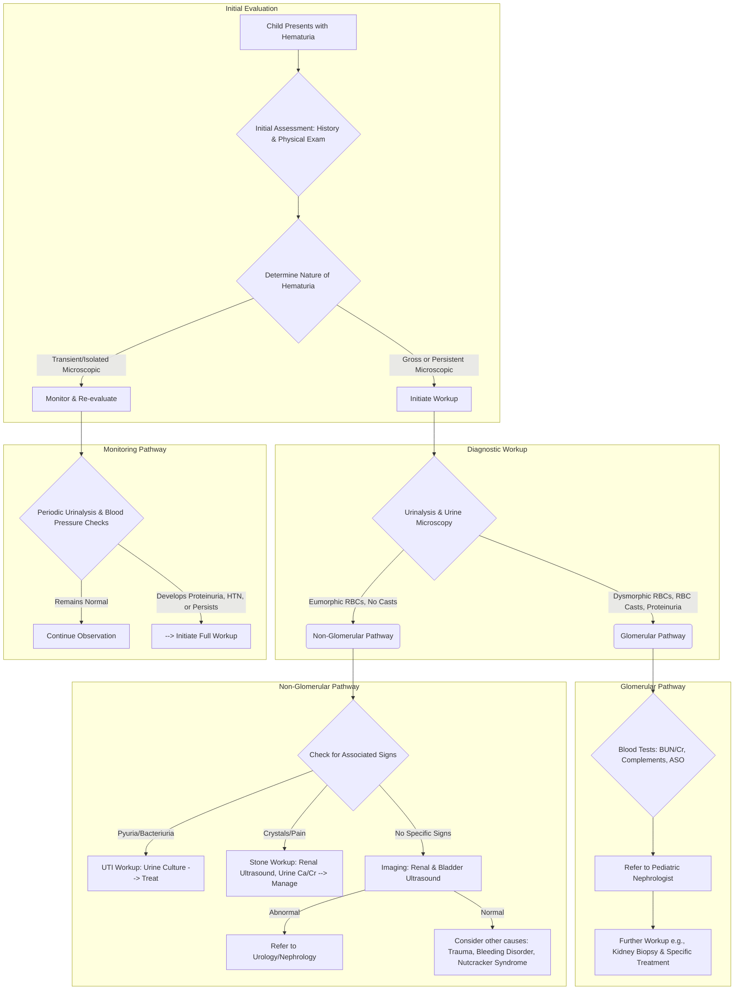

---
{"dg-publish":true,"permalink":"/nephrology/approach-to-hematuria/","noteIcon":"","dgPassFrontmatter":true}
---

Hematuria, the presence of blood in the urine, is a common finding in children that warrants a systematic and thorough evaluation. The approach involves a detailed history, a comprehensive physical examination, and appropriate laboratory and imaging studies to determine the underlying cause and guide management.

### **Initial Assessment: History and Physical Examination**

A careful history and physical exam are crucial first steps in evaluating a child with hematuria.

**History:**

- **Nature of Hematuria:**
    
    - **Gross vs. Microscopic:** Is the blood visible to the naked eye (gross hematuria), or was it found on a routine urinalysis (microscopic hematuria)?
        
    - **Color:** Bright red or pink urine often suggests a lower urinary tract source (bladder or urethra), while brown, "tea-colored," or "cola-colored" urine is more indicative of a glomerular (kidney) origin.
        
    - **Timing:** Blood at the beginning of urination (initial hematuria) may point to a urethral source, while blood at the end (terminal hematuria) often suggests a bladder neck or prostatic urethral issue. Blood throughout urination (total hematuria) can originate from anywhere in the urinary tract.
        
    - **Clots:** The presence of blood clots usually indicates a non-glomerular source.
        
- **Associated Symptoms:**
    
    - **Pain:** Flank or abdominal pain may suggest kidney stones, infection, or obstruction. Pain with urination (dysuria) can indicate a urinary tract infection (UTI).
        
    - **Systemic Symptoms:** Fever, rash, joint pain, or recent illness (especially a sore throat or skin infection) can be associated with glomerular diseases like post-streptococcal glomerulonephritis or IgA nephropathy.
        
    - **Edema and Hypertension:** Swelling (edema) and high blood pressure can be signs of significant kidney disease.
        
- **Past Medical and Family History:**
    
    - Inquire about previous UTIs, kidney stones, trauma to the abdomen or back, and any known kidney or urological problems.
        
    - A family history of hematuria, kidney disease, hearing loss, or kidney stones is important, as some causes of hematuria are hereditary (e.g., Alport syndrome, thin basement membrane disease).
        
- **Medications and Diet:**
    
    - Certain medications (e.g., NSAIDs, some antibiotics) and foods (e.g., beets, blackberries) can cause red-colored urine.
        

**Physical Examination:**

- **Vitals:** Measure blood pressure, as hypertension is a key sign of significant renal disease.
    
- **General:** Look for signs of swelling (edema) in the face, hands, or feet.
    
- **Abdomen:** Palpate for any masses, tenderness in the flanks (costovertebral angle tenderness), or an enlarged bladder.
    
- **Skin:** Check for rashes or other skin lesions that might suggest a systemic disease.
    
- **Genitalia:** Examine for any external sources of bleeding.
    

### **Diagnostic Workup**

The diagnostic evaluation is guided by the findings from the history and physical examination.

**Urinalysis and Urine Microscopy:**

- **Confirmation of Hematuria:** The first step is to confirm the presence of red blood cells (RBCs) with a microscopic examination of the urine. A urine dipstick can be a screening tool, but it's not specific for RBCs and can be positive with myoglobin or hemoglobin.
    
- **Glomerular vs. Non-Glomerular:** Urine microscopy can help differentiate the source of bleeding. The presence of **RBC casts** (cylindrical structures formed in the kidney tubules) and **dysmorphic RBCs** (abnormally shaped red blood cells) strongly suggests a glomerular origin.
    
- **Proteinuria:** The presence of protein in the urine (proteinuria) along with hematuria is another indicator of glomerular disease.
    
- **Other Findings:** The presence of white blood cells and bacteria may indicate a UTI. Crystals in the urine might suggest kidney stones.
    

**Blood Tests:**

- **Renal Function:** A basic metabolic panel, including blood urea nitrogen (BUN) and creatinine, is essential to assess kidney function.
    
- **Complete Blood Count (CBC):** This can reveal anemia, which might be present in chronic kidney disease.
    
- **Further Tests:** If a glomerular cause is suspected, additional blood tests may be ordered, such as complement levels (C3, C4), antistreptolysin O (ASO) titers (if post-streptococcal glomerulonephritis is suspected), and tests for autoimmune diseases (e.g., ANA).
    

**Imaging Studies:**

- **Renal and Bladder Ultrasound:** This is a non-invasive and safe imaging test that is often the first-line investigation. It can identify structural abnormalities of the kidneys and bladder, kidney stones, cysts, and tumors.
    
- **Other Imaging:** In some cases, a CT scan or MRI may be necessary for a more detailed evaluation, particularly if a tumor or complex structural anomaly is suspected.
    

### **Common Causes of Hematuria in Children**

The causes of hematuria can be broadly categorized as glomerular or non-glomerular.

**Glomerular Causes:**

- **IgA Nephropathy:** The most common cause of recurrent gross hematuria in children, often following an upper respiratory or gastrointestinal infection.
    
- **Post-Infectious Glomerulonephritis:** Typically occurs after a streptococcal infection of the throat or skin.
    
- **Thin Basement Membrane Disease:** A benign inherited condition that causes persistent microscopic hematuria.
    
- **Alport Syndrome:** A genetic disorder characterized by hematuria, progressive kidney failure, and often hearing loss and eye abnormalities.
    
- **Henoch-Schönlein Purpura (HSP) Nephritis:** A systemic vasculitis that can affect the kidneys.
    
- **Lupus Nephritis:** Kidney inflammation caused by systemic lupus erythematosus.
    

**Non-Glomerular Causes:**

- **Urinary Tract Infection (UTI):** A common cause, especially in girls.
    
- **Hypercalciuria:** High levels of calcium in the urine, which can cause hematuria even without the formation of kidney stones.
    
- **Kidney Stones (Nephrolithiasis):** Can cause significant pain and gross hematuria.
    
- **Trauma:** Injury to the kidneys or urinary tract.
    
- **Structural Abnormalities:** Such as ureteropelvic junction (UPJ) obstruction.
    
- **Nutcracker Syndrome:** Compression of the left renal vein, which can lead to hematuria.
    
- **Sickle Cell Disease or Trait:** Can cause damage to the kidneys and lead to hematuria.
    
- **Tumors:** Although rare in children, tumors of the kidney (e.g., Wilms' tumor) or bladder can cause hematuria.
    

### **When to Refer to a Pediatric Nephrologist**

Referral to a pediatric nephrologist is recommended in the following situations:

- **Persistent Microscopic Hematuria:** Hematuria that is present on three or more consecutive urinalyses over several weeks.
    
- **Gross Hematuria:** All cases of visible blood in the urine.
    
- **Signs of Glomerular Disease:** Presence of RBC casts, significant proteinuria, or dysmorphic RBCs on urine microscopy.
    
- **Associated Systemic Symptoms:** Hypertension, edema, or impaired kidney function.
    
- **Family History:** A family history of significant kidney disease, deafness, or inherited kidney disorders.
    
- **Uncertain Diagnosis:** When the cause of hematuria remains unclear after the initial evaluation.
    

A systematic approach to hematuria in children is essential to identify the underlying cause and ensure appropriate management. While many causes are benign and self-limited, some can indicate serious underlying kidney disease that requires prompt diagnosis and treatment.

Sources