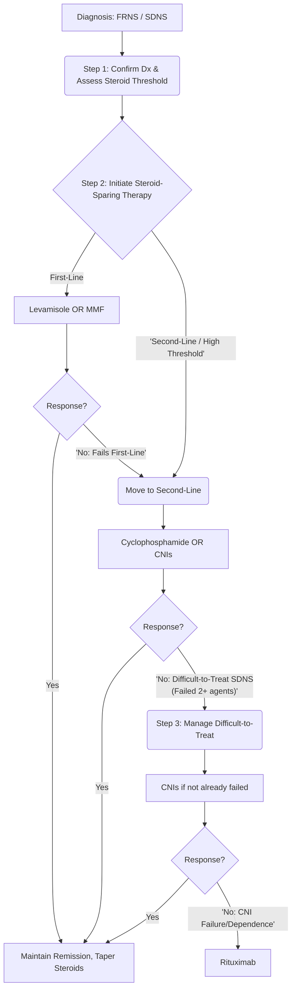
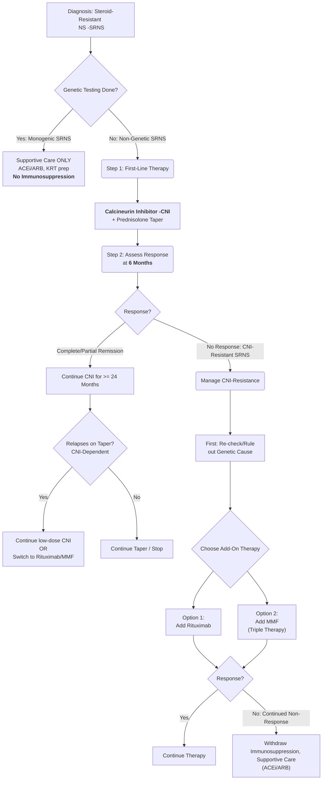

---
{"dg-publish":true,"permalink":"/nephrology/nephrotic-syndrome/","noteIcon":""}
---

# **Pediatric Nephrotic Syndrome**

**Based on Recent ISPN Guidelines (2021)**

### **1\. Definition & Classic Tetrad**

Nephrotic Syndrome is a clinical syndrome characterized by a collection of findings resulting from massive renal protein loss.

#### **The Classic Tetrad:**

1. **Heavy Proteinuria:** Urine protein/creatinine ratio (UPCR) \>2 mg/mg (or \>200 mg/mmol) or 3+/4+ on urine dipstick.  
2. **Hypoalbuminemia:** Serum albumin \<3.0 g/dL.  
3. **Edema:** Generalized edema (anasarca) is the clinical hallmark.  
4. **Hyperlipidemia:** Elevated serum cholesterol and triglycerides.

### **2\. Clinical Definitions & Course (ISPN 2021\)**

The response to steroid therapy defines the clinical course.

* **Remission:** Urine protein nil or trace (UPCR \<0.2 mg/mg) for three consecutive days.  
* **Relapse:** Urine protein ≥3+ (UPCR \>2 mg/mg) for three consecutive days after being in remission.

#### **Based on Steroid Response:**

* **<mark style="background: #ABF7F7A6;">Steroid-Sensitive (SSNS):</mark>** Achieves complete remission within the initial 6 weeks of high-dose daily steroid therapy.  
* **<mark style="background: #ABF7F7A6;">Steroid-Resistant (SRNS):</mark>** Fails to achieve remission despite 6 weeks of daily prednisolone (2 mg/kg/day). This applies to both initial (at first presentation) and late (in a subsequent relapse) resistance.  
* **<mark style="background: #ABF7F7A6;">Frequently Relapsing (FRNS):</mark>**  
  * ≥2 relapses in the first 6 months after initial therapy.  
  * ≥3 relapses in any 6 months.  
  * ≥4 relapses in any 12-month period.  
* **<mark style="background: #ABF7F7A6;">Steroid-Dependent (SDNS):</mark>** Two consecutive relapses while on alternate-day steroids, or within 14 days of stopping steroid therapy.  
* **<mark style="background: #ABF7F7A6;">Difficult-to-Treat SSNS:</mark>** Meets criteria for FRNS/SDNS and has failed treatment with at least two steroid-sparing agents (e.g., levamisole, MMF, cyclophosphamide).

### **3\. Pathophysiology**

The primary defect is an injury to the **podocytes** (glomerular epithelial cells). This leads to a loss of the glomerular filtration barrier's integrity, causing massive proteinuria, subsequent hypoalbuminemia, decreased plasma oncotic pressure, and the resultant edema and hyperlipidemia.

### **4\. Clinical Presentation**

* **Edema:** The hallmark sign, typically starting as **periorbital edema** and progressing to become generalized (anasarca), with ascites and pitting edema.  
* **Frothy Urine:** Caused by heavy proteinuria.  
* **Other Symptoms:** Fatigue, irritability, abdominal pain. Blood pressure is usually normal in Minimal Change Disease (MCD).

### **5\. Diagnosis & Evaluation**

Diagnosis is primarily clinical and biochemical, supported by a kidney biopsy in specific situations.

#### **Initial Investigations:**

* **Urinalysis:** Dipstick for proteinuria (3+/4+) and a spot **UPCR** to quantify (\>2 mg/mg).  
* **Blood Tests:** Serum albumin (\<3.0 g/dL), lipid profile, serum creatinine (usually normal), and electrolytes.

#### **Kidney Biopsy:**

* **Not performed routinely** for typical SSNS in children aged 1-12 years (MCD is presumed).  
* **<mark style="background: #FFF3A3A6;">Key Indications:</mark>**  
  * **Steroid Resistance (SRNS)** is the chief indication.  
  * Age \<1 year or \>12 years at onset.  
  * Atypical features: persistent hypertension, gross hematuria, low complement C3, or significant renal failure not due to hypovolemia.  
  * Prior to starting Calcineurin Inhibitors (CNIs) in SSNS (suggested, not mandatory).  
  * Prolonged (\>30-36 months) CNI therapy to assess for nephrotoxicity.

#### **Genetic Testing (for SRNS):**

* Recommended for:  
  * Congenital or infantile (\<1 year) onset.  
  * Family history of SRNS.  
  * Syndromic features.  
  * Resistance to CNI therapy.  
  * Pre-transplant evaluation.  
* Patients with a confirmed monogenic cause generally do not respond to immunosuppression.

### **6\. Management (ISPN 2021 Guidelines)**

#### **A. Steroid-Sensitive Nephrotic Syndrome (SSNS)**

##### **1\. Initial Episode (Presumed MCD)**

* **Corticosteroids:** **Oral Prednisolone** is first-line.  
  * **Induction:** 60 mg/m²/day or 2 mg/kg/day (max 60 mg) for **6 weeks**.  
  * **Taper:** 40 mg/m² or 1.5 mg/kg (max 40 mg) on **alternate days for 6 weeks**, then stop.  
  * *Note: Recent trials show extending therapy beyond this 12-week course does not reduce relapse risk.*

##### **2\. Relapses**

* Treat with daily Prednisolone (60 mg/m²/day or 2 mg/kg/day) until remission is achieved (urine protein nil/trace for 3 days).  
* Follow with alternate-day Prednisolone (40 mg/m²) for **4 weeks**.  
* **For intercurrent infections (e.g., URI):** Switch from alternate-day to daily prednisolone at the same dose for 5-7 days to prevent an infection-triggered relapse.

##### **3\. Frequently Relapsing / Steroid-Dependent (FRNS/SDNS)**

* **Goal:** Maintain remission and reduce steroid toxicity. A stepwise approach is used.

###### **Step 1: Confirm the Diagnosis & Assess Steroid Threshold**

* Before starting steroid-sparing agents, confirm the diagnosis of SDNS.  
* The dose of alternate-day prednisolone at which the patient relapses is known as the **"steroid threshold."** A high threshold (e.g., \>0.7-1 mg/kg on alternate days) indicates more severe disease and a greater need for potent steroid-sparing therapy.

###### Step 2: Initiate Steroid-Sparing Therapy  
The choice of agent depends on the disease severity (steroid threshold), patient age, and risk of side effects.

* **First-Line Steroid-Sparing Agents:**  

  * **Levamisole:** An immunomodulator. It is often a first choice, especially for patients with a lower steroid threshold. It is generally well-tolerated.  
  * **Mycophenolate Mofetil (MMF):** An immunosuppressant that is also a common first-line choice. ISPN guidelines suggest MMF may be more effective than levamisole in patients with SDNS.  
  * **Goal:** These medications are added to the current steroid regimen, with the aim of slowly tapering and discontinuing the prednisolone over several months. 

* Second-Line / More Potent Agents:  

  Used for patients who fail or have an inadequate response to Levamisole or MMF, or for those with a very high steroid threshold and significant steroid toxicity from the outset.  
  * **Cyclophosphamide:** An alkylating agent given as a single 8-12 week oral course. It can induce long-term remission but carries risks of gonadal toxicity (especially in peri-pubertal boys) and is therefore used cautiously.  
  * **Calcineurin Inhibitors (CNIs): Tacrolimus or Cyclosporine.** These are highly effective for maintaining remission but require therapeutic drug monitoring and can cause nephrotoxicity with long-term use. They are a key therapy for "Difficult-to-Treat" cases.

###### Step 3: Management of "Difficult-to-Treat" SDNS  
This category is for patients with SDNS who have failed treatment with at least two of the standard steroid-sparing agents (Levamisole, MMF, Cyclophosphamide).

* **Calcineurin Inhibitors (CNIs):** If not already used, CNIs are the next step.  
* **Rituximab:** A monoclonal antibody that depletes B-cells. This is reserved for patients who have failed or are dependent on CNIs, or have significant toxicity from them. It can induce prolonged, drug-free remission but carries risks of infusion reactions and hypogammaglobulinemia.

#### **B. Steroid-Resistant Nephrotic Syndrome (SRNS)**

This follows a structured, stepwise algorithm:
<!-- htmlmin:ignore -->

<!-- /htmlmin:ignore -->
##### **A. Management of Monogenic SRNS**

* **Immunosuppression is NOT recommended.** These patients do not respond, and therapy only adds toxicity.  
* **Management is supportive:**  
  * **ACE inhibitors or ARBs:** To control proteinuria and blood pressure.  
  * Nutritional support, edema management.  
  * Eventual preparation for Kidney Replacement Therapy (KRT).

##### **B. Management of Non-Genetic SRNS**

This follows a structured, stepwise algorithm:

###### **Step 1: First-Line Therapy**

* **Calcineurin Inhibitors (CNIs):** This is the cornerstone of treatment.  
  * **Agent:** **Tacrolimus** is generally preferred over Cyclosporine due to a better side-effect profile (no hirsutism or gum hypertrophy).  
  * **Dosing:** Titrated to achieve target trough blood levels (Tacrolimus: 4-8 ng/mL).  
  * **Duration:** If remission (complete or partial) is achieved, CNI therapy should be continued for **at least 24 months**.  
  * **Steroids:** CNIs are given along with alternate-day prednisolone, which is slowly tapered over 6-9 months.

###### **Step 2: Assessing Response & Managing CNI Resistance**

* **Response Assessment:** Patients are assessed after **6 months** of adequate CNI therapy.  
  * **Complete/Partial Remission:** Continue CNI for at least 24 months.  
  * **Non-Response (CNI-Resistant SRNS):** This is a critical branch point. First, **rule out a genetic cause** if not already done.  
* **Management of CNI-Resistant SRNS:**  
  * **Option 1: Add Rituximab:** Administer 2-4 doses of IV Rituximab while continuing the CNI.  
  * **Option 2: Add Mycophenolate Mofetil (MMF):** Create a "triple therapy" regimen of CNI \+ MMF \+ low-dose steroids.  
  * *Note: These are intensive regimens for difficult-to-treat disease and should be managed by a pediatric nephrologist.*

###### **Step 3: Long-Term Management & Relapses**

* **For CNI-Dependent Patients:** For those who achieve remission but relapse when the CNI is tapered, options include:  
  * Continuing the CNI at the lowest effective dose.  
  * Switching to **Rituximab** or **MMF** to reduce CNI exposure and toxicity.  
* **For Patients with Continued Non-Response:** If the patient fails CNI therapy and subsequent add-on therapies (Rituximab/MMF), immunosuppression is generally withdrawn, and care becomes supportive, focusing on slowing CKD progression.

###### **What about Cyclophosphamide?**

* **IV Cyclophosphamide:** Considered an **alternate therapy**, but it is **inferior to CNIs** for inducing remission in SRNS. It may be used if CNIs are unavailable or contraindicated.  
* **Oral Cyclophosphamide:** **NOT recommended** for the treatment of SRNS.

### **7\. Supportive Care & Complications**

#### **Anti-Proteinuric Therapy:** 
**ACE inhibitors or ARBs are recommended for ALL patients with SRNS** to reduce proteinuria and for renoprotection.  
#### *Edema Management:**  
  * **Assess for Hypovolemia:** Check for tachycardia, poor perfusion, or postural hypotension before giving diuretics. If present, give IV normal saline or albumin.  
  * **No Hypovolemia:** Manage with salt restriction. For moderate/severe edema, use oral **Furosemide**. Refractory edema may require IV furosemide or adding a thiazide diuretic.  
  * **Severe Refractory Edema:** IV albumin infusion followed immediately by IV furosemide 
#### **Infection:**  
  * High risk, especially for **Spontaneous Bacterial Peritonitis (SBP)** caused by *Streptococcus pneumoniae*.  
  * **Immunizations are crucial.** Give pneumococcal (PCV13 \+ PPSV23), varicella, and annual influenza vaccines, preferably during remission and on low-dose immunosuppression.  
#### **Thromboembolism:**  
  * High risk due to a hypercoagulable state.  
  * Prophylactic anticoagulation is not routine, but consider non-pharmacologic measures (hydration, ambulation).  
#### **Hyperlipidemia & Cardiovascular Risk:**  
  * Manage with diet and lifestyle changes.  
  * Statins may be considered for persistent severe hyperlipidemia, especially in SRNS.