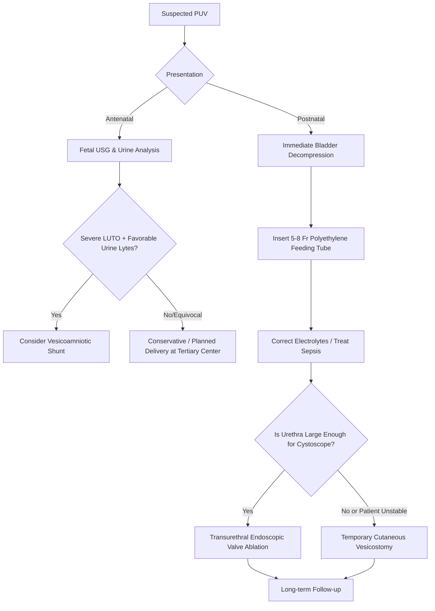

---
{"dg-publish":true,"uplink":"/nephrology/nephrology/","uptext":"Back to Index (🫘 Nephrology)","permalink":"/nephrology/posterior-urethral-valves-puv/","dgPassFrontmatter":true}
---

### Definition and Epidemiology

- Posterior urethral valves (PUV) are the most common cause of severe lower urinary tract obstruction (LUTO) in male infants, with an estimated incidence of 1 in 5,000 to 8,000 live births.
- They are characterized by the formation of obstructing, sail-like membrane folds that fan distally from the verumontanum to the prostatic urethra, producing a slit-like opening that severely impedes antegrade urine flow.

### Pathophysiology and Embryology

- The exact embryologic origin of PUV remains incompletely understood, but proposed mechanisms include hypertrophy of urethral mucosal folds, incomplete canalization or persistence of the urogenital membrane, abnormal development of the Wolffian or Müllerian ducts, or anomalous fusion of the verumontanum and posterior urethral roof epithelium.
- Familial cases demonstrating autosomal dominant inheritance have been linked to rare variants in the _BNC2_ gene (encoding basonuclin 2).
- The obstruction causes severe upstream anatomical and functional changes: the prostatic urethra dilates, the bladder muscle undergoes massive hypertrophy and trabeculation, and elevated intravesical pressures are transmitted to the upper urinary tract.
- Vesicoureteral reflux (VUR) is present in up to 50% of patients due to distortion of the ureterovesical junction.
- Chronic high-pressure obstruction during critical phases of fetal nephrogenesis results in varying degrees of renal dysplasia, ranging from minimal tubular changes to severe cystic dysplasia, accompanied by oligohydramnios and subsequent pulmonary hypoplasia.

### Clinical Manifestations

- **Antenatal Presentation:** Most cases are suspected on routine second-trimester ultrasound, manifesting with bilateral hydroureteronephrosis, a distended, thick-walled bladder, and oligohydramnios.
- **Neonatal Presentation:** Affected male infants typically present with a palpably distended bladder (often described as a walnut-sized mass above the pubic symphysis) and a weak, dribbling urinary stream.
- **Late Presentation:** Patients with less severe obstruction may present later in childhood with recurrent urinary tract infections (UTIs), urosepsis, failure to thrive secondary to uremia, or difficulty achieving diurnal urinary continence.

### Diagnostic Evaluation

|Diagnostic Modality|Key Findings and Clinical Utility|
|:--|:--|
|**Ultrasonography (USG)**|Prenatal USG reveals the classic "key-hole sign" (a dilated bladder with a dilated proximal urethra). Postnatal USG assesses the severity of hydroureteronephrosis, bladder wall thickening, and echogenic renal parenchyma (suggestive of cystic dysplasia).|
|**Voiding Cystourethrography (VCUG)**|The definitive gold standard for diagnosing PUV. It demonstrates a dilated and elongated prostatic urethra, a hypertrophied bladder neck, marked bladder trabeculation/diverticula, a transverse linear filling defect representing the valve leaflets, and often secondary VUR.|
|**Renal Scintigraphy (DMSA/MAG3)**|Utilized to assess split (differential) renal function, drainage characteristics, and the extent of cortical scarring or renal dysplasia once the obstruction has been relieved.|
|**Fetal Urine Analysis**|Evaluated prior to considering in-utero intervention; urinary sodium or chloride > 100 mmol/L and elevated $β_2$-microglobulin levels suggest irreversible tubular damage and predict poor postnatal renal outcomes.|

### Management Approach

- **Initial Postnatal Stabilization:** The immediate priority is bladder decompression. This must be achieved by gently passing a small (5 or 8 French) polyethylene feeding tube into the bladder. Foley catheters with balloons are strictly contraindicated, as the balloon can trigger severe bladder spasms and cause secondary ureterovesical junction obstruction.
- **Medical Management:** Concurrently, prompt correction of fluid and electrolyte imbalances, management of metabolic acidosis, and administration of appropriate parenteral antibiotics for suspected urosepsis are mandatory prior to any surgical intervention.
- **Surgical Intervention:** Once the patient is hemodynamically stable and renal function is optimized, primary transurethral endoscopic ablation (fulguration) of the valve leaflets is the treatment of choice.
- **Temporary Diversion:** In small premature infants where the urethra cannot accommodate a cystoscope, or in cases where renal function fails to improve despite initial catheter drainage, a temporary cutaneous vesicostomy is performed to ensure low-pressure urinary drainage until the child is old enough for definitive valve ablation.

### Prognostic Factors and Long-Term Sequelae

- Up to 30% of children surviving the neonatal period eventually progress to end-stage kidney disease (ESKD) necessitating dialysis or transplantation.
- **"Pop-off" Mechanisms:** Nature occasionally provides pressure-relief valves that preserve renal function in at least one kidney by dissipating the high intravesical pressures. These include:
    - **VURD Syndrome:** (Valves, Unilateral Reflux, Dysplasia) where massive unilateral reflux destroys one kidney but protects the contralateral kidney.
    - **Urinary Ascites:** Rupture of the renal fornices allows urine to extravasate into the peritoneal cavity, decompressing the upper tracts.
    - Large, distensible bladder diverticula.
- **Valve Bladder Syndrome:** Despite successful relief of the anatomical obstruction, patients frequently suffer from long-term neuropathic-like bladder dysfunction (poor compliance, detrusor overactivity, and polyuria due to concentrating defects). These require lifelong management with urodynamic monitoring, anticholinergics, and occasionally clean intermittent catheterization to prevent progressive renal deterioration.